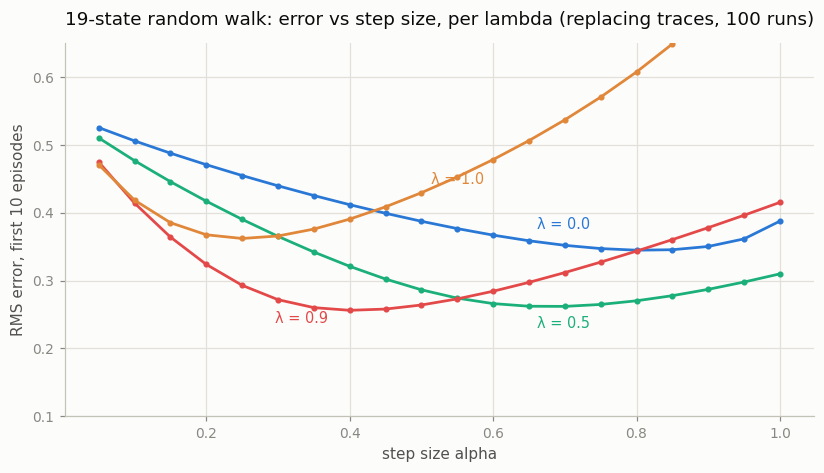
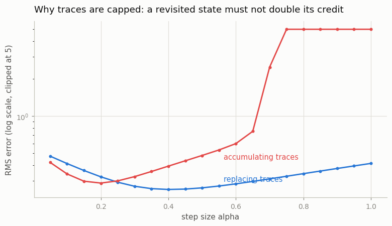
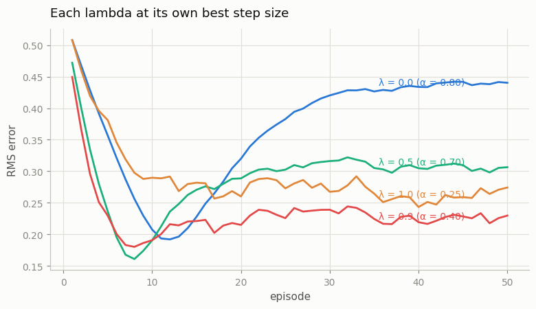

# Eligibility Traces

## Key Insight

[Eligibility traces](/shared/glossary/#eligibility-traces) give every recently visited state a fading "credit tag," so that when a [TD error](/shared/glossary/#td-error) finally arrives it updates not just the current state but all the states that led up to it, each in proportion to how recently it was seen. The trace-decay parameter λ slides smoothly between two extreme ways of learning. Setting λ = 0 gives plain one-step [TD(0)](/shared/glossary/#temporal-difference-learning) (updating only the immediate last step), and λ = 1 recovers [Monte Carlo](/shared/glossary/#monte-carlo-method) (updating every step in the whole episode equally), with intermediate values usually learning fastest. *Replacing* traces cap a revisited state's trace at 1 rather than adding to it, which stops a state visited in a loop from earning unrealistically large credit. Picture a fading scent trail behind you: when reward finally appears, the freshest parts of the trail feel the strongest pull, but replacing traces ensures a spot you walked in a circle over doesn't smell overpoweringly strong, just "fresh." Sweeping λ ∈ {0, 0.5, 0.9, 1.0} lets you watch the [bias–variance](/shared/glossary/#bias-variance-tradeoff) dial turn in real time.

---

## What's in this directory

| File | Role |
|------|------|
| `td_lambda.py` | Online TD(λ) with replacing *and* accumulating traces on the 19-state random walk, the classic `(lambda, alpha)` sweep, and learning curves at each λ's best step size. |

```bash
python td_lambda.py     # ~60 s
```

## The testbed: a random walk that grades itself

Sutton & Barto's long random walk is a 19-state
[chain](/shared/glossary/#chain-mdp): start in the middle, step left or
right with probability 1/2, terminate with reward −1 at the left end and +1
at the right end, nothing in between. Its appeal is that the true value
function is known exactly — `V(i) = i/10 − 1`, exactly linear — so
prediction error needs no reference implementation, and states *are*
revisited constantly (a walk crosses the same cells over and over), which is
precisely the situation traces exist for.

The whole algorithm is five lines per step:

```python
delta = r + gamma * V[s_next] - V[s]     # the TD error
e[s]  = 1.0                              # replacing trace (or e[s] += 1)
V    += alpha * delta * e                # every tagged state moves at once
e    *= gamma * lam                      # all tags fade
```

The trace vector `e` is the "fading scent trail": λ controls how far back
along the trajectory a TD error reaches, turning one-step
[bootstrapping](/shared/glossary/#bootstrapping) into something that spends
each surprise on the whole recent past — the same spectrum as
[n-step returns](/shared/glossary/#n-step-returns), but with all n mixed
geometrically and implemented in O(states) per step.

## The classic sweep

RMS error against the true values, averaged over the first 10 episodes and
100 runs, as a function of the [step size](/shared/glossary/#learning-rate)
α — one U-curve per λ:



| λ | best α | RMS at best α |
|-----|--------|---------------|
| 0.0 | 0.80 | 0.345 |
| 0.5 | 0.70 | 0.262 |
| **0.9** | 0.40 | **0.256** |
| 1.0 | 0.25 | 0.362 |

The bias–variance dial, read off the plot: λ = 0 (pure TD) is stable at
huge step sizes but slow — one episode moves information only one state per
visit, so 10 episodes barely reach the ends of the chain. λ = 1 (Monte
Carlo) propagates the terminal reward all the way back at once but pays for
it in variance — it is competitive only at small step sizes and blows up
earliest as α grows. λ = 0.9 wins the sweep: nearly Monte Carlo's reach with a fraction
of its variance. "Intermediate λ learns fastest" is one of the most reliable
empirical facts in tabular RL, and here it costs 60 seconds to verify.

## Why traces get capped

Same sweep at λ = 0.9, replacing vs accumulating:



With accumulating traces (`e[s] += 1`), a state visited five times in quick
succession — routine in a random walk — carries a trace near 5, and its
effective step size becomes `5 * alpha`. Past `alpha ≈ 0.6` that feedback
loop detonates: the sweep's worst RMS error is ~`1.5e35` (clipped in the
figure), a genuine numerical explosion, not a plateau. Replacing traces cap
the tag at 1 and stay bounded across the entire α range. One line of code —
`e[s] = 1` versus `e[s] += 1` — is the difference between "slightly worse at
tiny step sizes" and "diverges at practical ones".

## Each λ at its own best step size



Two honest wrinkles worth noticing. First, the ordering by *speed* (how fast
error falls in the first ~10 episodes) matches the sweep: higher λ drops
faster, λ = 0.9 lowest overall. Second, every curve bottoms out and then
*rises* to a plateau — with a constant step size, `V` never converges; it
fluctuates around the truth at a noise floor proportional to α. Since each λ
here uses the α that was best *for a 10-episode budget*, the greedy-looking
λ = 0 (α = 0.8) buys its early speed with the highest floor. Tuning α for
where you stop measuring is already a form of overfitting — a small preview
of why step-size schedules exist.
