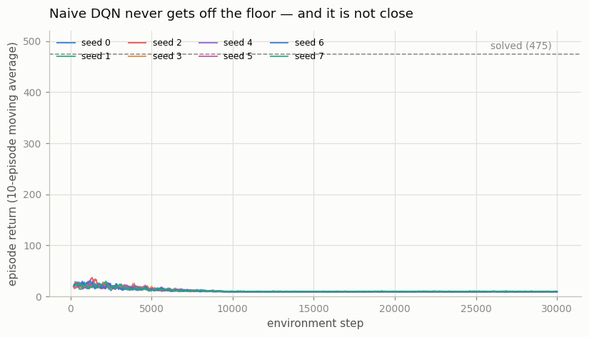
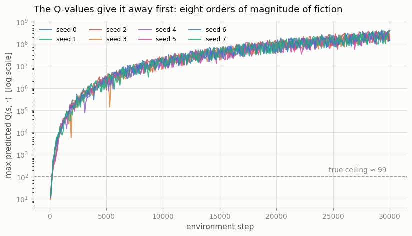
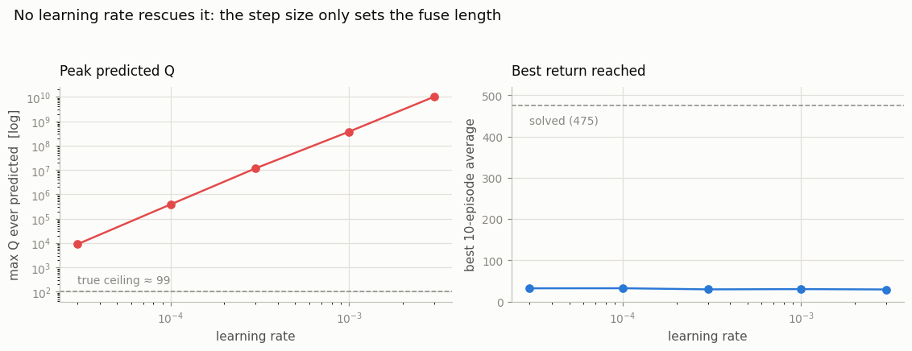
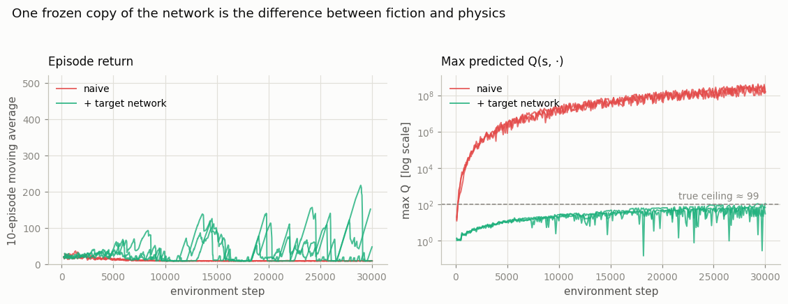

# DQN on CartPole

## Key Insight

[DQN](/shared/glossary/#dqn) replaces [Q-learning](/shared/glossary/#q-learning)'s lookup table with a small neural network (an [MLP](/shared/glossary/#mlp)) that maps a state to one [action-value](/shared/glossary/#value-function) per action — this is [function approximation](/shared/glossary/#function-approximation), and it is what lets the same algorithm scale from a 16-square grid to environments with far too many states to ever tabulate. [CartPole](/shared/glossary/#cartpole) is the gentlest place to watch this work: the state is just four numbers (cart position, cart velocity, pole angle, pole angular velocity), so a tiny network is more than enough to balance the pole — once it is given DQN's stabilizers. Stripping them out — no [experience replay](/shared/glossary/#experience-replay), no [target network](/shared/glossary/#target-network) — exposes the raw fragility the [deadly triad](/shared/glossary/#deadly-triad) warns about: the network chases a learning target built from its own constantly-shifting predictions, and its value estimates run away to eight orders of magnitude beyond anything the game can actually pay. Seeing that instability firsthand is the whole point, and it motivates every fix in the projects that follow.

---

## What's in this directory

| File | Role |
|------|------|
| `dqn_cartpole.py` | The naive agent (no replay, no target network) across 8 seeds; a [learning-rate](/shared/glossary/#learning-rate) sweep to test whether the failure is merely a tuning bug; and a one-line change that reveals which missing piece actually matters. |

```bash
python3 dqn_cartpole.py     # ~2 min on 12 CPU cores
```

## The entire algorithm

Strip DQN of both stabilizers and four lines remain. Every environment step
produces one transition, and that single transition is immediately turned into
one gradient step:

```python
bootstrap = 0.0 if term else GAMMA * q(s2).max().item()   # the network grades itself
target    = r + bootstrap
pred      = q(s)[a]
loss      = F.smooth_l1_loss(pred, target)                # Huber
```

Two details in there are already the *careful* choices, and they still do not
save it.

The [Huber loss](/shared/glossary/#huber-loss) (`smooth_l1_loss`) is the
defensive option — it caps the [gradient](/shared/glossary/#gradients) from an
outlier [TD error](/shared/glossary/#td-error) rather than squaring it. And the
`term` check is the standard subtlety: CartPole ends either because the pole
*fell* (`terminated`, so the future really is worth zero) or because the 500-step
time limit *expired* (`truncated`, where the episode's value did not end — we
just stopped watching, so that case must still bootstrap). Getting those two
confused is one of the most common quiet bugs in a DQN implementation.

Neither detail is the problem. The problem is that `q` appears on both sides of
the loss. The target is built from the very network the gradient is about to
move, so the target moves too — and the "batch" is a single transition that looks
almost exactly like the previous one, because consecutive states in a physics
simulation are nearly identical. That is [bootstrapping](/shared/glossary/#bootstrapping)
plus function approximation plus correlated [off-policy](/shared/glossary/#off-policy)
data: the deadly triad with nothing holding it back.

## It does not learn. It detonates.



Eight seeds, 30,000 steps each, and not one gets off the floor. The best
10-episode average any seed ever reaches is about 37 (random play scores ~22,
and "solved" is 475). There is no climb-then-collapse story to tell — the
collapse arrives first.

The score is the *least* informative thing here, though. Look at what the network
believes:



CartPole pays exactly `+1` per step and lasts at most 500 steps, so with
`γ = 0.99` the largest [return](/shared/glossary/#return) that can possibly exist
is `(1 - 0.99^500) / (1 - 0.99) ≈ 99.3`. That dashed line is not a goal or a
benchmark; it is arithmetic. The network blows through it within the first
thousand steps and keeps climbing, finishing eight orders of magnitude above
physical possibility — a peak prediction of **4.3 × 10⁸** for a quantity that
cannot exceed 99.3.

The loop that does this is worth spelling out, because it is the mechanism behind
every instability in this phase. A slightly overestimated `Q(s', a')` inflates
the target for `Q(s, a)`. Because the network *generalizes*, raising `Q(s, a)`
also raises `Q(s', a')` — they are nearly the same input. So the next target is
higher still. Nothing in the loop pushes back, the values ratchet upward forever,
and a policy acting greedily on numbers this meaningless is an expensive random
policy.

## Is it just a tuning problem?

The obvious objection is that the learning rate is too high, and it deserves an
answer with data rather than assertion. The script sweeps five learning rates
across two orders of magnitude:



| learning rate | peak predicted Q | best return |
|---|---|---|
| 3e-3 | 1.0 × 10¹⁰ | 29.4 |
| 1e-3 | 3.7 × 10⁸ | 30.2 |
| 3e-4 | 1.2 × 10⁷ | 29.6 |
| 1e-4 | 3.9 × 10⁵ | 32.3 |
| 3e-5 | 9.0 × 10³ | 32.2 |

The step size buys nothing that matters. Shrinking it 100× drops the peak
Q-value by six orders of magnitude — and every run still lands hundreds of times
above the true ceiling of 99.3, and still scores about 30. The learning rate is
not deciding *whether* the values explode, only *how fast*: it sets the length of
the fuse, not whether there is a bomb. A divergence you can slow down but never
stop is structural, and no hyperparameter search will fix it.

## The one line that changes the kind of failure

Now add a target network and change nothing else — still no replay buffer, still
one transition per gradient step. The bootstrap just reads from a frozen copy of
the network, refreshed every 500 updates:

```python
bootstrap_net = q_target if use_target else q
bootstrap = 0.0 if term else GAMMA * bootstrap_net(s2).max().item()
```



| | peak predicted Q | best 10-episode return |
|---|---|---|
| naive | 3.2 – 4.3 × 10⁸ | 28 – 37 |
| + target network | 66 – 109 | 141 – 218 |

The Q-values return to the realm of the physically possible (66–109, against a
ceiling of 99.3) and the score jumps roughly 5×. One frozen copy of the network
is the difference between fiction and physics.

It is still not *solved*, and the left panel shows why: the runs sawtooth,
climbing to 150–200 and falling back. Freezing the target broke the feedback loop
between prediction and target, but every gradient step is still computed on a
batch of one, and that batch is whatever just happened — so the network keeps
overwriting what it knew about the last situation with whatever it is looking at
now. That is the other leg of the triad, and it is
[project 13](../13-add-a-replay-buffer/README.md).

## What to take away

The lesson is not "naive DQN is unstable." It is that instability here has a
*signature*, and the signature appears in the Q-values long before the score
reflects it. In a real project the return curve is the last thing to tell you
something has gone wrong; a predicted Q above what the reward function can
physically pay is the first. It costs one line to log, and it is the most useful
diagnostic in this phase.
