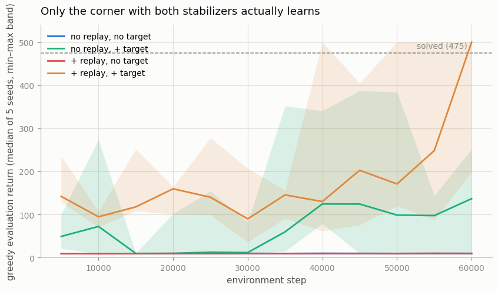
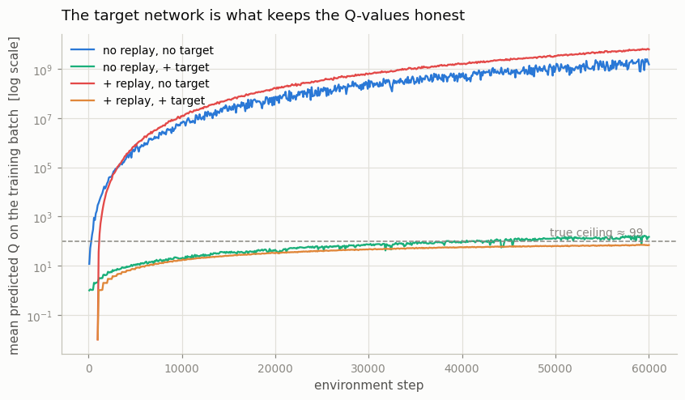
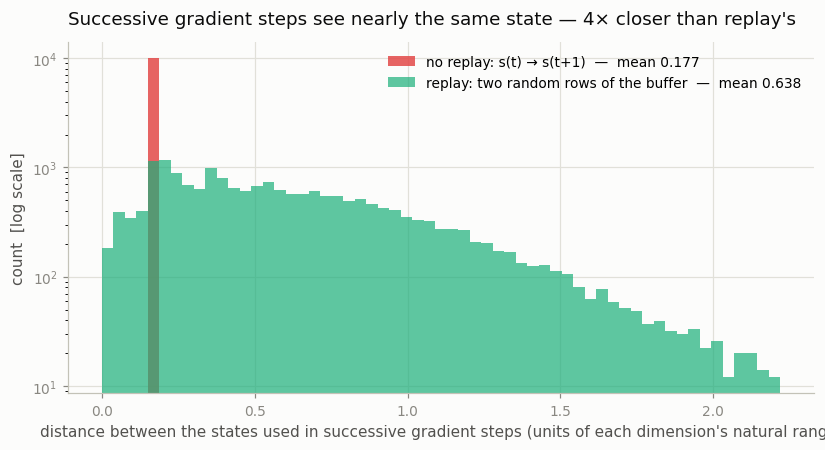
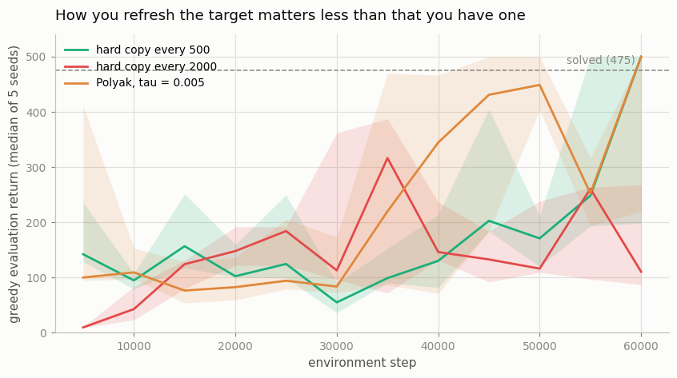

# Add a Replay Buffer

## Key Insight

Two additions turn the fragile [DQN](/shared/glossary/#dqn) of the previous project into the stable recipe that cracked [Atari](/shared/glossary/#atari). [Experience replay](/shared/glossary/#experience-replay) stores past `(state, action, reward, next-state)` transitions in a buffer and trains on random samples drawn from it, which breaks the strong correlation between back-to-back steps and lets each experience be reused many times instead of being seen once and thrown away. A [target network](/shared/glossary/#target-network) — a frozen copy of the [Q-network](/shared/glossary/#dqn) refreshed only every few hundred steps — supplies the `r + γ·maxₐ Q(s′, a)` learning target, so the network is no longer chasing a goalpost that jumps on every gradient step. Together they tame two of the three legs of the [deadly triad](/shared/glossary/#deadly-triad) ([bootstrapping](/shared/glossary/#bootstrapping) and [off-policy](/shared/glossary/#off-policy) data), and the once-collapsing learning curve becomes steady and repeatable.

---

## What's in this directory

| File | Role |
|------|------|
| `dqn_lib.py` | The reusable DQN core for the whole phase: `ReplayBuffer`, `OnlineBuffer`, `MLPQNet`, `DQNAgent`, and the `train_dqn` loop. Projects 14–18 import it and swap exactly one piece each. |
| `replay_and_target.py` | The 2×2 ablation (replay on/off × target network on/off, 5 seeds), a hard-copy-vs-[Polyak](/shared/glossary/#polyak-averaging) comparison, and a diagnostic that measures the thing replay is supposed to fix. |

```bash
python3 replay_and_target.py     # ~9 min on 12 CPU cores
```

## The four corners

Project 12 established that the naive agent diverges. The obvious next question is
*which* of the two missing stabilizers does the work — so add them back one at a
time, changing nothing else:



| variant | last-3 evaluation | best evaluation | seeds that hit 475 | peak predicted Q |
|---|---|---|---|---|
| no replay, no target | 9.4 | 10.0 | 0/5 | 3.3 × 10⁹ |
| no replay, **+ target** | 108.1 | 282.5 | 0/5 | 204 |
| **+ replay**, no target | 9.4 | 10.0 | 0/5 | 7.5 × 10⁹ |
| **+ replay, + target** | **318.7** | **461.8** | **3/5** | **77.5** |

The headline is the third row, and it is the one people get wrong. **Experience
replay on its own is worth nothing at all.** The `+ replay, no target` agent scores
9.4 — indistinguishable from the agent with no stabilizers whatsoever — and its
Q-values reach 7.5 × 10⁹, which is *worse* than the naive agent's 3.3 × 10⁹.

That is not a bug, and it is worth sitting with. Replay hands the network a bigger,
more diverse batch, so each gradient step is a *better-estimated* step. But it is a
better-estimated step toward a target the network is still computing from itself. A
sharper estimate of a runaway quantity simply runs away more efficiently: replay
makes the divergence *converge faster*.

The [Q-values](/shared/glossary/#value-function) say it plainly:



Two curves fly off to 10⁹; two stay pinned below CartPole's true ceiling of 99.3 (the
most return the game can physically pay, `(1 - 0.99^500) / (1 - 0.99)`). The split
runs entirely along one axis — **whether there is a target network** — and not at all
along the other.

So the two stabilizers are not two of a kind:

- The **target network is necessary.** Without it nothing else matters, because the
  bootstrap feedback loop stays unbroken and the values diverge regardless.
- The **replay buffer is what turns "not diverging" into "actually learning."** Given
  a target network, adding replay lifts the score from 108 to 319 and the best
  evaluation from 283 to 462.

## What replay actually buys

Replay's usual justification is that it breaks the correlation between consecutive
samples. That is true, but it is worth measuring rather than repeating, because the
size of the effect is not what folklore suggests:



The no-replay agent takes one gradient step per transition, so the honest question is
how far the training input moves *between one gradient step and the next*. Without
replay it moves from `s_t` to `s_{t+1}` — two states 20 ms apart in a physics
simulation, a mean distance of **0.177** in units of each dimension's natural range.
With replay it jumps to a random row of the buffer: **0.638**, about **4× further**.

Four times, not a hundred. CartPole's bang-bang force means velocities do jump
appreciably on every step, so consecutive states are less nearly-identical than the
story implies. The more important half of the effect is not the *distance* but the
*provenance*: a replay buffer holds the agent's whole history — the flailing of early
training alongside the competent balancing of late training — so a sampled row is
unrelated to the current moment in a way that no pair of consecutive states can ever
be. Successive online updates keep aiming the gradient at one narrow region of state
space, and the network quietly forgets everything else. That is
[catastrophic forgetting](/shared/glossary/#catastrophic-forgetting), and it is why
the `no replay, + target` curve sawtooths instead of climbing.

## How you refresh the target matters less than that you have one

DQN hard-copies the online weights into the target every N updates.
[Polyak averaging](/shared/glossary/#polyak-averaging) instead drags the target a tiny
fraction τ of the way toward the online net on *every* step — the default in
[DDPG](/shared/glossary/#ddpg), [TD3](/shared/glossary/#td3) and
[SAC](/shared/glossary/#sac). Both are in `dqn_lib.py`; here they are side by side:



| target update | last-3 evaluation | best evaluation | seeds that hit 475 |
|---|---|---|---|
| hard copy every 500 | 293.5 | 468.3 | 2/3 |
| hard copy every 2000 | 172.1 | 311.1 | 0/3 |
| Polyak, τ = 0.005 | **370.5** | **482.9** | 2/3 |

Polyak edges it, and refreshing too rarely (every 2000 updates) is clearly worst — the
target lags so far behind that the network spends its time fitting stale values. But
the spread across all three (172 to 371) is small next to the gap between *having* a
target network and not (9 to 319). This is a second-order tuning knob dressed up as an
architectural decision, which is a fair description of a good fraction of the DQN
literature.

## An honest word about "stability"

The best agent here reaches 462 and clears the 475 bar on 3 of 5 seeds, but its curve
still oscillates and no configuration *holds* 475. That is not a defect of the
implementation — CartPole DQN is well known for it. The agent gets good, its episodes
get long, its buffer fills up with 500-step balancing trajectories, it forgets what
falling looks like, it falls, and it relearns. Even the fixed recipe only *manages*
the deadly triad; it does not abolish it.

Which is the guide's point about this whole phase. Every algorithm from here on makes
a different bet about how to manage the triad, and none makes it go away.
[Double DQN](/shared/glossary/#double-dqn) (project 15) attacks the overestimation
that drives the ratchet. [Prioritized replay](/shared/glossary/#prioritized-experience-replay-per)
(project 16) attacks *which* transitions get replayed.
[Distributional RL](/shared/glossary/#distributional-rl) (project 18) changes what the
network is asked to predict in the first place — and produces the best CartPole agent
in the phase, the only one that reaches a perfect 500.

## The code the rest of the phase reuses

`dqn_lib.py` is factored so that each later project swaps exactly one thing:

```
buffer  -- where transitions live      (ReplayBuffer / OnlineBuffer / PER / n-step)
net     -- what maps state to Q-values (MLPQNet / ConvQNet / dueling / C51)
agent   -- how the target is built     (DQNAgent / C51Agent)
loop    -- how the three are driven    (train_dqn)
```

Two details in there are load-bearing. `OnlineBuffer` implements the same interface as
`ReplayBuffer` but remembers only the newest transition, so "turn replay off" is a
one-word change at the call site rather than a second training loop — and any
behavioral gap is therefore attributable to replay alone. And `DQNAgent.__init__`
seeds the RNG *before* building the network, because PyTorch seeds its default
generator from OS entropy on first use: construct the net first and its initialization
is unseeded, so the same config lands on a different curve every run. That one is easy
to miss, and especially easy when runs are fanned out across worker processes.
