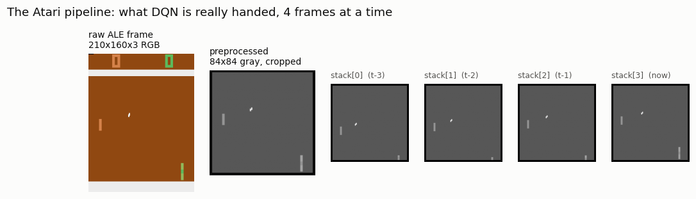
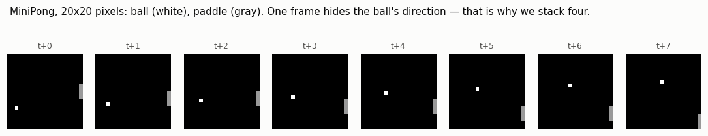
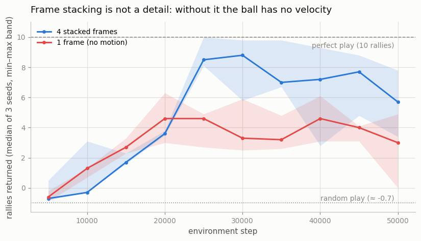
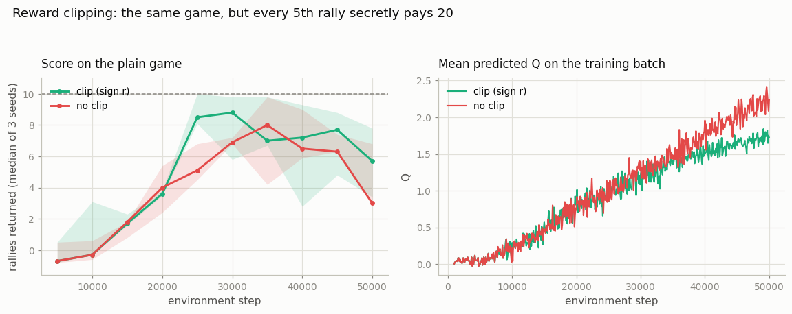

# Atari Pong

## Key Insight

Moving from [CartPole](/shared/glossary/#cartpole)'s four numbers to [Pong](/shared/glossary/#pong)'s raw screen pixels forces two classic preprocessing tricks. [Frame stacking](/shared/glossary/#frame-stacking) feeds the network the last four frames at once instead of a single image, because one still frame cannot reveal which way the ball is moving — velocity is only visible across time, and without it the [Markov property](/shared/glossary/#markov-property) the algorithm assumes is broken. [Reward clipping](/shared/glossary/#reward-clipping) squashes every score change to −1, 0, or +1 so that games with wildly different point scales can all be trained with one shared set of hyperparameters. With a [convolutional](/shared/glossary/#cnn) [Q-network](/shared/glossary/#dqn) reading the stacked frames, the same algorithm that balanced a pole now learns to play from pixels alone — the [Atari](/shared/glossary/#atari) result that put deep [reinforcement learning](/shared/glossary/#reinforcement-learning) on the map.

---

## An honest note about compute

Real ALE Pong needs on the order of a million frames before DQN scores its first
point. On a CPU that is hours, and a project claiming to run in ten minutes
cannot also claim to have trained it. Pretending otherwise with a truncated
learning curve would be a lie told with a chart.

So this project splits the difference and is explicit about which half is which:

- The **preprocessing pipeline** is the real one. It runs against real
  `ALE/Pong-v5` (when `ale_py` is installed) to produce the figure below — what
  the network is handed here is what it would be handed on Atari.
- The **training** happens on **MiniPong**: Pong against a wall, 20×20 real
  pixels, written in numpy, which the identical agent solves in about a minute.
  Same problem shape (control from raw pixels, velocity that exists only *across*
  frames, ±1 rewards), a thousandth of the compute.

Projects 15 and 17 train on MiniPong for the same reason.

## What's in this directory

| File | Role |
|------|------|
| `pong_lib.py` | `MiniPong` (the pixel game), the `FrameStack` and `ClipReward` wrappers, `ConvQNet` (the CNN torso), and `AtariPipeline` — the genuine ALE wrapper chain, in numpy, with no OpenCV dependency. |
| `train_pong.py` | Draws what the agent sees, then ablates frame stacking and reward clipping. |

```bash
python3 train_pong.py     # ~5 min on 12 CPU cores
```

## What DQN is actually handed



That is a real frame from the Arcade Learning Environment, then the same frame
after the wrapper chain. Every step in that chain is a fix for a specific property
of a 1977 games console:

| step | why |
|---|---|
| max-pool over 2 frames | Atari sprites *flicker* on alternate frames — the console could not draw them all on every refresh. Taking the elementwise max of the last two raw frames makes them all visible at once. |
| frame skip (4) | 60 decisions per second is wasted compute. The same action is repeated for 4 frames, so the agent thinks at ~15 Hz. |
| grayscale | color carries almost no signal in Pong, and dropping it cuts the input by 3×. |
| crop + downsample | strip the scoreboard (not part of the game state), halve the resolution. |
| stack 4 | see motion, not stills. |
| clip reward to `sign(r)` | one learning rate has to serve all 57 games. |

`AtariPipeline` implements all of it in numpy. Most implementations reach for
OpenCV to resize; a crop and a stride-2 slice do the same job with no extra
dependency.

And here is MiniPong, the game we can afford:



Eight consecutive frames. Look at any *single* one and try to say which way the
ball is going. You cannot — and neither can a network. That is not a quirk of the
toy; it is the same fact that forces frame stacking on real Atari, reproduced at
a seventeenth of the resolution.

## Frame stacking is not a detail

That claim is testable, so the script tests it: identical agent, identical
hyperparameters, `k = 4` frames versus `k = 1`.



| | last-3 score | best score |
|---|---|---|
| 4 stacked frames | **6.39** of 10 rallies | **9.87** |
| 1 frame | 3.66 | 5.77 |

(The headline is the mean of the last three checkpoints; a single final evaluation
is one noisy 10-episode sample, and these curves oscillate enough that quoting it
would be a coin flip dressed as a result.)

With four frames the agent gets to near-perfect play at its best. With one frame it
stalls around 3–5 and never once returns more than 5.77 rallies. It is not helpless —
a single frame still shows where the ball *is*, and "drift toward the ball's current
row" wins a fair number of easy rallies — but it cannot anticipate, so it loses every
ball that requires being somewhere the ball is not yet.

The formal way to say this: a single frame turns the environment into a
[POMDP](/shared/glossary/#pomdp). The observation is not a state, because it does
not contain what is needed to predict what happens next. Stacking four frames
restores the Markov property, and DQN's entire derivation depends on it holding.

## Reward clipping, and the identity hiding inside it

Testing clipping requires rewards worth clipping, so MiniPong gets a jackpot:
every 5th rally secretly pays **20** instead of 1. Train with and without
`sign(r)`, and score both on the *plain* game — rallies returned, the only thing
that actually matters.



| | last-3 score | best score | peak predicted Q |
|---|---|---|---|
| clip (`sign r`) | **6.39** | **9.87** | 1.89 |
| no clip | 6.01 | 8.53 | 2.74 |

The scores are nearly tied, and the honest summary is that **on this task clipping
barely matters** — 6.39 versus 6.01 across three seeds is well inside the noise. What
*is* clearly separated is the Q-values: the unclipped agent's peak prediction is 45%
higher (2.74 vs 1.89), because a rare `+20` inflates every value estimate that can
reach it, and gradient size scales with the [TD error](/shared/glossary/#td-error).
One outlier reward, one outlier gradient. That is the mechanism clipping exists to
suppress, and it is visible here even where its effect on the score is not.

Which is exactly what should be expected, and it is worth being precise about why. A
20× jackpot in a game whose scores span 0–10 is a mild test. Real Atari spans **three
orders of magnitude** across titles — Pong pays ±1 while Q*bert pays 25 to 3,000 per
event — and no single learning rate could serve all 57 without clipping. Clipping is
insurance against a scale problem this toy game does not really have. Reporting it as
a 6% win would be dressing up noise; the defensible claim is that the *mechanism* is
real and measurable, and that the payoff scales with how badly the rewards are scaled
in the first place.

The more interesting observation is *why the clipped arm needed no training runs of
its own*. Clipping the jackpot game maps every rally back to `+1` and every miss to
`-1` — which is the plain game, transition for transition. The clipped agent and the
plain stack-4 agent are not similar; they are **the same run**, which is why their
numbers above are identical. That equivalence *is* the point of clipping, and the
script leans on it rather than spending compute rediscovering it.

Clipping is also not free. The clipped agent is, by construction, **indifferent
between a 1-point rally and a 20-point jackpot** — it can no longer represent the
preference at all. On Atari that is a known and accepted loss: the agents learn to
play well while being blind to the score's own structure. It is one of the
tradeoffs [distributional RL](/shared/glossary/#distributional-rl) (project 18)
begins to unwind.

## The network

Nature-DQN's torso — 32/64/64 channels with 8×8, 4×4 and 3×3 kernels — is sized for
an 84×84 input. On a 20×20 frame those kernels would be mostly padding, so
`ConvQNet` is the same idea shrunk to fit: two strided convolutions turning pixels
into a small feature vector, then a linear head with one output per action.

```python
nn.Conv2d(4, 16, kernel_size=3, stride=2, padding=1)   # 4 stacked frames, 20 -> 10
nn.Conv2d(16, 32, kernel_size=3, stride=2, padding=1)  # 10 -> 5
```

One storage detail matters more than it looks. The replay buffer keeps
observations as **uint8** and divides by 255 at sample time. A stacked 4×20×20
observation in float32 is 6.4 KB, and the buffer holds two per transition — so a
20k buffer would cost 640 MB, and a dozen of these run in parallel. As bytes it is
64 MB. On real Atari (84×84 frames, a 1M-transition buffer) the same choice is the
difference between roughly 50 GB and 13 GB, which is why every serious DQN
implementation does it.

## What to take away

Pixels do not change the algorithm. The DQN in `dqn_lib.py` is the same code
project 13 ran on CartPole — loss, buffer, target network, epsilon-greedy loop, all
untouched. What changed is the *observation*, and each wrapper in the chain repairs
one way that raw pixels violate an assumption the algorithm quietly makes: stacking
repairs the Markov property, clipping repairs the scale of the gradients,
frame-skipping and grayscale simply buy back compute.

That is the pattern worth keeping. When deep RL meets a new observation space, most
of the work is not in the algorithm — it is in the wrappers.
