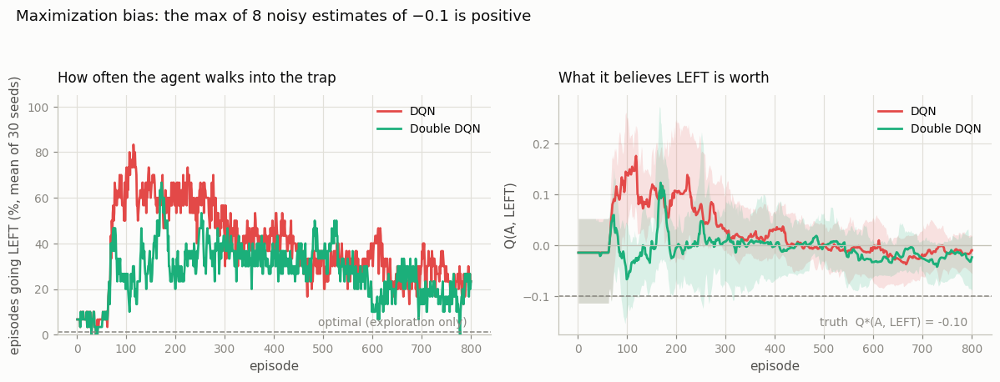
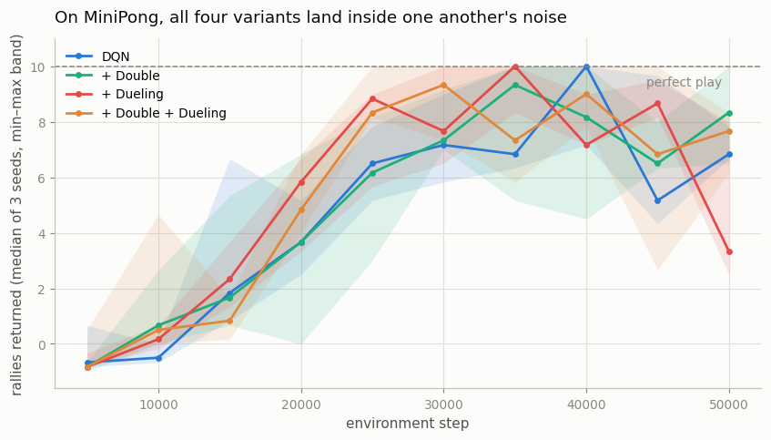
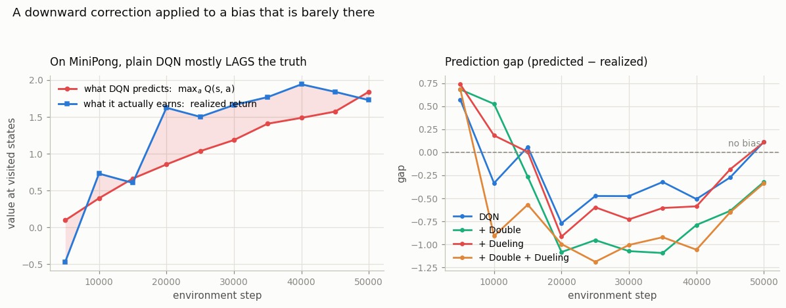

# Double + Dueling

## Key Insight

Standard [DQN](/shared/glossary/#dqn) systematically [over-estimates](/shared/glossary/#overestimation-bias) [action-values](/shared/glossary/#value-function) because the same network both *picks* the best next action and *judges* its value, so any random noise that makes one action look too good gets trusted — the `max` always reaches for the luckiest overestimate. [Double DQN](/shared/glossary/#double-dqn) fixes this with essentially one line: use the online network to *choose* the next action but the [target network](/shared/glossary/#target-network) to *score* it, so a fluke in one is unlikely to be echoed by the other. [Dueling DQN](/shared/glossary/#dueling-dqn) changes the network's shape instead, splitting it into two streams that separately estimate the state's overall [value](/shared/glossary/#value-function) `V(s)` and each action's [advantage](/shared/glossary/#advantage) `A(s, a)` before recombining them as `Q = V + A`; this lets the agent learn that a state is good or bad without having to try every action there first. Both are cheap, and both are *bets about the environment* — so this project ablates them on two environments, one where the bet pays and one where it does not.

---

## What's in this directory

| File | Role |
|------|------|
| `double_dueling.py` | Two experiments: the maximization-bias MDP (30 seeds), which isolates the pathology Double DQN was invented to cure; and the 2×2 ablation (Double on/off × dueling head on/off) on project 14's pixel Pong, with a direct measurement of the prediction gap. |

```bash
python3 double_dueling.py     # ~8 min on 12 CPU cores
```

## First, the disease

Double DQN cures a specific illness, so the honest way to evaluate it is to point it
at a patient who actually has that illness. Sutton & Barto's maximization-bias MDP
(Example 6.7) is that patient:

- From state **A** you can go **RIGHT** and end the episode with `0`.
- Or you can go **LEFT** into state **B**, from which all 8 actions end the episode
  with a reward drawn from `N(-0.1, 1)`.

B is worth `-0.1`, so RIGHT is optimal and LEFT is always a mistake. But look at what
`max_a Q(B, a)` computes: the largest of eight noisy estimates of `-0.1`. The largest
of eight noisy estimates of a negative number is reliably **positive**. Q-learning
therefore talks itself into believing B is a nice place to visit, and walks into it.



| agent | walks LEFT (last 50 episodes) | final `Q(A, LEFT)` | truth |
|---|---|---|---|
| DQN | 22.9% | −0.023 | **−0.10** |
| Double DQN | **17.6%** | **−0.044** | −0.10 |

The curves matter far more than those endpoints. Early in training — episodes 100 to
300, where the noise is freshest and the estimates least settled — plain DQN walks
into the trap **up to 80% of the time**, and its estimate of `Q(A, LEFT)` climbs to
**+0.17** when the true value is `−0.10`. It has invented, out of pure noise, the
belief that a losing move is a winning one. Double DQN peaks near 50%, and its value
estimate stays near zero rather than going positive.

By the end both have largely recovered — 22.9% versus 17.6% is a real but unspectacular
gap, and neither converges all the way to `−0.1` within 800 episodes, because a fixed
ε and a function approximator leave a little optimism behind. The lasting difference is
in the transient: for a few hundred episodes the plain agent is confidently, measurably
wrong in a direction it invented for itself, and Double DQN roughly halves both how
often it acts on that delusion and how large the delusion gets. In a game that ends
after 800 episodes that is a modest cost; in one that runs for 200 million frames and
whose Q-values feed every subsequent bootstrap, it compounds.

## Then, the patient who is not sick

Now the same two changes on MiniPong, in the standard 2×2:



| variant | last-3 score | best score | final prediction gap |
|---|---|---|---|
| DQN | 7.52 | 10.00 | +0.114 |
| + Double | 7.59 | 10.00 | −0.322 |
| + Dueling | 7.06 | 9.83 | +0.110 |
| + Double + Dueling | 7.61 | 9.78 | −0.336 |

All four variants land inside one another's noise — 7.06 to 7.61 rallies across three
seeds, with every variant touching a near-perfect 10 at its best. On this task, **you
cannot tell these four agents apart from the scores**, and reporting the 0.09-rally
gap between "+ Double + Dueling" and "DQN" as a win would be dressing up noise as a
finding.

The measurement that explains why is the prediction gap: at each checkpoint, compare
what the network *predicts* (`max_a Q(s, a)`, at states the greedy policy actually
visits) with what the policy then *earns* (the realized discounted return from those
same states).



| | final gap | mean gap over training |
|---|---|---|
| DQN | +0.114 | −0.217 |
| + Double | −0.322 | −0.507 |
| + Dueling | +0.110 | −0.264 |
| + Double + Dueling | −0.336 | −0.679 |

**There is barely any overestimation here to remove.** Plain DQN's gap ends at `+0.11`
and averages *negative* over training — for most of the run it is too *pessimistic*,
not too optimistic, because the value of a state has to be learned before it can be
inflated. Double DQN does exactly what it says on the tin: it drags every gap
downward (`+0.114 → −0.322`). But a downward correction applied to an estimate that
was not inflated is not a fix; it is just pessimism.

The reason is structural. MiniPong is **deterministic** and offers **three actions**.
Maximization bias grows with the amount of noise the `max` has to choose among — eight
noisy actions in the MDP above, with a reward standard deviation of 1.0. Take a
`max` over three nearly-identical, nearly-noiseless values and there is almost nothing
for the operator to launder into optimism. The disease requires noise, and this
environment does not supply any.

## Reading the two experiments together

Either experiment alone would mislead. A reader shown only the MDP would conclude
Double DQN is essential; a reader shown only MiniPong would conclude it does nothing.
Both readings are wrong, and the useful statement is the conditional one:

> Double DQN is worth its one line whenever the `max` in your target has real noise to
> chew on — many actions, stochastic rewards, stochastic transitions, or a
> function approximator that is still badly wrong. It buys you nothing in a small
> deterministic environment, and it costs you nothing either, which is why it is
> standard equipment: it is cheap insurance whose premium is one line and whose payout
> depends entirely on your environment.

Dueling tells a similar story from the other side. Its whole purpose is to let the
network learn "this state is bad" without having to try every action from it — which
is valuable when there are *many* actions, most of them irrelevant. MiniPong has
three actions, all of which matter constantly. There is nothing for the value/advantage
split to disentangle, and the measurements duly show nothing.

## The code

Double DQN really is one line at the point of use — the online net *chooses*, the
target net *scores*:

```python
if cfg.double:
    a_star = self.net(batch.s2).argmax(dim=-1, keepdim=True)      # online picks
    q_next = self.target(batch.s2).gather(-1, a_star).squeeze(-1) # target scores
else:
    q_next = self.target(batch.s2).max(dim=-1).values             # target does both
```

Dueling is a change of shape, not of algorithm, and it hides one subtlety:

```python
v, a = self.value(h), self.adv(h)
return v + a - a.mean(dim=-1, keepdim=True)
```

Subtracting the mean advantage is not cosmetic. Without it, `V` and `A` are not
identifiable — adding any constant `c` to `V` and subtracting `c` from every `A`
leaves every Q-value unchanged, so nothing pins down which part of the sum is the
"value" and which is the "advantage", and the two streams are free to drift in
opposite directions forever. Forcing the advantages to average zero nails them down.

## What to take away

The tempting summary of the ablation table — "Double and Dueling do nothing" — is
exactly as wrong as the summary the papers' abstracts might tempt you into. What the
two experiments together actually show is that **these techniques are conditional
bets, and the condition is a property of your environment, not of the algorithm.**
Knowing which condition each technique bets on is what lets you predict, before
spending a single GPU-hour, whether it will help you. That skill is worth more than
any of the individual tricks, and it is the one [project 17](../17-mini-rainbow/README.md)
puts to the test by stacking four of them at once.
