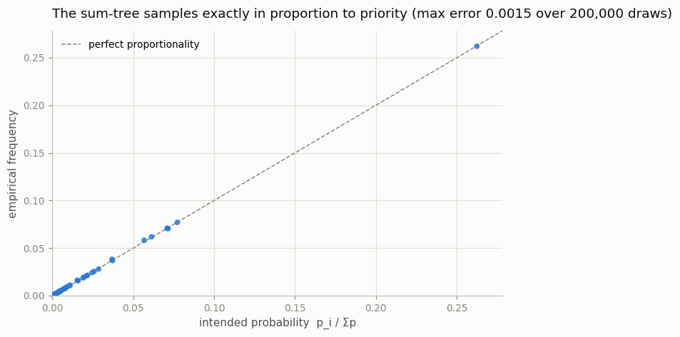
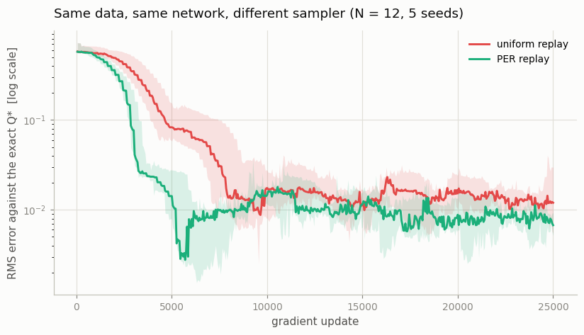
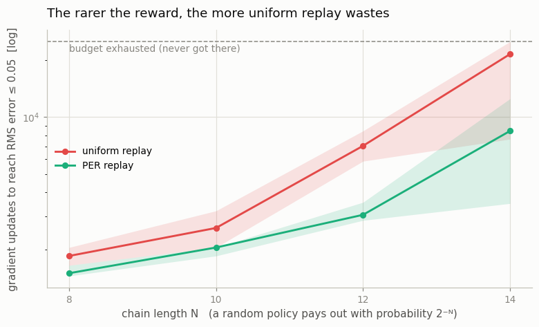
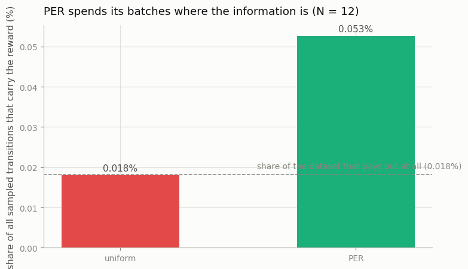

# Prioritized Replay

## Key Insight

Uniform [experience replay](/shared/glossary/#experience-replay) treats every stored transition as equally worth revisiting, but some transitions are far more *surprising* — and therefore more instructive — than others. [Prioritized experience replay (PER)](/shared/glossary/#prioritized-experience-replay-per) samples each transition with probability proportional to the size of its last [TD error](/shared/glossary/#td-error) (the gap between the predicted value and the bootstrapped target), so the agent spends more of its updates on the experiences it currently gets most wrong. Drawing weighted-random samples efficiently from a buffer of millions needs the right data structure: a [sum-tree](/shared/glossary/#sum-tree), a binary tree whose every node stores the total priority of everything beneath it, picks a sample in `O(log n)` steps instead of scanning the whole buffer. Because sampling non-uniformly would otherwise bias the learning target, PER multiplies each update by a small [importance-sampling](/shared/glossary/#importance-sampling) correction weight that cancels the bias back out.

---

## What's in this directory

| File | Role |
|------|------|
| `per.py` | `SumTree` (the `O(log n)` weighted sampler) and `PrioritizedReplayBuffer`, which is interface-compatible with project 13's uniform buffer — the training loop cannot tell them apart. |
| `prioritized_replay.py` | Verifies the sum-tree samples what it claims to, then measures the payoff on the Blind Cliffwalk at four levels of reward sparsity. |

```bash
python3 prioritized_replay.py     # ~3 min on 12 CPU cores
```

## An experiment that can only measure one thing

Comparing samplers *online* would be a trap. A PER agent and a uniform agent
explore differently, so they collect different data, and any difference in
learning could just be one of them getting luckier. The comparison here is
therefore **offline**: both samplers are handed the *same* fixed dataset and the
*same* network initialization, and differ in exactly one respect — which rows of
that dataset they look at. Any gap is attributable to the sampler and nothing
else.

The task is Schaul et al.'s own construction, the **Blind Cliffwalk**. There are
`N` states in a row and two actions. "Right" advances one state; "wrong" ends the
episode with nothing. Only the single all-right sequence of length `N` pays out
(`+1` at the end). A random policy therefore succeeds with probability `2⁻ᴺ` — the
reward is not rare by accident but by construction, and `N` is a dial that makes
it exponentially rarer.

That buys the experiment two properties. Ground truth is known in closed form, so
"how wrong is the network" needs no reference implementation:

```
Q*(s, right) = γ^(N-1-s)        Q*(s, wrong) = 0
```

And the dataset is imbalanced the way real sparse-reward problems genuinely are.
At `N = 14`, collecting until the random policy has stumbled into 3 payouts takes
**112,528 transitions** — of which exactly **3** carry any reward at all. Uniform
replay draws from that haystack with no idea a needle exists.

## First: does the sum-tree actually work?

Everything downstream rests on one claim — that a root-to-leaf descent guided by
a single uniform random number lands on leaf `i` with probability `p_i / Σp`.
That deserves verification before it is trusted, so the script loads the tree
with deliberately skewed priorities and draws 200,000 samples:



Every point sits on the diagonal; the largest gap between intended and empirical
frequency is **0.0015**. The structure does what it says.

The mechanism is worth a moment, because it is genuinely elegant. Each leaf holds
a priority and each internal node holds the sum of its children, so the root
holds the total. To sample, draw `x ~ U(0, total)` and walk down: if the left
child's mass covers `x`, go left; otherwise subtract that mass and go right.
Sampling is `O(log n)` array reads, updating one priority is `O(log n)` writes,
and the whole structure is a single flat array with no pointers and no objects.

## The payoff

Same data, same network, different sampler:



And the headline — how the advantage scales as the reward gets rarer:



| N | transitions in the dataset | uniform: updates to solve | PER: updates | speedup |
|---|---|---|---|---|
| 8 | 1,285 | 1,850 (5/5 seeds) | 1,500 (5/5) | 1.2× |
| 10 | 3,668 | 2,600 (5/5) | 2,050 (5/5) | 1.3× |
| 12 | 19,029 | 7,050 (5/5) | 3,050 (5/5) | 2.3× |
| 14 | 112,528 | 21,500 (**3/5**) | 8,450 (**5/5**) | 2.5× |

("Solve" = the network's RMS error against the exact `Q*` drops below 0.05.)

The shape of that table is the actual result. At `N = 8`, where a payout is one
row in ~430, prioritization is worth a modest 1.2×. At `N = 14`, where a payout
is one row in ~37,500, it is worth 2.5× — and more tellingly, uniform replay
fails to solve the task at all within the budget on 2 of 5 seeds, while PER
solves 5 of 5. **The benefit of prioritization is not a constant; it grows with
the sparsity of what you are trying to learn.** That is exactly the prediction,
and it is why PER earns its complexity on hard-exploration Atari games and barely
registers on dense-reward ones.

Why it works is visible directly in where the batches go:



Uniform replay sits precisely on the dashed line — the share of the dataset that
pays out at all (0.016% at `N = 12`). That is what "uniform" *means*: it spends
attention in exact proportion to how common something is, which for a rare reward
is exactly the wrong allocation. PER spends 3–5× more of its batches on the rows
that carry reward, because a transition the network is badly wrong about has a
large TD error, and a large TD error is a large priority.

## The two costs, and the code that pays them

**Cost one: the sampler is no longer free.** That is what the sum-tree is for.
One subtlety in `add()` is worth knowing — new transitions arrive with the
*maximum* priority seen so far:

```python
self.tree.update(i, self.max_priority ** self.alpha)   # optimistic init
```

Without that, a transition whose first TD error happened to be small would sink
to near-zero probability and never be drawn again — and its priority could never
be corrected, because correcting it requires sampling it. Optimistic
initialization guarantees every transition is replayed at least once before its
priority is believed.

**Cost two: the training distribution is now wrong.** Learning from a skewed
sample estimates a skewed expectation. PER corrects this with an importance-
sampling weight on each sample's loss:

```
w_i = (1 / (N · P(i)))^β,  normalized so that max w = 1
```

with `β` annealed from 0.4 to 1 over training. The annealing is not decoration.
Early on the network is wrong everywhere, and a biased gradient pointed roughly
uphill is fine — speed matters more than exactness. Near convergence, when the
network is nearly right, a systematically biased gradient is precisely what stops
it settling, so the correction is phased in to full strength exactly when it
starts to matter.

The `alpha` exponent is the other dial: `alpha = 0` recovers uniform sampling
exactly, `alpha = 1` samples in direct proportion to TD error, and 0.6 (used
here) is the usual compromise — prioritize, but not so hard that the buffer
collapses onto a handful of high-error transitions and the agent forgets
everything else.

## What to take away

PER is a *bet about where the information is*, and it is paid for in complexity:
a custom data structure, an importance-sampling correction, and two new
hyperparameters (`alpha`, `beta`) to get wrong. On a dense-reward task the bet
returns almost nothing — which is what the `N = 8` row is quietly telling you.
Reach for it when your reward is rare; skip it when it is not.

Project 17 puts it back in the pixel setting and asks the harder question: does
it *still* help once [Double](/shared/glossary/#double-dqn) and
[Dueling](/shared/glossary/#dueling-dqn) are already in place?
