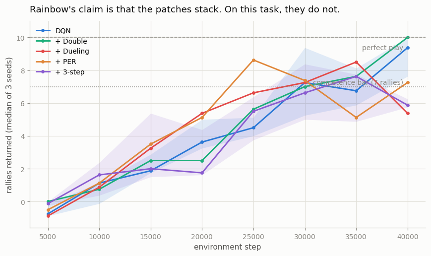
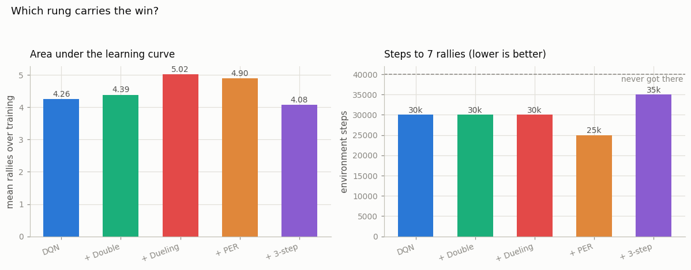

# Mini Rainbow

## Key Insight

[Rainbow](/shared/glossary/#rainbow) is the observation that the half-dozen independent improvements to [DQN](/shared/glossary/#dqn) are complementary rather than competing — stacked together they multiply rather than merely add. This project builds a Rainbow-lite from four of them: [Double DQN](/shared/glossary/#double-dqn) and [Dueling DQN](/shared/glossary/#dueling-dqn) for better value estimates, [prioritized experience replay](/shared/glossary/#prioritized-experience-replay-per) for focusing on the most informative transitions, and [n-step returns](/shared/glossary/#n-step-returns), which build the learning target from the rewards seen over the next `n` steps rather than just one — trading a little more variance for much faster propagation of reward back through time. Ablating the components one at a time reveals which carry the most weight on your chosen task, the kind of careful empirical bookkeeping that real reinforcement-learning engineering is mostly made of.

---

## What's in this directory

| File | Role |
|------|------|
| `mini_rainbow.py` | The cumulative ladder — DQN → +Double → +Dueling → +PER → +3-step — on project 14's pixel Pong, plus `NStepBuffer`, the one genuinely new piece of machinery. |

```bash
python3 mini_rainbow.py     # ~9.5 min on 12 CPU cores (15 runs in parallel)
```

Everything else is imported: the training loop and buffer from
[project 13](../13-add-a-replay-buffer/README.md), the environment and CNN from
[project 14](../14-atari-pong/README.md), the dueling head from
[project 15](../15-double-dueling/README.md), and the sum-tree from
[project 16](../16-prioritized-replay/README.md). The ladder is *cumulative* — each
rung keeps everything below it — because that is the claim under test: not "is PER
good in isolation" but "does PER still help once you already have Double and Dueling".

## The result, which is not the one Rainbow advertises



| rung | final score | best score | AUC (learning speed) | steps to 7 rallies |
|---|---|---|---|---|
| DQN | **9.00** | 9.17 | 4.26 | 30,000 |
| + Double | 8.54 | 9.21 | 4.39 | 30,000 |
| + Dueling | 5.96 | 9.21 | **5.02** | 30,000 |
| + PER | 6.58 | 9.12 | 4.90 | **25,000** |
| + 3-step | 5.96 | 7.50 | 4.08 | 35,000 (only 2 of 3 seeds) |



Read down the columns and the tidy staircase refuses to appear. Every rung reaches
roughly the same *peak* (9.1–9.2 rallies out of 10) except the last. Learning *speed*
(area under the curve) rises through +Double and +Dueling, peaks there, and then
falls. And 3-step returns — the final rung, and one of the most valuable components in
the real Rainbow ablation — is unambiguously the **worst** configuration here: lowest
AUC, lowest best score, slowest to competence, and the only rung that fails to reach 7
rallies on every seed.

Three seeds is not many, and most of these gaps sit inside the seed noise. The one
that does not is the 3-step regression, and it deserves understanding rather than
explaining away.

## Why n-step hurts here

An n-step target is
`r_t + γ·r_{t+1} + ... + γⁿ⁻¹·r_{t+n-1} + γⁿ·max_a Q(s_{t+n}, a)`. It carries real
reward `n` states back in a single update instead of relaying it one state per update,
which is why it usually accelerates learning.

The catch is that those intermediate rewards were collected by the *behavior* policy —
the ε-greedy one, which is regularly taking random actions — while the target is meant
to describe the *greedy* policy. A strictly correct off-policy n-step return needs an
[importance-sampling](/shared/glossary/#importance-sampling) correction to fix that
mismatch, and essentially nobody applies it for small `n`, because the bias is usually
small and the variance the correction introduces is usually worse.

"Usually" is doing all the work in that sentence. In MiniPong a single exploratory
action at the wrong moment does not cost a little reward — it **ends the episode** at
−1. So a 3-step return regularly bakes in the consequences of a random action the
greedy policy would never take, and the target turns systematically pessimistic about
states that are in fact perfectly safe. The bias n-step quietly accepts scales with
how catastrophic an exploratory action can be, and in this game it is maximally
catastrophic.

That is a property of the environment, not a bug in the buffer. `NStepBuffer` is
verified against hand-computed discounted returns, including the partial windows it
flushes when an episode ends inside one:

```python
# episode: rewards 1, 2, 3, then terminal with 10;  gamma = 0.9
emitted:  (s0, R = 1 + .9*2 + .81*3 = 5.23,   s3, done=0)   # a full 3-step window
          (s1, R = 2 + .9*3 + .81*10 = 12.8,  s4, done=1)   # terminal inside the window
          (s2, R = 3 + .9*10 = 12.0,          s4, done=1)   # flushed, 2-step
          (s3, R = 10,                        s4, done=1)   # flushed, 1-step
```

Every flushed window carries `done = 1`, so its bootstrap term is multiplied by zero,
and the fact that it is a k-step return with `k < n` never gets a chance to matter.

## Why PER barely moves the needle — and why that was predictable

+PER is the quickest rung to reach competence (25,000 steps against everyone else's
30,000), but the effect is small — and
[project 16](../16-prioritized-replay/README.md) already told us it would be. There,
PER's advantage grew with the *sparsity* of the reward: 1.2× on a chain where a payout
was one row in 430, and 2.5× where it was one row in 37,500.

MiniPong pays out constantly. The agent earns `+1` every twenty-odd steps and `−1` on
every miss; there is no needle in this haystack because the haystack is mostly
needles. Prioritization has little to find that uniform sampling would have missed, so
it buys a modest speedup and nothing more. **The two projects agree, and the agreement
is the point**: PER's value is a function of your reward distribution, and knowing
that in advance is worth more than any benchmark number.

## What this project is actually teaching

The honest summary of the table is: *on this task, one of the four patches helps a
little, two do nothing measurable, and one actively hurts.*

That is not a refutation of Rainbow. Rainbow's ablation ran on 57 Atari games across
millions of frames and many seeds, and its components were chosen precisely because
they pay off in *that* regime — sparse rewards, enormous state spaces, long horizons,
and enough compute for the variance to average out. MiniPong is dense-rewarded,
deterministic, three-actioned and tiny. The components are not broken; they are
solving problems this environment does not have, and one of them is actively mispriced
for a game where a single exploratory step is fatal.

The transferable lesson is the one the ladder embodies: **run the ablation on your own
task.** The reflex to import Rainbow wholesale because it topped a benchmark is
exactly the reflex this project exists to break. Each of these techniques is a bet
about a property of the environment — Double bets there is
[overestimation](/shared/glossary/#overestimation-bias) to remove, PER bets the
informative transitions are rare, n-step bets that off-policy bias is cheaper than
slow credit assignment — and a bet whose premise is false does not pay, however many
citations it carries.

Which is why the honest version of this project's headline figure is a ladder that
does not go up.
