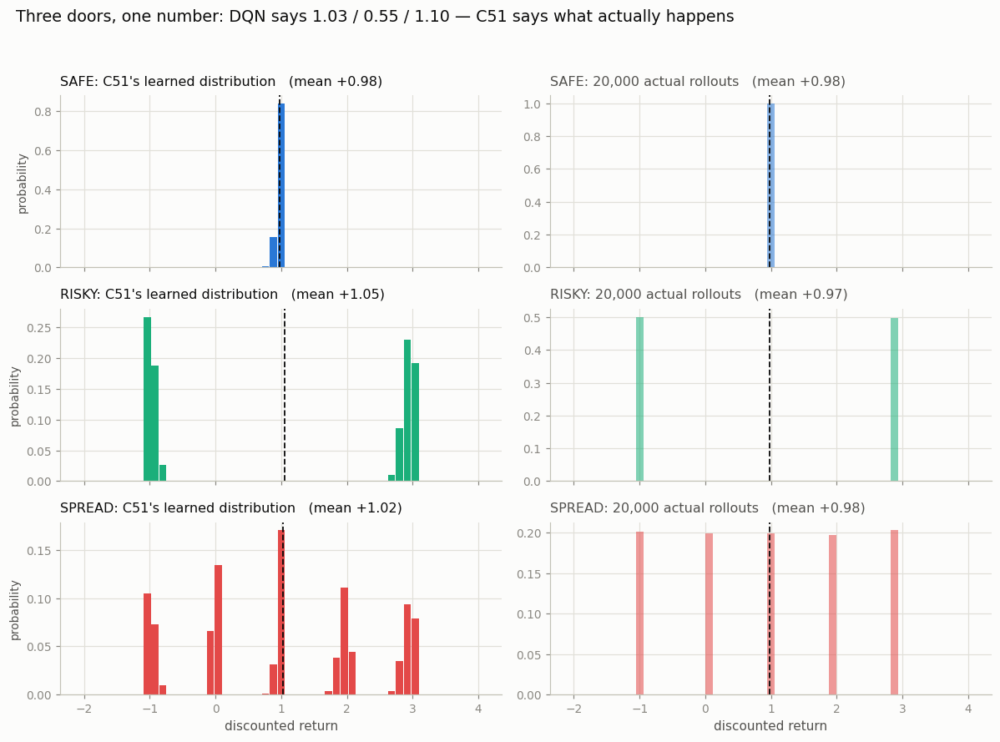
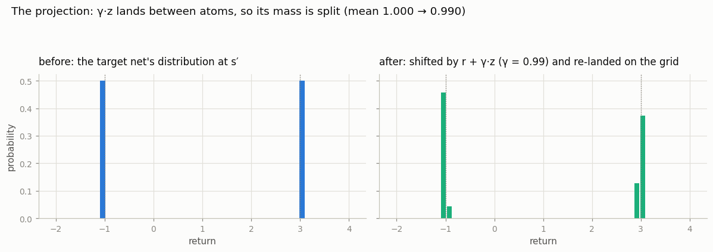
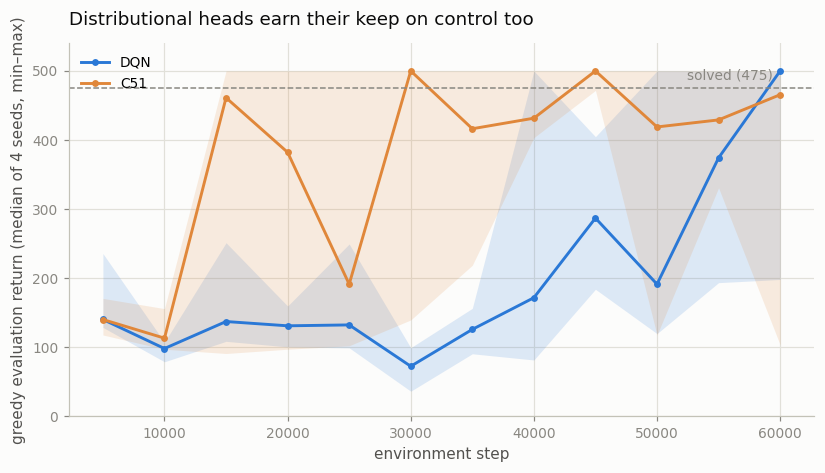

# Distributional DQN (C51)

## Key Insight

Ordinary [DQN](/shared/glossary/#dqn) predicts a single number per action: the *expected* [return](/shared/glossary/#return). [Distributional RL](/shared/glossary/#distributional-rl) predicts the whole *distribution* of possible returns instead — capturing that an action might usually pay off modestly but occasionally win or lose big — which gives the network a far richer training signal and tends to stabilize learning even when you still ultimately act on the mean. [C51](/shared/glossary/#c51), the original distributional agent, represents that distribution as a [fixed comb](/shared/glossary/#fixed-comb) of 51 evenly spaced return values (the "atoms") and learns a [softmax](/shared/glossary/#softmax) probability for each; the "51" is simply the atom count that was found to work well — enough resolution to capture the shape of the distribution without so many bins that each is starved of training data. Each [Bellman](/shared/glossary/#bellman-equation) update shifts every atom by the reward and [discount factor](/shared/glossary/#discount-factor), redistributes the probabilities back onto the fixed comb (a step called the projection), and trains the network to match that shifted target with a [cross-entropy](/shared/glossary/#cross-entropy) loss.

---

## What's in this directory

| File | Role |
|------|------|
| `c51.py` | `C51Net` (a distributional head), `project_distribution` (the one hard part), and `C51Agent` — which subclasses project 13's `DQNAgent`, inheriting replay, target network and [epsilon-greedy](/shared/glossary/#epsilon-greedy) untouched. |
| `distributional_dqn.py` | Draws the projection step; checks the learned distributions against Monte-Carlo truth on a corridor built to embarrass the mean; then asks whether any of it helps *control*. |

```bash
python3 distributional_dqn.py     # ~5 min on 12 CPU cores
```

## An environment designed to embarrass the mean

From the start state, three doors. Each leads down a two-step corridor to a
payout:

| door | payout | expected value |
|---|---|---|
| SAFE | always `+1` | 1.0 |
| RISKY | `+3` or `-1`, a fair coin | 1.0 |
| SPREAD | one of `-1, 0, +1, +2, +3`, uniformly | 1.0 |

Every door is worth exactly the same. This is not a trick question with a hidden
right answer — a *correct* [Q-function](/shared/glossary/#value-function) must
assign all three doors the same value, and DQN, asked what lies behind each, duly
gives the same answer three times. The answer it gives ("about 0.98") is a number
that RISKY and SPREAD **literally never pay**.

C51 is asked the same question, trained on the same reward signal, and describes
three different futures:



The left column is what the network learned; the right is 20,000 actual rollouts.
SAFE is a single spike. RISKY is two spikes with nothing in between — a case where
"the expected value" is the one outcome that cannot occur. SPREAD is five bars.
The means agree with each other, and with the truth, to two decimal places:

| door | true mean | DQN's `Q(start, door)` | C51's mean | C51's `P(return < 0)` |
|---|---|---|---|---|
| SAFE | 0.980 | 1.027 | 0.980 | 0.0% |
| RISKY | 0.980 | 0.549 | 1.050 | 48.2% |
| SPREAD | 0.980 | 1.101 | 1.023 | 25.4% |

That last column is the payoff, and it is unavailable at any price from a DQN.
The agent now knows that the RISKY door is a coin flip with a 49% chance of a
loss and that the SAFE door cannot lose at all — while still agreeing the two are
worth the same in expectation. Risk-sensitive policies, uncertainty-aware
exploration, and every distributional method that followed are built on exactly
that extra information.

One honest wrinkle, visible in the table: DQN's value for the RISKY door (0.549) is
by far the least accurate number in it — it is 44% below the truth, while its other
two doors land within 12%. Its regression target for that door thrashes between `+3`
and `-1`, so the mean converges slowly and noisily. C51's target for the same door is
a *stable* two-spike distribution — the randomness has moved into the thing being
predicted rather than into the signal doing the teaching. That is the usual
explanation for why distributional heads train more smoothly, and here it is measured
rather than asserted.

## The projection, which is the whole trick

The Bellman update maps each atom `z_i` to `r + γ·z_i`, and that value almost
never lands on another atom — `γ = 0.99` shrinks the grid slightly, so every atom
slides *between* two of its neighbours. Before the shifted distribution can be
compared with a prediction on the fixed comb, its mass has to be put back onto
the comb:



Each shifted atom's probability is split between the two atoms it landed between,
in proportion to how close it landed to each. Mass is conserved (the script
checks: `Σp = 1.000000`), and the mean moves by exactly the factor `γ`, as it
must.

The subtlety hiding in `project_distribution` is a two-line guard that most first
implementations omit:

```python
lower = torch.where((upper > 0) & (lower == upper), lower - 1, lower)
upper = torch.where((lower < n_atoms - 1) & (lower == upper), upper + 1, upper)
```

When a shifted atom lands *exactly* on a grid point, `floor(b) == ceil(b)`, and
both split weights `(upper - b)` and `(b - lower)` evaluate to zero — silently
deleting that atom's probability mass. The target then stops summing to 1, and
the cross-entropy loss quietly trains against something that is no longer a
distribution. Nudging the bounds apart fixes it; the two edge conditions
(`upper > 0`, `lower < n_atoms - 1`) keep the nudge from walking off the ends of
the comb. It is a fine example of the kind of bug this phase is full of: nothing
crashes, nothing warns, the loss curve looks plausible, and the agent is simply
worse than it should be.

## The loss stops being a regression

There is no squared TD error in C51, because there is nothing to square. The
prediction is a distribution, the target is a distribution, and the loss is the
cross-entropy between them:

```python
per_sample = -(target_probs * log_p).sum(-1)
```

Everything else is inherited from the ordinary `DQNAgent` unchanged: replay
buffer, target network, epsilon-greedy actor, even the
[Double DQN](/shared/glossary/#double-dqn) flag. Action selection still needs one
number per action, and it gets one by collapsing the distribution back to its
mean:

```python
q = (log_p.exp() * self.support).sum(dim=-1)     # atoms weighted by their probabilities
```

Which is the irony at the heart of C51: it goes to considerable lengths to learn
the whole distribution and then, at the moment of acting, takes the average
anyway. The distribution is not there to change the *decision rule*. It is there
to change what the network must learn in order to make the decision.

## Does the extra machinery actually help control?

That irony makes the question unavoidable. If we act on the mean regardless, is
the distribution just a prettier answer to the same question? Same CartPole, same
hyperparameters, one head swapped:



| method | last-3 evaluation | best evaluation | seeds that hit 475 |
|---|---|---|---|
| DQN | 345.1 | 476.2 | 3/4 |
| C51 | **389.9** | **500.0** | **4/4** |

C51 is better on every column: it holds a 13% higher score over the final three
checkpoints, it is the only agent in this entire phase to reach a *perfect* 500, and
it clears the 475 bar on all four seeds where DQN manages three. The usual
explanation is that predicting 51 probabilities is a richer, better-conditioned
learning problem than regressing one scalar: the network is forced to build features
that explain the *shape* of the future, not just its average, and those features turn
out to be better for control too. This is a 4-seed experiment on an easy task — read
it as consistent with the literature's finding, not as independent proof of it.

## The one real chore: choosing the comb

`v_min` and `v_max` are C51's genuine cost, and they are not learnable. The atom
grid has to cover the returns the environment can actually produce, which means
editing it per task:

```python
# corridor: returns live in [-1, +3]
C51Agent(..., v_min=-2.0, v_max=4.0)

# CartPole: returns live in [0, 100]  (gamma = 0.99, 500-step cap)
C51Agent(..., v_min=0.0, v_max=110.0)
```

Get it wrong and the failure is quiet rather than loud. A comb that is too narrow
cannot *represent* the true return — everything beyond the end is clamped onto the
last atom, so a great outcome and a merely good one collapse into the same
prediction. A comb that is too wide spends most of its 51 atoms on returns that
never occur, leaving coarse resolution exactly where the action is. The projection
clamps, so nothing ever crashes; you simply get a worse agent and no clue why.
(This is the wart that QR-DQN and IQN later removed, by learning the *locations*
of the atoms instead of fixing them in advance.)

## What to take away

DQN answers "what is this worth on average?". C51 answers "what could happen?".
The corridor shows those are different questions with different answers, and that
the second is answerable at almost no extra cost — the same replay buffer, the
same target network, the same epsilon-greedy loop, with a softmax where the scalar
head used to be and a cross-entropy where the squared error used to be. That it
*also* makes the agent better at the original task is the part nobody fully
predicted, and it is why a distributional head is standard equipment in
[Rainbow](/shared/glossary/#rainbow) and everything descended from it.
