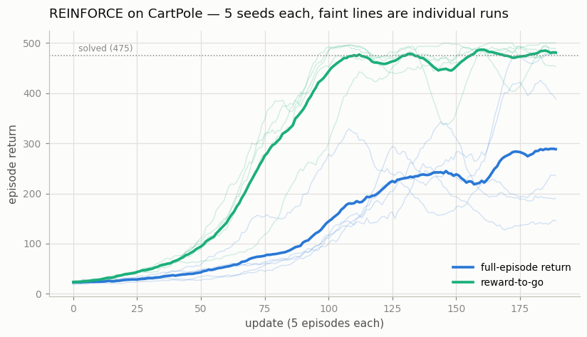
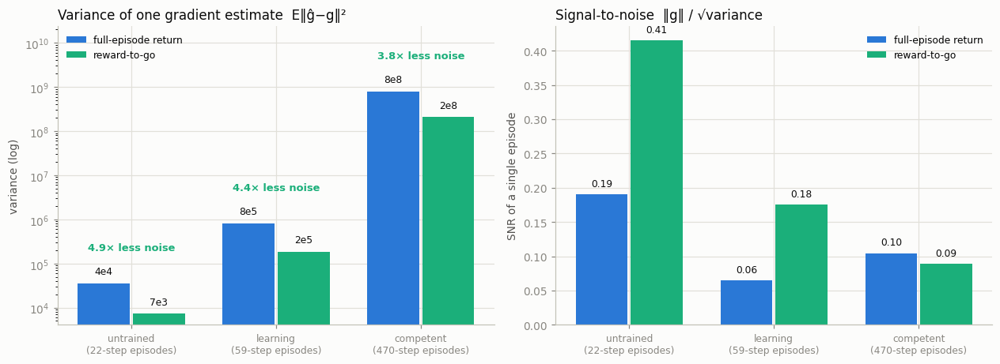
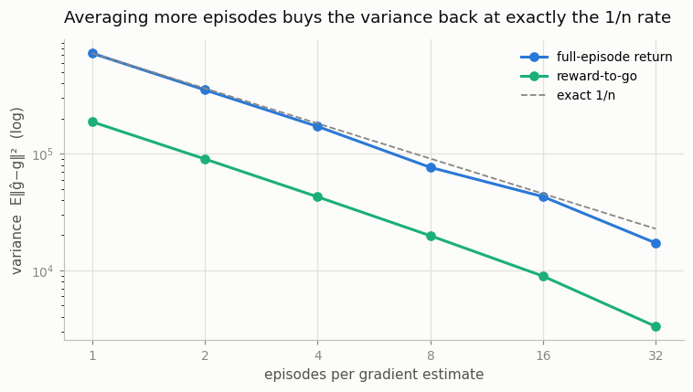
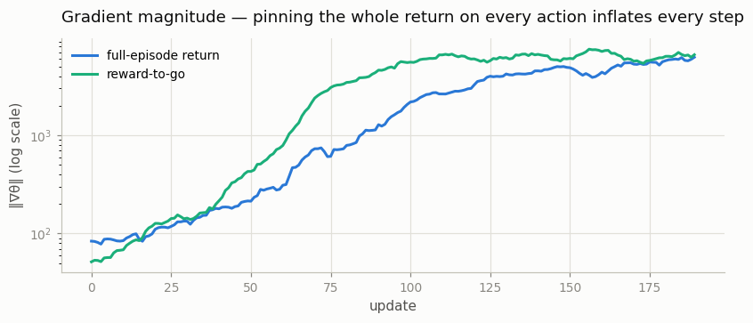

# REINFORCE on CartPole

## Key Insight

[REINFORCE](/shared/glossary/#reinforce) is the most direct way to learn a [policy](/shared/glossary/#policy): instead of estimating action values and acting [greedily](/shared/glossary/#greedy-policy), it nudges the policy's [weights](/shared/glossary/#weights) so that actions taken in successful episodes become more likely and actions from failed ones become less likely. The mechanism is the [policy gradient theorem](/shared/glossary/#policy-gradient-theorem), made computable by the [log-derivative trick](/shared/glossary/#log-derivative-trick), which weights each action by the full [Monte Carlo](/shared/glossary/#monte-carlo-method) [return](/shared/glossary/#return) of its [rollout](/shared/glossary/#rollout). [CartPole](/shared/glossary/#cartpole) is the gentlest place to see this work — but also to feel its flaw: because the weight is a whole noisy trajectory's return rather than a one-step estimate, the gradient is [unbiased but high-variance](/shared/glossary/#bias-variance-tradeoff), so training lurches around and learns slowly. Watching that variance firsthand is the whole point, and it motivates the baseline and [actor-critic](/shared/glossary/#actor-critic) fixes in the projects that follow.

## REINFORCE vs. DQN

[REINFORCE](/shared/glossary/#reinforce) and [DQN (Deep Q-Network)](/shared/glossary/#dqn) represent the two primary branches of reinforcement learning: **policy-gradient** methods and **value-based** methods.

- **DQN (Value-Based):** Learns to estimate the expected future reward (value) of taking each action in a given state (using a [critic](/shared/glossary/#actor-critic) or value network), and then acts [greedily](/shared/glossary/#greedy-policy) based on those estimates. It is [off-policy](/shared/glossary/#off-policy) and relies on an [experience replay](/shared/glossary/#experience-replay) buffer to learn from past data.
- **REINFORCE (Policy-Gradient):** Bypasses estimating action values entirely. It directly outputs a probability distribution over actions (the [policy](/shared/glossary/#policy)) and updates its weights using [Monte Carlo](/shared/glossary/#monte-carlo-method) [returns](/shared/glossary/#return) from complete [rollouts](/shared/glossary/#rollout). It is strictly [on-policy](/shared/glossary/#on-policy).

**Analogy:** Imagine learning to play golf.
- A **DQN** golfer (value-based) tries to calculate the exact expected score or landing position for every possible club and swing angle, and then picks the one with the highest estimated value.
- A **REINFORCE** golfer (policy-gradient) doesn't calculate any values. They just swing. If the ball lands in or near the hole, they try to repeat that exact swing next time. If the ball lands in a pond, they avoid that swing in the future.

While DQN is often more sample-efficient because it can reuse past data, REINFORCE is mathematically simpler, directly optimizes the policy, and works naturally in continuous action spaces where calculating values for infinitely many actions is impossible.

---

## What's in this directory

| File | Role |
|------|------|
| `pg_lib.py` | **The shared core for all of Phase 4.** The policy/critic network, the [vectorized environment](/shared/glossary/#vectorized-environment) builder, [GAE](/shared/glossary/#gae), the rollout collector, and the evaluator. Projects 20–25 import it and swap exactly one piece each. |
| `reinforce.py` | REINFORCE itself, plus the two measurements that make this project worth doing: how noisy the gradient estimate actually is, and how fast averaging buys the noise back. |

```bash
python3 reinforce.py all       # ~8 min on 12 CPU cores
```

## The algorithm is one line

Everything REINFORCE does is contained in the choice of a single variable — the
weight `w_t` that multiplies each action's log-probability:

```python
loss = -(logp * w).sum()
```

Set `w_t` to the return and you have REINFORCE. Set it to the return minus a
[baseline](/shared/glossary/#baseline) and you have project 20. Set it to a
bootstrapped [advantage](/shared/glossary/#advantage) and you have A2C. Set it to
a clipped importance-weighted advantage and you have PPO. The whole phase is an
argument about what belongs in `w_t`, and this project takes the two simplest
positions:

| weighting | `w_t` | the claim it makes |
|---|---|---|
| full-episode return | `G₀` — the whole episode's return, on every action | every action in a good episode was a good action |
| reward-to-go | `Gₜ` — only the reward that arrived *after* the action | an action cannot be credited with a reward that preceded it |

The second is obviously the more sensible [credit assignment](/shared/glossary/#credit-assignment),
and the interesting question is *how much* it is worth. That is measurable, so
this project measures it.

## Both learn. One learns much better.



| weighting | final return (mean of last 20 updates) | per seed |
|---|---|---|
| full-episode return | **282 ± 125** | 188, 145, 390, 469, 217 |
| reward-to-go | **478 ± 11** | 498, 473, 484, 473, 465 |

Reward-to-go lands every seed in a tight band near the 500 ceiling. The
full-return version gets there on none of them within the same budget, and its
five seeds spread over a 324-point range — one run finds its way to 469, another
stalls at 145. That spread *is* the variance the Key Insight promises, seen from
the outside.

The change that produced it is deleting, from each action's weight, the rewards
that were collected before that action was taken. Nothing else differs: same
network, same learning rate, same episodes, same seeds.

## Why it works, in numbers rather than adjectives

The reward-to-go argument is usually made by waving at "extra noise". It can
simply be measured. Freeze a policy, draw 200 independent single-episode gradient
estimates, and look at how far they scatter around their own mean:



| checkpoint | episode length | variance, full return | variance, reward-to-go | ratio |
|---|---|---|---|---|
| untrained | 22 steps | 3.6 × 10⁴ | 7.3 × 10³ | **4.9× less** |
| learning | 59 steps | 8.2 × 10⁵ | 1.8 × 10⁵ | **4.4× less** |
| competent | 470 steps | 7.9 × 10⁸ | 2.1 × 10⁸ | **3.8× less** |

Both estimators are aimed at the *same* gradient — the rewards-before-the-action
term has zero mean, so dropping it changes the noise and not the target. That is
also why this project runs at `γ = 1` while the rest of the phase uses `γ = 0.99`:
with a discount the two weightings quietly target *different* vectors (the
full-return weight picks up an extra `γᵗ`), and comparing their variance would be
comparing two different things. CartPole is hard-capped at 500 steps, so the
undiscounted return is finite and no discount is needed to keep the math honest.

The right-hand panel holds the number that actually decides whether learning
happens: the signal-to-noise ratio of one episode's gradient, `‖g‖ / √variance`.
Read it and the picture is grimmer than the left panel suggests.

**The estimator gets worse as the agent gets better.** For reward-to-go, SNR falls
from 0.42 to 0.18 to 0.09 as the policy improves. At the competent checkpoint a
single episode's gradient is around *90% noise* — and there the two weightings are
equally doomed, because reward-to-go's 3.8× variance advantage is cancelled by the
true gradient itself shrinking as the policy runs out of things to fix. This is not
a CartPole quirk. It is structural:

- a better policy survives longer, so episodes get longer (22 → 470 steps),
- a longer episode contains more actions, each contributing its own randomness,
- and the returns themselves grow, so the weights multiplying that randomness grow with them.

Success makes the measurement harder, and nothing inside REINFORCE pushes back.

## The only fix REINFORCE has, and its price

If one estimate is too noisy, average more of them. That works — at exactly the
rate the central limit theorem promises and not one bit faster:



The measured curve sits on the `1/n` reference line for both weightings. Which
means: to halve the *error* (which goes as `√variance`) you must **quadruple** the
number of episodes. Cutting the noise 10× costs 100× the interaction with the
environment.

That sentence is the motivation for the rest of the phase. REINFORCE is not
*wrong* — it is unbiased, it converges, and given unlimited episodes it finds the
optimum. It is **expensive**, and the price is set by a variance the algorithm
does nothing about. Everything that follows is an attempt to get the variance down
*without* buying more episodes:

- project 20 subtracts a [baseline](/shared/glossary/#baseline) — another 3–5×, free,
- project 21 bootstraps a critic, replacing the noisy tail of the return with an estimate,
- project 22 reuses each batch several times, so the same episodes pay for several steps.

## A detail worth stealing: watch the gradient norm



The full-return weighting does not only add noise, it inflates the *size* of every
gradient — by a factor that grows as episodes lengthen, because every action is
now multiplied by a number as large as the entire episode's return. Under a fixed
learning rate that is a step-size problem wearing an algorithm's clothes, and it
is why an untuned REINFORCE so often diverges outright rather than merely learning
slowly. An earlier version of this project ran at `lr = 1e-2` and drove three of
five seeds into a collapsed policy that scored 9 out of 500; the fix was not a
better algorithm but a smaller step. Reward-to-go keeps the weights smaller and
the steps saner, which is a second, quieter reason it wins.

## What to take away

The policy gradient theorem hands you an unbiased estimator and says nothing about
whether it is *usable*. The gap between those two things is enormous, it is
measurable in an afternoon, and it widens in exactly the regime you care about —
a policy that has nearly become good. Every remaining project in this phase is a
different attack on that gap, and the reward-to-go trick measured here is the
smallest and cheapest of them: 4× less noise, in exchange for deleting a term that
could never have carried any information in the first place.
