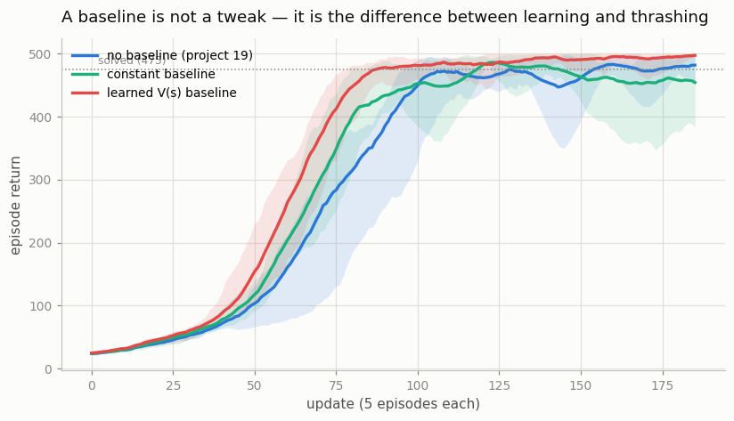
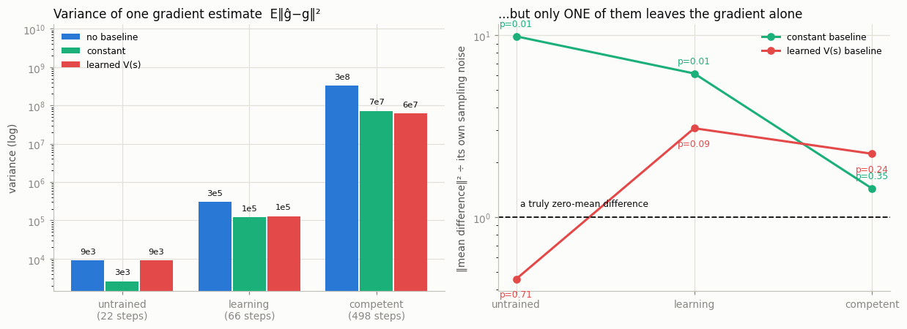
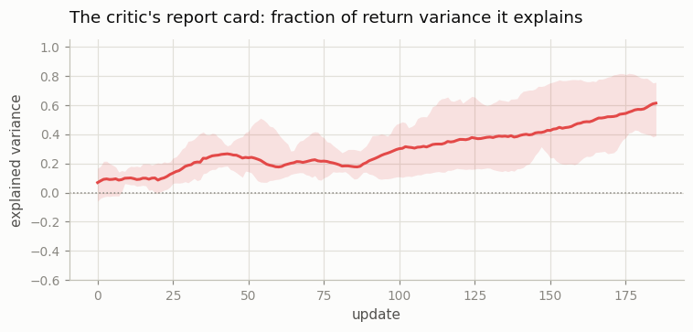

# Add a Value Baseline

## Key Insight

[REINFORCE](/shared/glossary/#reinforce)'s high [variance](/shared/glossary/#bias-variance-tradeoff) comes from weighting every action by the raw [return](/shared/glossary/#return), which swings wildly from episode to episode. Subtracting a [baseline](/shared/glossary/#baseline) — typically a learned [value function](/shared/glossary/#value-function) `V(s)` that estimates the average return from a state — fixes this: the action weight becomes the [advantage](/shared/glossary/#advantage) `A(s,a) = return − V(s)`, which answers "was this action better or worse than usual *here*?" rather than "was the whole episode good?". Crucially this subtraction lowers variance *without adding bias*, because a baseline that depends only on the state (not the action) cancels out in expectation. Adding this single term is the conceptual bridge from REINFORCE to [actor-critic](/shared/glossary/#actor-critic) methods, where the same learned `V(s)` plays the role of the critic.

---

## What's in this directory

| File | Role |
|------|------|
| `baseline.py` | The same CartPole REINFORCE as [project 19](../19-reinforce-on-cartpole/README.md), with three choices of baseline, plus the two measurements that check the textbook's two promises: that the variance drops, and that the gradient does not move. |

```bash
python3 baseline.py all       # ~8 min on 12 CPU cores
```

This project imports [project 19](../19-reinforce-on-cartpole/README.md)'s `pg_lib.py` and reuses its exact settings
(`γ = 1`, `lr = 1e-3`, 5 episodes per update, 200 updates, 5 seeds). The `none`
variant below therefore *is* [project 19](../19-reinforce-on-cartpole/README.md)'s reward-to-go agent, and the only thing
that changes is one subtraction.

## The claim, stated precisely enough to test

The textbook promise is double-barrelled, and both barrels are checkable:

```
for ANY function b(s) that does not depend on the action,

    E[ ∇log π(a|s) · (Gₜ − b(s)) ]  =  E[ ∇log π(a|s) · Gₜ ]      ← same gradient (no bias)
  Var[ ∇log π(a|s) · (Gₜ − b(s)) ]  <  Var[ ∇log π(a|s) · Gₜ ]    ← less noise
```

Three baselines are compared, and the middle one is included precisely because it
looks harmless and is not:

| variant | `b` | |
|---|---|---|
| `none` | 0 | [project 19](../19-reinforce-on-cartpole/README.md)'s reward-to-go |
| `constant` | the mean return of the batch | the cheapest baseline anyone would think of |
| `learned` | `V_φ(s)`, a critic trained on the returns | the real thing — a *state-dependent* baseline |

## The learned baseline wins on every axis



| variant | final return | updates to reach 400 (per seed) |
|---|---|---|
| no baseline | 477.4 ± 13.2 | 95, 95, 113, 96, 97 |
| constant baseline | 453.6 ± 43.4 | 85, 96, 91, 78, 82 |
| **learned `V(s)`** | **494.7 ± 7.1** | **76, 80, 88, 78, 83** |

The critic reaches a return of 400 about 20% sooner and finishes closest to the
ceiling with the tightest spread across seeds (± 7 against ± 13). That is what
lower variance buys — and on a task this easy it is a modest-looking win, which is
the honest scale of it. CartPole is solvable without any of this. The reason to
care is that the mechanism scales even though the task does not: everything after
this project inherits the critic, and by the time [LunarLander](/shared/glossary/#lunarlander)
arrives in [project 21](../21-a2c-with-parallel-envs/README.md) the baseline has stopped being a nicety.

## Barrel one: the variance really does drop



Freeze a policy, draw 200 single-episode gradient estimates under all three
weightings *from the same episodes*, and measure how far they scatter:

| checkpoint | no baseline | constant | learned `V(s)` |
|---|---|---|---|
| untrained (22-step episodes) | 9.0 × 10³ | 2.6 × 10³ — **3.5× less** | 9.0 × 10³ — **1.0×, nothing** |
| learning (66-step episodes) | 3.0 × 10⁵ | 1.2 × 10⁵ — **2.5× less** | 1.3 × 10⁵ — **2.3× less** |
| competent (498-step episodes) | 3.3 × 10⁸ | 7.3 × 10⁷ — **4.5× less** | 6.3 × 10⁷ — **5.2× less** |

Look at the top-right cell. At the untrained checkpoint the learned baseline
achieves **nothing whatsoever** — because the *critic* is untrained too, so
`V(s) ≈ 0`, and subtracting it is subtracting zero. A critic's usefulness has to be
earned, and it grows as the critic learns: 1.0× → 2.3× → 5.2×. By the last
checkpoint it has overtaken the constant baseline, which is the expected ordering:
a state-*dependent* baseline can track how precarious each individual state is, and
a single number cannot.

Stacked on top of [project 19](../19-reinforce-on-cartpole/README.md)'s 4× from reward-to-go, the two cheapest tricks in RL
together cut the gradient noise by roughly **20×** — and neither one costs a single
extra episode of environment interaction.

## Barrel two: no bias — and a trap

This is the half everyone asserts and nobody checks. Checking it turns up something
unpleasant.

The obvious test — "do the two mean gradients point the same way?" — is itself a
trap. Near a converged policy the true gradient is almost zero, so a few hundred
episodes cannot pin down its *direction*, and the cosine (the standard way to
measure the angle between two vectors — 1 means pointing the same way, 0 means
perpendicular, −1 means opposite) between two noisy estimates of a near-zero vector
means nothing. Imagine trying to tell which way an arrow points when the arrow is
almost zero length — a tiny gust of wind can flip it end to end, so "which way is it
pointing" stops being a meaningful question. Measured here, the cosine came out at
**−0.9**: not a scandal, just a measurement taken where no measurement is possible.

The well-conditioned test looks at the **difference** between the two estimators
instead of comparing their directions. Per episode, `g_none − g_baseline` is exactly
`b · Σₜ ∇log π(aₜ|sₜ)`, and the theorem says its expectation is *zero* — that IS the
unbiasedness claim, rewritten as something measurable. To check whether a measured
average could plausibly be "zero plus noise", this project uses a standard
statistical trick called **bootstrap resampling**: take the many measured
differences, repeatedly draw random resamples of them (with replacement — the same
value can be drawn more than once), and see how large an average those resamples
produce *just by chance*, if the true average really were zero. If the average
actually measured is far out in the tail of that chance distribution, the "it's just
noise" explanation becomes hard to believe; the **p-value** below is exactly that:
the probability that pure chance alone would produce an average as large as the one
observed (a low p-value, conventionally under 0.05, is read as "unlikely to be pure
chance"). Here is what that check finds at each checkpoint:

| checkpoint | constant baseline | learned `V(s)` baseline |
|---|---|---|
| untrained | 9.9× the noise floor, **p = 0.007** | 0.5× — p = 0.71 |
| learning | 6.2× the noise floor, **p = 0.006** | 3.1× — p = 0.085 |
| competent | 1.4× — p = 0.35 | 2.2× — p = 0.24 |

**The learned `V(s)` baseline is unbiased**, exactly as promised: every p-value is
comfortably consistent with a difference of zero.

**The constant baseline is not.** Its bias is statistically obvious (`p < 0.01`) at
two of the three checkpoints. The reason is worth internalising, because the theorem
was never violated — it was never *satisfied* in the first place:

> The baseline may not depend on the **action**. A baseline computed as *the mean
> return of the very episodes it is subtracted from* depends on the actions in those
> episodes, because the actions are what produced those returns. It is not a function
> `b(s)`; it is a function of the sampled trajectory. So it biases the gradient, and
> appealing to the theorem does not help.

The learned critic escapes exactly because it was fit on *earlier* episodes and is
frozen when the gradient is taken. It looks only at the state, as required.

Two caveats, stated plainly. The measurement uses *single-episode* estimates, which
is the worst case for the constant baseline: with one episode in the batch, "the mean
return of the batch" degenerates into "this episode's own mean return" and the
self-reference is total. The training loop above averages over five episodes, which
dilutes it — and, as the bottom row shows, once the policy is good enough that every
episode returns roughly the same number, the batch mean is effectively a constant and
the bias disappears into the noise. That is why the constant baseline still trains
perfectly well. The bias is real, small, and usually survivable.

It is also not an obscure corner case. PPO's [advantage normalization](/shared/glossary/#advantage-normalization)
([project 23](../23-the-37-details/README.md), detail #7) divides advantages by the standard deviation *of the same
minibatch*, which is the identical sin — and the field does it anyway, because it
works. Now you know what it costs.

## The critic's report card



The number to watch when debugging any actor-critic method is the critic's
[**explained variance**](/shared/glossary/#explained-variance): `1 − Var[G − V] / Var[G]`,
or "what fraction of the variation in returns does the critic actually predict?" 1.0
is perfect, 0.0 is no better than guessing the mean, and *negative* means the critic
is worse than useless.

It starts negative here — an untrained critic predicting ≈0 against returns in the
tens is actively wrong — climbs as the critic catches up, and never reaches 1.0. It
cannot: at `γ = 1` the reward-to-go from a state is dominated by *how many steps
remain before the 500-step cap*, and the elapsed step count is nowhere in CartPole's
four-number observation. The critic is being asked a question its input cannot
answer. This is a real and general phenomenon — a time-limited task is not
[Markov](/shared/glossary/#markov-property) unless the clock is part of the state —
and the standard fixes are to put the remaining time into the observation, or to
discount (`γ < 1`), which is what every project after this one does.

## What to take away

The baseline is the best deal in reinforcement learning: a 2–5× cut in gradient
noise, no extra environment interaction, no bias, and about ten lines of code.
[Project 19](../19-reinforce-on-cartpole/README.md) bought 4× by deleting a term that could not carry information; this
project buys another 2–5× by subtracting a term that predicts the part of the return
having nothing to do with the action taken. What survives the subtraction —
`Gₜ − V(sₜ)` — is the [advantage](/shared/glossary/#advantage), and estimating it
well is what every remaining algorithm in this phase is for.

Carry the trap forward too. "Unbiased" is a property of an estimator *and of how you
compute its pieces*. Subtract a number derived from the very data you are about to
weight, and the theorem quietly stops applying: no error message, no crash, and a
perfectly plausible learning curve.
