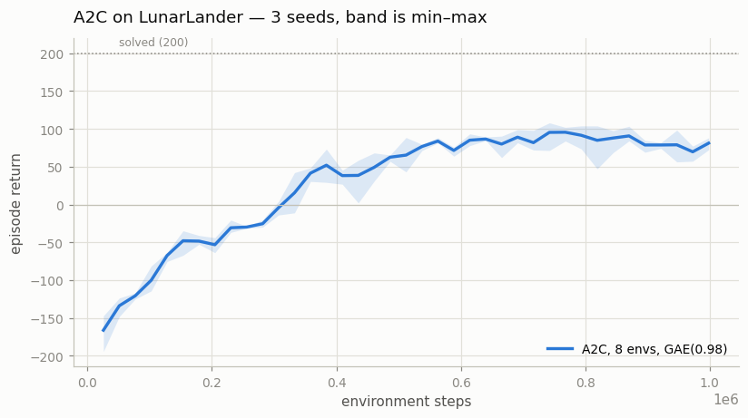
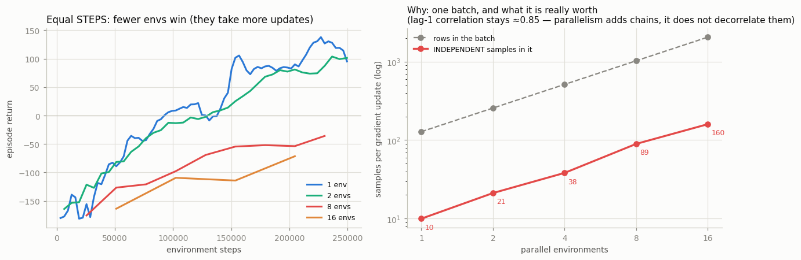
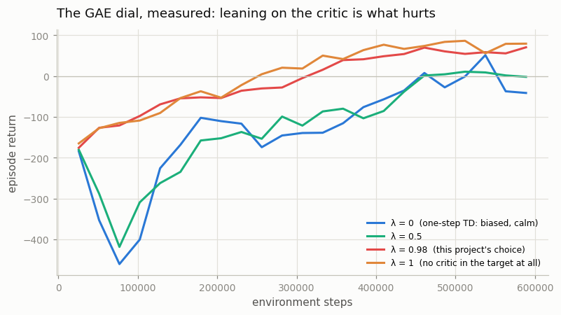

# A2C with Parallel Environments

## Key Insight

[A2C](/shared/glossary/#a2c) (Advantage [Actor-Critic](/shared/glossary/#actor-critic)) turns the value baseline from the previous project into a full algorithm: an *actor* network outputs the [policy](/shared/glossary/#policy) while a *critic* network learns `V(s)`, and the critic's estimate is used to compute each action's [advantage](/shared/glossary/#advantage). Two ingredients make it work in practice — [Generalized Advantage Estimation (GAE)](/shared/glossary/#gae), which blends short-sighted [one-step](/shared/glossary/#n-step-returns) and full-[return](/shared/glossary/#return) advantage estimates to trade off [bias and variance](/shared/glossary/#bias-variance-tradeoff), and running many copies of the environment in parallel so each gradient step sees a batch of *decorrelated* transitions instead of one highly-correlated trajectory. Running 8 parallel [environments](/shared/glossary/#gymnasium) is enough to stabilize learning on [LunarLander](/shared/glossary/#lunarlander), a control task where the agent must fire thrusters to land a spacecraft gently between two flags. A2C is the synchronous sibling of A3C, which gathers experience from asynchronous workers instead of stepping them in lockstep.

---

## What's in this directory

| File | Role |
|------|------|
| `a2c.py` | A2C itself, plus three experiments that test the claims A2C is usually sold on. Two of the three come out the *opposite* way, and the reasons are worth more than the folklore was. |

```bash
python3 a2c.py all       # ~10 min on 12 CPU cores
```

## The one idea A2C adds

REINFORCE (19) and its baseline (20) could not learn until an episode *ended*,
because the [Monte-Carlo](/shared/glossary/#monte-carlo-method) return does not exist
until the future has happened. A2C breaks that dependency with a **bootstrap**: cut
the rollout after a fixed `n` steps, wherever it happens to be, and let the critic
estimate what the rest would have been worth.

```
A_t = δ_t + (γλ)·δ_{t+1} + (γλ)²·δ_{t+2} + ...     where  δ_t = r_t + γV(s_{t+1}) − V(s_t)
```

Once an update costs a *fixed, small* amount of experience, it can be gathered from
many environments at once — which is the second half of the name of this project.

## A2C flies. It does not land.



| | final return (3 seeds, 20 fresh episodes each) |
|---|---|
| **A2C**, 8 envs, GAE(0.98), 1M steps | **98.3** (75, 100, 119) |
| PPO (project 22), same env, same network, 1M steps | **277.7** |
| | 200 = "solved" |

The curve rises fast to ~100 and then oscillates there for the rest of training. A
return near 100 on LunarLander has a specific meaning: the agent has learned to fire
its thrusters, kill its descent, and hover — collecting the shaping reward for being
near the pad — but not to *land*, which is where the +100 bonus lives. More steps do
not fix it (a 1.5M-step run plateaus at the same place).

The fix is not more data. It is project 22: reuse each batch for several gradient
steps instead of one, and clip the resulting off-policy update so it cannot go too
far. Same network, same GAE, same environments — 98 becomes 278.

## Claim 1: parallel envs decorrelate the batch — TRUE, and precisely measurable



A gradient step assumes its batch is a *sample* of the state distribution. It is not.
Consecutive states within one environment are the same lander a fortieth of a second
apart, and their measured lag-1 correlation is **ρ ≈ 0.85**. Feed the standard AR(1)
formula and a batch's real information content falls out:

```
effective sample size  ≈  (rows in batch) · (1 − ρ)/(1 + ρ)
```

| parallel envs | rows in the batch | independent samples in it |
|---|---|---|
| 1 | 128 | **10** |
| 2 | 256 | 21 |
| 8 | 1024 | 89 |
| 16 | 2048 | **160** |

Only about **8% of the rows are worth anything**, at every setting. And note what does
*not* change: ρ stays at 0.85 no matter how many environments you run, because it is a
property of the lander's physics, not of your batching. Parallelism does not
decorrelate a chain — **it adds more chains**. The effective sample size per gradient
update therefore grows linearly with the number of environments, which is exactly the
claim, now with a number attached.

This is the same disease [experience replay](/shared/glossary/#experience-replay) cures
for [DQN](/shared/glossary/#dqn) (project 13), by a completely different route — and it
has to be a different route, because an [on-policy](/shared/glossary/#on-policy)
algorithm is not allowed to keep old data at all.

## Claim 2: therefore more envs learn better — FALSE, at equal steps

This is the part the folklore gets wrong, and the experiment is cheap enough that
there is no excuse for repeating it. Fix the step budget at 250k and vary only how
those steps are arranged:

| parallel envs | steps/update | gradient updates | final return | wall-clock |
|---|---|---|---|---|
| 1 | 128 | **1953** | **150.9** | 190 s |
| 2 | 256 | 976 | 132.8 | 119 s |
| 8 | 1024 | 244 | −44.6 | 65 s |
| 16 | 2048 | 122 | −60.6 | **50 s** |

At equal experience, **fewer environments is dramatically better** — because the step
budget buys 16× more gradient updates. Each of those updates is noisier (ESS 10 versus
160), and it does not matter: many noisy steps beat few clean ones by a wide margin
here. The left panel above shows the 8- and 16-env arms still underwater at 250k steps
while the 1-env arm is at +150.

So what is parallelism *for*? The last column. Sixteen environments do the same 250k
steps in **50 seconds instead of 190** — a 3.8× wall-clock win from batching the
network's forward pass. Vectorization buys **throughput, not sample efficiency**, and
every practitioner who says "use more envs" is really saying "you can afford more
steps per hour". On this toy — a cheap environment and a two-layer MLP — 3.8× is not
enough to repay the lost updates. On the environments the technique was built for
(Atari frames, MuJoCo physics, a large network) the same batching is worth 10–100×,
and the arithmetic reverses completely.

There is also a second reason the reversal does not survive contact with PPO. A2C gets
**one** gradient step per rollout, so a big batch really does mean few updates. PPO
(project 22) reuses each rollout for 10 epochs × 8 minibatches = **80** updates, so a
large batch costs it nothing in update count. That is why "many parallel envs" is
standard equipment for PPO and a poor trade for A2C, and it is a good example of how
two implementation details that look independent are not.

## Claim 3: the GAE dial has a sweet spot in the middle — FALSE here, for a specific reason



| λ | what the advantage target becomes | final return |
|---|---|---|
| 0 | one-step TD: `r + γV(s')` — trusts the critic completely | **−22.6** |
| 0.5 | | 27.6 |
| 0.98 | | 64.1 |
| 1 | no critic in the target at all | **88.0** |

Monotone. No U-shape, no sweet spot: on this task, the more you lean on the critic,
the worse you do, and the textbook's "λ=1 is unbiased but too noisy" end never bites.

The reason is a detail of *this setup* rather than a fact about GAE, and it is worth
understanding because it applies to every truncated-rollout implementation. With a
128-step rollout, **λ=1 is not Monte-Carlo**. It is a 128-step return with a bootstrap
at the rollout boundary — the truncation itself caps the variance that λ=1 is supposed
to bring. The high-variance end of the dial has been sawn off before the sweep began.
What remains visible is the other end: λ=0 hands the entire target over to a critic
that is still wrong, and its bias is fatal.

To see the classic U-shape you need a setting where λ=1 really does mean "the whole
noisy episode" — which is to say, project 19. The dial is real; the picture in the
textbook assumes an untruncated return.

## What to take away

A2C is the smallest complete [actor-critic](/shared/glossary/#actor-critic) algorithm:
take project 20's learned baseline, replace the Monte-Carlo return with a bootstrapped
[GAE](/shared/glossary/#gae) target, and run several environments so that each cheap
update sees a batch worth having. It works — and then it stops at 98, hovering above
the landing pad, because it spends every batch on a single gradient step and has no
guard rail on how far that step may go.

Both of those are what PPO fixes, and both of the "obvious" benefits measured here came
out sideways: parallelism buys wall-clock rather than sample efficiency, and the GAE
dial's famous trade-off is half-hidden by the rollout truncation everyone uses. Neither
finding contradicts the theory. Both contradict the way the theory is usually repeated.
