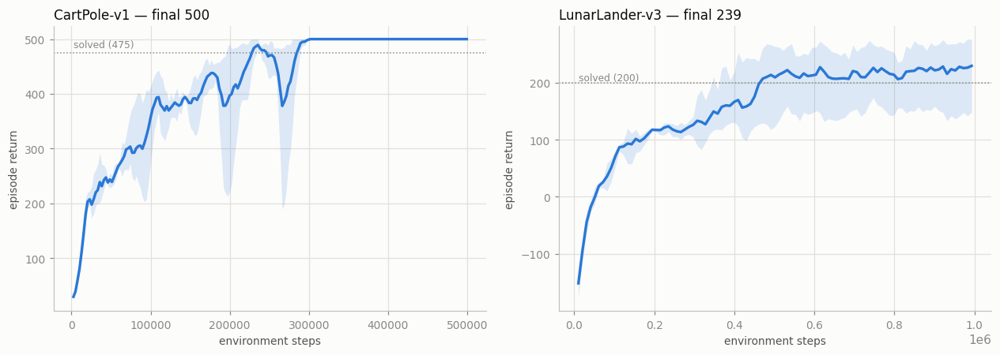
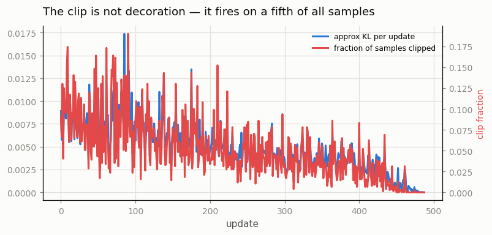

# PPO from Scratch

## Key Insight

[PPO](/shared/glossary/#ppo) (Proximal Policy Optimization) is the [on-policy](/shared/glossary/#on-policy) algorithm that ships in most production RL systems, and its core idea is a safety rail on how far the policy may move in one update. It forms the [importance ratio](/shared/glossary/#importance-sampling) `π_new/π_old` — how much more or less likely the new policy makes each past action — multiplies it by the [advantage](/shared/glossary/#advantage), and then *clips* that ratio to a narrow band around 1 so a single batch can never yank the policy too far. This is a cheap stand-in for [TRPO](/shared/glossary/#trpo)'s expensive [trust region](/shared/glossary/#trust-region): same goal of small, stable steps, but achieved with a one-line clamp instead of constrained optimization. Reproducing CleanRL's `ppo.py` line by line reveals that the famous five-line loss is the easy part — the rest is [GAE](/shared/glossary/#gae), advantage [normalization](/shared/glossary/#normalization), and the [data-wrangling](/shared/glossary/#data-wrangling) details that actually make it learn.

---

## What's in this directory

| File | Role |
|------|------|
| `ppo.py` | The whole algorithm, with **every implementation detail behind a named flag on `PPOConfig`**. [Project 23](../23-the-37-details/README.md) ablates those flags, [project 24](../24-ppo-on-atari/README.md) swaps the network for a CNN, and [project 25](../25-trpo-for-comparison/README.md) uses this file as the yardstick TRPO is measured against. |

```bash
python3 ppo.py check       # the sanity check that belongs in every PPO you write
python3 ppo.py all         # CartPole ~2 min, LunarLander ~6 min, on 12 CPU cores
```

## The five lines

```python
ratio      = (new_logp - old_logp).exp()                       # π_new / π_old
pg_loss    = -torch.min(ratio * adv,
                        ratio.clamp(1 - eps, 1 + eps) * adv).mean()
v_loss     = 0.5 * (V_pred - returns).pow(2).mean()
loss       = pg_loss + c1 * v_loss - c2 * entropy
```

The reasoning behind them is worth stating precisely, because it explains why PPO
exists at all. A2C ([project 21](../21-a2c-with-parallel-envs/README.md)) takes one gradient step per rollout and then throws
the data away, because after that step the policy has moved and the data is [off-policy](/shared/glossary/#off-policy).
That is a wretched trade: the data cost a walk through the environment, the gradient
step cost a microsecond. PPO reuses each batch for several epochs and pays for the
resulting off-policy-ness with the importance ratio. Left alone, that ratio would
let one batch drag the policy arbitrarily far — so PPO **clips** it. Past `1 ± ε`
the objective goes flat, its gradient vanishes, and the batch stops pulling. A
[trust region](/shared/glossary/#trust-region) implemented as a `clamp`.

The `min` (not `max`) is what makes the clipped objective a *pessimistic* bound: PPO
always believes the less flattering of the two stories it is told about a step. In
plain terms: PPO computes the update's benefit two ways — once with the ratio clipped,
once without — and then, for a good action, always takes whichever number is
*smaller*, and for a bad action, whichever is *worse*. It never lets the clip make a
step look better than it honestly is; the clip can only hold the policy back, never
push it further than the unclipped evidence would justify. That asymmetry is what
turns "clip the ratio" into an actual safety rail rather than just a cosmetic cap.

## The check that belongs in every PPO you write

```
$ python3 ppo.py check
  first-epoch ratio: mean 1.0000000000  max deviation from 1: 5.96e-08
  first-epoch approx KL: -2.91e-10
```

At the first minibatch of the first epoch, the policy scoring the data *is* the
policy that collected it. The ratio must therefore be exactly 1 and the KL exactly
0. If they are not, your stored log-probs disagree with your network — the most
common silent PPO bug there is. It does not crash. It does not warn. It just trains
a worse agent.

## It solves both tasks



| task | final return (3 seeds) | threshold |
|---|---|---|
| CartPole-v1 | **500.0** (a perfect score on every seed) | 475 = solved |
| LunarLander-v3 | **238.8** (164, 273, 279) | 200 = solved |

And for contrast, [A2C](/shared/glossary/#a2c) from [project 21](../21-a2c-with-parallel-envs/README.md) — the same network, the
same [GAE](/shared/glossary/#gae), the same parallel environments, differing only in
that it uses each batch **once** and does not clip — plateaus at **98** on
LunarLander and stays there. It learns to fly and hover; it does not learn to land.
Batch reuse plus a guard rail on the step size is the entire difference, and on this
task it is the difference between an agent that hovers and an agent that lands.

(One of the three LunarLander seeds lands at 164 rather than ~275. PPO is robust,
not magic; a fifth of the runs in any honest RL table are worse than the other four.)

## The clip is not decoration



The clip fires on a real fraction of samples every update, and the [KL divergence](/shared/glossary/#kl-divergence)
per update sits in a narrow band instead of wandering. That band is the trust region,
enforced by a `clamp` that costs nothing.

Note the diagnostic used here: the **k3 estimator** of the [KL divergence](/shared/glossary/#kl-divergence)
(a standard way of measuring "how different is the new policy's action distribution
from the old one" — 0 means identical, larger means further apart),
`((ratio - 1) - log_ratio).mean()`, rather than the naive `(-log_ratio).mean()`. Both
formulas are trying to answer the same question — "on average, how far did the policy
move?" — but the naive one is unbiased *on average over infinitely many updates*
while still being able to report a *negative* distance for any one actual update,
which is useless as the alarm you actually want it to be ("how far has my policy
moved *right now*?"); a distance that can read as negative cannot be trusted as an
early-warning number to watch during training. This is
[detail #12](https://iclr-blog-track.github.io/2022/03/25/ppo-implementation-details/) —
"debug variables" — and it is in the list of 37 for a reason: you cannot fix what you
cannot see.

## Three things that are not in the five lines, and without which nothing works

Reproducing PPO line by line teaches something the paper does not: the loss function
is the *easy* part. Three settings, none of them visible in the equations above, each
separately turn a solved LunarLander into a wrecked one. All three were live bugs in
this project before they were findings.

**1. The discount must span the reward.** LunarLander pays its +100 landing bonus
hundreds of steps after the thruster firings that earned it. At `γ = 0.99` the
effective horizon is `1/(1−γ) ≈ 100` steps — shorter than the episode. The agent
literally cannot see the landing pad from where it stands, so it learns to hover
instead, which is precisely what it did here until `γ` was raised to `0.999`. The
[discount factor](/shared/glossary/#discount-factor) is not a "regularizer", it is a
statement about which futures the agent is allowed to care about.

**2. [Reward scaling](/shared/glossary/#observation-normalization) is load-bearing —
and not for the reason you would guess.** Turning it off drops LunarLander from 277
to **−52**, and the mechanism has nothing to do with the rewards being "too big". It
is an interaction with a completely different detail:

| | actor gradient norm | critic gradient norm | global clip factor | effective actor LR |
|---|---|---|---|---|
| raw rewards | 0.13 | **50.0** | 0.5/50 = **0.01** | 3e-4 × 0.01 = **3e-6** |
| normalized rewards | 0.10 | 1.0 | 0.5/1.0 = 0.50 | 3e-4 × 0.50 = 1.5e-4 |

LunarLander's returns run into the hundreds, so the critic's regression loss — and
therefore its gradient — is enormous, while the actor's gradient (on normalized
advantages) is order 0.1. **Global gradient clipping (detail #11) clips them
jointly.** The critic's gradient eats the entire clipping budget, the whole update
gets rescaled by 0.01, and the actor's effective learning rate collapses to 3e-6.
The policy sits still while the critic thrashes. Normalizing the reward does not fix
the reward; it fixes the *gradient budget*. [Project 23](../23-the-37-details/README.md) measures this.

**3. Value-loss clipping (detail #9) is actively harmful on raw rewards.** It clamps
the critic's prediction to move at most `±clip_coef = ±0.2` *per update*. With returns
in the hundreds, a critic starting at 0 needs a thousand updates just to reach the
right order of magnitude — and it has only 293. The critic never arrives, the
advantages are garbage, and the agent never learns. Once rewards are normalized the
returns are order 1, the ±0.2 clamp becomes a sensible trust region on the critic, and
the detail turns from harmful into helpful — [project 23](../23-the-37-details/README.md) measures it as worth +94.
Detail #9 is not "useless", as the literature often has it; it is *conditional on
detail #30*, and an ablation that does not say which reward scale it used has measured
nothing.

None of this is in the paper. All of it is in the 37 details, and [project 23](../23-the-37-details/README.md) exists
to take each one apart.

## What to take away

The clipped objective is elegant and it is not the point. PPO's reputation for
robustness comes from the fact that this particular assembly of parts —
[vectorized envs](/shared/glossary/#vectorized-environment), GAE,
[advantage normalization](/shared/glossary/#advantage-normalization), batch reuse,
a clipped ratio, a global gradient clip, [annealed learning rate](/shared/glossary/#learning-rate-annealing) —
tolerates being wrong about almost everything else. But "tolerates almost everything"
is not "tolerates anything", and the failures above are instructive precisely because
they are *silent*: no crash, no NaN, no warning. Just an agent that hovers, and a
learning curve that looks plausible enough to publish.
