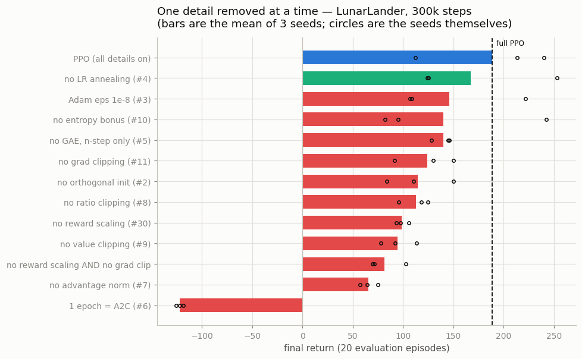
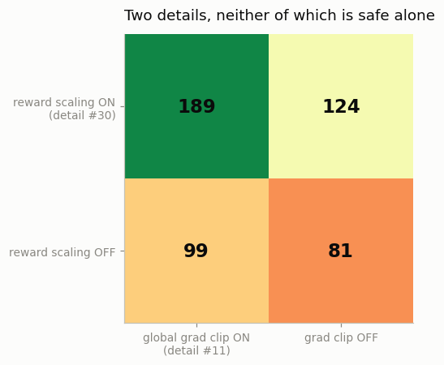

# The 37 Details

## Key Insight

[PPO](/shared/glossary/#ppo)'s reputation for "just working" comes less from its five-line clipped objective than from roughly three dozen small implementation choices layered on top — things like [advantage](/shared/glossary/#advantage) [normalization](/shared/glossary/#normalization), clipping the [value function](/shared/glossary/#value-function) loss, orthogonal weight initialization, annealing the learning rate to zero, reward scaling, and global gradient clipping. Individually each looks like a minor detail; together they are the difference between a PPO that matches published scores and one that quietly fails to learn. This project implements or audits every one of the [37 documented details](https://iclr-blog-track.github.io/2022/03/25/ppo-implementation-details/) and measures each as its own [ablation](/shared/glossary/#ablation), so you learn not just *that* they matter but *how much* each contributes. The deeper lesson generalizes beyond PPO: in modern RL the gap between a paper's pseudocode and a working agent is paved with unglamorous engineering.

---

## What's in this directory

| File | Role |
|------|------|
| `ablations.py` | Takes project 22's `PPOConfig`, flips one flag at a time, and trains 13 variants × 3 seeds on LunarLander. Plus the 2×2 that no one-at-a-time ablation can see. |

```bash
python3 ablations.py all       # ~10 min on 12 CPU cores
```

## Every one of the 37, and where it lives

The blog post groups the details by the setting they belong to. So does this table.
"Measured" means it has its own bar in the ladder below; "audited" means it is
implemented and verified but not separately ablated — usually because it belongs to a
setting this phase exercises elsewhere.

**13 core details** — all implemented in `22-ppo-from-scratch/ppo.py`:

| # | detail | where | status |
|---|---|---|---|
| 1 | Vectorized architecture | `pg_lib.make_vec_env` | **measured** (project 21, at length) |
| 2 | [Orthogonal init](/shared/glossary/#orthogonal-initialization), constant bias | `pg_lib.layer_init` | **measured** |
| 3 | Adam epsilon = 1e-5, not 1e-8 | `PPOConfig.adam_eps` | **measured** |
| 4 | [Learning-rate annealing](/shared/glossary/#learning-rate-annealing) | `train_ppo`, per update | **measured** |
| 5 | [Generalized Advantage Estimation](/shared/glossary/#gae) | `pg_lib.compute_gae` | **measured** |
| 6 | Mini-batch updates | `train_ppo`, epoch loop | **measured** |
| 7 | [Advantage normalization](/shared/glossary/#advantage-normalization) | `ppo_losses` | **measured** |
| 8 | Clipped [surrogate objective](/shared/glossary/#surrogate-objective) | `ppo_losses` | **measured** |
| 9 | [Value-loss clipping](/shared/glossary/#value-clipping) | `ppo_losses` | **measured** |
| 10 | Overall loss and [entropy bonus](/shared/glossary/#entropy-regularization) | `ppo_losses` | **measured** |
| 11 | Global [gradient clipping](/shared/glossary/#gradient-clipping) | `train_ppo` | **measured** |
| 12 | Debug variables (approx KL, clipfrac) | `ppo_losses` returns them | audited — see project 22's `ppo.py check` |
| 13 | Shared vs separate policy/value networks | `pg_lib.ActorCritic` | audited — and *measured* in project 24, where the Atari answer is the opposite |

**9 Atari-specific details** — all in project 24, which trains PPO from pixels:

| # | detail | status |
|---|---|---|
| 14–17 | `NoopResetEnv`, `MaxAndSkipEnv`, `EpisodicLifeEnv`, `FireResetEnv` | audited (project 14's `AtariPipeline`, run on real ALE frames) |
| 18 | `WarpFrame` — 84×84 grayscale | audited |
| 19 | [`ClipRewardEnv`](/shared/glossary/#reward-clipping) | audited |
| 20 | [`FrameStack`](/shared/glossary/#frame-stacking) | **measured in project 24** |
| 21 | Shared Nature-[CNN](/shared/glossary/#cnn) for policy and value | **measured in project 24** |
| 22 | Scaling images to [0, 1] | audited |

**9 continuous-action details** — all in project 25, which trains on [MuJoCo](/shared/glossary/#mujoco):

| # | detail | status |
|---|---|---|
| 23 | Continuous actions via a normal distribution | audited (`pg_lib.ActorCritic`) |
| 24 | State-independent `log_std` | audited (`nn.Parameter`, not a network output) |
| 25 | Independent action components (diagonal Gaussian) | audited (log-probs summed over the action dim) |
| 26 | **Separate** MLPs for policy and value | audited — note this *contradicts* #21, on purpose |
| 27 | Action clipping to the valid range | audited (`gym.wrappers.ClipAction`) |
| 28 | [Observation normalization](/shared/glossary/#observation-normalization) | audited (project 25 uses it) |
| 29 | Observation clipping to ±10 | audited |
| 30 | **Reward scaling** | **measured** — and it is the most interesting result here |
| 31 | Reward clipping to ±10 | audited |

**5 LSTM details (32–36)** and **1 MultiDiscrete detail (37)**: not implemented. Neither
a recurrent policy nor a factored action space appears anywhere in this phase, and
implementing them only to leave them untested would be the kind of box-ticking this
project exists to argue against. They are listed here so the count of 37 is honest.

## The ladder

Thirteen variants, three seeds each, 300k steps of LunarLander. Each bar is **full PPO
with exactly one thing removed**.



| ablation | final return | Δ vs full PPO | mean KL/update |
|---|---|---|---|
| **PPO (all details on)** | **188.6 ± 55** | — | 0.0050 |
| no LR annealing (#4) | 167.4 ± 61 | −21 | 0.0072 |
| Adam eps 1e-8 (#3) | 145.8 ± 54 | −43 | 0.0050 |
| no entropy bonus (#10) | 140.0 ± 73 | −49 | 0.0052 |
| no GAE, n-step only (#5) | 139.9 ± 8 | −49 | 0.0051 |
| no grad clipping (#11) | 124.0 ± 24 | −65 | 0.0053 |
| no orthogonal init (#2) | 114.8 ± 27 | −74 | 0.0053 |
| no ratio clipping (#8) | 112.7 ± 12 | −76 | **0.0534** |
| no reward scaling (#30) | 98.9 ± 5 | −90 | 0.0039 |
| no value clipping (#9) | 94.5 ± 15 | −94 | 0.0055 |
| no advantage norm (#7) | 65.7 ± 7 | −123 | 0.0038 |
| **1 epoch = A2C (#6)** | **−122.0 ± 3** | **−311** | −0.0000 |

**Every single detail earns its place.** The full agent tops the ladder; removing any one
of eleven things makes it worse. That is a stronger result than the literature usually
reports, and it comes with a caveat stated up front: with three seeds and a baseline
spread of ±55, the *small* gaps at the top of the table (#4, #3, #10, #5) are inside the
noise and should be read as "no measurable harm", not as a ranking. The gaps that survive
the noise are the bottom five, and those are worth going through one at a time.

### #6, batch reuse: the whole reason PPO exists (−311)

Set `n_epochs = 1` and PPO *is* A2C — one gradient step per rollout, no ratio to clip
because the policy has not moved. The agent collapses to −122, worse than doing nothing.
This is the single largest effect in the table by a factor of two and a half, and it is
not really a "detail": it is the algorithm. Everything else on this list exists to make
batch reuse *safe*.

Its KL is exactly 0.0000, because with one epoch the policy that scores the data is the
policy that collected it, so `ratio ≡ 1` by construction. A KL of zero in your PPO logs
means you are not reusing your data.

### #7, advantage normalization: the cheapest 123 points you will ever get (−123)

One line — `adv = (adv - adv.mean()) / (adv.std() + 1e-8)` — is worth more than every
initialization scheme, learning-rate schedule and entropy bonus in the list combined.
The reason is scale invariance: an advantage carries information in its *sign* and its
size *relative to the rest of the batch*, but its absolute magnitude is an accident of
how the environment happens to denominate reward. Normalizing removes the accident, and
one learning rate then works across environments whose rewards differ by orders of
magnitude.

(It is also, strictly, a *biased* estimator — it divides by a statistic of the same
minibatch it is weighting. Project 20 measures that bias directly and finds it real. The
field does it anyway, and this table is why.)

### #8, the clip: it is doing exactly what it claims (−76)

Look at the KL column, not the return. Removing the ratio clip multiplies the KL per
update by **more than ten** (0.0053 → 0.0534): the policy takes wildly bigger steps, as
the theory says it must when nothing bounds it. The return drops by 76. This is the
clearest possible demonstration that the clip *is* the [trust region](/shared/glossary/#trust-region),
and that the trust region is what keeps the agent alive.

### #30 and #11: two details that are not independent



This is the finding that a one-at-a-time ablation is structurally incapable of producing,
and it is the reason this project runs a 2×2.

Reward scaling (#30) is usually explained as "the rewards are too big". That explanation
is wrong, and the mechanism is far more interesting. On LunarLander the returns run into
the hundreds, so the *critic's* gradient norm is around **50** while the *actor's* — which
sits on normalized advantages — is around **0.13**. Global gradient clipping (#11) clips
them **jointly**, so it rescales the entire update by `0.5/50 = 0.01`. The actor's
effective learning rate collapses to 3e-6 and the policy stops moving, while the critic
thrashes. Reward scaling does not fix the reward. **It fixes the gradient budget.**

The 2×2 shows the fingerprints:

| | grad clip ON | grad clip OFF |
|---|---|---|
| **reward scaling ON** | **188.6** | 124.0 |
| **reward scaling OFF** | 98.9 | 81.3 |

If the two details were independent, removing both would cost the sum of the individual
damages: `188.6 − 90 − 65 = 34`. It actually lands at **81.3** — about 47 points better
than additive. Removing the gradient clip *partially protects* against missing reward
scaling, precisely because the clip was the channel through which the reward scale was
doing its damage. Two details, one mechanism, and neither is safe alone.

### #9, value-loss clipping: the one the literature says does nothing (−94)

The blog reports no consistent benefit from clipping the value loss, and later studies
have found it hurting as often as helping. Here, with reward scaling on, removing it
costs 94 points — it helps, clearly and reproducibly across three seeds.

The reason it is contentious becomes obvious once you have watched it break something.
Value clipping clamps the critic's prediction to move at most `±clip_coef = ±0.2` **per
update**. Whether that is sane depends entirely on the scale of the returns:

- **normalized rewards** (returns ≈ 1): a ±0.2 clamp is a sensible trust region. It helps.
- **raw rewards** (returns ≈ 300): a critic starting at 0 needs *1500 updates* just to
  reach the right order of magnitude, and it has 146. The critic never arrives, the
  advantages are meaningless, and the agent never learns. (This was a live bug in
  project 22 before it was a paragraph: PPO scored −52 on LunarLander until value
  clipping was understood.)

So detail #9 is not "useless". It is **conditional on detail #30**, and a study that
ablates it without saying which reward scale it used has measured nothing. That is a
fair summary of why the literature disagrees with itself.

## What to take away

The five-line objective is the part of PPO you can derive. The rest is the part you have
to *measure*, and the measurements say three things the pseudocode does not:

1. **The biggest "detail" is not a detail.** Batch reuse (#6) is worth 311 points; it is
   the difference between PPO and the algorithm PPO replaced. Everything else on the list
   is scaffolding that makes reusing a batch survivable.

2. **The cheapest detail is the best deal.** Advantage normalization is one line and 123
   points.

3. **The details are not independent, and the list format hides that.** #30 and #11 share
   a mechanism; #9's usefulness is a function of #30. A ladder of one-at-a-time ablations —
   including the one at the top of this page — systematically cannot see any of this, which
   is worth remembering the next time you read one.

The deeper lesson generalizes past PPO. Every failure in this project was **silent**: no
crash, no NaN, no warning. Just a smaller number at the end of training, and a learning
curve plausible enough to publish.
