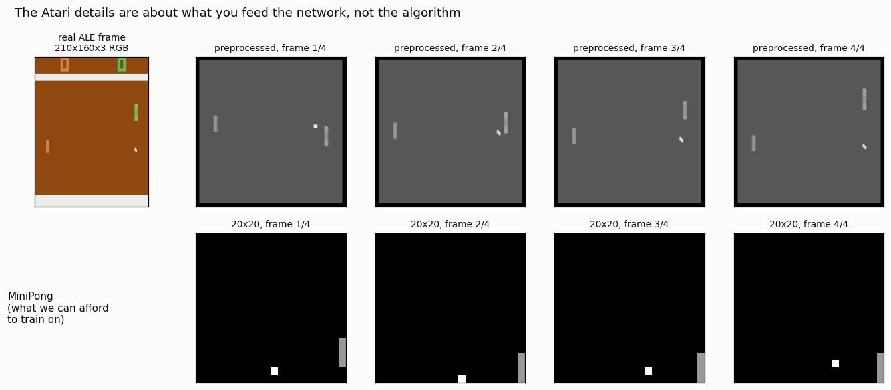
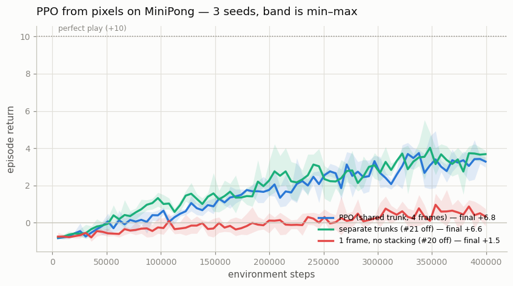

# PPO on Atari

## Key Insight

Moving [PPO](/shared/glossary/#ppo) from low-dimensional control to [Atari](/shared/glossary/#atari) tests whether the same [on-policy](/shared/glossary/#on-policy) recipe survives raw pixel input, and the answer is yes — with the standard image-RL scaffolding bolted on. The policy and value networks now share a [convolutional](/shared/glossary/#cnn) trunk that reads the screen, the last few frames are stacked together ([frame stacking](/shared/glossary/#frame-stacking)) so the agent can perceive motion and direction from otherwise-static images, and rewards are squashed to a fixed range ([reward clipping](/shared/glossary/#reward-clipping)) so games with wildly different score scales train with one set of hyperparameters. Because PPO is on-policy, it is data-hungry and leans heavily on running many environment copies in parallel to feed each update. Comparing your agent's scores on a few games against published numbers is the honest check that every detail is wired correctly.

---

## What's in this directory

| File | Role |
|------|------|
| `ppo_pixels.py` | The pixel PPO: a shared Nature-CNN trunk, a hand-rolled [vectorized](/shared/glossary/#vectorized-environment) pixel env, and the two Atari *network* details tested rather than assumed. Reuses [project 14](../14-atari-pong/README.md)'s `pong_lib.py` for the real ALE preprocessing chain and for MiniPong. |

```bash
python3 ppo_pixels.py all       # ~7 min on 12 CPU cores
```

## First, the honest part: what real Atari would cost

The nine Atari details in the 37 are not about PPO at all. Seven are environment wrappers
(`NoopReset`, `MaxAndSkip`, `EpisodicLife`, `FireReset`, `WarpFrame`,
[`ClipReward`](/shared/glossary/#reward-clipping),
[`FrameStack`](/shared/glossary/#frame-stacking)) and two are about the network. They
concern **what you feed the agent**, and [project 14](../14-atari-pong/README.md) already built that chain for
[DQN](/shared/glossary/#dqn). This project points the same chain at real `ALE/Pong-v5`
and looks at what comes out of it:



The top row is genuine Atari: a 210×160×3 RGB frame, then the four preprocessed frames the
network actually receives. The bottom row is MiniPong — Pong against a wall, 20×20 real
pixels — which is what a CPU can afford to *train* on.

That word "afford" deserves a number rather than an apology. Measured on this machine, with
the real ALE and this PPO's network in the loop:

| | steps/second |
|---|---|
| real `ALE/Pong-v5` + preprocessing | 1,509 |
| Nature-CNN forward pass (batch 8) | 3,649 |
| **both together** | **1,068** |

Published PPO reaches ~20.7 on Pong after **10M frames**. At 1,068 steps/s that is **2.6
hours** — and that figure counts only the environment and the *forward* pass. Real training
also runs a backward pass on every minibatch, several epochs deep, so the true bill is a
multiple of it. For one game. On one seed. Reproducing the published Atari table is not a
CPU activity, and a project that claimed otherwise would be lying with a learning curve.

So this project does the honest version instead: run the *real* preprocessing chain on
*real* frames, then train the identical algorithm on a miniature pixel environment where
the answer arrives in minutes — and measure the two Atari details that are about the
*network*, which are the two that transfer.

## PPO learns to play from pixels



| variant | final return (3 seeds) | |
|---|---|---|
| **PPO — shared trunk, 4 frames** | **6.82 ± 0.50** | max possible is +10 |
| separate trunks (#21 off) | 6.58 ± 1.76 | |
| 1 frame, no stacking (#20 off) | **1.47 ± 1.66** | |

The agent goes from missing nearly every ball to returning about seven rallies in ten,
using nothing but raw pixels, the same clipped objective from [project 22](../22-ppo-from-scratch/README.md), and a three-layer
CNN.

## Detail #20, frame stacking: the agent is blind without it

Removing frame stacking costs **5.4 of a possible 10 points** — the largest effect in this
project by a wide margin, and the one with the cleanest explanation.

A single 20×20 frame shows a ball at a position. It does not show *which way the ball is
going*. That information does not exist in any single frame; it exists only *between*
frames. An agent handed one frame is being asked to intercept a ball whose direction it
cannot observe — and the task is not merely harder, a large part of it is
[not Markov](/shared/glossary/#markov-property) at all. Stacking four frames restores the
velocity, and with it the possibility of planning.

This is why every Atari agent since the 2015 DQN paper stacks frames, and it is a standing
reminder that "the state" is whatever you *hand* the network, not whatever exists inside
the simulator.

## Detail #21, the shared trunk: a real contradiction, and a modest answer

Detail #21 says the policy and value heads should **share** the convolutional trunk on
Atari. Detail #26 says they must be **separate** for continuous control. Both sit on the
same list of 37, and they contradict each other. That is not sloppiness — the two settings
are genuinely different:

- On **pixels**, the trunk is a *perception system*. It is expensive, and both heads want
  exactly the same thing from it (where is the ball, where is the paddle). Sharing is
  nearly free and doubles the gradient signal reaching the convolutions.
- On **proprioceptive vectors** (a handful of numbers describing the agent's own body,
  like joint angles and velocities, rather than an image — see [project 25](../25-trpo-for-comparison/README.md)),
  the "trunk" is two small dense layers on a
  17-number observation. Sharing saves nothing worth having, and the value loss — whose
  scale is the *return* — bullies the policy gradient through the shared weights. That is
  the same coupling [project 23](../23-the-37-details/README.md) measured through the gradient clip, arriving from a
  different direction.

Measured here, the shared trunk's advantage is **small on the mean and clear on the
spread**: 6.82 ± 0.50 versus 6.58 ± 1.76. The two are within a seed of each other on
average, but the separate-trunk runs scatter **3.5× more** — one seed does fine, another
lags. On a task this small, sharing buys consistency rather than score, and the honest
summary is that this detail is worth rather less than its place on the list suggests.
Which is itself worth knowing.

## What to take away

Pixels do not change PPO. Every line of the update from [project 22](../22-ppo-from-scratch/README.md) is untouched here; what
changes is the *stack in front of it* — the wrappers that turn a 210×160 RGB screen into
something learnable, and a CNN where the MLP used to be. That is the real content of the
nine Atari details, and the reason they read like a plumbing manual rather than an
algorithm.

The two that concern the network, measured rather than assumed, come out very unevenly:
frame stacking is not a "detail" at all but a repair to a broken observation, worth 5.4
points; the shared trunk is worth a little consistency and almost no score. A list of 37
equal-looking bullet points hides that difference completely — which is the same lesson
[project 23](../23-the-37-details/README.md) reaches from the other side.
