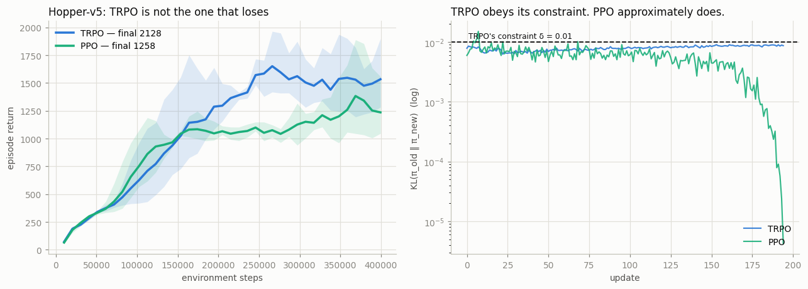

# TRPO for Comparison

## Key Insight

[TRPO](/shared/glossary/#trpo) (Trust Region Policy Optimization) is the algorithm [PPO](/shared/glossary/#ppo) simplified. It pursues the same goal — improve the [policy](/shared/glossary/#policy) without ever taking a step so large it collapses performance — but enforces it rigorously by solving a constrained optimization that keeps the [KL divergence](/shared/glossary/#kl-divergence) between the old and new policy below a fixed budget, the literal [trust region](/shared/glossary/#trust-region). Making that tractable requires heavy machinery: a conjugate-gradient solver to approximate the constraint and a backtracking line search to enforce it every update, which is far more code and compute than PPO's one-line ratio clip. Implementing TRPO on a [MuJoCo](/shared/glossary/#mujoco) task and seeing it match — but not beat — PPO is the clearest way to understand why the field abandoned the mathematically cleaner method for the empirically simpler one.

---

## What's in this directory

| File | Role |
|------|------|
| `trpo.py` | TRPO in full — [conjugate gradient](/shared/glossary/#conjugate-gradient), [Fisher](/shared/glossary/#fisher-information)-vector products by double backward, and a backtracking [line search](/shared/glossary/#line-search) — raced against [project 22](../22-ppo-from-scratch/README.md)'s PPO on `Hopper-v5`. |

```bash
python3 trpo.py all       # ~9 min on 12 CPU cores
```

## What TRPO actually asks for

```
maximize   E[ π_θ(a|s)/π_old(a|s) · A(s,a) ]          the surrogate objective
subject to E[ KL( π_old(·|s) ‖ π_θ(·|s) ) ] ≤ δ       the trust region, as a hard constraint
```

PPO's clip is a *heuristic* stand-in for that constraint. TRPO enforces the real thing —
and the price is that you can no longer call `loss.backward()` and `optim.step()`, because
that is not how constrained optimization works. Three pieces of machinery are needed. Before
the details, the shape of the problem in plain terms: TRPO wants the biggest step that
improves the policy *without* moving the policy's behavior too far from where it started, and
"too far" is measured not in the network's raw numbers but in how differently the policy
actually *acts*.

**1. The [natural gradient](/shared/glossary/#natural-gradient).** Linearize the objective,
quadratically approximate the constraint, and the best step is `F⁻¹g`, where `F` is the
[Fisher information](/shared/glossary/#fisher-information) matrix — the curvature of the KL.
It measures distance in units of *behavioural change* rather than units of *parameters*,
which is the right yardstick: the same policy can be written with wildly different weights
(scale one layer up and the next layer down and the network computes the exact same
function), so "how far did θ (the raw weights) move" is a meaningless question and "how far
did π (the actual behavior) move" is the one that matters. `F` is what converts a step size
in weight-space into a step size in behavior-space, the way a currency exchange rate
converts dollars moved into euros actually spent.

**2. [Conjugate gradient](/shared/glossary/#conjugate-gradient) (CG).** For even this small
network, writing `F` out as an explicit matrix would mean storing and inverting a
4,600 × 4,600 grid of numbers — 21 million entries, recomputed every update. Nobody does
that. Instead, CG is an iterative solver: it finds the same answer to `F·x = g` using only
the ability to compute `F·v` for vectors `v` you choose one at a time, never building `F`
itself. That narrower ability — "multiply by `F`", not "have `F`" — happens to be available
directly from autograd, by differentiating the scalar `(∇KL · v)` a second time:

```python
grads = flat_grad(kl, params, create_graph=True)   # ∇KL, still differentiable
gv    = (grads * v).sum()                          # a scalar
hv    = flat_grad(gv, params)                      # ∇(∇KL · v)  =  F·v
```

Ten CG iterations cost about ten backward passes. A matrix nobody could afford to write
down is thereby used as though it were sitting in memory — the classic trick of solving
"multiply by a huge matrix" problems without ever materializing the huge matrix.

**3. A [line search](/shared/glossary/#line-search).** Steps 1 and 2 rest on approximations
(a *linear* stand-in for the objective, a *quadratic* stand-in for the constraint) that are
only trustworthy *close to* the current policy θ — far from θ they can be wrong in either
direction. So compute the largest step the quadratic model permits, then walk **backwards**
from it, shrinking by 0.8 each time, until you find a step that genuinely improves the
surrogate *and* genuinely respects the KL constraint — checked against the true quantities,
not the approximating models. If none does, take no step at all. It is the safety net under
a tightrope walker who has already done the math on where to put each foot: the math is
trusted for the *direction*, but the actual footing is double-checked before any weight
shifts onto it.

That is roughly 200 lines against PPO's five. This project measures what they buy.

## The constraint is real, and PPO's is not



This is the money result, and it is exactly what the theory promises:

| | mean KL/update | **max KL over all updates** | updates exceeding δ = 0.01 |
|---|---|---|---|
| **TRPO** | 0.0079 | **0.0098** | **0.0%** |
| PPO | 0.0056 | **0.0209** | **4.3%** |

TRPO's KL **never once** exceeds its budget across every update of every seed — its maximum
lands at 0.0098 against a constraint of 0.0100, hugging the boundary from below because that
is precisely what a constrained optimizer is *supposed* to do: take the largest step the
constraint allows and not one **nat** more (a *nat* is simply the unit KL divergence is
measured in, the natural-log counterpart to a *bit* — the number itself matters more than the
unit's name).

PPO's clip, by contrast, **overshoots on 4.3% of updates**, and its worst step is more than
twice the budget. This is not a bug in the implementation; it is what a clip *is*. Clipping
the importance ratio bounds the KL only indirectly — it flattens the objective's gradient
past `1 ± ε`, but a minibatch that has already moved the policy can keep moving it, and
nothing checks the actual KL before the step is taken. TRPO checks. That is the entire
difference between the two algorithms, and here it is, measured.

## And yet, on this task, TRPO simply wins

| | final return (3 seeds) | wall-clock |
|---|---|---|
| **TRPO** | **2127.5 ± 666.6** | **168 s** |
| PPO (best of a small sweep) | 1258.1 ± 325.2 | 292 s |

That is not the result this project was expecting to report, so it is worth being careful
about what it does and does not say.

It is a **fair** comparison: PPO here is not a straw man. Its first configuration scored 841,
and a small sweep (32 minibatches instead of 4, learning rate 1e-4 instead of 3e-4) lifted it
to 1258 — that improved version is the one in the table. Both algorithms see the same 400k
environment steps, the same network, the same [GAE](/shared/glossary/#gae), the same
[observation](/shared/glossary/#observation-normalization) and reward normalization.

It is also a **narrow** comparison: one task, three seeds, 400k steps. TRPO is known to be a
strong baseline on MuJoCo locomotion specifically, and nothing here licenses "TRPO beats PPO"
as a general claim. What it does license is the negative: **the field did not abandon TRPO
because TRPO performs badly.** On the benchmark TRPO was designed for, it is still excellent —
better here than PPO, and, because it takes one policy step per rollout instead of 320
minibatch steps, faster in wall-clock too.

The line search tells the same story from another angle: it accepted its first proposed step
**100% of the time** and gave up entirely on 0% of updates. The quadratic model was accurate,
the safety net never had to catch anything. TRPO is not fragile. It works.

## So why did nobody keep using it?

Not for its results. For everything else:

- **It is 200 lines of specialized machinery, and they are the kind you get subtly wrong.**
  Flat-parameter plumbing, a hand-rolled CG solver, double-backward Fisher products, a
  backtracking search with two acceptance criteria. PPO is `torch.clamp`.

- **The trust region only covers the policy.** The Fisher is defined on the policy's *output
  distribution*, so the critic must be trained separately by ordinary Adam, and the actor and
  critic cannot share a trunk. That forecloses the shared-CNN design that Atari needs
  ([project 24](../24-ppo-on-atari/README.md)'s detail #21) — TRPO cannot easily do pixels.

- **It cannot exploit data reuse.** TRPO takes *one* policy step per batch. PPO takes 320, and
  that is where PPO's sample efficiency comes from in settings where collecting data is the
  expensive part. Everything about the modern large-scale recipe — many epochs, many
  minibatches, huge distributed batches — is native to PPO and alien to TRPO.

- **It does not generalize across problem shapes.** Discrete, continuous, multi-discrete,
  recurrent: PPO takes each one with no new machinery. Each one requires TRPO's Fisher-vector
  product to be rederived.

- **And it does not scale to where the money went.** [RLHF](/shared/glossary/#rlhf) fine-tunes
  a language model with billions of parameters. Conjugate gradient on a Fisher matrix of that
  size, ten Hessian-vector products per update, is not a thing anyone is going to do. PPO's
  clip costs one `clamp` regardless of model size — which is why [GRPO](/shared/glossary/#grpo)
  and the entire post-training stack in Phase 9 are descended from PPO and not from TRPO.

## What to take away

TRPO is the mathematically honest algorithm and it does what it says: the constraint you write
down is the constraint you get, verified here to the fourth decimal place across every update.
PPO is the mathematically *dishonest* one — its clip is a heuristic that misses its own budget
4% of the time — and it won anyway.

That is a genuinely uncomfortable lesson, and it is the real content of this project. The field
did not choose PPO because it was better on Hopper. It chose PPO because a five-line objective
that is *approximately* right, works on every architecture, reuses its data 320 times, and
scales to a 70-billion-parameter policy, beats a rigorous one that does none of those things.
Correctness lost to composability. Keep that in mind the next time an elegant method is losing
to an ugly one; the elegance is rarely the thing being voted on.
