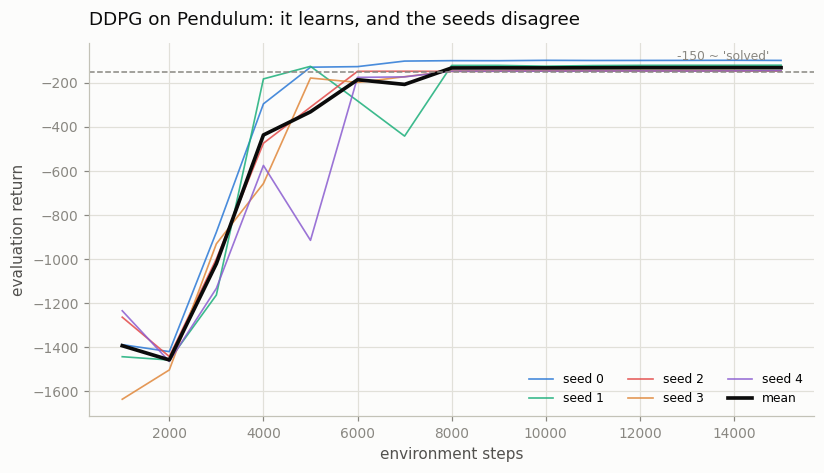
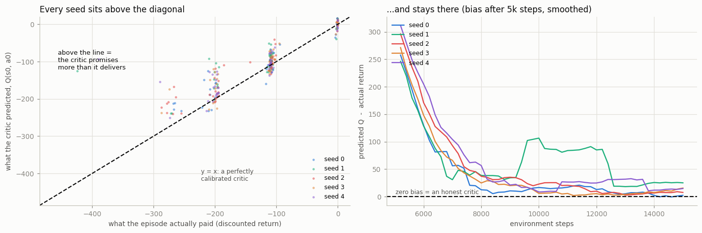
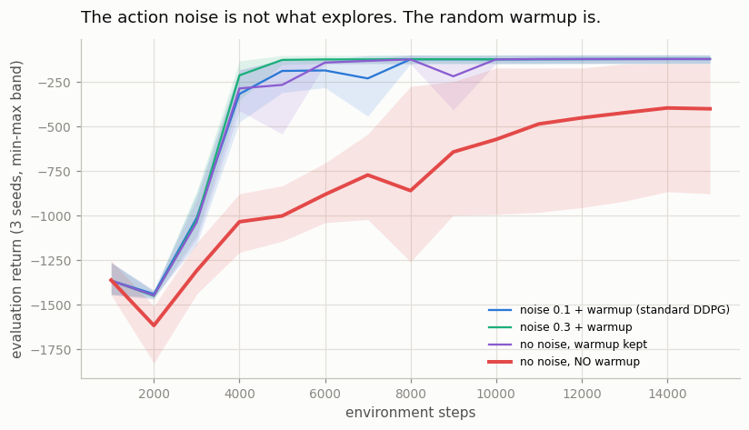

# DDPG on Pendulum

## Key Insight

[DDPG](/shared/glossary/#ddpg) (Deep Deterministic Policy Gradient) carries [DQN](/shared/glossary/#dqn)'s [off-policy](/shared/glossary/#off-policy), [replay-buffer](/shared/glossary/#experience-replay) recipe over to [continuous control](/shared/glossary/#continuous-control), where `max over all actions` is no longer a lookup you can compute. It replaces that impossible max with a learned deterministic [actor](/shared/glossary/#actor-critic) that outputs the single best action directly, while a [critic](/shared/glossary/#actor-critic) scores it — the [deterministic policy gradient](/shared/glossary/#deterministic-policy-gradient) flows the critic's gradient back into the actor through the chain rule. [Pendulum](/shared/glossary/#pendulum) — swing a single pole upright with a continuous torque and hold it there — is the smallest task where you can watch DDPG learn, and also watch it wobble: with one actor, one critic, and no fix for [overestimation](/shared/glossary/#overestimation-bias), its learning curve is famously fragile, which is exactly the instability [TD3](/shared/glossary/#td3) and [SAC](/shared/glossary/#sac) were built to cure.

---

## What's in this directory

| File | Role |
|------|------|
| `cc_lib.py` | **The whole of Phase 5 lives here.** One `Agent`, one `Config`. DDPG, [TD3](/shared/glossary/#td3) and [SAC](/shared/glossary/#sac) are the same class with different flags set — [project 27](../27-td3-on-halfcheetah/README.md) through [project 31](../31-sample-efficiency-study/README.md) all import this file and flip fields. |
| `ddpg.py` | The three experiments below: does it learn, is the critic honest, and where does its exploration actually come from. |

```bash
python3 ddpg.py       # ~8 min on 12 hyperthreads
```

## The one problem this whole phase exists to solve

[Q-learning](/shared/glossary/#q-learning) picks its action like this:

```
a* = argmax over a of Q(s, a)
```

[`argmax`](/shared/glossary/#argmax) just means "the input that gives the biggest
output" — here, *the action with the highest score*.

In a game with four buttons, that is a **lookup**: score all four actions, take the
best one. Easy. But a robot arm does not have four buttons. It has six joints, and each
one takes a *continuous* torque — any real number in a range, like `0.10` or `0.1001`.
There is no "all four" to score, because **between any two torques there is always
another torque**. The list you would have to search is infinite.

So `argmax` has quietly stopped being a lookup and become a full *search* problem — and
you would have to solve it from scratch at **every single timestep**, thousands of times
a second. That is far too slow to be usable.

DDPG's answer is the one idea the whole of Phase 5 is built on:

> **Train a network to output the maximizing action directly. The actor *is* the argmax.**

Instead of searching for the best action every time, train a second network whose *only
job* is to guess it in one shot. Two networks, two jobs:

- the [critic](/shared/glossary/#actor-critic) `Q(s, a)` **scores** an action — "how good
  is doing `a` in state `s`?"
- the [actor](/shared/glossary/#actor-critic) `mu(s)` **proposes** one — "here is the
  action I think is best in state `s`."

To make the actor better, ask the critic a question it can already answer: *if I nudged
this action slightly, would your score go up or down?* Then move the action in whichever
direction raises the score. Repeat forever.

That question has a name — it is the [gradient](/shared/glossary/#gradients) `dQ/da`, the
direction in action-space that increases the critic's score fastest — and in code the
whole thing is a single line:

```python
pi_loss = -self.q1(o, self.actor(o)).mean()   # "make the critic like my actions more"
```

Read it right-to-left: take the actor's action, feed it to the critic, and put a **minus
sign** in front. Minimizing `-Q` is the same as maximizing `Q`, and "maximize the critic's
score of my own action" is exactly the instruction we wanted.

That one line is the [deterministic policy gradient](/shared/glossary/#deterministic-policy-gradient).
It works because [autograd](/shared/glossary/#autograd) — PyTorch's automatic
differentiation — applies the [chain rule](/shared/glossary/#chain-rule) *through* the
critic and into the actor for free: it computes how the score changes with the action
(`dQ/da`), then how the action changes with the actor's weights (`da/dtheta`), and
multiplies them. You never write either derivative yourself.

## It learns



Five [seeds](/shared/glossary/#seed), 15,000 environment steps each. A random policy
scores about `-1200`; about `-150` is the usual "solved" line for Pendulum.

| seed | 0 | 1 | 2 | 3 | 4 | mean |
|---|---|---|---|---|---|---|
| final return | **-98** | -120 | -146 | -144 | -145 | **-131** |

Every seed learns, and every seed lands in or near the solved band. But look at the
spread: **49 points between the best seed and the worst**, on a task this small. That
gap is not evaluation noise — it is a real difference in the policies DDPG settled
on. Hold that thought, because it is the reason [project 27](../27-td3-on-halfcheetah/README.md)
and [project 28](../28-sac-on-a-mujoco-suite/README.md) exist.

## The critic is lying, and you can measure it

Here is the experiment worth running, because almost nobody does: at the start of
every episode, record what the critic *predicted* — `Q(s0, a0)` — and then record
what the episode *actually paid* (its [discounted return](/shared/glossary/#return)).
Compare the two.



A perfectly honest critic would put every point on the `y = x` line. Every seed sits
**above** it.

```
=== overestimation (mean over episodes after step 5k) ===
  seed 0: predicted   -117.7   actual   -127.1   bias    +9.4
  seed 1: predicted   -100.7   actual   -147.1   bias   +46.4
  seed 2: predicted   -128.1   actual   -148.2   bias   +20.1
```

The critic consistently promises **more than the episode delivers** — by 9 to 46 points
depending on the seed. The right-hand panel shows how that gap behaves over training: it
starts enormous (the critic is simply untrained), shrinks fast as the critic learns…
and then **stops shrinking while still above zero**. It never reaches the honest line.
The critic does not stay wrong because it has not learned enough; it stays wrong because
something is holding it up.

This is [overestimation bias](/shared/glossary/#overestimation-bias), and its cause is
structural rather than a bug. The critic's estimates carry random error. The actor is
trained to find the actions the critic likes *most*. So the actor is, by construction,
a machine for seeking out the critic's **most over-optimistic mistakes**. Any action
the critic happens to overrate becomes an action the actor is pulled toward. The
errors never average out, because the actor is actively hunting for them.

> **Analogy.** Ask ten friends to guess what your used car is worth, then always sell
> to the highest bidder. The winning bid is not the car's value — it is the value plus
> whichever friend was most wrong in the optimistic direction. Do this repeatedly and
> you will come to believe your car is worth more than it is. That is exactly what a
> `max` (or an actor trained to imitate one) does to a noisy critic.

Everything in [project 27](../27-td3-on-halfcheetah/README.md) — [twin critics](/shared/glossary/#twin-critics),
[target policy smoothing](/shared/glossary/#target-policy-smoothing) — is an attempt to
stop this. Now you have the number they are trying to drive to zero.

## Where does DDPG's exploration actually come from?

A deterministic actor has an obvious problem: given the same state it always outputs
exactly the same action, so it can never try anything new. DDPG therefore bolts
exploration on from outside — and it does so in **two** places that tutorials tend to
blur together:

1. **Gaussian action noise** — a small random wobble added to every action the actor
   takes. ("Gaussian" just means the wobble is drawn from a bell curve: usually tiny,
   occasionally larger.) If the actor says "torque `0.30`", the agent might actually
   apply `0.28` or `0.33`, so it never repeats itself exactly.
2. **A random warmup** (`start_steps`) — before the policy is allowed to act at all, the
   agent takes **completely random actions for the first 1,000 steps**, filling the
   [replay buffer](/shared/glossary/#experience-replay) with varied experience for the
   critic to learn from.

Everyone talks about (1). So the honest thing to do is switch it off and see what breaks.
Removing one piece at a time to find out what it was worth is called an
[ablation](/shared/glossary/#ablation).



| what the agent gets | final return (3 seeds) |
|---|---|
| noise `0.1` + warmup — **standard DDPG** | **-121** |
| noise `0.3` + warmup — *more* noise | -121 |
| **no noise at all**, warmup kept | **-121** |
| no noise, **no warmup** | **-406** (seeds: -887, -147, -184) |

Read the third row again. Turning the action noise **completely off** leaves the final
return unchanged — `-121`, the same as standard DDPG to the point. Tripling the noise
does nothing either. On this task, the exploration mechanism everybody names is
**doing no work at all**.

The fourth row is where it breaks. Remove the 1,000 random warmup steps as well and
the mean collapses to `-406`, with one seed in three failing outright at `-887` — it
never learns to swing the pendulum up at all.

So the exploration that matters here is the **random warmup**, not the noise. Why?
Pendulum is a small task with a *dense* [reward](/shared/glossary/#reward-function):
every [state](/shared/glossary/#state) tells you something useful (being upright is
always better than hanging down), and the action is a single number. One thousand
random actions are enough to show the critic the whole story. After that, the actor's
own gradual improvement carries it through plenty of new states on its own; jittering
each action adds nothing the task pays for.

Two lessons, and the second is the one that generalizes:

1. **On this task, DDPG's famous action noise is decoration.** The buffer is filled by
   the warmup, and that is enough.
2. **An ablation is only as good as the thing it removes.** Had this project tested
   only "noise on vs noise off" — which is the ablation the tutorials imply — it would
   have concluded "exploration does not matter for DDPG", drawn a flat line, and been
   completely wrong. The effect was hiding in a *different* knob, and it only showed up
   once **both** knobs were removed together. So when an ablation shows **no difference
   at all**, the first question to ask is not "does this component matter?" but
   **"is something else quietly doing this component's job for it?"**

   > Unplug the kettle and the tea still gets made — so you conclude the kettle is
   > useless. In fact your flatmate has been quietly boiling water on the stove all
   > along. To learn what the kettle does, you have to switch off the stove too.

Do not over-generalize the first lesson: on a [sparse-reward](/shared/glossary/#sparse-reward)
task where reward only appears after a long, specific sequence of actions, a 1,000-step
random warmup finds nothing at all, and sustained exploration becomes the whole
problem. That is what Phase 8 is about.

## What to take away

DDPG works. On Pendulum it works on every seed, and this project is where the
machinery — [replay buffer](/shared/glossary/#experience-replay),
[target networks](/shared/glossary/#target-network) nudged along by
[Polyak averaging](/shared/glossary/#polyak-averaging), an actor trained *through* the
critic — should stop feeling like a list of tricks and start feeling like one idea.

But two cracks are already showing, and they are what the rest of Phase 5 is about:

- **The critic is systematically optimistic** (+9 to +46 here, and the gap stops
  shrinking instead of closing).
  [TD3](/shared/glossary/#td3) attacks this head-on with twin critics ([project 27](../27-td3-on-halfcheetah/README.md)).
- **The exploration is bolted on** — and, as the experiment above shows, it is not even
  bolted on where you thought. [SAC](/shared/glossary/#sac) removes the bolt entirely by
  making the policy itself stochastic and then *paying* it to stay random. That is the
  [maximum-entropy](/shared/glossary/#maximum-entropy-rl) idea
  [project 28](../28-sac-on-a-mujoco-suite/README.md) and
  [project 29](../29-automatic-temperature-tuning/README.md) are built on.

DDPG is, as the guide puts it, a pedagogical stepping stone. Build it once so you know
exactly what TD3 and SAC are fixing — and then, as the phase's own advice goes, don't
ship it.
