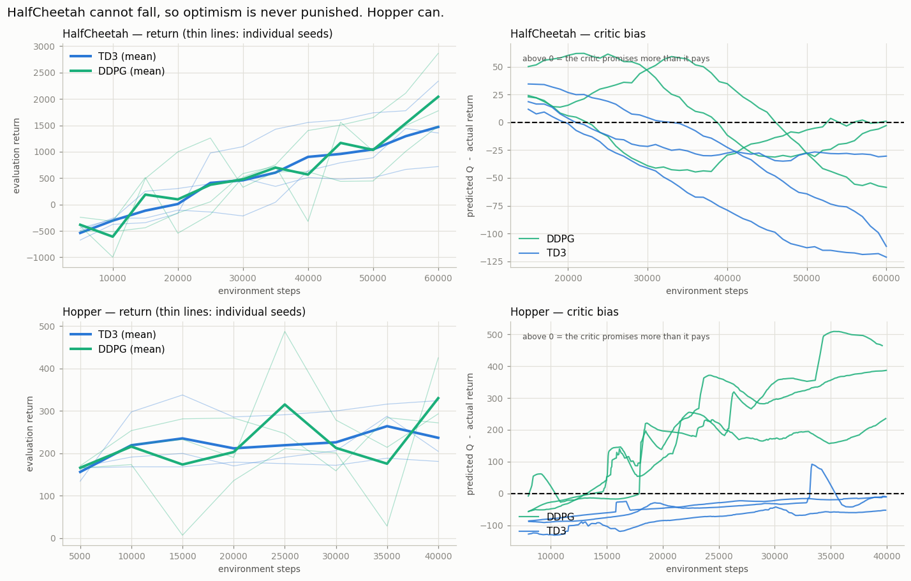
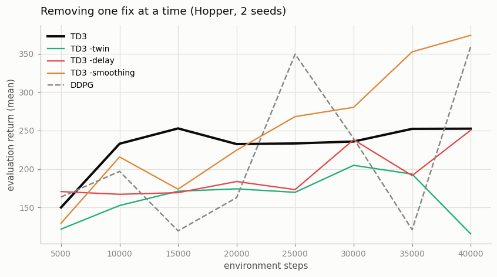

# TD3 on HalfCheetah

## Key Insight

[TD3](/shared/glossary/#td3) (Twin Delayed DDPG) keeps [DDPG](/shared/glossary/#ddpg)'s [actor-critic](/shared/glossary/#actor-critic) skeleton but adds three fixes that turn a fragile algorithm into a dependable one: [twin critics](/shared/glossary/#twin-critics) whose smaller estimate is used as the target, so the [policy](/shared/glossary/#policy) cannot exploit one critic's lucky [overestimate](/shared/glossary/#overestimation-bias); [delayed policy updates](/shared/glossary/#delayed-policy-updates) that let the critic settle before the actor chases it; and [target policy smoothing](/shared/glossary/#target-policy-smoothing), a little noise added to the target action so the critic cannot overfit to a razor-thin peak. [HalfCheetah](/shared/glossary/#halfcheetah) — a two-legged running robot simulated in [MuJoCo](/shared/glossary/#mujoco) — is the standard benchmark where these fixes visibly lift TD3's [returns](/shared/glossary/#return) above DDPG's noisy, often-diverging ones.

---

## What's in this directory

| File | Role |
|------|------|
| `td3.py` | TD3 vs DDPG, plus an ablation that removes each of the three fixes one at a time. |

```bash
python3 td3.py            # TD3 vs DDPG on two bodies, 3 seeds    (~9 min)
python3 td3.py ablation   # remove one fix at a time, on Hopper   (~6 min)
```

TD3 is not a new algorithm in this repo — it is
[`cc_lib.py`](../26-ddpg-on-pendulum/cc_lib.py)'s single `Agent` class with three
fields changed:

```python
def td3_config(**kw):
    return Config(twin_critics=True,    # min(Q1, Q2) in the target
                  policy_delay=2,       # actor updates once per 2 critic updates
                  target_noise=0.2,     # noise on the target action
                  **kw)
```

That is the entire difference between "the algorithm you should not ship" and "the
algorithm you can". Writing it as three flags rather than a second file is the point:
if you had to copy-paste an agent to get TD3, you would come away believing these are
different algorithms, and you would be wrong.

## The three fixes, in plain language

**1. Twin critics.** [Project 26](../26-ddpg-on-pendulum/README.md) measured DDPG's critic promising ~25 points more than
its episodes actually paid. The cause: the actor is trained to find actions the critic
scores highly, so it systematically seeks out the critic's *most optimistic mistakes*.
TD3 trains **two** critics and uses the **smaller** of their two opinions as the
target. For an action to look good now, both critics must independently like it — and
two independent networks rarely make the *same* lucky mistake about the *same* action.

> Ask two appraisers for a price and always believe the lower one. You will
> occasionally undervalue the car. You will never again be talked into a fantasy price
> by whichever appraiser happened to be most wrong.

**2. Delayed policy updates.** The actor chases the critic; the critic is trying to
learn a moving target that the actor keeps moving. TD3 updates the actor only every
*second* critic update, so the critic gets a head start and is a little more settled
before the actor starts climbing it.

**3. Target policy smoothing.** The critic is a neural network, so its `Q` surface has
sharp spikes — narrow, tall bumps that are artifacts of function approximation rather
than real value. A deterministic actor will happily walk straight to the top of one.
TD3 adds a little noise to the *target* action, which forces the critic to predict a
value that holds over a small *neighbourhood* of actions, flattening spikes that are
too narrow to survive being jiggled.

## What an honest 10-minute budget can and cannot prove

Read this before the numbers.

TD3's published win over DDPG is measured at **1,000,000 steps with 10 seeds**. This
project runs **60,000 steps with 3 seeds** — 6% of the samples, on a CPU. That is a real
constraint, not a formality, and it changes which questions can be answered:

- **"Which algorithm scores higher?"** — cannot be settled here. Run the *same* algorithm
  with a different random [seed](/shared/glossary/#seed) and you get a noticeably
  different score; that run-to-run wobble is, at this budget, bigger than the difference
  between the two algorithms. So any winner you declare might just be the luckier dice
  roll, and pretending otherwise would be dishonest.
- **"Does each fix do the thing it claims to do?"** — *can* be settled here, cleanly,
  because the **mechanism** is measurable directly, and it is far less noisy than the
  score.

The mechanism has a name we will use throughout: **critic bias**.

> **Critic bias = what the critic promised − what the episode actually paid.**
>
> At the start of an episode the critic predicts a score for the first action,
> `Q(s0, a0)`. Then we simply let the episode run and add up the reward it really
> earned (its [discounted return](/shared/glossary/#return)). Subtract the second from
> the first.
>
> **Positive** = the critic over-promises (it is an optimist). **Zero** = honest.
> **Negative** = it under-promises (a pessimist).

This is a very cheap thing to log, and unlike the score it is not drowned in luck. So this
project measures the mechanism, and reports the scoreboard with its uncertainty showing.

## The result

The experiment runs on **two** bodies, and the second one is the whole point.

[HalfCheetah](/shared/glossary/#halfcheetah) **cannot fall over.** There is no way for
its episode to end early — whatever it does, it keeps going for the full 1,000 steps. A
terrible policy just runs slowly. [Hopper](/shared/glossary/#hopper) **can** fall, and
when it does the episode is cut short on the spot.

That difference decides whether a mistake is *cheap* or *expensive*. If TD3's fixes cure
overconfidence, then the place to look for the cure working is the body where
overconfidence is actually punished — the one that can fall.



```
=== HalfCheetah-v5: final return after 60,000 steps (3 seeds) ===
TD3    mean    1270   std    540   seeds   1951     631    1228
DDPG   mean    1538   std    507   seeds   1428     980    2207
--- critic bias (predicted Q - actual return), second half ---
TD3    mean    -72.7  (under-estimates)
DDPG   mean    -16.4  (under-estimates)

=== Hopper-v5: final return after 40,000 steps (3 seeds) ===
TD3    mean     242   std     55
DDPG   mean     239   std     18
--- critic bias (predicted Q - actual return), second half ---
TD3    mean    -31.3  (under-estimates)
DDPG   mean   +280.6  (OVER-estimates)
```

**On the scoreboard, TD3 loses.** DDPG scores `1538` on HalfCheetah against TD3's
`1270`, and on Hopper they are indistinguishable (`239` vs `242`). This is not the result
the textbooks promise, and it is not a bug — it is what 60,000 steps buys you.

But before drawing any conclusion, look at TD3's three HalfCheetah seeds: `1951`, `631`,
`1228`. These are **the same algorithm, the same settings — only the random seed differs**,
and the best run is three times the worst. The `std` column (`540`) is the *standard
deviation*, a one-number summary of how far apart those runs are.

Now compare: the gap *between* TD3 and DDPG is `1538 − 1270 = 268`. The wobble *within*
TD3 alone is `540` — **twice as large**. So the "gap" between the algorithms is smaller
than the noise inside either one of them, and this column is, honestly, not saying
anything at all. It is a coin toss reported to four significant figures.

**Now look at the bias, and the fog clears.**

On **HalfCheetah**, DDPG's critic bias is `-16.4` — essentially *honest*. There is no
overestimation to fix. TD3's three fixes are treating a disease the patient does not
have, and all they achieve is making the critic *pessimistic* (`-72.7`), which slows the
actor down. That is precisely why TD3 scores lower here: **you are paying the premium on
an insurance policy that has no claim to settle.**

On **Hopper**, the picture inverts completely. DDPG's critic promises **`+280.6` more
than its episodes actually pay** — a runaway optimism, clearly visible climbing away
from zero in the bottom-right panel. TD3's critic, on the same body with the same
budget, sits at `-31.3`. **The fixes work exactly as advertised.** They have simply not
yet had time, in 40,000 steps, to convert that honesty into a higher score — that
conversion is what the remaining 960,000 steps of the published experiment are for.

The difference between the two bodies is the mechanism itself: HalfCheetah cannot fall,
so an overconfident action costs a little speed and nothing more, and the error never
compounds. Hopper ends the episode, so overconfidence is punished at once and the critic
is dragged badly off course.

## Which fix is doing the work?

The ablation runs on **Hopper**, not HalfCheetah — because, as the table above shows,
HalfCheetah's seed spread at this budget is larger than any difference between the
variants, so an ablation there would be measuring noise and calling it a finding.

Each row removes exactly one of TD3's three fixes and changes nothing else.



```
=== ablation on Hopper-v5: final return after 40,000 steps ===
variant             mean  critic bias   seeds
TD3                  247        -42.7      313     180
TD3 -twin            171        +10.5      218     125
TD3 -delay           227        -10.3      298     155
TD3 -smoothing       335        -42.6      373     298
DDPG                 240       +326.6      218     262
```

**Ignore the return column.** With two seeds and a spread like `313 / 180`, it cannot
distinguish these variants, and the fact that `-smoothing` "wins" is noise, not a
discovery. Reporting it as one would be exactly the mistake this project is trying to
teach you to avoid.

**Read the bias column instead.** It is the quantity the fixes were designed to control,
and it separates them cleanly:

| variant | critic bias | what it means |
|---|---|---|
| TD3 (all three fixes) | **-42.7** | pessimistic, safely |
| TD3 without **delayed updates** | -10.3 | still controlled |
| TD3 without **target smoothing** | -42.6 | unchanged |
| TD3 without **twin critics** | **+10.5** | **the sign flips — optimism returns** |
| DDPG (no fixes at all) | **+326.6** | runaway |

**Twin critics is the load-bearing fix.** It is the only one whose removal flips the
bias from negative to positive. Delayed updates and target smoothing barely move it —
they are stabilizers for the *actor*, not correctives for the *critic*, and this
measurement says so plainly.

And notice the gap between `TD3 -twin` (`+10.5`) and `DDPG` (`+326.6`). Both lack twin
critics, so if twin critics were the *whole* story they should be similar. They are not,
by a factor of thirty. The other two fixes are doing real work holding the bias down
once twin critics is gone — they are just invisible while it is present. **The fixes are
not independent, and an ablation that removes them one at a time cannot see that.** It
is the standard blind spot of one-at-a-time ablations, and it is worth knowing that your
ablation has it.

## What to take away

At 60,000 steps on HalfCheetah, TD3 does not beat DDPG. If you came here to see the paper
reproduced, it is not here, and no honest run at this budget will show it to you.

But the *reason* it is not here is the actually useful lesson:

> **TD3's three fixes are insurance against overestimation. On HalfCheetah, at this
> budget, DDPG's critic is not overestimating — so there is no claim to pay out, and all
> you see is the premium.**

Change the body so the disease is present, and the mechanism appears immediately: on
Hopper, DDPG's critic promises **+327 more than it delivers**, and TD3 holds the same
number at **-43**. The fix works exactly as advertised. It simply has not yet had time,
at 40k steps, to turn that advantage into a higher score — that is what the other 960k
steps of the published experiment are for.

Three things worth carrying forward:

1. **Measure the mechanism, not just the score.** The score needed more seeds and more
   steps than a laptop has. The critic bias was decisive in both, and it is nearly free
   to log — a handful of lines in `cc_lib.py`.
2. **An ablation is conditional on its budget and its task.** "TD3 beats DDPG" is true
   at 1M steps and false at 60k. Neither statement is a lie; a paper reporting one
   without the other has told you half of something.
3. **A body that cannot fail cannot punish overconfidence.** HalfCheetah has no
   termination condition — it cannot fall over, so a wrong action costs a little speed
   and nothing else. Hopper ends the episode. Which failures a task *can* express
   determines which algorithmic fixes can possibly matter on it, and that is worth
   thinking about before you choose a benchmark.
