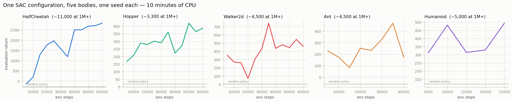
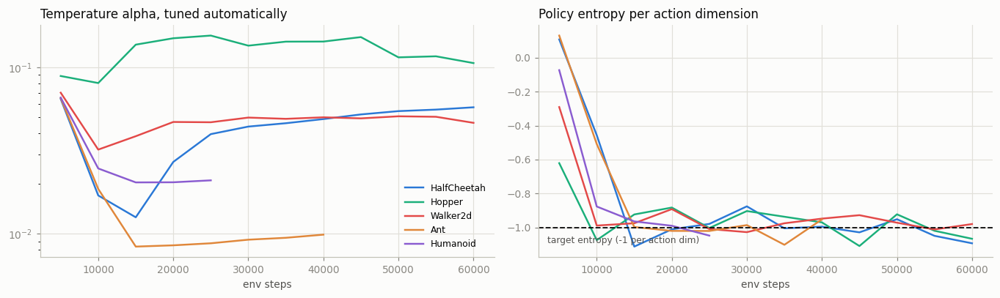

# SAC on a Mujoco Suite

## Key Insight

[SAC](/shared/glossary/#sac) (Soft Actor-Critic) is the modern default for [continuous control](/shared/glossary/#continuous-control) because it folds an entropy bonus straight into the objective — it follows [maximum-entropy RL](/shared/glossary/#maximum-entropy-rl), maximizing reward *and* keeping the [policy](/shared/glossary/#policy) as random as it can afford — so it explores on its own and stays robust without the hand-tuned action noise [DDPG](/shared/glossary/#ddpg) and [TD3](/shared/glossary/#td3) lean on. Running it across a [MuJoCo](/shared/glossary/#mujoco) suite of increasingly hard bodies — [HalfCheetah](/shared/glossary/#halfcheetah), [Walker2d](/shared/glossary/#walker2d), [Ant](/shared/glossary/#ant), and [Humanoid](/shared/glossary/#humanoid) — tests whether one algorithm with one [hyperparameter](/shared/glossary/#hyperparameter) setting can scale from a simple runner to a 17-joint humanoid, and SAC's reputation rests on the fact that it usually can.

---

## What's in this directory

| File | Role |
|------|------|
| `sac_suite.py` | The *same* SAC configuration on five bodies, from a 6-joint runner to a 17-joint humanoid. |

```bash
python3 sac_suite.py     # ~9 min: five bodies, five cores, one seed each
```

SAC is not a new file either — it is
[`cc_lib.py`](../26-ddpg-on-pendulum/cc_lib.py)'s `Agent` with the entropy flags on:

```python
def sac_config(**kw):
    return Config(twin_critics=True,      # inherited from TD3
                  stochastic_actor=True,  # a distribution, not a point
                  entropy_bonus=True,     # the maximum-entropy objective
                  auto_alpha=True,        # project 29
                  act_noise=0.0,          # NO hand-tuned exploration noise
                  **kw)
```

Note the last line. [DDPG](/shared/glossary/#ddpg) and [TD3](/shared/glossary/#td3) need
`act_noise` — a hand-tuned amount of random jitter added to every action — because their
actors are deterministic and cannot explore on their own. SAC sets it to **zero**. Its
policy is a distribution, and the entropy bonus *pays it* to keep that distribution wide.
Exploration stops being a bolted-on accessory ([project 26](../26-ddpg-on-pendulum/README.md) showed how fragile that bolt
is) and becomes part of the objective.

## What is actually being tested

The claim behind SAC's reputation is **not** "it gets a high score". It is:

> **One configuration** — one learning rate, one network size, one temperature rule —
> learns on bodies ranging from a 6-joint runner to a 17-joint humanoid, **with no
> per-task tuning.**

That word *tuning* is the point. Most RL algorithms need a human to sit down with each new
robot and hand-adjust their settings until they work. That is slow, it needs an expert,
and it has to be repeated for every new body. An algorithm that needs **none** of that is
worth far more in practice than one that scores slightly higher after a week of fiddling.

Every algorithm setting in `sac_suite.py` is therefore identical across the five bodies.
The only thing that differs is the *number of steps* each one is given, and that is purely
a budget decision, not a scientific one: Humanoid reports 348 numbers about its state at
every step (against Hopper's 11), so a single Humanoid step costs several times more
computer time. Giving every body the same number of steps would mean spending almost the
whole ten minutes on the one body and starving the rest.

## The honest result



```
body               steps   random   SAC (ours)   published   we reach
HalfCheetah-v5    60,000     -280         2768     ~11,000        27%
Hopper-v5         60,000       18          374      ~3,300        11%
Walker2d-v5       60,000        2          502      ~4,500        11%
Ant-v5            40,000      -60          320      ~4,500         8%
Humanoid-v5       25,000      120          411      ~5,000         6%
```

Read that last column before anything else, because it is the honest part: **this run
reaches 6–27% of the published numbers.** Those published numbers come from 1–3 *million*
environment steps. This is 25,000–60,000, on a CPU, in ten minutes — between 20 and 100
times less experience. Anyone claiming to reproduce SAC's MuJoCo results on a laptop is
either using different definitions or is mistaken.

So what *did* the ten minutes buy?

**Every body ends up above a random policy**, and the same configuration ran on all five
without diverging, without `NaN`, and without a single per-task adjustment. HalfCheetah
is the clearest: it climbs from `-280` to `2768` and is still rising steeply when the
budget runs out. Hopper roughly doubles.

**And every body except HalfCheetah is too noisy to call a trend.** Walker2d wanders
between `80` and `740`. Ant peaks at `470` and falls back to `320`. Humanoid bounces
between `310` and `490`. With **one seed each**, the honest reading of those three panels
is "above random, and learning something, but do not draw a line through it" — a second
seed could easily reorder them. That is a real limit of the budget, not a result to
present as one.

## One rule, five different temperatures

This is the part the budget *can* prove, and it is the more interesting one.



The left panel is the [temperature](/shared/glossary/#temperature) `alpha` that
[automatic tuning](/shared/glossary/#automatic-temperature-tuning) ([project 29](../29-automatic-temperature-tuning/README.md)) settled
on for each body. They are not the same. They are not close:

| body | `alpha` it converged to |
|---|---|
| Hopper | ~0.11 |
| HalfCheetah | ~0.055 |
| Walker2d | ~0.047 |
| Humanoid | ~0.021 |
| Ant | ~0.010 |

That is a **more than 10× spread**, discovered automatically, with no human involved. Now
recall [project 29](../29-automatic-temperature-tuning/README.md)'s measurement: on HalfCheetah, moving `alpha` from `0.05` to `0.2`
takes the return from `2250` to `12`. A 4× error in `alpha` is fatal. Here the *correct*
values differ by more than 10× **between bodies** — so any single hand-picked constant
would be badly wrong on most of this suite.

And the right panel shows why the automatic rule can find them: **all five entropy curves
collapse onto the same `-1.0` target line** and stay there. Five bodies, five wildly
different reward scales, five different temperatures — one entropy target, hit every
time.

That is the mechanism behind "one configuration, many robots", and it is fully visible in
ten minutes even though the *scores* are not.

## What to take away

The suite tests a claim about **generality**, not about scores, and generality is exactly
what a small budget can still speak to:

- **Where the claim holds up:** one configuration ran on bodies from 3 to 17 joints, and
  from 11- to 348-dimensional observations, with no tuning and no instability. Its
  temperature controller silently found a different correct answer for each body,
  spanning a 10× range, and landed every one of them on the same entropy target. Nothing
  here needed a human.
- **Where this run cannot speak:** whether SAC ultimately *solves* these bodies. It
  reaches 6–27% of published returns, on one seed. That question needs 20–100× this
  compute, and no amount of careful writing can substitute for it.

The reason SAC became the default for [continuous control](/shared/glossary/#continuous-control)
is visible in the first bullet. [DDPG](/shared/glossary/#ddpg) needs its exploration noise
re-tuned per task ([project 26](../26-ddpg-on-pendulum/README.md) showed how brittle that noise actually is), and
[TD3](/shared/glossary/#td3) inherits the same hand-tuned knob. SAC replaced it with a
quantity that *transfers* — "be this random" instead of "pay this much for randomness" —
and that single substitution is what lets one config walk onto a new robot and work.
