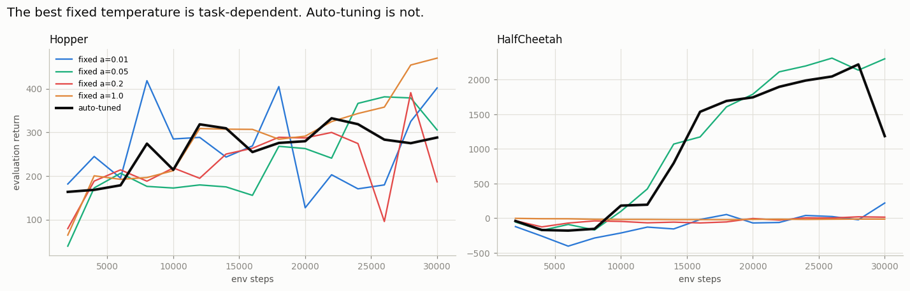
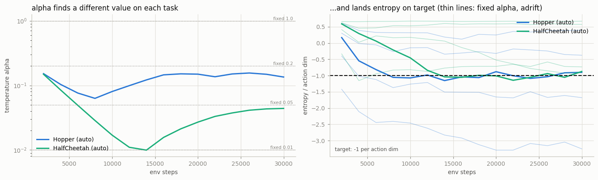

# Automatic Temperature Tuning

## Key Insight

[SAC](/shared/glossary/#sac) balances reward against exploration with a single knob, the entropy [temperature](/shared/glossary/#temperature) α, and the algorithm is painfully sensitive to it: set it too high and the agent acts almost randomly forever, too low and it [collapses](/shared/glossary/#maximum-entropy-rl) to a brittle near-deterministic [policy](/shared/glossary/#policy). [Automatic temperature tuning](/shared/glossary/#automatic-temperature-tuning) removes the guesswork by treating α as something to learn — you pick a *target entropy* (how random you want the policy to be on average) and adjust α by [gradient descent](/shared/glossary/#sgd) so the policy's actual [entropy](/shared/glossary/#entropy-regularization) is driven toward that target. This one change is what let SAC use a single configuration across wildly different tasks instead of re-tuning α by hand for every robot.

---

## What's in this directory

| File | Role |
|------|------|
| `auto_alpha.py` | A grid: 4 fixed temperatures × 2 tasks, plus auto-tuned α on both. Designed so that the claim *"one setting works everywhere"* can actually fail. |

```bash
python3 auto_alpha.py     # ~7 min on 12 hyperthreads
```

## What the temperature actually does

SAC does not maximize reward. It maximizes reward **plus randomness**:

```
ordinary RL:        maximize  E[ sum of rewards ]
maximum-entropy RL: maximize  E[ sum of rewards  +  alpha * entropy(policy) ]
```

`alpha` is the exchange rate between the two. And that phrasing exposes the problem
immediately: **an exchange rate only means something relative to the units on each
side.** Entropy is measured in nats, and it lives on a small scale — a few nats,
always. Reward is measured in whatever the environment happens to use, which might be
0.5 per step or 500 per step, and which *grows* as the agent gets better.

So `alpha = 0.2` is not a setting. It is a setting *relative to a reward scale*, and
that scale is different on every task, and it moves during training.

> **Analogy.** Imagine a rule that says "spend 5 dollars on lottery tickets for every
> unit of profit you make." Whether that is reckless or trivial depends entirely on
> whether your profit is measured in dollars or in millions of dollars — and on whether
> your business grew tenfold since you wrote the rule. `alpha` has exactly this problem.

## The fix: stop setting `alpha`, start setting the entropy you want

The insight of SAC v2 is to flip the control problem around. Instead of choosing the
*price* of randomness (hard, task-dependent, meaningless in isolation), choose **how
random you want the policy to be** — the target entropy — and let `alpha` be whatever
it needs to be to achieve that.

The standard target is `-1 nat per action dimension`, and `alpha` is then adjusted by
[gradient descent](/shared/glossary/#sgd):

```python
# push alpha UP when the policy is more deterministic than the target
# push alpha DOWN when it is more random than the target
alpha_loss = -(log_alpha * (logp.detach() + target_entropy)).mean()
```

This is a **thermostat**. You no longer set the boiler's fuel rate (`alpha`); you set
the temperature you want the room to be (`target_entropy`) and let the controller work
out the fuel. That is exactly the trade this update makes, and it is why the same
configuration transfers across robots.

(The entropy this thermostat reads comes from the actor's
[log-probability](/shared/glossary/#log-probability). If that number is wrong, the
thermostat is servoing on a lie — which is precisely the bug project 30 audits.)

## The experiment

The claim under test is: *"auto-tuning matches the best hand-picked `alpha`, without
being told which task it is on."* To let that claim fail, the grid has to include fixed
temperatures that are genuinely good — so it sweeps four of them (`0.01`, `0.05`,
`0.2`, `1.0`) on two tasks with very different reward scales
([Hopper](/shared/glossary/#hopper) and [HalfCheetah](/shared/glossary/#halfcheetah)),
and asks two questions:

1. Is there **one** fixed `alpha` that wins on **both** tasks? (If yes, auto-tuning
   solves a problem nobody has.)
2. Does auto-tuning match the best fixed `alpha` **on each task**, without knowing the
   task?



```
=== final return after 30,000 steps ===
temperature              Hopper     HalfCheetah
fixed a=0.01                302              73
fixed a=0.05                355            2250
fixed a=0.2                 224              12
fixed a=1.0                 427             -14
auto-tuned                  282            1817
```

**Question 1 has a brutal answer: there is no fixed `alpha` that is safe on both.**

Look at `alpha = 1.0`. It is the **best** setting on Hopper (`427`, beating every other
row) and a **catastrophe** on HalfCheetah (`-14`, worse than doing nothing — a random
policy scores about `-280`, so it is barely above flailing). The single best choice on
one task is close to the single worst choice on the other.

And the sensitivity is savage. On HalfCheetah, going from `alpha = 0.05` to
`alpha = 0.2` — a change most people would call "the same order of magnitude" — takes
the return from `2250` to `12`. That is not a knob you can tune by intuition, and it is
not a knob whose value transfers between robots.

## What auto-tuning is actually doing



The left panel is the answer to *why* it works. Auto-tuning settles on a **different
temperature for each task**, without being told which task it is on: roughly `0.14` on
Hopper, and about `0.045` on HalfCheetah.

That second number is worth pausing on. The sweep above needed **four separate training
runs** on HalfCheetah to discover that `alpha = 0.05` was the good setting. Auto-tuning
**found essentially that same value on its own, in one run**, starting from `0.2`. It
did not get lucky — it was following its thermostat.

And the thermostat holds. The right panel plots policy entropy against the `-1.0`
target:

```
=== final entropy per action dim (target = -1.0) ===
Hopper         a=.01= -3.15  a=.05= -1.66  a=.2= -0.32  a=1= +0.38  auto= -0.95
HalfCheetah    a=.01= -0.68  a=.05= -0.89  a=.2= +0.58  a=1= +0.67  auto= -0.96
```

Both auto runs land on `-0.95` and `-0.96`, essentially exactly on the `-1.0` they were
aiming at. Every fixed-`alpha` run drifts wherever the reward scale happens to drag it —
from `-3.15` (a policy that has gone nearly deterministic and stopped exploring) to
`+0.67` (a policy still flailing about at the end of training). **Same `alpha`, opposite
outcomes, because the tasks pay different rewards.**

## The honest caveat: auto-tuning did not *win*

Read the table again. Auto-tuning scores `282` on Hopper against the best fixed
`alpha`'s `427`, and `1817` on HalfCheetah against `2250`. **On both tasks it is beaten
by the best hand-picked temperature.** Any claim that auto-`alpha` is simply superior
would be contradicted by this project's own numbers.

That is the wrong scoreboard, though, and seeing why is the whole point:

- The "best fixed `alpha`" in each column was found **by running the sweep** — four
  training runs per task, and you only know which one won *afterwards*. Auto-tuning got
  within striking distance in **one** run, knowing nothing.
- To use the best fixed `alpha` on a new robot, you must sweep again. There is no
  transfer: the winner on Hopper (`1.0`) is the disaster on HalfCheetah.
- Auto-tuning never produced a catastrophe. Fixed `alpha` did — twice (`0.2` and `1.0`
  on HalfCheetah both collapse to near-zero return).

So the correct summary is not "auto-tuning is better". It is:

> **Auto-tuning is not about winning. It is about not losing, on a task you have not
> tuned for.**

## What to take away

`alpha` is a price, and a price is meaningless without knowing the currency. Reward
scales differ by orders of magnitude between tasks — and *within* one task, as the agent
improves and its returns grow — so a constant `alpha` is a constant only in name.

Automatic temperature tuning replaces an un-transferable quantity (**the price of
randomness**) with a transferable one (**how random the policy should be**). `-1 nat per
action dimension` means the same thing on a 3-joint hopper and a 17-joint humanoid;
`alpha = 0.2` does not mean the same thing on any two tasks at all.

This is why SAC ships with one configuration and works across a whole
[MuJoCo](/shared/glossary/#mujoco) suite (project 28) while [DDPG](/shared/glossary/#ddpg)
needs its exploration noise re-tuned per task. The algorithmic difference is a few lines
of [dual gradient descent](/shared/glossary/#sgd). The practical difference is whether
you sweep four runs per robot, forever.
