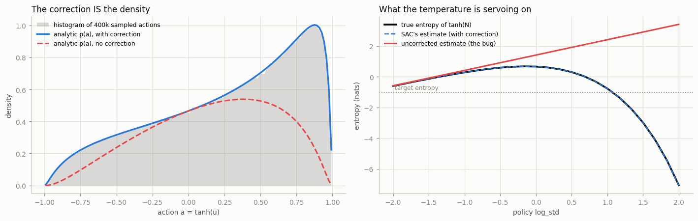
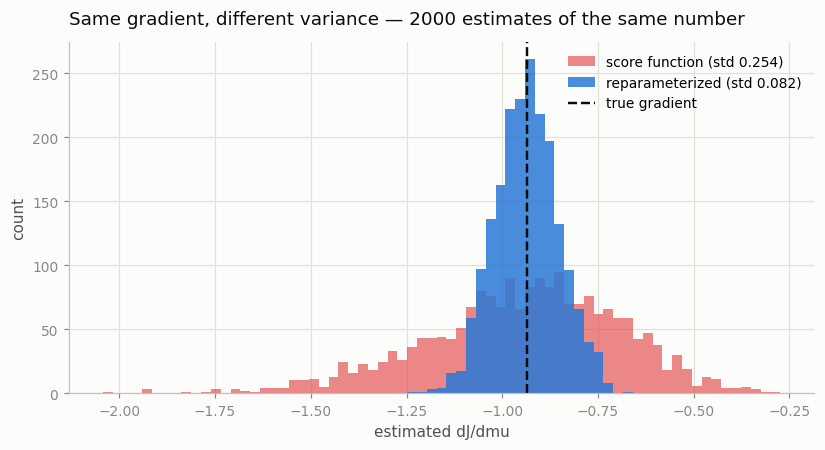
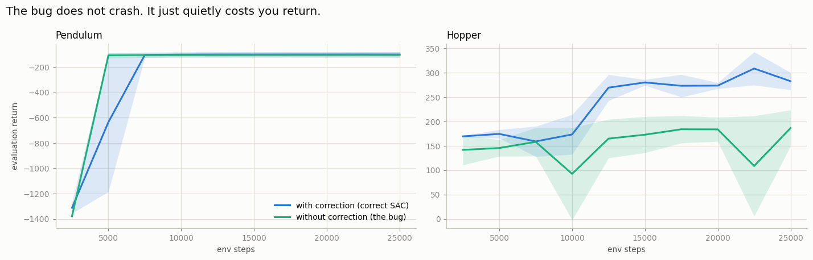

# Reparameterization Audit

## Key Insight

[SAC](/shared/glossary/#sac)'s actor outputs a Gaussian that is then squeezed through a [tanh squashing](/shared/glossary/#tanh-squashing) function so every action stays inside the environment's bounds, and it trains that actor with the [reparameterization trick](/shared/glossary/#reparameterization-trick) — sampling plain noise and pushing it through `mean + std · ε` so [gradients](/shared/glossary/#gradients) flow through the otherwise-random action. The catch is that squashing a Gaussian through `tanh` changes its probability density, so the log-probability used in the loss needs a correction term; get that correction wrong and SAC keeps running while silently learning the wrong [entropy](/shared/glossary/#entropy-regularization), producing a policy that looks trained but quietly underperforms. Auditing this one formula by hand is the cheapest way to catch a bug that no error message will ever report.

---

## What's in this directory

| File | Role |
|------|------|
| `reparam_audit.py` | Five numerical checks on the [log-probability](/shared/glossary/#log-probability) formula, then a training run that measures what the bug costs. |

```bash
python3 reparam_audit.py checks    # the five checks only, ~15 seconds
python3 reparam_audit.py           # checks + the training comparison, ~6 min
```

The actor being audited lives in [`../26-ddpg-on-pendulum/cc_lib.py`](../26-ddpg-on-pendulum/cc_lib.py)
(`SquashedGaussianActor`). Its `tanh_correction` flag is what this project switches
off in order to measure the damage.

## The formula, and why it needs a correction at all

SAC's actor does two things. First it samples an unbounded number from a Gaussian:

```
u = mu(s) + sigma(s) * eps          eps ~ N(0, 1)
```

Reading that line: the network looks at the state `s` and outputs two numbers — a
**centre** `mu` ("the action I think is best") and a **spread** `sigma` ("how unsure I
am"). Then `eps` is a random draw from a standard bell curve (`N(0, 1)` — usually near
zero, occasionally further out). Multiply the spread by the random draw, add it to the
centre, and you have a random action that is *usually* close to what the network wanted.

There is one problem: `u` can be **any** number, and real motors have limits. So SAC
squashes it into the legal range with `tanh`, an S-shaped function that takes any input
and gently bends it into the interval from `-1` to `+1`:

```
a = tanh(u)                         always lands in (-1, 1)
```

Now the problem this project is about. SAC needs to know **how likely the action `a`
was** — it feeds that likelihood into its [entropy](/shared/glossary/#entropy-regularization)
bonus, the thing that keeps the policy exploring. And squashing an action **changes how
likely it was.**

Here is the intuition, with no math. Think of probability as sand spread along an
infinite line. `tanh` crushes that whole infinite line into the short interval from
`-1` to `+1`. Near the middle, the crushing is gentle. Near the two ends it is
extreme — an enormous stretch of the original line gets compressed into a thin
sliver next to `+1`. So sand piles up near the edges: it becomes much *denser*
there. If you keep reporting the original density after crushing, you are
describing a pile of sand that no longer exists.

The correction term measures exactly how much each point got squeezed, and divides
that squeezing back out:

```python
log p(a) = log p(u) - SUM_i log(1 - tanh(u_i)^2)
```

Drop that second term and nothing crashes. The agent trains. The loss goes down. It
is simply optimizing the entropy of a distribution that is not the one the
environment ever saw.

## Check 1 — is it even a probability distribution?

The cheapest possible test, and it needs no RL at all.

A [probability density](/shared/glossary/#probability-density) has one rule it can never
break: **add it up over every possible outcome and you must get exactly 1.** ("Something
must happen" — the chances of all the outcomes together have to be 100%.) Adding up a
value across a continuous range like this is called *integrating*, and it is just a very
careful sum.

So: add it up.

```
$ python3 reparam_audit.py checks

1. NORMALIZATION — does exp(log p) integrate to 1 over a in (-1, 1)?
   with correction:    1.001359   <- a probability density
   without correction: 0.665193   <- integrates to 0.67, not a density at all
```

The corrected version integrates to 1.0. (The 0.0014 excess is numerical error in
the integration itself, which has to evaluate the function right up against the
`±1` boundary, where it is at its nastiest.) The uncorrected version integrates to
**0.67**.

That is not "slightly off". Something that sums to 0.67 is **not a probability
distribution at all**, and every quantity SAC computes from it — the entropy bonus,
the temperature gradient — is meaningless. One check, two lines of output, and the
bug is already caught.

## Check 2 — does the formula match reality?

Sample 400,000 actions from the actor, histogram where they actually landed, and
overlay what each formula *claims* the density is.



```
2. DENSITY — analytic log p vs the histogram of 400k sampled actions
   with correction:    max |analytic - empirical| = 0.0375
   without correction: max |analytic - empirical| = 0.8110
```

In the left panel, the grey histogram is where the actions really went. The blue
line (with correction) lies right on top of it. The red dashed line (without
correction) sags below it everywhere, and completely misses the pile-up against the
walls — exactly the crushed-sand effect described above.

## Check 3 — the one that actually matters

This is the check worth remembering, because it explains *why* the bug is so
damaging, not merely that it is wrong.

[Automatic temperature tuning](/shared/glossary/#automatic-temperature-tuning)
([project 29](../29-automatic-temperature-tuning/README.md)) works by watching the policy's entropy and pushing it toward a target
value. Entropy means "how random is my policy". So that entropy number had better be
true.

The right-hand panel above sweeps the policy's spread (`log_std`) and plots three
things: the true entropy of the squashed policy, SAC's estimate of it, and the
uncorrected estimate.

```
3. ENTROPY — the quantity automatic temperature tuning targets
    log_std     true H   SAC est.  no correction
      -2.00     -0.598     -0.599         -0.581
       0.00      0.669      0.670          1.419
       1.00     -0.764     -0.766          2.419
       2.00     -7.059     -7.077          3.419
```

Look at the last row. The policy has become very spread out, so nearly every action
it samples gets squashed hard against `-1` or `+1`. The policy is now close to a
coin flip between "full left" and "full right" — it has
**[saturated](/shared/glossary/#action-saturation)** — and its true entropy has
*collapsed* to `-7.06`.

The uncorrected formula reports `+3.42`. It does not just get the number wrong; it
gets the **direction** wrong. It announces "this policy is extremely random, relax"
at the exact moment the policy has stopped exploring and pinned itself to the action
limits. A temperature controller fed this number will keep pushing the policy to be
*more* random, which saturates it further, which makes the lie bigger.

That is the real bug. Not a small numerical error — a control loop steering by a
gauge that moves the wrong way.

## Check 4 — the `-inf` that eats your actor

The literal textbook formula, `log(1 - tanh(u)^2)`, is perfectly correct in exact
mathematics — and unusable on a real computer, which stores numbers with only limited
precision ([float32](/shared/glossary/#float32), about 7 decimal digits).

```
4. NUMERICAL STABILITY — literal log(1 - tanh(u)^2) vs the stable form
        u        literal          +1e-6         stable
      1.0        -0.5514        -0.5514        -0.5514
      8.0       -18.3628       -19.4933       -18.3052
     10.0            inf       -37.1034       -32.3052
     20.0            inf      -187.1034      -162.3052
```

Here is the chain of events. `tanh(10)` is `0.99999999...` — so close to `1` that float32
cannot tell the difference and simply **rounds it to exactly `1.0`**. Then
`1 - tanh(u)^2` is exactly `0`. Then `log(0)` is `-inf` (minus infinity), the
log-probability becomes `+inf`, and on the very next update every weight in the actor
turns into [`NaN`](/shared/glossary/#nan) ("not a number"). Training is over — the network
is now permanently garbage.

Note *when* this strikes: at large `|u|`, which is exactly a
[saturated](/shared/glossary/#action-saturation) actor — one slamming its actions against
the limits. **The formula breaks precisely in the situation you most need it to survive.**

The popular fix is to add a tiny number ("epsilon") to stop the `log(0)`:
`log(1 - tanh(u)^2 + 1e-6)`. Look at the `+1e-6` column above. It does stop the crash —
and it is still wrong. The epsilon quietly puts a **floor** under the correction, so
instead of the true value it returns whatever that arbitrary floor allows. At `u = 20` it
is off by **25 [nats](/shared/glossary/#nat)** — an enormous error.

You have traded a *loud* failure (a crash you would fix in ten minutes) for a *quiet* one
(a wrong number you will never notice). That is a bad trade, and it is the theme of this
entire project.

The identity used in `cc_lib.py` needs no epsilon and stays exact everywhere:

```python
# log(1 - tanh(u)^2), rewritten so it never evaluates log(0)
correction = 2 * (math.log(2) - u - F.softplus(-2 * u))
```

## Check 5 — why "reparameterization" and not REINFORCE?

There are two different ways to work out which direction to push the actor, and both are
*correct* — they aim at the same answer. An **estimator** is just a recipe for guessing a
number from random samples, and because the samples are random, every estimator's guess
wobbles a bit.

So run each recipe 2,000 times on the identical problem, and see how much its answers
scatter:



```
5. GRADIENT VARIANCE — reparameterized vs score-function (REINFORCE)
                estimator       mean        std
          reparameterized    -0.9359     0.0824
           score function    -0.9440     0.2536
```

They agree on the answer: `-0.936` vs `-0.944`, the same number once you allow for noise.
That is the `mean` column, and it confirms neither one is *cheating*.

The `std` column is where they part company. It measures how widely the 2,000 guesses were
scattered around that answer — small `std` means "every attempt gave nearly the same
result"; big `std` means "the answers were all over the place". The
[score-function](/shared/glossary/#log-derivative-trick) recipe's scatter is **3.1× wider**.

Both are aiming at the same target. One of them has a much steadier hand.

The reason is structural. The score-function estimator only ever asks "that action
scored well, so make actions like it more likely" — it treats the
[critic](/shared/glossary/#actor-critic) as an opaque black box and has to infer the
right direction from samples. The reparameterized estimator differentiates *through*
the sampled action into the critic, so it can ask the strictly more informative
question: "which **direction** should I nudge this action to raise its score?" It is
handed `dQ/da` directly instead of guessing it. That extra information is the
variance reduction — and it is the same trick, for the same reason, as the
[deterministic policy gradient](/shared/glossary/#deterministic-policy-gradient) in
[DDPG](/shared/glossary/#ddpg) ([project 26](../26-ddpg-on-pendulum/README.md)).

## The consequence: what the bug actually costs

Checks are theory. Here is SAC trained *with* the correction and *without* it, on
two tasks, two seeds each, identical in every other respect.



```
task             with correction    without   entropy/dim (with)   (without)
Pendulum-v1                 -101       -103                -0.88       -0.94
Hopper-v5                    296        147                -1.00       +3.40
```

Two tasks, two completely different verdicts — and the difference between them is the
most useful thing in this project.

**On Pendulum the bug is almost invisible.** `-101` with the correction, `-103` without.
If this were your only test, you would conclude the correction is optional and delete
it. Pendulum has **one** action dimension, and the correction is a *sum over action
dimensions* — so there is exactly one term to get wrong, and the policy never needs to
push its actions hard against the limits to solve the task.

**On Hopper the same bug halves the return.** `296` drops to `147`. Hopper has **three**
action dimensions, so the error is three times larger, and the walking gait it has to
find genuinely does push actions toward their limits.

Now look at the last column, which is the *mechanism* rather than the score. The correct
agent reports an entropy of `-1.00` per action dimension — exactly the target it was
aiming for. The broken agent reports **`+3.40`**.

Its [temperature](/shared/glossary/#temperature) controller ([project 29](../29-automatic-temperature-tuning/README.md)) is being told
the policy is far *more* random than the target, so it drives `alpha` down and down,
trying to make an already-saturated policy less random. It is a thermostat wired to a
thermometer that reads the wrong room. Nothing crashes. The agent just quietly ends up
half as good.

And the scaling of the damage is the warning: **the bug gets worse with the number of
action dimensions.** One joint hid it completely. Three joints halved the score. A
17-joint [Humanoid](/shared/glossary/#humanoid) is where you would finally notice — long
after you had stopped suspecting your log-probability.

## What to take away

This bug is worth a whole project not because it is hard to fix — it is one line,
and `cc_lib.py` has it right — but because **it is invisible**.

There is no crash, no `NaN`, no warning. The loss curve looks healthy. The agent
improves. Everything about the run says "working", and the only symptom is a final
score lower than it should have been — which, in RL, looks *exactly the same* as an
unlucky [seed](/shared/glossary/#seed), a hard task, or a slightly-off
[hyperparameter](/shared/glossary/#hyperparameter). Those are the three things you would
blame, and you would spend a week on them. You would never think to inspect your
log-probability, because your log-probability never complains.

Three checks that cost fifteen seconds — *does it integrate to 1, does it match the
histogram, does the entropy move in the right direction* — settle it permanently.
Write them once; run them whenever you touch the actor. And the lesson generalizes
well past SAC: **any time you transform a random variable and keep using its
density, you have taken on a silent debt.** A numerical check is how you find out
whether you actually paid it.
