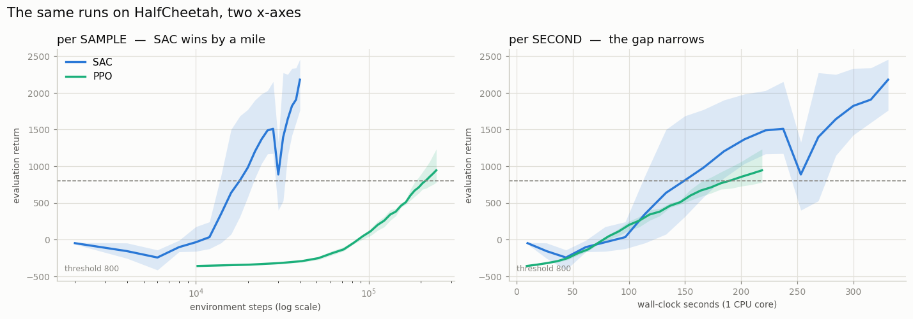

# Sample Efficiency Study

## Key Insight

[Sample efficiency](/shared/glossary/#sample-efficiency) asks how much reward an algorithm buys per unit of environment experience, and it cleanly splits the two camps of deep RL: [off-policy](/shared/glossary/#off-policy) methods like [SAC](/shared/glossary/#sac) replay every transition from a [buffer](/shared/glossary/#experience-replay) many times, so they reach good policies in far fewer samples, while [on-policy](/shared/glossary/#on-policy) methods like [PPO](/shared/glossary/#ppo) must throw data away after each update and make up for it with massive parallelism and fast simulation. Running PPO and SAC on the same [MuJoCo](/shared/glossary/#mujoco) task and plotting [return](/shared/glossary/#return) against both samples used and wall-clock time makes the trade-off concrete: SAC usually wins on samples, while PPO often wins on wall-clock time when the simulator is cheap and you can run thousands of environments at once.

---

## What's in this directory

| File | Role |
|------|------|
| `sample_efficiency.py` | Runs SAC and PPO on the *same* task, 3 [seeds](/shared/glossary/#seed) each, and plots the same runs against two different x-axes. |

```bash
python3 sample_efficiency.py     # ~6 min on 12 hyperthreads
```

Neither algorithm is reimplemented here. SAC is
[`cc_lib.py`](../26-ddpg-on-pendulum/cc_lib.py) from [project 26](../26-ddpg-on-pendulum/README.md); PPO is
[`ppo.py`](../22-ppo-from-scratch/ppo.py) from [project 22](../22-ppo-from-scratch/README.md), configured for continuous
control. That reuse is what makes the comparison trustworthy: both are code the guide
has already tested, so any difference below is the *algorithms* differing, not two
implementations of varying quality.

## Two questions that sound like one

"Which algorithm is more efficient?" hides two completely different questions, and they
have different answers:

| the question | the resource you are short of | who cares |
|---|---|---|
| Which learns more **per environment step**? | *samples* | a real robot, a medical trial — anything with a physical clock and parts that wear out |
| Which learns more **per second**? | *seconds* | a fast simulator you can fork across 64 cores |

A paper reporting only the first is answering a question its readers may not have
asked. So this project plots **the same runs** against both x-axes and lets the
disagreement show.

All of it follows from a single lopsided difference between the two — how many times each
algorithm *studies* what it collects. That ratio has a name: the
[update-to-data ratio](/shared/glossary/#update-to-data-ratio).

- **SAC** does **one gradient update for every single environment step.** Each step is
  therefore expensive — but nothing is wasted, because every sample is stored in the
  [replay buffer](/shared/glossary/#experience-replay) and studied again and again.
- **PPO** collects 2,048 steps, does a few dozen updates on that whole batch, and then
  **throws the data away for good.** Each step is cheap — but each sample teaches it far
  less before it is discarded.

> Two students with the same textbook. One re-reads every page until it sticks: slow per
> page, but almost nothing is forgotten. The other skims each page once and never returns
> to it — but gets through ten times as many books in the same evening.

## The result



Same six runs, same task ([HalfCheetah](/shared/glossary/#halfcheetah), where a random
policy scores about `-280`). Only the x-axis changes.

To compare fairly we pick a **threshold** — a "good enough" score both algorithms must
reach (here, a return of `800`) — and then ask what each one had to *spend* to get there.

```
HalfCheetah-v5  (threshold = 800)
  algo     env steps    seconds   final return   steps/s
  SAC         24,000        203           1969       121
  PPO        235,520        210            900      1124
```

**Per sample, SAC is 10× better.** It reaches the threshold after 24,000 steps of
experience; PPO needs 235,520 — almost ten times as much.

Why should you care? Because on a *real* robot, a "step" is not free: it is one actual
movement of a physical arm, taking real time and wearing out real hardware. At a typical
20 steps per second, 24,000 steps is about **20 minutes** of robot time. 235,520 steps is
about **3.5 hours** of continuous running. Same robot, same result — one afternoon versus
several days once you account for battery changes and breakages.

**Per second, they arrive at the same moment.** SAC crosses the threshold at 203
seconds, PPO at 210. A 3% gap — a tie.

The explanation is the last column: **PPO runs 9.3× more environment steps per second**
(1,124/s vs 121/s), because it is not paying for a gradient update on every single
step. SAC's 10× sample advantage and PPO's 9.3× speed advantage very nearly *cancel*,
and the race to a working policy ends in a dead heat.

Do not memorize that cancellation — it is a coincidence of this machine. Understand
*why* it happens: the two ratios are the same trade, made in opposite directions. **SAC
spends compute to save samples. PPO spends samples to save compute.** Which one wins
depends entirely on which of the two is scarce for *you*, and that is a fact about your
problem, not about the algorithms.

## Where each one actually wins

Two things the table does not say, and both matter.

**SAC keeps going.** Look at the right-hand panel *past* the threshold. The two are
tied at 200 seconds, but SAC climbs on to `1969` while PPO sits at `900`, rising
slowly. Equal time to a *mediocre* policy is not equal time to a *good* one. (SAC's
curve also shows a sharp dip around 250 seconds — one seed briefly collapsing, then
recovering. That is SAC being SAC: more sample-efficient, and less placid than PPO,
which plods up its curve almost boringly.)

**PPO's advantage is the one that scales.** PPO managed 1,124 steps/s on a *single CPU
core* — and gathering experience is work you can simply split up. Run 64 copies of the
environment side by side ([vectorized environments](/shared/glossary/#vectorized-environment))
on 64 cores, and PPO collects roughly 64× faster, sliding its entire wall-clock curve to
the left.

SAC cannot buy the same speedup, and the reason is worth understanding. Its bottleneck is
not collecting data — it is the gradient updates, and those must happen **one after
another**: update 2 uses the network that update 1 just produced, so you cannot do them
at the same time. Handing SAC 64 cores barely helps, because the work it is waiting on
refuses to be split.

> Nine women cannot make a baby in one month. Some work divides across workers; some work
> is a chain where each link needs the one before it. Collecting experience is the first
> kind. Gradient updates are the second.

**That is the real reason large-scale RL runs on PPO** despite being far less
sample-efficient: its scarce resource is the one you can simply buy more of.

## What to take away

> **SAC is 10× more sample-efficient. PPO is 9.3× faster per sample. Choose the one
> whose scarce resource matches yours.**

If samples cost money, wear out hardware, or take real-world time — a robot arm, a
recommender experimenting on live users, anything physical — you want the off-policy,
replay-buffer, high-[UTD](/shared/glossary/#update-to-data-ratio) family: SAC,
[TD3](/shared/glossary/#td3), and their descendants. If samples are nearly free and you
have cores to burn, PPO's simplicity and parallelism win, and its large appetite for
samples is not a flaw you need to fix.

Neither is "better". They answer different questions — and the most common mistake in
applied RL is inheriting another team's algorithm along with their answer, without
noticing that your constraint was never the same as theirs.
