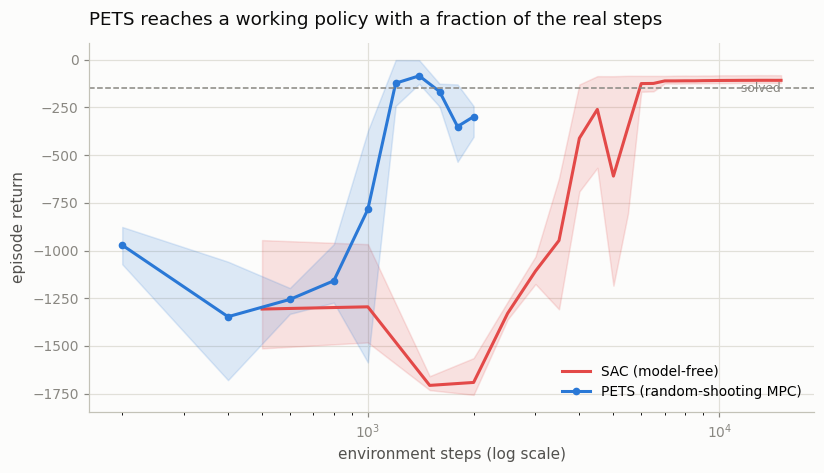
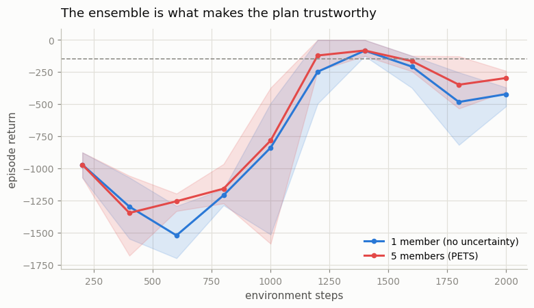
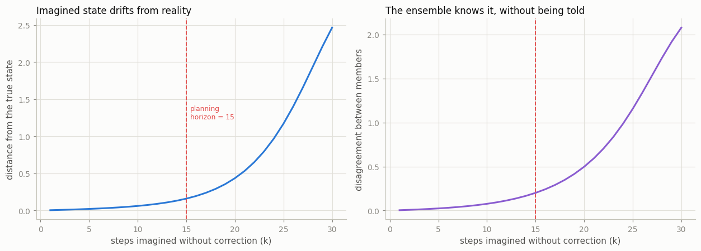

# PETS / Random Shooting MPC

## Key Insight

[PETS](/shared/glossary/#pets) (Probabilistic Ensembles with Trajectory Sampling) is the simplest serious [model-based RL](/shared/glossary/#model-based-rl) recipe: learn a one-step [dynamics model](/shared/glossary/#dynamics-model) from real transitions, then at every step choose an action by [random shooting](/shared/glossary/#random-shooting) — sample many random action sequences, roll each one forward through the model ([model predictive control](/shared/glossary/#mpc)), and execute the first action of whichever sequence scored the highest predicted [return](/shared/glossary/#return). Because a single dynamics network is overconfident where it has seen little data, PETS trains an [ensemble](/shared/glossary/#ensemble) of probabilistic networks and averages their predictions, so the planner trusts the model only where the ensemble agrees. On a task as small as [Pendulum](/shared/glossary/#pendulum) it can match [SAC](/shared/glossary/#sac)'s final performance using a fraction of the environment samples — the headline promise of [sample efficiency](/shared/glossary/#sample-efficiency) — because every real transition teaches the model, not just the policy.

---

## What's in this directory

| File | Role |
|------|------|
| `mbrl_lib.py` | **The planning half of Phase 6 lives here.** The [ensemble](/shared/glossary/#ensemble) model, both planners, and the MPC loop. [Project 33](../33-cem-mpc/README.md) and [project 34](../34-mini-mbpo/README.md) import this file rather than re-implementing it. ([Project 37](../37-td-mpc2-study/README.md) is standalone: its model lives in a *learned latent space*, not in observation space, so it shares the ideas but none of the code.) |
| `pets.py` | The three experiments below: does it work, does the ensemble matter, and how long does an imagined future stay true. |

```bash
python3 pets.py       # ~4 min on 12 hyperthreads
```

## The one idea

Every algorithm in Phases 4 and 5 learned a **policy**: a habit, a function from state to
action, ground out over thousands of episodes. None of them could ask the question a human
asks constantly:

> *"What would happen if I did this?"*

They couldn't, because they had no idea what the world *does*. A
[model-free](/shared/glossary/#model-free-rl) agent knows only which actions have paid off
before — never why.

Model-based RL learns the answer to that question. A **dynamics model** is a network that
takes a state and an action and predicts what happens next:

```
f(state, action)  ->  next_state, reward
```

and then does something almost embarrassingly direct with it. At every single timestep:

1. **Imagine.** Make up 400 random action sequences, each 15 steps long.
2. **Simulate.** Run all 400 through the model, adding up the reward each one earns.
3. **Commit.** Execute the first action of whichever sequence scored best.
4. **Throw the rest of the plan away**, and do all of this again from the next state.

That is [Model Predictive Control](/shared/glossary/#mpc), and step 4 is the part that
looks like a mistake. You carefully built a 15-step plan and then used *one step of it*.
Why?

Because by the next timestep you know something you did not know before: **where you
actually ended up**. The model is imperfect, so the real state will have drifted from the
imagined one. Re-planning from the true state every step stops that drift from
accumulating — you are never more than one step deep into a plan that reality has already
falsified.

> **Analogy.** Driving in fog. You plan the next 100 metres, drive 5, then look again. You
> *could* plan the whole route at once, but you cannot see that far, and after 100 metres
> of driving on a blind plan you are in a ditch. A short honest view, refreshed constantly,
> beats a long confident wrong one.

And notice what this agent does **not** have: there is no policy anywhere. No actor network,
no [Q-function](/shared/glossary/#q-learning), nothing that ever learned "what to do". The
only thing trained is the model. The behaviour is regenerated from scratch, by search, at
every step — the "policy" is a side effect of a model plus a searcher.

## The "PE" in PETS: why five models beat one

The model must say more than "the pole will be *here*". It must say **how sure it is** — and
there are two quite different reasons it might not be.

- **The world is genuinely random.**
  ([Aleatoric uncertainty](/shared/glossary/#aleatoric-uncertainty).) A fair coin lands
  heads half the time; studying it harder will not make the next flip predictable. Each
  network handles this by predicting a *distribution* — a mean and a spread — instead of a
  single number.
- **The model has never been here before.**
  ([Epistemic uncertainty](/shared/glossary/#epistemic-uncertainty).) This is not the world
  being random, it is the model being ignorant — and a single neural network is *terrible*
  at noticing it. Ask a network about a state it has never seen and it returns a confident,
  specific, entirely invented answer. It has no way to say "I don't know."

The second one is what wrecks a naive planner, and the reason deserves to be said plainly.
The planner **searches for the highest-scoring plan it can find**. So if the model
hallucinates a big reward somewhere it has never actually been, the planner does not merely
stumble in — it **goes there on purpose**, because that is where the numbers look best. A
planner is, structurally, a machine for locating a model's most optimistic mistakes.

(If that sounds familiar, it should:
[project 26](../26-ddpg-on-pendulum/README.md) measured the identical trap in DDPG, where an
actor trained to maximize a noisy critic seeks out precisely the critic's over-optimistic
errors. Same disease, different organ.)

PETS's cure is to **train five models instead of one**, each on its own random resample of
the data (drawn with replacement, so each member sees a slightly different version of
history). Then:

- Where data is **thick**, all five learned the same thing, so they **agree**.
- Where data is **thin**, each one filled the gap with a different invention, so they
  **disagree**.

Score every candidate plan by the **average across the five**. A plan that looks wonderful
to one member and catastrophic to another now averages out to unremarkable, and loses to a
plan they all like. The planner's optimism is cancelled automatically — there is no penalty
term anywhere in the code doing this.

The disagreement between the members **is** the model's estimate of its own ignorance. And
computing it needs no ground truth, which matters more than it sounds: at planning time, the
truth is exactly the thing you do not have.

## It works, and it is drastically more sample-efficient



Three [seeds](/shared/glossary/#seed) each. The x-axis is **real environment steps** (log
scale) — the only axis that matters here.

| | env steps to reach a return of −300 | final return |
|---|---|---|
| **PETS** (random-shooting MPC) | **1,200** | −298 |
| **SAC** (Phase 5's best, model-free) | 4,500 | **−108** |

**PETS reaches a working controller 3.8x faster than SAC** in real interaction with the
world. That is model-based RL's promise, measured.

The reason is a change in *what one sample is worth*. To SAC, a transition is one training
example for its critic — consumed, then diluted among thousands of others. To PETS, a
transition is a lesson about **how physics works**, and physics is the same everywhere. A
transition collected while flailing randomly in episode 1 still teaches the model something
true, and that truth is still paying out ten episodes later, in states the agent had not yet
imagined. A model-free method has to *revisit* a state to learn about it; a model
**generalizes**, so it can answer questions about places it has never been.

But read the right-hand column too, because it is the other half of the story: **SAC ends up
better.** −108 against −298. Given enough data, the model-free method wins on final quality.
This is exactly the trade the guide names — model-based buys sample efficiency and pays in
asymptotic performance. PETS is quick to get *good* and slow to get *great*, partly because
random shooting is a weak searcher ([project 33](../33-cem-mpc/README.md) goes after that),
and partly because the model's residual errors cap how good any plan can be.

> One caveat so you don't over-read the chart: PETS's line is a *single episode's* return at
> each point — an MPC agent has no separate "explore" and "evaluate" mode, it just plans —
> while SAC's is averaged over 3 evaluation episodes. PETS's curve is noisier by
> construction, not by nature.

## The ensemble earns its keep

Turn the "PE" off — one model instead of five, nothing else changed.



| | final return (3 seeds) | model's holdout prediction error |
|---|---|---|
| **5 members** (PETS) | **−298** (−248, −404, −243) | 0.019 |
| **1 member** | **−423** (−380, −518, −371) | 0.023 |

Every seed is worse with one model; the mean falls by 125 points.

The revealing column is the last one. The lone model's **holdout error is barely worse —
0.023 versus 0.019.** As a *predictor* it is nearly as good. It is not that a single network
cannot predict the pendulum. It can, almost as accurately as five.

What it cannot do is **know when it is wrong**. And because the planner actively hunts for
wherever the model is most optimistic, "about as accurate on average" turns out not to be
the property that matters. What matters is the model's behaviour in its worst, least-visited
corners — because a maximizing search will take you straight to them.

> **The lesson outlives PETS.** Whenever a model's output will be handed to something that
> *maximizes* over it, average accuracy is the wrong metric. The maximizer will find your
> errors and stand on them.

## The catch: an imagined future has a short shelf life

The model is trained **only** on one-step transitions. But the planner rolls it out **15
steps**, feeding each prediction back in as the next input, and trusts the sum. Every small
error becomes the input to the next prediction, which makes a slightly larger error, which
becomes the next input.

So: take real trajectories, and from each state let the model imagine `k` steps ahead with
no correction, using the actions that were actually taken. Then compare its imagined state
against where the real pendulum actually got to.



| steps imagined (k) | error vs reality | ensemble disagreement |
|---|---|---|
| 1 | 0.003 | 0.004 |
| 5 | 0.021 | 0.024 |
| 10 | 0.061 | 0.076 |
| **15** (the planning horizon) | **0.159** | **0.201** |
| 20 | 0.434 | 0.497 |
| 30 | **2.463** | 2.077 |

The error does not creep up — it **detonates**. Near zero for a few steps, tolerable at 10,
and by 30 steps it is off by 2.46, which on a pendulum whose state components live in
`[-1, 1]` and `[-8, 8]` means the model has lost the plot completely. It is not predicting
the pendulum any more. It is dreaming.

This one plot is why most of the rest of Phase 6 exists:

- **[Project 34 (MBPO)](../34-mini-mbpo/README.md)** uses the model to manufacture fake
  training data — and keeps its imagined rollouts to a **single step**, branching from real
  states. Now you know why. At k=1 the model is essentially truthful. At k=15 it is not.
- **[Project 37 (TD-MPC2)](../37-td-mpc2-study/README.md)** plans only **3 steps** ahead and
  hands the entire remaining future to a learned [value function](/shared/glossary/#value-function).
  Now you know why that is not a compromise but an upgrade.

### The best column in that table is the right-hand one

Look at the two columns again. **They track each other almost exactly.** At k=1: true error
0.003, disagreement 0.004. At k=15: 0.159 and 0.201. At k=30: 2.46 and 2.08.

The left column required knowing the future — we had to actually run the pendulum and look.
**The right column required nothing.** It is five networks arguing with one another,
computable at planning time, in the dark, with no access to the truth.

So the ensemble does not merely *make* errors — it **reports** them. That is its entire
reason for being in the algorithm, and it is why "how much do my models disagree?" is one of
the most useful diagnostics in all of model-based RL.

## What to take away

1. **A model changes what a sample is worth.** A transition teaches physics rather than
   preference, and physics generalizes to states you have never visited. That is where the
   3.8x comes from.
2. **A planner is a maximizer, and maximizers exploit models.** Anywhere your model is
   wrongly optimistic is somewhere your planner will deliberately go. The ensemble is not
   about accuracy — it is about *calibrated doubt*.
3. **Imagination decays fast, and superlinearly.** Every more sophisticated method that
   follows — MBPO, Dreamer, TD-MPC2 — is at bottom a different strategy for never needing
   the model to stay right for very long.

Next, [project 33](../33-cem-mpc/README.md) keeps this model *exactly as it is* and changes
only the search — and gets a result that is not the one you would expect.
