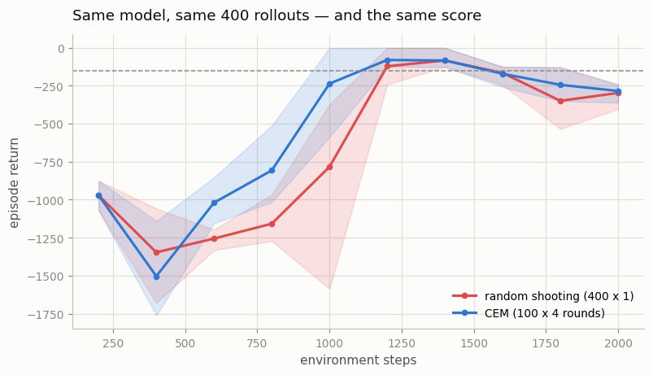
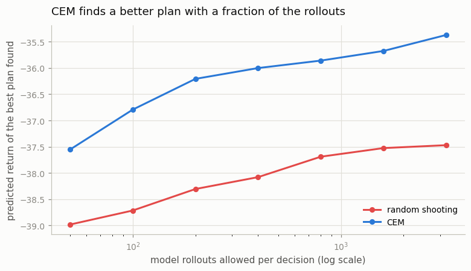
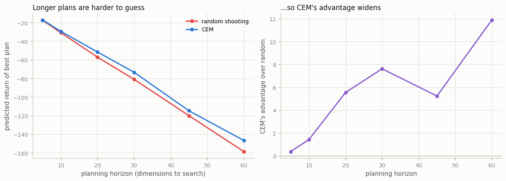

# CEM-MPC (Cross-Entropy Method Model Predictive Control)

## Key Insight

[Cross-Entropy Method Model Predictive Control](/shared/glossary/#cross-entropy-method-model-predictive-control) (CEM-MPC) swaps [random shooting](/shared/glossary/#random-shooting)'s blind guessing for the [Cross-Entropy Method](/shared/glossary/#cem), an iterative search that fits a distribution to the best action sequences and resamples from it. Each planning step it samples a batch of action sequences, keeps the top-scoring fraction (the "elites"), refits a Gaussian to those elites, and repeats a few times — so the search concentrates around promising actions instead of spraying uniformly, which finds far better plans for the same [dynamics model](/shared/glossary/#dynamics-model) at the cost of more compute per [decision](/shared/glossary/#mpc). This Cross-Entropy Method shares both its name and its core idea — matching a sampling distribution to a target by minimizing a cross-entropy-like gap — with the [cross-entropy loss](/shared/glossary/#cross-entropy) used to train classifiers, but here the "target" is the set of high-[return](/shared/glossary/#return) action sequences rather than the correct labels. CEM is the action search inside Dreamer-era planners and [TD-MPC2](/shared/glossary/#td-mpc2), which is why it is worth implementing once by hand.

---

## What's in this directory

| File | Role |
|------|------|
| `cem_mpc.py` | The three experiments below. The model, the [ensemble](/shared/glossary/#ensemble), and the MPC loop are imported **unchanged** from [project 32](../32-pets-random-shooting-mpc/README.md) — the only thing this project alters is which `Planner` object gets passed in. |

```bash
python3 cem_mpc.py    # ~5 min on 12 hyperthreads
```

## Aim the darts instead of throwing more of them

[Random shooting](/shared/glossary/#random-shooting) plans like someone throwing darts
blindfolded: fling 400 random action sequences at the model, keep whichever scored best.
It never learns anything *from* the 400 throws. Round two would be exactly as blind as
round one.

CEM's idea is to look at where the good darts landed and aim there. It keeps a Gaussian
(a bell curve) over action sequences, and each round it:

1. **Samples** 100 action sequences from the current bell curve.
2. **Scores** them all with the [dynamics model](/shared/glossary/#dynamics-model).
3. **Keeps the top 10** — the *elites*.
4. **Refits** the bell curve to just those 10: new mean, new spread.

Then repeats, 4 times. The distribution walks toward the good region and tightens around
it. Early rounds are wide and exploratory; late rounds are narrow and precise.

Step 4 is where the name comes from. Fitting a distribution to a set of good samples is
mathematically the act of minimizing a **cross-entropy** between them — the very same
quantity a [cross-entropy loss](/shared/glossary/#cross-entropy) minimizes when it fits a
classifier to correct labels. The mechanics are identical; only the target differs. A
classifier's targets are the right answers; CEM's targets are the action sequences that
happened to score well.

**The comparison is budget-matched.** Both planners roll exactly **400 action sequences**
through the model per decision:

| | rollouts per decision |
|---|---|
| random shooting | 400 sequences x 1 round = **400** |
| CEM | 100 sequences x 4 rounds = **400** |

Same model. Same compute budget. Only the search changed. So any difference is
attributable to the search and to nothing else.

## Experiment 1: and the difference is... nothing



| planner | final return (3 seeds) |
|---|---|
| random shooting (400 x 1) | −298 (−248, −404, −243) |
| **CEM** (100 x 4) | **−285** (−249, −362, −243) |

Thirteen points apart, on seeds that individually vary by 150. That is a **null result**.
Two of the three seeds are identical to the point. The clever search bought us, as far as
this chart can tell, nothing at all.

You could stop here, write "CEM is not worth the complexity on Pendulum", and move on.
Plenty of people do. **They would be wrong**, and the reason why is the most useful thing
in this project.

## Experiment 2: measure the thing you actually changed

Experiment 1 measured the **return of the agent**. But we did not change the agent's
learning, or its model, or its reward. We changed **how good a plan it finds**. So measure
*that*.

Freeze one trained model. Now the environment is out of the picture entirely and the
question is pure optimization: *given a fixed function from action-sequences to predicted
return, and a fixed number of times you may evaluate it, how good a sequence can you find?*
Run both planners from the same 24 states at budgets from 50 to 3,200 rollouts.



| rollouts per decision | random shooting | CEM | gap |
|---|---|---|---|
| 50 | −39.0 | **−37.6** | 1.4 |
| 100 | −38.7 | −36.8 | 1.9 |
| 200 | −38.3 | −36.2 | 2.1 |
| 400 | −38.1 | −36.0 | 2.1 |
| 800 | −37.7 | −35.9 | 1.8 |
| 1600 | −37.5 | −35.7 | 1.8 |
| **3200** | **−37.5** | **−35.4** | 2.1 |

Now the two are not remotely equivalent.

- **CEM with 50 rollouts finds as good a plan as random shooting with 3,200** — the same
  plan quality for **64x less compute**.
- **Random shooting plateaus.** From 800 rollouts to 3,200 it improves by 0.2 and stops.
  Quadrupling the darts stops helping, because the darts are still blindfolded — doubling
  the number of blind guesses in a 15-dimensional space barely improves your best guess.
- **CEM keeps climbing**, and at every budget it is ahead.

So CEM did exactly what it promised. It found genuinely better plans, consistently, cheaply.
**And the agent scored the same anyway.**

### Why both results are true at once

Because on Pendulum a −38 plan and a −36 plan **drive the pendulum the same way**. The task
is forgiving: swing up, stay up. A merely decent plan already gets the pole vertical, and a
better plan gets it vertical in a fractionally better way that the episode return cannot
resolve. The extra plan quality is real, and it has nowhere to go.

> **The lesson, and it is bigger than CEM.** Experiment 1 measured the *return*, when the
> thing that changed was the *plan*. When you improve a component, measure that component —
> not just the number at the far end of the pipeline. The downstream metric can be
> saturated, bottlenecked elsewhere, or simply insensitive, and it will report "no effect"
> for an intervention that worked perfectly.
>
> This is the mirror image of [project 26's](../26-ddpg-on-pendulum/README.md) lesson.
> There, an ablation showed *no difference* because something else was quietly doing the
> component's job. Here, an experiment shows no difference because the improvement had
> nowhere to *show up*. Both times, the flat line was hiding something, and both times the
> fix was to go and measure a step further upstream.

## Experiment 3: where the gap starts to matter

If CEM's advantage does not show up on Pendulum, when does it? The answer is in the *size
of the search space*, which for a planner is `horizon x action_dim`. Pendulum has a
single action dimension, so a 15-step plan is a 15-dimensional search — small enough that
blind guessing covers it tolerably. Sweep the horizon and watch what happens.



| planning horizon | random shooting | CEM | CEM's advantage |
|---|---|---|---|
| 5 | −17.5 | −17.1 | 0.4 |
| 10 | −30.9 | −29.4 | 1.4 |
| 20 | −57.1 | −51.6 | 5.5 |
| 30 | −81.0 | −73.3 | 7.6 |
| 45 | −120.0 | −114.8 | 5.2 |
| 60 | −158.6 | −146.7 | **11.9** |

The gap **widens with the dimension of the search**, from 0.4 at horizon 5 to 11.9 at
horizon 60 — roughly a 30x growth in CEM's advantage.

The reason is the [curse of dimensionality](/shared/glossary/#curse-of-dimensionality), and
it is worth making concrete. To stumble on a good 5-step plan by chance, you need to get 5
numbers roughly right at once. Suppose you have a 1-in-3 shot at each: that is `(1/3)^5`,
about 1 in 243 — so a few hundred random darts will turn one up. For a 60-step plan you
need 60 numbers right at once, `(1/3)^60`, which is a 1 in 10^28 chance. You could throw
random darts until the sun burns out and never hit one.

Random shooting's cost to find a good plan grows **exponentially** with the search
dimension. CEM's does not, because it never has to hit the target in one throw — it walks
toward it, using each round of darts to tell it where to aim the next.

That is why this project matters even though experiment 1 was a null. Pendulum's action is
one number. A humanoid robot's is 20-plus, and a 20-dimensional action over a 30-step
horizon is a 600-dimensional search. There, blind guessing is not merely inefficient —
it is hopeless, and the difference between the two planners is the difference between an
agent and a paperweight.

## A cost that the "matched budget" hides

The two planners rolled the same 400 sequences through the model — but CEM was slightly
**slower in wall-clock time** (282s vs 266s per run). Same arithmetic, more time. Why?

Random shooting does its 400 rollouts in **one** batched pass. CEM does 4 sequential
rounds of 100, and each round must *finish* before the next can be aimed — the whole point
is that round 2 depends on round 1's results. So CEM does the same total work in 4
dependent chunks instead of 1 wide one, and small-batch matrix multiplies on a CPU are
dominated by per-operation overhead rather than by arithmetic.

The general shape of this: **CEM trades parallelism for sample efficiency**. On hardware
that loves wide batches (a GPU), that trade costs more than it looks. It is why real
implementations keep the number of CEM iterations small — 4 to 6, never 50 — and why
[TD-MPC2](/shared/glossary/#td-mpc2) ([project 37](../37-td-mpc2-study/README.md)) runs CEM
over a horizon of just 3.

## What to take away

1. **CEM is a better optimizer than random shooting, unambiguously** — 64x cheaper for the
   same plan quality, and it keeps improving where random shooting plateaus.
2. **On an easy, low-dimensional task, that buys you nothing measurable.** Better plans only
   help when plan quality is the binding constraint, and on Pendulum it is not.
3. **Measure the component you changed.** The end-to-end metric said "no effect" about an
   intervention that demonstrably worked. If experiment 2 had not been run, this project
   would have drawn precisely the wrong conclusion — and it would have looked rigorous
   doing it.
4. **The advantage is exponential in the size of the action space.** That is why every
   serious planner in this phase uses CEM and none of them use random shooting.

Next: [project 34](../34-mini-mbpo/README.md) stops planning with the model altogether and
uses it as a *data generator* instead.
