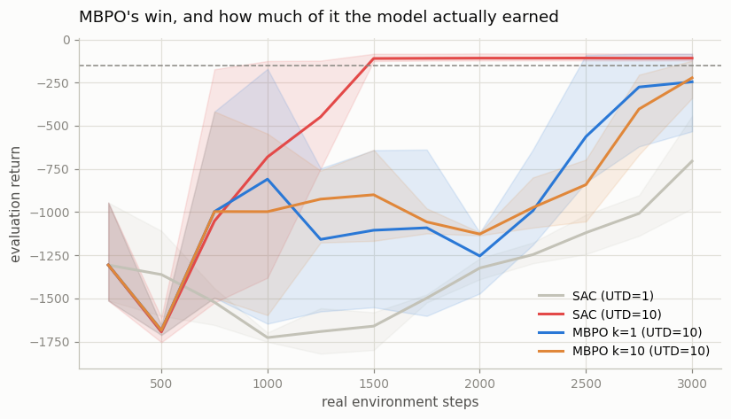
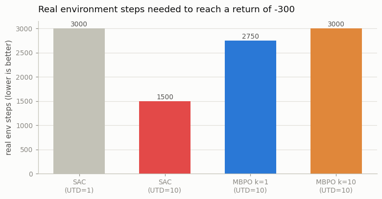

# Mini MBPO

## Key Insight

[MBPO](/shared/glossary/#mbpo) (Model-Based Policy Optimization) is the [Dyna](/shared/glossary/#dyna) idea done carefully: train a [dynamics model](/shared/glossary/#dynamics-model), use it to generate short synthetic [rollouts](/shared/glossary/#rollout), and mix those fake transitions into the [replay buffer](/shared/glossary/#experience-replay) that an [off-policy](/shared/glossary/#off-policy) learner like [SAC](/shared/glossary/#sac) trains on. The key design choice is keeping the model rollouts very short — often a single step — because model error compounds with every imagined step, so a short rollout branched from a real state stays trustworthy while still multiplying the data the policy learns from. The payoff is a large [sample-efficiency](/shared/glossary/#sample-efficiency) win: the agent reaches a good policy in far fewer real environment steps than a purely [model-free](/shared/glossary/#model-free-rl) baseline, which is exactly what [model-based RL](/shared/glossary/#model-based-rl) promises.

---

## What's in this directory

| File | Role |
|------|------|
| `mbpo.py` | All four arms below. [SAC](/shared/glossary/#sac) is imported verbatim from [project 26](../26-ddpg-on-pendulum/README.md); the [ensemble](/shared/glossary/#ensemble) model is imported verbatim from [project 32](../32-pets-random-shooting-mpc/README.md). Nothing is re-implemented, so a difference between the arms cannot be a difference in the code. |

```bash
python3 mbpo.py       # ~6 min on 12 hyperthreads
```

## A completely different way to spend a model

[Projects 32](../32-pets-random-shooting-mpc/README.md) and
[33](../33-cem-mpc/README.md) used the model to **plan**: no policy at all, just a fresh
search at every step. MBPO uses it the other way round. There *is* a policy — SAC,
unchanged from Phase 5 — and the model's only job is to **manufacture training data** for
it.

```
  real environment  ──▶  real transitions  ──▶  [real buffer]  ──┐
                                │                                │
                                ▼                                │
                          dynamics model                         ▼
                                │                          SAC trains on
                                ▼                          a mix of both
        branch short imagined rollouts off real states           ▲
                                │                                │
                                └──▶  [model buffer]  ───────────┘
```

Why would this help? Because a real environment step is *expensive* (a robot moves, a
minute passes, a motor wears) while an imagined one is a matrix multiply. If the model is
any good, you can turn 1,000 real transitions into 100,000 training examples and let SAC
feast.

Two details make or break it.

**1. Rollouts are branched, and they are short.** Every imagined rollout *starts* from a
real state pulled out of the real buffer, then runs the model forward for just `k` steps.
It begins on solid ground and only has to stay honest briefly.
[Project 32 measured exactly how long that is](../32-pets-random-shooting-mpc/README.md):
the model's error is 0.003 at one step and 2.463 by thirty. A 1-step imagined transition
is very nearly true. A 30-step imagined trajectory is fan fiction. The naive alternative —
dreaming a whole episode from the start state, as classic [Dyna](/shared/glossary/#dyna)
would — teaches SAC to be brilliant inside a hallucination.

**2. Only 5% of each batch is real.** That looks absurd until you see what the real
transitions are *for*. They are not the training signal — the model data is. They are the
**anchor**: the one part of the batch the model cannot possibly be wrong about.

## The confound nobody controls for

Here is the thing about MBPO that made this project worth building. MBPO does **two** things
at once:

1. It adds model-generated data to the buffer.
2. It takes **far more gradient steps per real environment step** — a high
   [update-to-data ratio](/shared/glossary/#update-to-data-ratio), or UTD. Imagined data is
   cheap, so why not train harder on it?

Those are *different interventions*, and the literature routinely credits the first with the
work of the second. So this project runs **four** arms, not two:

| arm | model data? | gradient steps per env step |
|---|---|---|
| SAC (UTD=1) | no | 1 |
| **SAC (UTD=10)** | **no** | **10** |
| MBPO k=1 (UTD=10) | yes, 1-step rollouts | 10 |
| MBPO k=10 (UTD=10) | yes, 10-step rollouts | 10 |

The third row is the one everyone runs. **The second row is the one that decides whether
the third row means anything.** If MBPO only beats SAC-at-UTD-1, then the model did nothing
that a bigger `for` loop could not have done for free.

Every arm gets the same number of imagined *transitions* (4,000 per model refit), so the
`k=1` arm makes 4,000 one-step rollouts and the `k=10` arm makes 400 ten-step ones. The arms
differ only in **how deep into the dream** the data came from — never in how much of it
there is.

## The result



| arm | final return (3 seeds) | real steps to reach −300 |
|---|---|---|
| SAC (UTD=1) | −705 | **never** (in 3,000 steps) |
| **SAC (UTD=10)** | **−108** | **1,500** |
| MBPO k=1 (UTD=10) | −245 | 2,750 |
| MBPO k=10 (UTD=10) | −222 | 3,000 |



Read those rows in order, because the story reverses halfway down.

**The UTD ratio is a monster.** Going from 1 gradient step per env step to 10 takes SAC
from −705 (it never solves the task at all inside the budget) to −108 (solved, in 1,500
real steps). That is an enormous sample-efficiency win, and **it involves no model
whatsoever.** It is a `for` loop.

**And then the model makes things worse.** Adding imagined data on top of UTD=10 *slows the
agent down* — from 1,500 real steps to 2,750. Both MBPO arms are worse than the plain SAC
arm they are built on top of.

So on this task, the honest answer to "is it the model, or just more gradient steps?" is:
**it was just more gradient steps.** All of it. Had we run only the two arms everybody runs
(SAC at UTD=1, and MBPO), MBPO would have won by a mile and we would have credited the
model — and we would have been completely wrong.

## Why the model *loses* here (and where it would win)

This is not evidence that MBPO is a bad algorithm. It is evidence about **when its premise
holds**.

MBPO's premise is: *real data is the scarce resource.* It spends model error to buy more
data, and that is a good trade only when data is what you are short of.

On Pendulum at UTD=10, **SAC is not short of data.** It already squeezes a solved policy out
of 1,500 real transitions. There is nothing left for the model to buy — so the model's
errors are a pure tax. And it is a heavy one, because 95% of every batch is imagined, which
means 95% of SAC's gradient signal carries the model's approximation error. When the real
data was never the bottleneck, that is all cost and no benefit.

Where the trade *does* pay:

- **Real steps are genuinely expensive.** A physical robot, a chemistry experiment, a
  clinical trial. Trading model error for a 10x reduction in real interaction is obviously
  right when each real interaction costs an hour and a technician.
- **The task is hard enough that the model has room to help.** On MuJoCo locomotion
  (Hopper, Walker2d), model-free SAC needs hundreds of thousands of steps, and MBPO's
  published wins there are real.
- **You cannot simply crank UTD.** High UTD has its own pathology — the critic overfits its
  replay buffer and its estimates diverge — and the fixes for *that* are a research area of
  their own. On Pendulum, UTD=10 happens to be free. It is not free everywhere.

## The k=1 vs k=10 result agrees with project 32 (which is the surprise)

Theory says short rollouts should beat long ones, because model error compounds. Our
numbers say `k=1` (−245) and `k=10` (−222) are **indistinguishable** — the gap is well
inside the seed-to-seed spread, and if anything `k=10` is nominally ahead.

Do not file this as "the theory is wrong." Go back and look at what
[project 32 actually measured](../32-pets-random-shooting-mpc/README.md):

| steps imagined | model's error |
|---|---|
| 1 | 0.003 |
| **10** | **0.061** |
| 20 | 0.434 |
| 30 | 2.463 |

**At k=10, the error is still tiny.** The explosion happens after 15–20 steps, not before.
So on *this* model, on *this* task, a 10-step rollout is still basically truthful — and the
theory predicts, correctly, that it should therefore be fine.

The two projects corroborate each other. The compounding-error curve is not a warning that
"long rollouts are bad"; it is a *ruler* that tells you, for a given model, how long a
rollout you can afford. Here that budget is comfortably more than 10. On a harder task with
a worse model, it would be 1 or 2 — and then the k-penalty would bite exactly as advertised.

> **How to use this in your own work.** Do not pick `k` from a paper. Measure your model's
> compounding error, find the horizon where it turns up sharply, and stay well inside it.
> That number is a property of *your* model and *your* task, and it is cheap to measure.

## What to take away

1. **Always run the arm that isolates your intervention.** MBPO changes two things at once.
   Three of the four arms here exist solely to stop us from crediting the model for the
   `for` loop's work — and it turned out to be the `for` loop's work entirely.
2. **The update-to-data ratio is one of the strongest knobs in off-policy RL**, and it is
   nearly free. Before reaching for a world model, check whether you have simply been
   under-training on the data you already have.
3. **Imagined data is a trade: model error in exchange for more data.** It only pays when
   data is genuinely the thing you lack.
4. **Imagined data has a shelf life.** The model buffer here is a *ring* buffer that
   overwrites old fantasy. A transition dreamt at step 1,000 came from a bad model and a
   bad policy; leaving it in the buffer to poison batches at step 3,000 is a bug that costs
   real performance (it cost this project a rewrite).

Next: [project 35](../35-dreamer-v3-reproduction/README.md) stops mixing imagined data into
real data, and trains the policy on **nothing but** imagination.
