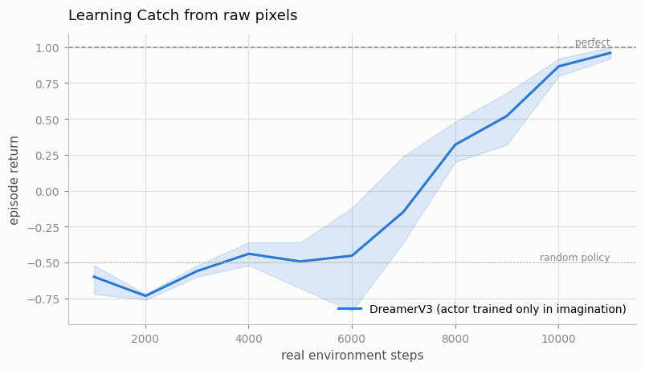
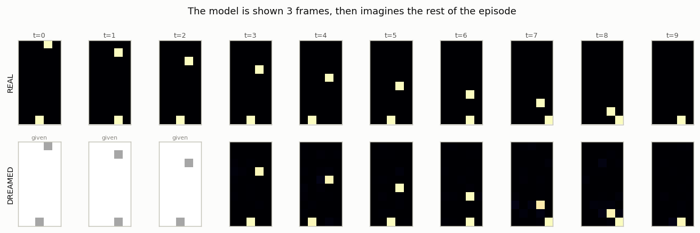
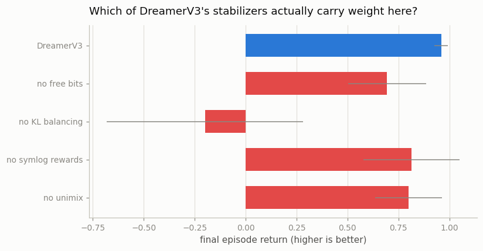

# Dreamer V3 Reproduction

## Key Insight

[DreamerV3](/shared/glossary/#dreamerv3) learns a compact [world model](/shared/glossary/#world-model) of the environment and then trains its [policy](/shared/glossary/#policy) almost entirely "in imagination" — rolling the policy forward inside the learned [latent dynamics](/shared/glossary/#latent-dynamics) instead of the slow, expensive real environment. Its claim to fame is generality: a single fixed set of hyperparameters clears tasks as different as [Atari](/shared/glossary/#atari) games and collecting diamonds in Minecraft, which had long been an open problem in RL where each task usually needs its own tuning. Reproducing it on a custom environment is the best way to feel how much work the [model-based](/shared/glossary/#model-based-rl) world model does and how few knobs you actually have to touch.

---

## What's in this directory

| File | Role |
|------|------|
| `dreamer.py` | The custom environment, the [RSSM](/shared/glossary/#rssm) world model, the imagination-trained [actor-critic](/shared/glossary/#actor-critic), and the ablations. |

```bash
python3 dreamer.py    # ~8 min on 12 hyperthreads
```

## The premise: the agent learns to act inside its own head

```
   real env  ──▶  a few thousand frames  ──▶  world model
                                                   │
                                                   ▼
                                        millions of imagined frames
                                                   │
                                                   ▼
                                            actor + critic
```

The actor in this project **never sees a real frame. Not once.** Every gradient it receives
comes from [rollouts](/shared/glossary/#rollout) imagined inside the learned latent space.
The real environment is used for exactly two things: collecting frames to train the world
model, and telling us the score at the end.

Compare this with the rest of Phase 6.
[Projects 32](../32-pets-random-shooting-mpc/README.md) and
[33](../33-cem-mpc/README.md) used the model to *plan* — no policy at all, a fresh search
every step, which is slow at decision time.
[Project 34](../34-mini-mbpo/README.md) used the model to *top up* a real replay buffer.
Dreamer goes all the way: the model **replaces** the environment for learning purposes, and
the resulting policy is a plain feedforward network that acts instantly, with no search.

## The custom environment: Catch

A paddle at the bottom, a ball falling one row per step from a random column, on a
**10x5 grid of raw pixels**. Move left, right, or stay. The agent sees only the pixels — it
is never told where the ball is.

```
 . . X . .        the ball (X) falls one row per step
 . . . . .
 . . . . .        the paddle (P) moves left/right/stay
 . . . . .
 . . P . .        catch it: +1     miss it: -1     every other step: 0
```

Two properties make this a real test rather than a toy.

**It is a [credit assignment](/shared/glossary/#credit-assignment) problem.** The reward
arrives *only* on the final frame. Every other step pays exactly zero. So the agent must
connect a +1 at step 9 back to the paddle nudges it made at steps 1 through 8. This is
precisely where a world model helps: the ball's motion is a **dense, easy signal available
in every single frame**, while the reward is a rare one. The model learns physics from the
dense signal, and the actor then trains against the model instead of groping for a reward it
sees once per episode.

**The agent must discover objects from pixels.** Nothing tells it there is such a thing as a
ball, that balls fall, or that the paddle should be under it. It has 50 numbers per frame.

## The world model: why the latent has two halves

The [RSSM](/shared/glossary/#rssm) (Recurrent State-Space Model) splits its latent state in
two, and the split is the single most important design decision in the Dreamer family:

| part | what it is | what it is for |
|---|---|---|
| **`h`** (deterministic) | a [GRU](/shared/glossary/#gru)'s hidden state | **remembering**: *"the ball has been falling on the left for three frames"* |
| **`z`** (stochastic) | a sample from a learned distribution | **guessing**: *"the ball started in column 3"* — nothing in the past could have told you that, so it must be *sampled*, not computed |

Neither half works alone. A purely deterministic model cannot represent genuine uncertainty,
so when several futures are possible it predicts their **average** — a blurred ball smeared
across two places at once, which is a picture of nothing that can ever happen. A purely
stochastic model forgets. Together: **`h` remembers, `z` guesses.**

During training, two distributions over `z` are computed at every step:

- the **posterior**, which is allowed to look at the current frame, and
- the **prior**, which is not.

The [KL divergence](/shared/glossary/#kl-divergence) between them is the loss that teaches
the prior to *predict the future* — and that matters enormously, because **during
imagination the prior is all the model has.** There are no frames in a dream.

## Result 1: it learns Catch from pixels



| | final return (3 seeds) |
|---|---|
| a random policy | ≈ −0.5 |
| **DreamerV3 (this project)** | **+0.96** (+0.92, +1.00, +0.96) |
| perfect play | +1.00 |

Near-perfect, from raw pixels, in about 11,000 real frames — with an actor that never once
looked at a real frame.

## Result 2: look inside the dream

This is the part worth staring at. Show the model **three real frames**, then close its eyes:
feed it only the actions, and let it roll its own prior forward and decode each imagined
latent back into pixels.



Top row: what really happened. Bottom row: what the model **imagined** would happen, given
only the first 3 frames.

From `t=3` onward the model is receiving **no pixels whatsoever**. Every frame it draws is
hallucinated from its own previous hallucination. And it is *right*: the ball keeps falling
one row per step, on the correct diagonal, the paddle responds correctly to each action, and
at `t=9` the two arrive on the same square — a catch, correctly imagined six steps before it
happened.

> **Mean per-pixel error of the imagined frames: 0.0042.** On pixels that are 0 or 1, that is
> essentially exact.

Nobody told this model that there is a ball, that it falls at one row per step, or that
"left" moves the paddle left. It learned all of it from 50 numbers a frame and a
[KL divergence](/shared/glossary/#kl-divergence).

## Result 3: which of DreamerV3's famous tricks actually matter?

DreamerV3's headline claim is generality — *one* hyperparameter setting for hundreds of
tasks. That generality is bought with a handful of stabilizing tricks. So switch each one
off and see which are load-bearing.



| variant | final return (3 seeds) |
|---|---|
| **DreamerV3 (all tricks on)** | **+0.96** |
| no [free bits](/shared/glossary/#free-bits) | +0.69 |
| **no KL balancing** | **−0.20** (+0.48, −0.52, −0.56) |
| no [symlog](/shared/glossary/#symlog) rewards | +0.81 |
| no unimix | +0.80 |

**KL balancing is the one that is holding everything up.** Remove it and the agent collapses
to *worse than random* on two of three seeds.

Here is why. The KL term has **two jobs that pull in opposite directions**:

1. drag the **prior** toward the posterior — *"learn to predict what you're about to see"*
2. drag the **posterior** toward the prior — *"don't smuggle in detail you couldn't have
   predicted"*

Written as one symmetric term, job 2 wins. The cheapest way to make the KL small is for the
posterior to stop encoding anything at all and simply agree with the lazy prior. The latent
goes empty, and the whole model quietly dies —
[posterior collapse](/shared/glossary/#posterior-collapse), the classic failure of every
latent-variable model. KL balancing gives the two directions **separate weights** (mostly
train the prior, only gently regularize the posterior), and a `detach()` is what splits
them. It is two lines of code and it is the difference between +0.96 and −0.20.

**Free bits** ([+0.69 without](/shared/glossary/#free-bits)) attacks the same disease from
the other side: ignore the KL entirely while it is below 1 nat, so the model is not punished
for using a modest amount of information. Think of it as an expense allowance — you are not
nagged about spending until you exceed it, so you actually spend what you need.

### The interesting null: symlog barely matters here, and that is exactly right

Turning off [symlog](/shared/glossary/#symlog) costs almost nothing (+0.81 vs +0.96, well
inside the seed spread). Do **not** conclude that symlog is useless.

Symlog compresses reward magnitudes so that one [learning rate](/shared/glossary/#learning-rate)
can serve a game paying `0.01` and a game paying `10,000`. **Catch pays exactly +1 or −1.**
There is no scale problem for symlog to solve, so it does nothing — and it *should* do
nothing.

> This is a trap worth naming, because a single-task benchmark will fall into it every time.
> Symlog's entire purpose is to make one hyperparameter setting work **across** tasks with
> wildly different reward scales. That benefit is, by construction, **invisible to any
> experiment run on one task**. An ablation can only measure what varies inside it. Here,
> reward scale does not vary — so this ablation is structurally incapable of detecting
> symlog's value, and a "0.15, within noise" result is not evidence of anything.
>
> To actually test symlog you would have to do what DreamerV3 did: run the same
> configuration, unchanged, over a hundred tasks with wildly different reward scales, and
> count how many it clears.

## What to take away

1. **A world model turns a sparse reward into a dense one.** Catch pays out once per episode,
   but the ball's motion is visible in every frame. The model learns from the dense signal;
   the actor then learns from the model. That is the deepest reason model-based RL helps.
2. **`h` remembers, `z` guesses.** A latent that is only deterministic will blur across
   possible futures; one that is only stochastic will forget. The split is the design.
3. **The KL term is a negotiation between two opposing forces, and if you let it run
   symmetrically the destructive one wins.** KL balancing and free bits are both defences
   against posterior collapse, and here they are worth 1.16 return between them.
4. **An ablation can only see what varies inside it.** Symlog looked worthless in this
   experiment because the experiment held reward scale fixed — the one thing symlog exists
   to handle. Before reporting "component X does nothing", ask whether your setup even
   contains the problem X was built to solve.

Next: [project 36](../36-mini-muzero/README.md) drops the decoder entirely — a world model
that never reconstructs anything and plans anyway.
