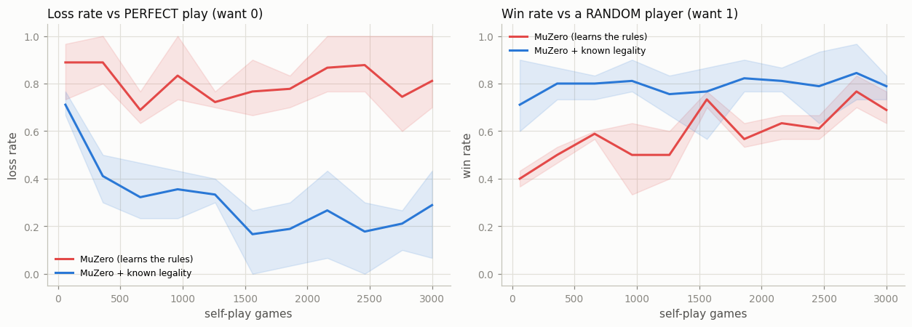
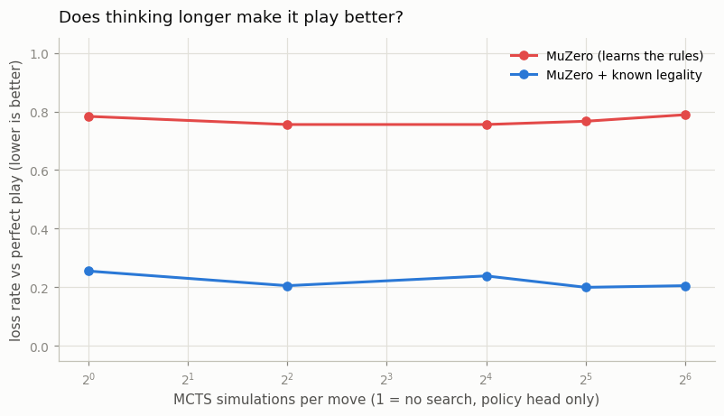
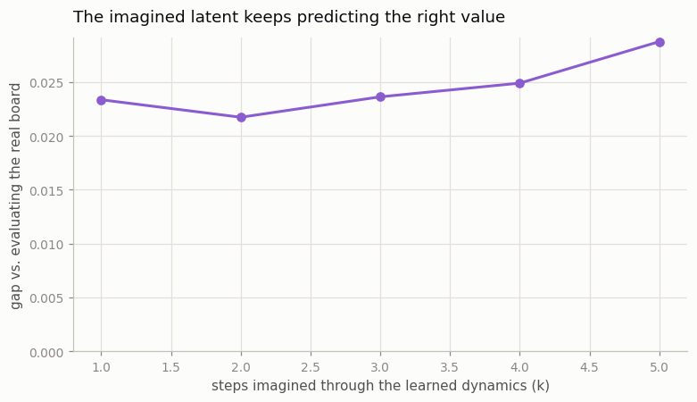

# Mini MuZero

## Key Insight

[MuZero](/shared/glossary/#muzero) combines [Monte Carlo Tree Search](/shared/glossary/#mcts) with a learned [dynamics model](/shared/glossary/#dynamics-model) that predicts only what matters for decisions — reward, [value](/shared/glossary/#value-function), and [policy](/shared/glossary/#policy) — without ever reconstructing the actual game board, which is why the same algorithm works on [Atari](/shared/glossary/#atari) pixels as well as board games. 

Implementing it on a tiny game like [Tic-Tac-Toe](/shared/glossary/#tic-tac-toe) or 4×4 [Connect Four](/shared/glossary/#connect-four) exposes its three coupled neural network heads, which collaborate to let the agent plan ahead entirely in its mind:

*   **[Representation function](/shared/glossary/#representation-function-muzero) (or Representation head):** This translates raw inputs (like game screens or board coordinates) into a clean, abstract [latent state](/shared/glossary/#latent-space) containing only details relevant to winning. *Analogy: A chess master looking at a board does not care about the wood grain of the pieces or the glare of the lights; they represent the board abstractly in their mind as "castled king" or "weak center."*
*   **[Dynamics head](/shared/glossary/#dynamics-head-muzero):** This takes a latent state and a proposed action, and predicts the *next* latent state and any immediate [reward](/shared/glossary/#reward-function). *Analogy: When planning a move in your head, you think "if I slide my rook here (action), the position in my mind will change (next state) and I will capture their bishop (reward)."*
*   **[Prediction head](/shared/glossary/#prediction-head-muzero):** This looks at any latent state (real or imagined) and immediately predicts the policy (which moves are best to try) and value (the chance of winning). *Analogy: A seasoned player looks at a board layout and has a gut feeling: "I have about an 80% chance of winning from here (value), and my best next move is probably to advance my pawn (policy)."*

The "Zero" in the name marks its descent from [AlphaZero](/shared/glossary/#alphazero), which ran the same search-plus-learning loop but was handed the real game rules; MuZero learns the rules instead.

---

## What's in this directory

| File | Role |
|------|------|
| `muzero.py` | The game, the three heads, the [MCTS](/shared/glossary/#mcts), the training loop, and a perfect [minimax](/shared/glossary/#minimax) opponent to test against. |

```bash
python3 muzero.py     # ~5.5 min on 12 hyperthreads
```

## What is actually missing from this model

Look at the three heads again and notice what is **not** there: **a decoder.**

Nothing in this file ever turns a [latent](/shared/glossary/#latent-space) `s` back into a
board, and nothing ever checks that it could. `s` is not a board. It is not a compressed
board. It is not required to resemble a board in any way. It is whatever internal scratchpad
makes the *predictions* — policy, value, reward — come out right. All three heads are
trained end-to-end through the search, so they are free to agree on any private language
they like.

That is the last step in the "Zero" lineage. [AlphaZero](/shared/glossary/#alphazero) was
handed the rules of the game and searched with them. MuZero is handed **nothing**, and
learns a rule-like thing that is only ever required to be right about the things a decision
depends on.

### The recurrence, which is the thing to actually see

Training does not fit the three heads separately. It **unrolls** them:

```
   real board ──h──▶ s₀ ──┬──f──▶ (policy₀, value₀)   ⟵ must match the real game at ply t
                          │
                    a₀ ──g──▶ s₁ ──┬──f──▶ (policy₁, value₁, reward₀)  ⟵ ...at ply t+1
                                   │
                             a₁ ──g──▶ s₂ ──f──▶ (policy₂, value₂, reward₁) ⟵ ...at ply t+2
```

Encode a real board **once**, then run the dynamics head `g` forward K times *on its own
output*, and demand that the prediction heads keep matching the real game at every one of
those imagined steps. The model is never asked to reconstruct anything — only to stay
*predictive* after k steps of imagination. That is the entire training signal, and it is
why the three heads end up sharing one representation instead of learning three.

## Two experiments in one, because the first one failed

The honest history of this project: the pure MuZero implementation **learned to play badly
and its search did not help at all.** Rather than tune it until the numbers looked nice,
the failure turned out to be the most instructive thing here — so the project now runs two
variants and compares them.

The difference is a single flag, and it is a flag about **the rules**:

| variant | what the tree knows below the root |
|---|---|
| **MuZero (learns the rules)** | Nothing. It does not know which moves are legal, or that the game can end. Real MuZero. |
| **MuZero + known legality** | Legal moves only; stop at a finished game. The *dynamics is still learned* — only legality and termination are given. |

The second variant is not AlphaZero: the latent transitions still come from the learned
dynamics head `g`. It isolates exactly one thing — **what does not knowing the rules cost
you?**

## Result 1: not knowing the rules is enormously expensive



Three [seeds](/shared/glossary/#seed) each, 3,000 self-play games. The opponent for the
left-hand chart is a **perfect [minimax](/shared/glossary/#minimax) player**, so a *draw* is
the best result obtainable and the number to drive to zero is the **loss rate**.

| variant | loses to perfect play | **draws** perfect play | beats a random player |
|---|---|---|---|
| MuZero (learns the rules) | **0.81** | 0.19 | 0.69 |
| **MuZero + known legality** | **0.29** | **0.71** | 0.79 |

Told which moves are legal, the agent holds a perfect player to a draw **71% of the time**.
Left to learn legality for itself, on the same budget, with the same network, it gets
crushed in 81% of games.

## Result 2: the search is doing *nothing* (and here is why)

Now freeze the weights and only change how long the agent is allowed to think. `1` means the
search is switched off entirely and the raw policy head plays.



| simulations per move | MuZero (learns rules) | MuZero + known legality |
|---|---|---|
| 1 (no search) | 0.78 | 0.26 |
| 4 | 0.76 | 0.21 |
| 16 | 0.76 | 0.24 |
| 32 | 0.77 | **0.20** |
| 64 | 0.79 | 0.21 |

Read the middle column top to bottom. **Sixty-four times more thinking buys exactly
nothing** — 0.78 with no search at all, 0.79 with 64 simulations. The search is a very
expensive way to reproduce the policy head's opinion.

That should alarm you, because a working "Zero" algorithm is *defined* by search making the
network better. The search is supposed to be a stronger player than the network that powers
it — that is the whole improvement operator:

> the network proposes, the search disposes, and the network is then trained to imitate the
> search. Because the search plays better than the raw network, imitating it makes the
> network better, which makes the next search better still.

If search does not beat the raw policy, that engine has stalled.

### Why the tree is poisoned

Below the root, MuZero does not know what is legal. So it happily plans moves like *"play on
the square my opponent already occupies."*

And now the trap springs. Self-play **never makes an illegal move** (legality *is* masked at
the root, where the real board is available). So the dynamics head `g` has **never once been
trained on an illegal transition**. Ask it what happens when you play on an occupied square
and it returns a latent from nowhere — untrained, unconstrained, meaningless. The value and
policy heads then read that meaningless latent and report meaningless numbers, and every
node beneath it inherits the nonsense.

With 9 actions and only a few moves played, most of the tree's branches are illegal, so
**most of the search budget is spent evaluating hallucinations**, and the root's statistics
are averaged over them. More simulations just means more hallucinations. That is precisely
what the flat line in the middle column is.

Real MuZero does not have this problem, and the reason is quantitative rather than
structural: with millions of games, the policy head drives the prior on illegal moves to
essentially zero, and [PUCT](/shared/glossary/#puct) then never selects them — the exploration
bonus is *multiplied* by that prior. The illegal branches are still there; the network has
simply learned to never look at them. Our network, after 3,000 games, has not learned that
yet.

> **The transferable lesson.** MuZero's generality is not free — it is *bought with data*.
> "Learn the rules from scratch" is a real capability and a real bill. When you cannot pay
> that bill, hand the model the structure you already have. A great deal of applied RL is
> deciding which invariants to hard-code and which to learn, and "we have the rules, so use
> them" is very often the right call.

Note also the right-hand column: **with legality known, search does help** — 0.26 with no
search down to 0.20 at 32 simulations. Modest, because Tic-Tac-Toe is small and the policy
head already handles most positions, but it is going the right way. The engine runs once you
stop feeding it garbage.

## Result 3: the latent really does stay predictive without ever being a board

This is MuZero's headline claim, and it survives intact.

Take a real board, encode it once with `h`, then imagine `k` moves forward using only `g`.
Now compare the value predicted **from that imagined latent** against the value predicted
from the **real board** at that point (which we can compute, because we still have the real
game sitting there).



| steps imagined | gap between imagined value and real-board value |
|---|---|
| 1 | 0.023 |
| 2 | 0.022 |
| 3 | 0.024 |
| 4 | 0.025 |
| 5 | **0.029** |

Values live in `[-1, +1]`, so a gap of 0.029 after **five** steps of pure imagination is
tiny — and, remarkably, **almost flat**. Compare this against
[project 32](../32-pets-random-shooting-mpc/README.md), where an observation-space model's
error grew by a factor of 800 over 30 steps.

Why is MuZero's imagination so much more stable? Because it is imagining **less**. Project
32's model had to predict the pendulum's actual coordinates, and any error in those
coordinates fed straight back in and grew. MuZero's dynamics head is never asked for the
board — only for a latent from which the *value* comes out right. It is free to discard
everything a decision does not depend on, and what you never model, you cannot get wrong.

> **Analogy.** Asked to predict a chess position 5 moves out, a grandmaster will not tell you
> the exact pixel layout of the board. They will say "I'm a pawn up with a safer king." That
> summary is *enough to decide with*, and it stays reliable far deeper than any attempt to
> render the exact position would.

This is the idea the guide's Key Insight for Phase 6 is pointing at, and the one the
frontier converged on: **model what you will be queried on, not everything.**

## What to take away

1. **The three heads are one model, trained through a recurrence.** Encode once, roll the
   dynamics forward on its own output, and supervise the predictions at every imagined step.
2. **Search is only an improvement operator if the model it searches over is sound.** Ours
   was not, below the root, and the search collapsed to a very expensive no-op. Always run
   the `sims=1` arm — if thinking longer does not play better, your search is searching a
   hallucination.
3. **Learning the rules from scratch is a real cost, paid in data.** MuZero's generality is
   magnificent at DeepMind scale and a liability at laptop scale. If you have the structure,
   use the structure.
4. **A model that predicts only what decisions need is far more stable under imagination**
   than one that predicts everything — 0.029 drift after 5 steps, against an 800x error
   explosion for an observation-space model over 30.

Next: [project 37](../37-td-mpc2-study/README.md) takes exactly that idea — a latent trained
only on what the decision needs — into continuous control.
