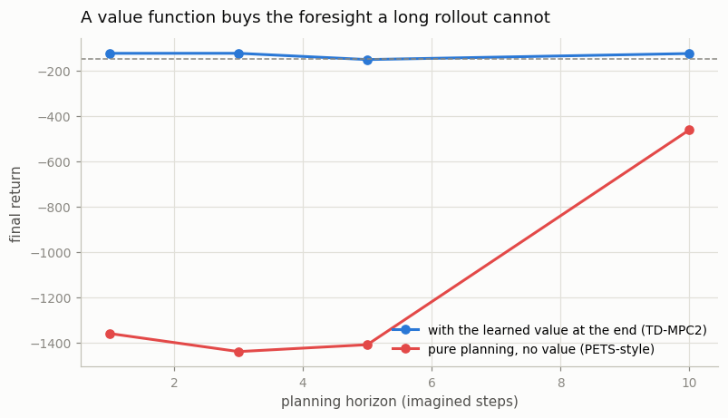
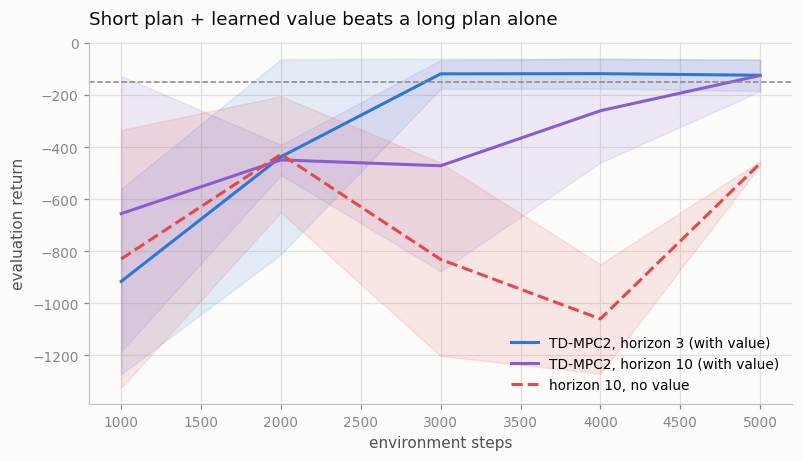

# TD-MPC2 Study

## Key Insight

[TD-MPC2](/shared/glossary/#td-mpc2) [plans](/shared/glossary/#planning) with a learned [dynamics model](/shared/glossary/#dynamics-model) over a short horizon and then bootstraps from a learned [value function](/shared/glossary/#value-function) beyond it — fusing the strengths of planning (precise short-term decisions) and value learning (cheap long-term foresight), with the [Cross-Entropy Method](/shared/glossary/#cem) doing the short-horizon action search. Crucially it plans in a learned [latent space](/shared/glossary/#latent-space) rather than over raw observations, so the model only has to be accurate about the features the value and policy actually use. With one fixed set of hyperparameters it masters the whole [DeepMind Control Suite](/shared/glossary/#deepmind-control-suite-dmc) of [continuous-control](/shared/glossary/#continuous-control) tasks, making it the current frontier of [model-based RL](/shared/glossary/#model-based-rl) and a clean demonstration of why sharing representations between the model, value, and policy is what finally made model-based control competitive.

---

## What's in this directory

| File | Role |
|------|------|
| `tdmpc2.py` | A compact TD-MPC2: encoder, latent dynamics, reward head, twin Q, policy — plus the horizon x value-bootstrap sweep that *is* the paper's argument. |

```bash
python3 tdmpc2.py     # ~7 min on 12 hyperthreads
```

## The equation, and why every term is there

[Project 32](../32-pets-random-shooting-mpc/README.md) ended on a warning, measured in
numbers: an imagined trajectory is accurate for about 3 steps, usable for 10, and pure
fiction by 30. PETS responds to this by planning 15 steps anyway and hoping. TD-MPC2
responds by **not planning far at all:**

```
score(a₀…a_H) =  Σ γᵗ · R(z_t, a_t)   +   γ^H · Q(z_H, π(z_H))
                 └────────────────┘       └──────────────────┘
                   imagined, 3 steps       learned, everything after
                   (the model is still     (fitted on REAL returns;
                    honest this far)        imagines nothing)
```

Plan **3 steps** with the model — the range where it is still telling the truth — and hand
**the entire rest of the future** to a learned [Q-function](/shared/glossary/#q-learning),
which was trained on real data and never has to imagine anything at all.

The division of labour:

- **Planning** gives precise short-term decisions. It can react to the exact state you are
  in right now, which a policy trained on averages cannot.
- **The value function** gives cheap long-term foresight. It summarizes "everything after
  step 3" in one number, at no rollout cost and with no compounding error.

Neither could do the job alone, which is exactly what the experiment below shows.

## The second idea: a latent that only models what it will be asked

Nothing in this file ever asks the model to predict what the pendulum will *look* like.
There is no decoder and no reconstruction loss. The encoder is trained **only** by the
reward, value, and consistency losses — so the [latent space](/shared/glossary/#latent-space)
is shaped by what the *decisions* need and by nothing else.

Compare with PETS, where the model is fit in a vacuum by maximum likelihood over states,
and the planner simply has to live with whatever representation that produced. If a state
variable is hard to predict but irrelevant to the reward, PETS burns capacity on it anyway.
TD-MPC2 does not, because nothing in its loss ever mentions it.

This is the same insight as [MuZero's](../36-mini-muzero/README.md), transplanted into
continuous control — and [project 36 measured what it buys](../36-mini-muzero/README.md):
a latent trained only on decision-relevant quantities drifted by 0.029 after 5 imagined
steps, while project 32's observation-space model blew up by a factor of 800 over 30. What
you never model, you cannot get wrong.

> **The consistency loss is where this could quietly go wrong.** The dynamics head is
> trained to make its imagined next latent match the *target encoder's* latent of the state
> that really came next. Notice that both sides of this loss are things the network
> produces. It could therefore satisfy the loss perfectly by mapping every observation to
> the same constant vector — a collapse to a single point, zero loss, zero information.
> The [target network](/shared/glossary/#target-network) is what stops that: one side of
> the comparison is a slow-moving copy, so the encoder cannot chase its own tail. This is
> the same trick, for the same reason, that made [DQN](/shared/glossary/#dqn) stable.

## The experiment: horizon x value bootstrap

Two knobs, everything else fixed, 2 [seeds](/shared/glossary/#seed) each:

- **planning horizon** ∈ {1, 3, 5, 10} — how many steps the model imagines.
- **value bootstrap** ∈ {on, off} — with it off, the `γ^H · Q(...)` term is deleted and the
  agent scores plans by imagined reward alone. That is PETS-style pure planning, running
  inside the very same code.



| planning horizon | **with** the learned value | **without** it (pure planning) |
|---|---|---|
| 1 | **−124.8** | −1360.3 |
| **3** | **−124.7** | −1439.8 |
| 5 | −152.3 | −1409.4 |
| 10 | −125.7 | −463.1 |

(A random policy scores about −1,200; roughly −150 is "solved".)

Look at the two columns. They are not describing the same algorithm.

**With the value, every horizon works** — including a horizon of **one**. **Without it,
every short horizon fails catastrophically**, scoring at or below random.

## Why pure planning fails so badly here

Pendulum is not a task you can win by being greedy. The motor is too weak to lift the pole
directly. You must first swing *away* from the goal, build momentum, and only then swing up.
The reward for those early backswings is **worse** than doing nothing.

So a planner that can only see 3 steps of imagined reward looks at the backswing, sees the
reward getting worse, and refuses. It sits at the bottom, twitching, forever. It is not
badly optimized — it is **myopic**. It cannot see far enough for the good part to appear
inside its window.



Watch the "no value" column improve as the horizon grows: −1439 at horizon 3, −463 at
horizon 10. **The fix for myopia is a longer horizon** — and this is precisely the trap
Phase 6 has been walking toward. To see the swing-up, a pure planner needs a horizon of
30-50 steps. And [project 32 measured what a 30-step imagined rollout is worth](../32-pets-random-shooting-mpc/README.md):
an error of **2.463**, on a state whose components live in `[-1, 1]` and `[-8, 8]`. The
plan is fiction long before it is long enough to be useful.

**Pure planning is caught in a vice.** Too short, and it cannot see the reward. Too long,
and the model it is seeing it through is a hallucination.

The learned value function is the way out. `Q(z_H, π(z_H))` already knows that a backswing
leads somewhere good — not because it imagined the swing-up, but because it was **fitted on
real returns** where the swing-up actually happened. It compresses a 200-step future into
one number, exactly, at zero rollout cost. The agent gets long-term foresight without a long
imagination.

> **Analogy.** Planning a drive across a country. You can plan the next three turns
> precisely, because you can see them. You cannot plan all 400 turns — your mental map is
> not that good, and errors compound. So you plan three turns in detail, and for everything
> beyond that you consult a *value*: "head toward the motorway; it's roughly 4 hours from
> there." You never simulate those 4 hours. You just need a reliable number for them, and
> the number came from experience, not imagination.

## The honest null: on Pendulum, the planning adds nothing

Now read the first column downward, carefully. Horizon 1 scores −124.8. Horizon 3 scores
−124.7. Horizon 10 scores −125.7. **They are identical.**

At horizon 1 with a value bootstrap, "planning" is a one-step lookahead against a learned
Q-function — which is, almost exactly, what a model-free
[actor-critic](/shared/glossary/#actor-critic) already does. So the honest summary of this
chart is:

> **On Pendulum, the learned value is doing 100% of the work, and the planning is doing
> none of it.**

That is the third time this phase has produced this shape of result, and it is not a
coincidence. [Project 33](../33-cem-mpc/README.md) found that a better *search* changed
nothing on Pendulum. [Project 34](../34-mini-mbpo/README.md) found that model-generated
*data* changed nothing on Pendulum. Now a deeper *plan* changes nothing on Pendulum either.

Pendulum is a 3-dimensional state and a 1-dimensional action. **SAC already solves it, and
solves it well.** There is no headroom for sophistication to occupy, and every sophisticated
method in this phase degenerates gracefully to "about as good as a good model-free method",
which — given the extra machinery — is the correct and expected outcome.

Where TD-MPC2's planning does earn its keep is where the paper claims it: high-dimensional
continuous control (the 20-plus joints of a humanoid), where the action space is far too
large for a policy network to have covered every corner, and where a short online search
around the policy's suggestion finds actions the policy alone would never emit. Our
[project 33 horizon sweep](../33-cem-mpc/README.md) is the miniature preview of exactly
that: the value of search grows with the dimension of the space being searched.

## Design details worth stealing

- **The policy seeds the search.** A slice of the CEM population is generated by rolling the
  learned policy forward, rather than sampled from noise. This means the planner starts from
  a competent guess instead of rediscovering competence at every timestep — and it also
  guarantees the planner can never be much *worse* than the policy alone.
- **Warm starts.** The plan from the last timestep, shifted forward one step, initializes
  this timestep's search. The world moved 0.05 seconds; the old plan is an excellent first
  guess, and this buys roughly a free CEM iteration.
- **Twin Q with a minimum**, straight from TD3/SAC in Phase 5. [Project 26](../26-ddpg-on-pendulum/README.md)
  measured why: a single critic, maximized over actions, is a machine for locating its own
  most optimistic errors. A planner is an even more aggressive maximizer than an actor, so
  it needs that protection more, not less.
- **Deeper imagined steps are weighted less** (`rho = 0.5` per step) in the loss. The model
  is less trustworthy the further it imagines, so it is asked to be correct there less
  insistently.

## What to take away

1. **A value function is a plan of infinite length that costs nothing to roll out.** That is
   the entire trick. Everything TD-MPC2 does downstream follows from it.
2. **Short horizon + learned value beats long horizon alone, and it is not close** — −125
   against −463, and against total failure at short horizons.
3. **Pure planning is caught in a vice** between myopia (too short to see the reward) and
   hallucination (too long for the model to be true). The value function is the escape.
4. **Sophistication needs headroom.** Three separate projects in this phase found their
   clever component doing nothing on Pendulum. That is a fact about Pendulum, not a
   refutation of the components — but you only get to say that because you *measured* it
   rather than assumed it.

This closes Phase 6. The through-line, from PETS to TD-MPC2, is a steady retreat from asking
the model to do too much: model fewer steps, model fewer variables, and let something
fitted on reality carry the rest.
