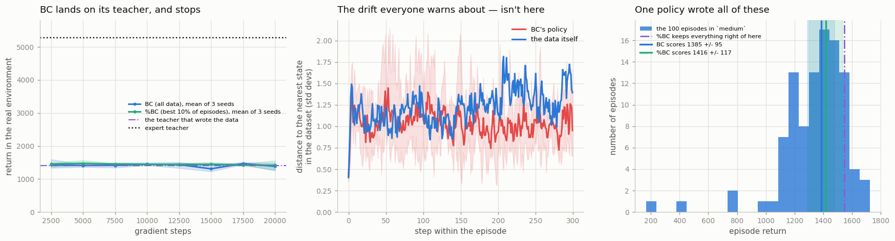

# BC Baseline on D4RL

## Key Insight

[Behavior cloning](/shared/glossary/#bc) is the most basic thing you can do with a fixed dataset of past experience: throw away the rewards, treat each recorded state as an input and the action the dataset's [behavior policy](/shared/glossary/#behavior-policy) took as the correct label, and train a [policy](/shared/glossary/#policy) by plain [supervised learning](/shared/glossary/#supervised-learning) to reproduce those actions. Run on a [D4RL](/shared/glossary/#d4rl)-style `medium` task — a [HalfCheetah](/shared/glossary/#halfcheetah) locomotion dataset — it gives you a [return](/shared/glossary/#return) number that every fancier [offline RL](/shared/glossary/#offline-rl) method must beat to justify its complexity. Why it matters: when the dataset was collected by a strong expert, simply copying it is hard to beat, so [imitation learning](/shared/glossary/#imitation-learning) by BC is the honest yardstick you always measure first — skip it and you risk celebrating a complicated algorithm that never actually outperformed "just copy the data."

---

## What's in this directory

| File | Role |
|------|------|
| `make_teachers.py` | Builds the three [behavior policies](/shared/glossary/#behavior-policy) that generate every Phase 7 dataset. **You do not need to run it** — the weights are committed. |
| `offline_lib.py` | The shared Phase 7 core: the datasets, the four algorithms, the scoring. Projects 39-41 and 43 all import it. |
| `bc.py` | This project: BC, %BC, and two measurements that test what "everyone knows" about BC. |
| `teachers/*.pt` | The three frozen policies (~85 KB each). The datasets are rebuilt from these on first run. |

```bash
python3 bc.py     # ~3 min. The first run spends ~1 min building the datasets, then caches them.
```

## Phase 7 changes the rules

Every project from [project 12](../12-dqn-on-cartpole/README.md) to [project 37](../37-td-mpc2-study/README.md)
shared one privilege that was never spelled out: **when the agent wanted to know something, it
could go and find out.** Try the action. See what happens. Correct the estimate.

Offline RL takes that away. You are handed a file of recorded experience and may never touch the
environment again — except once, at the very end, to see how you did. This is not an artificial
restriction invented to make a benchmark harder. It is the *normal* situation wherever trying
things out is expensive, slow, or dangerous:

- **Medicine.** You have records of treatments and outcomes. You cannot give a patient a drug just to see what happens.
- **Recommendation.** You have logs of what was shown and what was clicked. Every "experiment" costs a real week of real users' attention.
- **Robot fleets.** You have a warehouse of driving logs. A single exploratory action costs a real crash.

In every one of those, the data was collected by *somebody else's* policy — a doctor, an old
recommender, a human driver — and your job is to do better than them using only their recordings.
That is exactly the setting this phase studies.

## Where the data comes from (and why not real D4RL)

The standard benchmark for this phase is [D4RL](/shared/glossary/#d4rl). We cannot use the real
thing: it is pinned to `mujoco-py`, a dead package that will not build against the
[MuJoCo](/shared/glossary/#mujoco) version installed here. So `make_teachers.py` rebuilds it, using
D4RL's own recipe:

> Train **one** agent with [SAC](/shared/glossary/#sac), freeze it at three moments in its life,
> and let each frozen copy drive the robot to record a dataset.

| teacher | what it is | its return |
|---|---|---|
| `random` | uniformly random joystick-shaking | **−235** |
| `medium` | SAC, stopped early on purpose (at 25k steps) | **1,409** |
| `expert` | SAC, trained to the end (75k steps) | **5,273** |

`medium` is stopped at roughly **one third** of expert performance. That is not a guess — it is
D4RL's actual definition of "medium," and the reason is that a third is where data is genuinely
mediocre: good enough to be worth learning from, bad enough that there is obvious room to improve.

> **Why HalfCheetah, when the guide's table names Walker2d?** Because we measured.
> [Project 28](../28-sac-on-a-mujoco-suite/README.md) ran SAC on five robot bodies on this same
> CPU and found that in a small budget it reaches 2,768 on HalfCheetah but only **374** on Hopper.
> Hopper gets *stuck*: standing still and collecting the survival bonus is safer than risking a
> fall, and a short run never escapes that trap. A teacher that never learned to move cannot be an
> "expert," and without a real expert the whole quality ladder this phase is built on collapses.
> HalfCheetah also cannot fall over, so every episode runs exactly 1,000 steps — differences in
> return are differences in the *quality of the running*, not in how long the robot stayed upright.

### The two ends of the ruler

Raw returns are unreadable. Is 1,385 good? You cannot say without knowing the task. So Phase 7
reports the [normalized score](/shared/glossary/#normalized-score), which puts every result on one
fixed ruler:

```
score = 100 x (your return − random return) / (expert return − random return)

    0  = no better than shaking the joystick at random
  100  = as good as the expert that recorded the data
```

Like grading an exam on a curve where 0 is what a random guesser gets and 100 is the class star's.
**A score above 100 is not a bug** — [project 43](../43-dataset-quality-study/README.md) produces one.

## What BC actually does

Delete the rewards. Keep the (state, action) pairs. Train a network to predict the action from the
state, with exactly the loss you would use to classify photos of cats:

```python
def _update_bc(self, batch):
    o, a, _, _, _ = batch                      # the rewards go straight in the bin
    loss = -self.actor.log_prob(o, a).mean()   # "make the data's action likely"
```

That is the whole algorithm. Notice what is **not** there: no [Q-function](/shared/glossary/#q-learning),
no [target network](/shared/glossary/#target-network), no [bootstrapping](/shared/glossary/#bootstrapping),
no [Bellman equation](/shared/glossary/#bellman-equation). Nothing that can explode — and
[project 39](../39-naive-q-learning-on-the-same-dataset/README.md) is about what happens when you
add something that can. That safety is exactly what BC trades its ceiling away for: it can never be
*better* than the hand that wrote the data, because "be like the data" is the entire objective.

## The results



Every number below is the mean of **three seeds**, with the seed-to-seed spread after the `±`.

|  | return | [score](/shared/glossary/#normalized-score) |
|---|---|---|
| random teacher | −235.0 | 0.0 |
| the data's average episode | 1,343.9 | 28.7 |
| **the teacher that wrote the data** | **1,409.1** | **29.8** |
| **BC** | **1,384.7 ± 94.8** | **29.4** |
| %BC (best 10% of episodes) | 1,416.0 ± 117.3 | 30.0 |
| expert teacher | 5,273.1 | 100.0 |

**BC lands on its teacher and stops.** 1,385 against the teacher's 1,409 — the two are the same
number, to within the noise. It reproduced the hand that wrote the data, which is what it was asked
to do and all it will ever do. The expert scores 5,273. BC is not "a bit short of the expert"; it is
at **29 out of 100**, and no amount of extra training will move it, because the thing it is
imitating is not the expert.

That number — **29** — is the bar. Every remaining project in this phase exists to beat it.

> **Why three seeds, for something this simple?** Because the first time this was run with one seed,
> BC scored 1,255 and %BC scored 1,559, and it looked as though filtering the data had bought a
> handsome 24% improvement. Re-running at a different training budget **reversed the ordering.**
> Neither run was buggy; the gap was simply smaller than the noise, and a single run cannot tell
> *"this method is better"* from *"this run got lucky."* BC costs under a minute, so there was no
> excuse for not measuring the noise. **Look at the shaded bands in the left panel: they overlap
> completely.** Keep this in mind for the rest of the phase — the differences that matter later are
> 10x bigger than this, which is exactly why they are safe to believe.

## Two things "everyone knows" about BC — and what the measurement says

### 1. "BC drifts off the data, and the errors compound." Not here.

The textbook argument: BC makes a tiny mistake, which puts it in a state slightly unlike anything in
the data, where its next action is a slightly worse guess, which puts it somewhere stranger still —
and the errors snowball until the agent is lost somewhere no dataset ever went.

So we measured it. At every step of an evaluation episode, `bc.py` computes the distance from the
state BC is standing in to the **nearest state anywhere in the 100,000-row dataset**. That is a
direct, literal measurement of "how far off the map am I?", in standard deviations.

```
distance to the nearest state in the dataset:   at step 10     at step 250
  BC's policy                                      1.13    ->     1.08      flat
  the data's own trajectories (for reference)      1.15    ->     1.62
```

**BC does not drift.** The distance barely moves — if anything it goes *down* — and BC ends up in a
*denser* part of the data than the data's own trajectories occupy (1.08 against 1.62). That is not a
paradox: BC plays the average action, and the average action leads to the most typical,
most-visited states. The middle panel above shows it — the red line (BC) never climbs away from the
blue line (the data).

The compounding-error story is real in general, but **it needs a cliff to fall off**, and
HalfCheetah has none. It cannot topple over, so a clumsy step costs a little reward and nothing
else. In a robot that *can* fall — Hopper, [Walker2d](/shared/glossary/#walker2d) — one bad step
ends the episode, and there the drift is fatal.

This matters more than it looks. Had we *assumed* the textbook answer, we would have written a
confident paragraph about compounding error and been wrong about this task. **BC's real limitation
here is not that it goes off the rails. It is that it stays exactly on them.**

### 2. "Some episodes are better than others — copy only those." Not measurably.

%BC (sometimes written 10%BC) is the cheapest imaginable use of the rewards: rank whole episodes by
return, throw away all but the best 10%, run plain BC on what is left. On real mixed-quality
datasets this is a strong and well-known baseline.

Here, it makes **no difference you can measure**:

```
  BC    1,385  ± 95     (seeds: 1255, 1419, 1480)
  %BC   1,416  ± 117    (seeds: 1559, 1272, 1417)
```

The gap is **+31**, and a single seed moves either number by up to **117**. There is no effect here —
only noise. (Note how much worse the temptation would have been with one seed: `1559` against `1255`
is a "24% win" for %BC, and it would have been a mirage.)

And the right-hand panel shows *why we should never have expected one*. All 100 episodes came from
**one single policy**. Their returns cluster tightly around 1,344 with a spread of only 17%, and
that spread is not a difference in *skill* — it is the same policy having a luckier or unluckier
day, because [SAC](/shared/glossary/#sac)'s actions are random samples.

So "the best 10% of episodes" is selecting for **good luck, not good behavior** — and luck does not
transfer to the next episode. It is like taking the ten highest scorers on a test where everybody
guessed at random, and asking them to teach the class.

> **When *does* %BC work?** When the episodes genuinely differ in skill — a dataset pooled from
> several policies of different quality (D4RL's `medium-replay` and `medium-expert` are exactly
> that). Then "the best 10%" really does select better *behavior*, and the filter pays for itself.
> The general lesson: **a filter can only select for a difference that actually exists in the data.**

## What to take away

1. **BC scores 29/100 here, and that is the bar.** Any offline-RL method that fails to beat 29 has bought you nothing but complexity.
2. **BC's ceiling is its teacher, by construction.** It got 1,385 from a teacher worth 1,409 — the same number — and it will never approach the expert's 5,273, because it was never shown the expert.
3. **Measure the noise before you believe a difference.** The BC-vs-%BC gap looked like a 24% win on one seed and vanished on three. If a result would change your mind, it deserves an error bar; if it wouldn't, it didn't need running.
4. **Run the baseline before you believe the paper.** Two things everyone says about BC turned out not to hold *on this task*, and the only reason we know is that we measured instead of assuming.
5. **A copier cannot exceed what it copies.** To beat 29, an algorithm has to do something BC structurally cannot: use the *rewards* to work out that some recorded actions were better than others, and prefer those. Every remaining project in this phase is a different way of doing that — and [project 39](../39-naive-q-learning-on-the-same-dataset/README.md) shows why the obvious way is a catastrophe.
