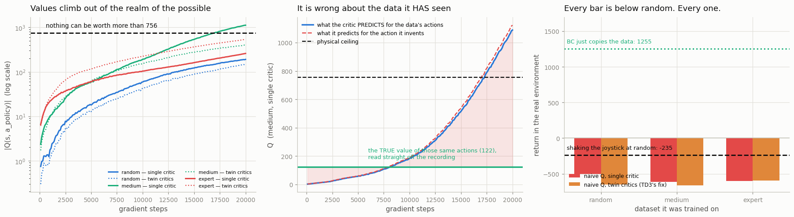

# Naive Q-Learning on the Same Dataset

## Key Insight

This project deliberately breaks [Q-learning](/shared/glossary/#q-learning) to show *why* [offline RL](/shared/glossary/#offline-rl) needs special algorithms. The bootstrapped target `r + γ·maxₐ′ Q(s′, a′)` picks the action with the highest predicted value — but on a fixed dataset that maximizing action is often one the [behavior policy](/shared/glossary/#behavior-policy) never tried, an [out-of-distribution](/shared/glossary/#out-of-distribution) action where `Q` has seen no data and is free to hallucinate a huge value. [Bootstrapping](/shared/glossary/#bootstrapping) then feeds that fantasy back into other targets, the errors compound (a far worse version of ordinary [overestimation bias](/shared/glossary/#overestimation-bias)), and the learned policy chases exactly those phantom high-value actions — so it scores well in training yet collapses on the real task. Watching the Q-values explode here makes the [distribution shift](/shared/glossary/#distribution-shift) problem concrete and motivates the pessimism and constraint tricks of [CQL](/shared/glossary/#cql) and [IQL](/shared/glossary/#iql).

---

## What's in this directory

| File | Role |
|------|------|
| `naive_q.py` | Ordinary Q-learning on a fixed dataset — run with and without TD3's protection, on all three datasets. |

```bash
python3 naive_q.py     # ~6 min: 6 runs in parallel, plus a BC reference
```

## The one line that ruins everything

Here is the target that every Q-learning method since [project 12](../12-dqn-on-cartpole/README.md)
has trained on:

```
target(s, a)  =  r  +  γ · max_a′ Q(s′, a′)
                            └────────────┘
                     "the best I could do from the next state"
```

**Online, `max` is safe.** If the critic wrongly believes some action is brilliant, the agent
*tries it*, the environment answers, the reward comes back small, and the estimate gets corrected.
The `max` is a hypothesis and the environment is the referee.

**Offline, the referee has gone home.** The `max` still hunts for the highest-valued action — but
now nothing can ever contradict it. And here is the cruel part:

> `max` does not look for the *best* action. It looks for the action with the **highest predicted
> value**. Those are the same thing only if the predictions can be trusted — and the predictions
> are *least* trustworthy exactly where there is no data.

So `max` is not a neutral search. It is a **magnet for the network's own mistakes**. Wherever the
critic has overshot — and an untrained network overshoots *somewhere*, always — the `max` seeks that
spot out and hands the inflated number back to the critic as a training target. The critic learns
to believe it. Next round, it overshoots further.

> **Analogy.** You must choose a restaurant using only reviews; you are not allowed to go and eat
> anywhere. Sensibly, you pick the highest-rated one. But some restaurants have exactly one review,
> written by the owner's brother — and *those* are the ones with five stars. **"Pick the highest
> rating" is a rule that systematically selects the least trustworthy entries**: the fewer real
> reviews a place has, the more easily it tops your list. Now imagine that each night you also
> *rewrite your notes* so they agree with today's pick. That last step is bootstrapping, and it is
> what turns a bad evening into a spiral.

## The experiment

The algorithm under test is not a weak one. It is the agent from
[project 27](../27-td3-on-halfcheetah/README.md) — the one that learned to run on this very robot.
Exactly one thing has changed: **it may not collect data.**

We run two versions, to separate two questions that are easy to confuse:

| version | what it is |
|---|---|
| **single critic** | Plain Q-learning. No protection of any kind. |
| **twin critics** | [TD3](/shared/glossary/#td3)'s famous fix: train *two* Q-networks and always believe the more pessimistic one. Online, this is **the** cure for over-optimistic values. |

And because our data is a recording, we have something online RL never gets: **the true answer.**
For every row in the dataset we can compute what `Q(s, a)` really was, by adding up what actually
happened next:

```python
G_t = r_t + γ·r_{t+1} + γ²·r_{t+2} + ...      # read straight off the tape
```

That is not an estimate — it is ground truth. It turns "hmm, the values look big" into a number.

## What happens



| dataset | protection | Q predicted for the **data's own** actions | the **true** value of those actions | return |
|---|---|---|---|---|
| random | single critic | 185.7 | −25.5 | **−499.2** |
| **medium** | **single critic** | **1,088.6** | **122.2** | **−615.7** |
| expert | single critic | 255.8 | 435.4 | **−600.1** |
| random | twin critics | 143.1 | −25.5 | **−649.7** |
| **medium** | **twin critics** | **391.6** | **122.2** | **−659.9** |
| expert | twin critics | 529.7 | 435.4 | **−596.8** |
| medium | *BC, for reference ([project 38](../38-bc-baseline-on-d4rl/README.md))* | — | — | **+1,255.3** |
| | *uniform-random teacher* | — | — | *−235.0* |

*(The BC row is this project's own seed-0 run. Project 38 reports 1,385 ± 95 across three seeds —
the difference does not matter here, because every naive-Q number is roughly **1,900 below** it.)*

Three findings, each worse than the last.

### 1. The values leave the realm of the possible

HalfCheetah never pays more than **7.56** in a single step. With `γ = 0.99`, the most any
state-action can *possibly* be worth is `7.56 / (1 − 0.99) = 756`. That is arithmetic, not opinion:
no correct Q-value can exceed it, ever.

The single-critic run on `medium` sails past it, finishing at **1,089** — a number describing
**something that cannot exist**. The left panel shows the crossing happen, at around 17,000
gradient steps.

Look at the *shape* of those curves, too: every one of the six is still climbing when the budget
runs out. Nothing has settled. **This does not converge to a wrong answer — it diverges**, and the
only reason the `random` and `expert` runs have not crossed the line yet is that we stopped
watching. (Give the `medium` run another 10,000 steps and it reaches 2,378 — we measured that too.)

### 2. The rot spreads to the actions it *has* seen

This is easy to miss, and it is the most important thing in the project.

You would expect the critic to be wrong about *unseen* actions but right about the ones in its
training data — those it was fit on directly. **It is not.** On `medium` with a single critic, it
values the data's own recorded actions at **1,089**, when the recording says they were worth
**122**. It is wrong by a factor of **9 about the very data it was trained on** (middle panel: the
blue prediction line climbing away from the flat green line of truth).

Why? Because the training target for those actions is `r + γ·Q(s′, a′_max)` — and *that* term
contains the fantasy. The critic is fit to a target built out of its own hallucination, so the
hallucination gets **laundered into** the values of real actions.

> **Bootstrapping is a pipe, and the poison flows both ways.** There is no clean corner of the
> Q-function to stand in. This is why "just trust it where there's data" is not a fix.

### 3. The resulting policy is worse than shaking the joystick

This is the headline, and it is completely uniform: **every single one of the six runs scores below
−499**, when the uniform-random teacher scores **−235** and BC scores **+1,255**. The right-hand
panel is six bars, and every one is buried under the "random" line.

It does not matter which dataset. It does not matter whether the data came from an expert. It does
not matter whether we used TD3's protection. **Six for six.**

This is not "offline RL is hard and we got a mediocre result." The agent has learned something
actively **worse than nothing** — it has taught itself to seek out precisely the actions its critic
is most confidently wrong about, and those actions are, physically, terrible.

## TD3's famous fix does not fix it

Read the two blocks of the table together. Twin critics **do** work as advertised *on the numbers*:
on `medium` they pull the predicted value down from 1,089 to 392 — a 2.8x improvement, exactly what
they were invented for, and enough to keep it under the physical ceiling.

**And the policy is no better at all** (−660, against −616 without them — if anything slightly
worse). Still far below random.

This is the finding that justifies the rest of Phase 7:

> **Twin critics treat the symptom. The disease is somewhere else.**
> Taking the minimum of two networks makes your estimate *less optimistic*. It does nothing about
> the fact that you are asking the question **at an action nobody ever tried**. Two networks that
> have never seen an action will produce two guesses about it — and the smaller of two guesses is
> still a guess.

You cannot fix this by being more careful with your numbers. You have to change **what you ask**.
The next two projects are the two ways to do that:

- **[Project 40 — CQL](../40-implement-cql/README.md)**: keep the `max`, but *punish* the critic for putting high values on actions that are not in the data. Fight optimism with a penalty.
- **[Project 41 — IQL](../41-implement-iql/README.md)**: don't punish the question — **delete** it. Never evaluate `Q` at an unseen action at all.

## What to take away

1. **`max` over a learned function is a machine for finding that function's own errors.** Online, reality corrects them. Offline, nothing does — and the errors *are* the training target.
2. **The damage is not confined to unseen actions.** Bootstrapping mixes the fantasy back into the values of real actions: 9x too high on the very data it was trained on.
3. **A strong online algorithm is not a strong offline algorithm.** TD3's twin critics — the standard, correct, effective cure for overestimation *online* — shrank the numbers 2.8x and left the policy exactly as broken. Offline RL is a genuinely different problem, not a harder version of the same one.
4. **We know all of this only because the dataset let us compute the truth.** Checking a value estimate against what actually happened is a luxury unique to the offline setting. Use it: it is the difference between "the curves look odd" and "you are wrong by a factor of 9."
