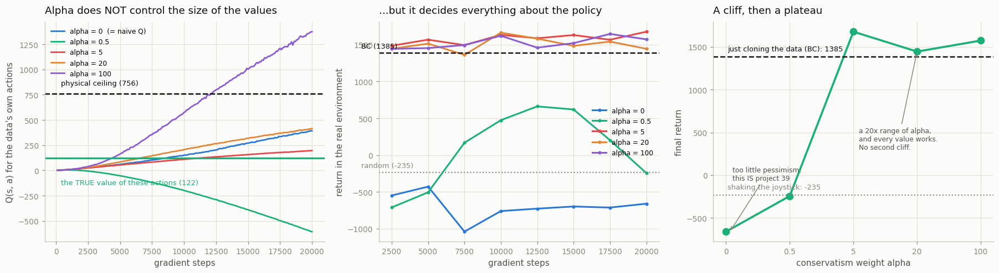

# Implement CQL

## Key Insight

[CQL (Conservative Q-Learning)](/shared/glossary/#cql) fixes the [out-of-distribution](/shared/glossary/#out-of-distribution) blow-up of naive [offline RL](/shared/glossary/#offline-rl) with one extra penalty bolted onto the normal [Q-learning](/shared/glossary/#q-learning) loss: it pushes *down* the predicted value of all the actions the network is tempted to overrate, while pulling *up* the value of the actions actually present in the dataset. The net effect is [pessimism](/shared/glossary/#pessimism) — the learned `Q` deliberately underestimates unfamiliar actions, so the policy stops chasing the fantasy high-value actions that wrecked naive Q-learning and stays near the [behavior policy](/shared/glossary/#behavior-policy)'s data. It is the value-pessimism counterpart to keeping the policy close to the data ([policy constraint](/shared/glossary/#policy-constraint)), and reproducing its [D4RL](/shared/glossary/#d4rl) numbers is the standard way to learn the approach.

---

## What's in this directory

| File | Role |
|------|------|
| `cql.py` | The conservative penalty, swept across five values of its one knob — from "no penalty at all" (which is [project 39](../39-naive-q-learning-on-the-same-dataset/README.md)) to "penalty so large the rest of the loss barely matters". |

```bash
python3 cql.py     # ~8 min: 5 values of alpha in parallel
```

## The whole idea, in one line of loss

[Project 39](../39-naive-q-learning-on-the-same-dataset/README.md) left us with a critic that
believed made-up actions were wonderful. CQL adds **one term** to the ordinary Q-learning loss to
argue with it:

```
loss  =  TD_error  +  alpha * [  logsumexp_a Q(s, a)   −   Q(s, a_data)  ]
                                 └────────────────┘        └───────────┘
                                  push DOWN every           pull UP the one
                                  action it might           that actually
                                  daydream about            happened
```

Read it as a tug of war on the Q-surface:

- **`logsumexp_a Q(s, a)`** is a soft maximum over *many* actions — most of them never seen. Making this term *small* pushes the whole surface **down**, and it pushes hardest wherever the surface is highest. It is a penalty aimed precisely at the network's own optimism.
- **`Q(s, a_data)`** is the value of the action that really happened. Subtracting it pulls that one point back **up**.

The net effect: **the only actions allowed to keep a high value are the ones the dataset actually
contains.** Everything the network was tempted to daydream about gets flattened.

> **Analogy.** Back to project 39's restaurant problem: you must choose using only reviews, and the
> five-star places are the ones with a single review from the owner's brother. CQL's rule is
> *"knock two stars off every restaurant nobody you know has actually eaten at."* You will now
> undervalue some genuinely good restaurants — that is the price. But you will stop being
> systematically fooled by the fake ones, and being *cautious* is a far better failure mode than
> being *confidently wrong*.

`alpha` is how many stars you knock off. This project is a sweep over `alpha`, because it is the
knob that turns naive Q-learning into CQL **continuously**:

- `alpha = 0` **is** project 39 — same code path, penalty multiplied by zero.
- `alpha → ∞` deletes the TD loss's influence and leaves only "stay on the data", which is
  [behavior cloning](/shared/glossary/#bc) wearing a critic as a hat.

So the sweep runs *between two algorithms we have already measured*. The question is what happens
in between.

## The results



| alpha | | Q it predicts for the data's actions | the **true** value | return | [score](/shared/glossary/#normalized-score) |
|---|---|---|---|---|---|
| **0.0** | *(= naive Q)* | 391.6 | 122.2 | **−659.9** | −7.7 |
| 0.5 | | −605.6 | 122.2 | **−244.0** | −0.2 |
| **5.0** | | **196.6** | 122.2 | **1,676.4** | **34.7** |
| 20.0 | | 414.9 | 122.2 | 1,444.2 | 30.5 |
| 100.0 | | 1,374.0 | 122.2 | 1,572.6 | 32.8 |
| | *BC ([project 38](../38-bc-baseline-on-d4rl/README.md))* | — | — | *1,384.7 ± 94.8* | *29.4* |

**CQL works.** At `alpha = 5` it scores **1,676** — the first thing in this phase to beat plain
copying (BC's 1,385). The catastrophe of project 39 is gone: from **−660** to **+1,676**, and the
only change is one extra term in the loss.

But now read that table properly, because **two of its three lessons are things this project
expected to find and did not.**

### 1. It is a cliff, not a sweet spot

The textbook picture of a conservatism knob is a hump: too little is bad, too much is bad, and
somewhere in the middle sits a peak you must carefully tune your way onto.

That is not what happened. What happened is a **cliff, and then a plateau**:

```
alpha:      0        0.5   |     5        20       100
return:  −660      −244    |  1,676    1,444    1,573
         └── catastrophic ─┘  └────── all of it works ──────┘
```

Below the threshold, total failure. Above it, **every value works**, and the differences between
them (1,444 to 1,676, across a **20x** change in alpha) are about the size of the seed-to-seed noise
[project 38 measured](../38-bc-baseline-on-d4rl/README.md) (±95). We have one seed per point, so we
should *not* read a trend into that wobble.

CQL's knob is not a needle to thread. It is a switch you must make sure is **on**.

### 2. Turning it up too far does not break the policy

The failure mode everyone warns about is "too much pessimism crushes every value flat, and the
critic can no longer tell a good action from a bad one." We swept to `alpha = 100` — twenty times
past the best setting — to watch that happen.

**It doesn't.** `alpha = 100` scores **1,573**, still comfortably above BC. There is no second cliff.

Theory says there *must* be one eventually: as `alpha → ∞`, the TD term's influence shrinks to
nothing and the loss becomes *only* "score the data's actions above everything else." A policy that
maximizes that is a policy that reproduces the data — which is the definition of
[behavior cloning](/shared/glossary/#bc). So the far end of this knob is not a catastrophe, it is
**BC in disguise**: you lose the *gain* from using RL, not the policy. At `alpha = 100` we are
evidently not there yet.

Which is worth saying plainly: **CQL's two ends are not symmetric.** Too little pessimism gives you
project 39's disaster. Too much gives you, at worst, the baseline you were already going to run.
Given a choice of which way to be wrong, be too conservative.

### 3. The values are still wrong. It works anyway.

This one is genuinely surprising, and it is the most important idea in the project.

Compare the `alpha = 100` row against the `alpha = 0` row:

|  | Q it predicts for the data's actions | true value | return |
|---|---|---|---|
| naive Q (`alpha = 0`) | 392 | 122 | **−660** (catastrophe) |
| CQL (`alpha = 100`) | **1,374** | 122 | **+1,573** (fine) |

**The working agent's value estimates are three times more wrong than the broken one's.** CQL at
`alpha = 100` predicts 1,374 for actions truly worth 122 — **11x too high**, and far *above the
756 physical ceiling* that project 39 used as its very definition of nonsense. The left panel shows
it plainly: the purple line (`alpha = 100`) carries the **largest** values in the whole sweep.

So a critic can be wildly, provably wrong about the value of everything and still produce a good
policy. How?

> **Because a policy never reads the values. It only reads their ORDER.**
>
> The actor's job is `argmax_a Q(s, a)` — pick the best-scoring action. `argmax` does not care
> whether the scores are `(122, 100)` or `(1606, 1584)`; it cares only *which one is bigger*. Adding
> a huge constant to every value of a state changes the numbers completely and changes the decision
> not at all.

That reframes the whole disease of project 39. Naive Q-learning did not fail *because its numbers
were big*. It failed because the numbers were big **in the wrong places** — it ranked unseen actions
*above* seen ones, and the policy dutifully went and took them. CQL's penalty does not make the
numbers correct. It makes them **correctly ordered**: data actions above made-up ones. That is all a
policy needs, and it is all CQL delivers.

> This also explains the strange `alpha = 0.5` row, where Q collapses all the way to **−606**. A
> penalty too weak to fix the *ordering* still wrecks the *magnitudes*. You pay the full cost of the
> constraint and get none of the benefit — the worst of both worlds, and still a catastrophic policy
> (−244).

**A practical warning follows immediately.** If the values do not have to be right, then *you cannot
use the values to tell whether your agent is right.* The most natural sanity check in the world —
"do my Q-values look sensible?" — would have rejected the best agent in this sweep and accepted the
worst. In offline RL there is no substitute for actually running the policy.

## What this cost, and the shortcut that made it fit

CQL's penalty is *expensive*. For every state it evaluates the critic at `2 × n_actions` extra
actions, so with the standard 10 samples and a batch of 256 it does **twenty times** more critic
work than the TD loss it is bolted onto. Measured on this CPU: **10.7 updates/s** — which is
**47 minutes** for a single run, and this project needs five of them.

The fix lives in `offline_lib.py`, and it is worth knowing because it generalizes far beyond CQL:

```python
cql_batch: int = 16   # charge only 16 of the batch's 256 states for the penalty
```

The penalty is an **average over states**, and an average does not need every state — a random
subset estimates the same quantity, just more noisily. The batch is already a random sample of the
dataset, so its first 16 rows are a random sample too.

```
cql_batch     256      64      32      16
updates/s    10.7    39.5    54.2    67.8
```

**Why cut the states and not the actions?** The cost is driven by the *product*
`n_actions × cql_batch`, so either would have worked. But `logsumexp` over few actions is a
**biased** estimate of the soft maximum — with fewer samples it systematically *underestimates* —
whereas averaging over few states is merely **noisy**. Over 20,000 updates, noise averages out;
bias does not. So we kept all 10 actions and paid for fewer states.

**When a term in your loss is an average, its batch size is a free parameter, independent of
everything else.** Here that observation is the difference between this project existing and not.

## What to take away

1. **One extra term rescues the whole thing.** From −660 (worse than random flailing) to +1,676 (better than cloning) — by penalizing the values of actions that nobody ever took.
2. **`alpha` is a cliff, not a needle.** Below the threshold you are back in project 39's disaster; above it, a 20x range of values all work about equally well. Get it *on*, then stop fiddling.
3. **The two ends are not symmetric.** Too little pessimism is a catastrophe. Too much, in the limit, is just [behavior cloning](/shared/glossary/#bc) — the baseline you were going to run anyway. If you must be wrong, be too conservative.
4. **A critic does not have to be right. It has to be right about the ORDER.** CQL's `alpha = 100` agent misprices the data by 11x — worse than the broken agent from project 39 — and beats it by 2,200 points, because `argmax` reads rankings, not values. This is the idea that ties Phase 7 together, and it has a sharp corollary: **you cannot debug an offline agent by looking at its Q-values.**
5. **[Project 41](../41-implement-iql/README.md) takes this to its conclusion.** If all that matters is not mis-ranking unseen actions, why evaluate them at all?
