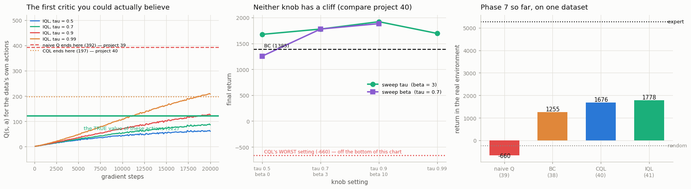

# Implement IQL

## Key Insight

[IQL (Implicit Q-Learning)](/shared/glossary/#iql) sidesteps the [out-of-distribution](/shared/glossary/#out-of-distribution) problem more cleanly than [CQL](/shared/glossary/#cql): instead of penalizing bad actions, it simply *never asks* `Q` about any action outside the dataset. It learns a [value function](/shared/glossary/#value-function) `V(s)` with [expectile regression](/shared/glossary/#expectile-regression) — an asymmetric loss that leans toward the *better* outcomes the data already contains, approximating "the value of the best in-dataset action" without ever evaluating an unseen one — then trains the [policy](/shared/glossary/#policy) by [advantage-weighted regression](/shared/glossary/#advantage-weighted-regression), copying dataset actions but weighting the good ones more heavily. Because every quantity is computed only on actions that really occurred, there is nothing to hallucinate, which makes IQL simpler and more robust than CQL and the modern default for [offline RL](/shared/glossary/#offline-rl).

---

## What's in this directory

| File | Role |
|------|------|
| `iql.py` | IQL's three losses, plus a sweep over both of its knobs — pushed to the settings that *should* break it. |

```bash
python3 iql.py     # ~7 min: 7 runs in parallel
```

## The idea: stop asking the question

[Project 39](../39-naive-q-learning-on-the-same-dataset/README.md) diagnosed the disease. Everything
went wrong at one word:

```
target  =  r  +  γ · max_a′ Q(s′, a′)
                     ^^^
                     this
```

[Project 40](../40-implement-cql/README.md) kept the `max` and bolted a penalty on to survive it. It
worked (1,676, beating BC's 1,385) — but look at what CQL actually does: it samples a pile of made-up
actions, evaluates the critic on every one of them, and pushes them all down. **It spends most of its
compute arguing with hallucinations that it went out of its way to generate.**

IQL asks a better question: *why are we evaluating `Q` at made-up actions in the first place?*

And then it simply **doesn't**. Below are all three of its losses. Scan them for a network being
called on an action that did not come out of the dataset:

```python
# (1) V learns the value of a GOOD action in the data — without a max.
q = min(Q1_targ(s, a), Q2_targ(s, a))          # `a` is the DATA's action
diff = q - V(s)
weight = torch.where(diff > 0, tau, 1 - tau)   # tau = 0.7: asymmetric!
v_loss = (weight * diff.pow(2)).mean()

# (2) Q learns by plain TD — and there is no max, no actor, no action at s' AT ALL.
q_loss = mse(Q(s, a), r + gamma * (1 - done) * V(s2))

# (3) The policy copies the data, weighted by how well each action turned out.
adv = min(Q1_targ(s, a), Q2_targ(s, a)) - V(s)
w = torch.clamp((beta * adv).exp(), max=100.0)
pi_loss = -(w * pi.log_prob(s, a)).mean()      # again: the DATA's action
```

There isn't one. **The dangerous operation has not been defended against — it has been deleted.**

### The trick that makes it work: expectile regression

If you never take a `max`, how do you ever get *better* than the data? The answer is line 3 of loss
(1), and it is the cleverest idea in Phase 7.

An ordinary squared-error regression fits the **mean**. Regress `V(s)` onto the values of the data's
actions and `V` becomes "the value of a *typical* action here" — which is just the value of the
[behavior policy](/shared/glossary/#behavior-policy), and imitating that gets you BC.

[Expectile regression](/shared/glossary/#expectile-regression) makes the loss **asymmetric**. With
`tau = 0.7`:

- when `Q > V` — this action did *better* than V expected — the error is weighted by **0.7**
- when `Q < V` — it did *worse* — the error is weighted by **0.3**

Being *too low* now costs more than being *too high*, so `V` settles **above** the mean, up near the
good outcomes the data contains.

> **Analogy.** You want to know how fast a road can be driven. Average everybody's speed and you
> learn the pace of a *typical* driver, dawdlers included. Take the *maximum* and you get the one
> lunatic doing 200 km/h — or a typo in your data. An expectile is the dial between those: *"lean
> toward the quick drivers, but don't chase the single fastest."* At `tau = 0.5` it is the plain
> average; turn it toward 1 and it creeps up toward the maximum — **but only ever over drivers who
> actually drove the road.** It cannot invent a speed that nobody reached.
>
> That is the whole trick: **an implicit maximum, taken only over things that exist.**

## The results



### Head to head — same dataset, same budget, same code

| method | Q it predicts for the data's actions | the **true** value | how wrong | return | [score](/shared/glossary/#normalized-score) |
|---|---|---|---|---|---|
| BC ([project 38](../38-bc-baseline-on-d4rl/README.md)) | — | 122.2 | — | 1,255.3 | 27.1 |
| naive Q ([project 39](../39-naive-q-learning-on-the-same-dataset/README.md)) | 391.6 | 122.2 | **3.2x too high** | −659.9 | −7.7 |
| CQL, alpha=5 ([project 40](../40-implement-cql/README.md)) | 196.6 | 122.2 | 1.6x too high | 1,676.4 | 34.7 |
| **IQL, tau=0.7 beta=3** | **86.7** | 122.2 | **0.7x — slightly LOW** | **1,778.2** | **36.5** |

**IQL wins on both counts — and the second one is the interesting one.**

It scores **1,778**, the best in the phase: ahead of CQL's 1,676, and far ahead of BC's 1,255.

And its critic is **the only believable one in Phase 7.** Naive Q was 3.2x too high. CQL was 1.6x too
high (and at `alpha = 100`, 11x). IQL lands on **87** against a true value of **122** — close, and
erring *low*. Of course it does: it is fitted only on things that actually happened. **There is
nothing for it to be optimistic about.**

> This matters in practice. Project 40 ended with a warning: because CQL's values are wrong, you
> cannot use them to tell whether CQL is working. **With IQL you can.** A critic that stays near the
> truth is a critic you can debug with.

### Neither knob has a cliff

CQL's `alpha` had a cliff: set it too low and you fell straight back into project 39's catastrophe
(−660). IQL has *two* knobs, which sounds like twice the danger. So we swept both to their extremes,
looking for its cliff.

**There isn't one.**

| tau (with beta=3) | return | | beta (with tau=0.7) | return |
|---|---|---|---|---|
| 0.50 | 1,675.9 | | **0.0** | **1,255.3** |
| **0.70** | **1,778.2** | | 3.0 | 1,778.2 |
| 0.90 | **1,920.3** | | 10.0 | 1,883.3 |
| 0.99 | 1,693.6 | | | |

Every setting — including the deliberately silly ones — matches BC or beats it. IQL's **worst**
result is 1,255. CQL's worst is **−660**.

> **The knobs trade performance. They do not trade safety.** That is a categorically different kind
> of [hyperparameter](/shared/glossary/#hyperparameter), and it is the real reason IQL is the modern
> default. A knob you can get wrong and merely lose 20% is a knob you can ship.

### Two degenerate cases that landed exactly where theory says

The extremes of each knob are not arbitrary. Each one collapses IQL into an algorithm we have
already measured — and **both landed precisely there.**

**`beta = 0` is behavior cloning, exactly.** The policy weight is `exp(beta * advantage)`. Set
`beta = 0` and every weight becomes `exp(0) = 1`: every dataset action is copied equally hard, the
advantage is ignored entirely, and loss (3) *is* plain BC.

It scored **1,255.3**. [Project 39's BC run scored **1,255.3**](../39-naive-q-learning-on-the-same-dataset/README.md).
Not "about the same" — **the same number**, because it is the same algorithm arriving by a different
road. (When a degenerate case reproduces a number you measured in another project to the decimal, you
have real evidence you implemented the thing correctly.)

**`tau = 0.5` heads back toward BC by the other road.** At `tau = 0.5` the expectile loss is
symmetric — ordinary mean regression — so `V` becomes the value of an *average* action, the advantage
`Q − V` hovers near zero, the weights flatten, and the filter stops filtering. It scores 1,676: still
good, but the lowest of the tau sweep.

So `tau` and `beta` are **two different dials onto the same quantity**: how far IQL is allowed to
drift from simply copying the data. Turn either one down and imitation comes back.

## The honest caveat

`tau = 0.9` scored **1,920** — better than our default `tau = 0.7` (1,778). Should we have used 0.9?

We have **one seed per point**, and [project 38 measured the seed-to-seed noise on this task at
±95](../38-bc-baseline-on-d4rl/README.md). The 0.7-vs-0.9 gap is 142 — a little over one standard
deviation. That is *suggestive*; it is not *proof*. The gap between IQL and naive Q is **2,438**, and
that one needs no error bars. The gap between two tau values does — and we did not buy them.

**Report the number, state the noise, and do not tell a story the data cannot carry.**

## What to take away

1. **The best way to handle a dangerous question is not to ask it.** CQL burns most of its compute generating fake actions so it can punish itself for liking them. IQL never generates one — and is both simpler *and* better (1,778 vs 1,676).
2. **An expectile is a maximum you can take safely.** It leans toward the good outcomes in the data without ever evaluating an action that is not in it. That one asymmetric loss is what lets IQL beat imitation without inventing anything.
3. **IQL's critic is the only one in this phase you could believe** — 87 against a true 122, erring low. Everything else ran 1.6x to 11x too high. Honest values are values you can debug with.
4. **Its knobs trade performance, not safety.** Every setting we tried, including the broken ones, matched or beat BC. Compare CQL, where one bad `alpha` is a −660 catastrophe. That is what "more robust" actually means, and it is worth more than a few points of score.
5. **Both knobs, turned to zero, are behavior cloning** — and `beta = 0` reproduced project 39's BC number to the decimal.

Next, [project 42](../42-decision-transformer/README.md) throws all of this away — no values, no
Bellman equation, no [advantage](/shared/glossary/#advantage) — and asks whether offline RL is really
just next-token prediction in a trench coat.
