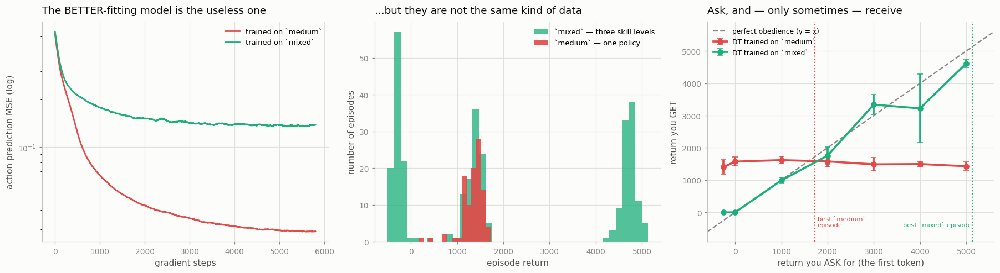

# Decision Transformer

## Key Insight

The [Decision Transformer](/shared/glossary/#decision-transformer) throws out value functions and Bellman backups entirely and reframes [offline RL](/shared/glossary/#offline-rl) as [sequence modeling](/shared/glossary/#sequence-modeling): feed a [transformer](/shared/glossary/#transformer) a stream of (desired [return-to-go](/shared/glossary/#return-to-go), state, action) tokens and train it, exactly like a language model, to predict the next action. At test time you simply *tell* it the return you want — "from here, collect 500 reward" — and it autoregressively produces actions consistent with having achieved that, because during training it saw which action sequences led to which returns. This turns "find the optimal policy" into "predict what an agent that earned this much reward would do," which shines when the dataset is large and varied. Compared with [IQL](/shared/glossary/#iql) it needs no [out-of-distribution](/shared/glossary/#out-of-distribution) machinery at all — the price is that it reliably hits only return targets the data actually demonstrates. Its value-free cousin that also models states and rewards is the [Trajectory Transformer](/shared/glossary/#trajectory-transformer).

---

## What's in this directory

| File | Role |
|------|------|
| `dt.py` | A small [GPT](/shared/glossary/#transformer) over (return-to-go, state, action) tokens — trained on two different datasets, because the difference between them is the entire lesson. |

```bash
python3 dt.py     # ~3 min: two GPTs, then 14 return targets swept in parallel
```

## Offline RL as a sentence

Every other project in this phase argued about how to handle `max_a Q(s, a)` safely. The Decision
Transformer's answer is to **not have a `Q`**.

Instead it writes a trajectory out as a sentence:

```
R₁, s₁, a₁,  R₂, s₂, a₂,  R₃, s₃, a₃,  ...
```

where `Rₜ` is the **[return-to-go](/shared/glossary/#return-to-go)**: the total reward the agent went
on to collect from step `t` to the end of the episode. Then it trains a
[transformer](/shared/glossary/#transformer) to predict the next action — exactly, mechanically, the
way a language model predicts the next word.

`Rₜ` is a fact *from the future*. Online, you could never write it down. **Offline you can, because
the episode is already over** — the future has happened, and it is sitting in your file. That one
observation is the whole trick, and it is one line of code:

```python
rtg = np.cumsum(r[::-1])[::-1]     # add up all rewards from here to the end
```

At test time, **you write the first token yourself.** You say `R = 5000` — *I want 5,000 reward from
here* — and let the model finish the sentence. It produces the actions of an agent that was on its
way to collecting 5,000, because that is the only kind of continuation it has ever seen following
that number. After each step you subtract the reward you actually got, and the remaining budget
becomes the next `R`.

> No [Bellman equation](/shared/glossary/#bellman-equation). No [bootstrapping](/shared/glossary/#bootstrapping).
> No out-of-distribution actions. **The distribution-shift problem of [project 39](../39-naive-q-learning-on-the-same-dataset/README.md)
> is not solved here — it is never created.**

## The experiment

If the story above is true, then **what you ask for and what you get should track each other.** So
we sweep the request from −250 up to 5,000 and plot it against the result. Two straight lines are
possible, and they mean opposite things:

- along the diagonal `y = x` → the model is listening to you
- flat → the model is ignoring the number entirely

We run it on **two datasets**, because the first answer is a flat line and the reason is the most
useful thing in this project.

| dataset | what's in it | its episode returns |
|---|---|---|
| `medium` | 100 episodes, **all written by one half-trained policy** | 166 … 1,724 |
| `mixed` | those same 100, plus 100 `random` and 100 `expert` episodes | **−500 … 5,131** |

Same task, same robot, same network, same budget. The only difference is *who drove*.

## The results



| you ASK for | `medium`-only DT gives you | `mixed`-data DT gives you |
|---|---|---|
| −250 | 1,401 | **−2** |
| 0 | 1,572 | **−2** |
| 1,000 | 1,618 | **987** |
| 2,000 | 1,578 | **1,758** |
| 3,000 | 1,487 | **3,338** |
| 4,000 | 1,496 | 3,222 |
| 5,000 | 1,429 | **4,615** |
| | **total movement: 217** | **total movement: 4,617** |

Read the two columns side by side. They are not describing the same technology.

**The `medium` DT is not listening to you.** Ask it for −250 and it gives you 1,401. Ask it for 5,000
— nearly four times more than the best episode it has ever seen — and it gives you 1,429. The entire
sweep, across a 5,250-point range of requests, moves its behavior by **217 points**. It has learned
to ignore the return token completely, and it just does its best impression of the average episode.

**The `mixed` DT obeys you almost exactly.** Ask for 1,000, get 987. Ask for 3,000, get 3,338. Ask for
5,000 — and it delivers **4,615**, a [normalized score](/shared/glossary/#normalized-score) of **88**.
The green line in the right-hand panel sits on the diagonal.

## Why? Because a number can only be a control if it *means* something

Here is the failure, in one sentence:

> **On `medium`, the return-to-go is noise. On `mixed`, it is information.**

Unpack it. In `medium`, all 100 episodes came from **one policy**. Their returns vary — 166 to 1,724
— but [project 38 established what that variation is](../38-bc-baseline-on-d4rl/README.md): it is
**luck**, not skill. The same policy, sampling its actions randomly, having a better or worse day.

So during training, the model is shown a state, a return-to-go of 1,600, and an action — and then a
nearly identical state, a return-to-go of 1,100, and a *nearly identical action*. The return token
predicts nothing about what comes next. It is a column of random numbers.

**And a model that is trained to ignore a column of random numbers will ignore it at test time too.**
It is not broken. It learned exactly what the data taught: *this token is noise, do not condition on
it.* Then we show up at evaluation, type `5000` into a field the model has correctly learned to
disregard, and act surprised.

In `mixed`, the returns really *do* say something about how the robot was being driven. A `-283`
episode is one where the joints were being shaken at random. A `4,900` episode is a trained expert
running cleanly. **Now the return-to-go token is genuinely predictive of the actions that follow**,
the model has every reason to attend to it — and it does.

> **Analogy.** You want to learn to cook at different skill levels, so you study a thousand recipes,
> each labelled with the rating the meal received.
>
> If every recipe in your book came from **the same mediocre cook**, the ratings vary a bit — a good
> night, a bad night — but the *cooking* is the same. You would soon learn that the rating on the page
> tells you nothing about what to do, and start ignoring it. Then someone asks you for a 5-star meal
> and you produce your usual 3-star dinner, because you never learned what a different rating even
> looks like.
>
> Now give the book **1-star, 3-star and 5-star cooks all mixed together**. Now the rating tells you
> which *technique* is coming, and "make me a 5-star meal" becomes an instruction you can actually
> follow.
>
> The Decision Transformer is the student. The dataset is the book.

## The trap: the model that fit better is the useless one

Look at the left-hand panel again, and be honest about which curve you would rather see in your logs.

| | final action-prediction MSE | does it obey you? |
|---|---|---|
| `medium` DT | **0.026** (5x better) | **no** |
| `mixed` DT | 0.140 | **yes** |

**The model with the far better training loss is the one that does not work.** And the reason is not
mysterious: `medium` contains one behavior, so predicting its actions is easy. `mixed` contains three
very different behaviors and demands that the model tell them apart from the return token — a much
harder fit, and a much more useful one.

> If you had been tuning this project by watching the loss curve, you would have picked the broken
> model, congratulated yourself, and shipped it. **A supervised loss measures how well you fit the
> data. It cannot tell you whether the data contained the thing you were trying to learn.**

This is the same trap that [project 38](../38-bc-baseline-on-d4rl/README.md) fell into with %BC and
[project 40](../40-implement-cql/README.md) fell into with Q-values, and it is Phase 7's most
repeated lesson: **the quantity that is easy to measure is not the quantity you care about.**

## How does it compare to IQL?

Carefully — because the two numbers are not a fair fight.

| method | dataset | score |
|---|---|---|
| DT | `medium` | 33.6 |
| **[IQL](../41-implement-iql/README.md)** | `medium` | **36.5** |
| DT | `mixed` (asking for 5,000) | 88.0 |

On the **same data**, IQL beats the DT — 36.5 to 33.6. The DT on `medium` is essentially a
slightly-better BC (which scored 27–29): with the return token carrying no signal, that is all it can
be, and this matches what the literature reports for `halfcheetah-medium`.

The DT's **88.0** is a real number, but it comes from a dataset that contains expert demonstrations.
It is not evidence that the DT is better than IQL; it is evidence that **`mixed` is an easier
problem than `medium`** — and it is exactly the regime the Decision Transformer was built for.
Do not put those two numbers next to each other in a table and claim a winner.

## What to take away

1. **Offline RL can be written as next-token prediction, and it genuinely works** — a plain GPT with no value function, no Bellman backup, and no OOD machinery hit a score of 88, the best in this phase.
2. **Return conditioning only works if the return carries information.** Trained on a single policy's data, the DT correctly learned to ignore the return token — and then no amount of asking would move it. Same code, diverse data, and it tracks your request almost exactly.
3. **"Diverse data" does not mean "a wide spread of returns."** `medium` had a 1,558-point spread and conditioning failed anyway, because that spread was *luck*. It means a spread that is **caused by different behavior**. That distinction is the whole project.
4. **The better-fitting model was the useless one.** Trust an evaluation in the environment; do not trust a training loss.
5. **Diagnose your data before your algorithm.** Everything that went wrong here was decided before a single gradient was computed.

Next, [project 43](../43-dataset-quality-study/README.md) makes that last point the entire experiment.
