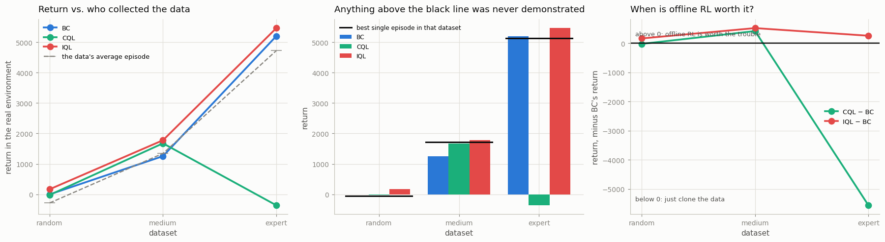

# Dataset-Quality Study

## Key Insight

The same [offline RL](/shared/glossary/#offline-rl) algorithm can look brilliant or useless depending only on *who collected the data*, and this study makes that dependence visible by running one fixed method across three [D4RL](/shared/glossary/#d4rl)-style datasets of the same task — `random` (a flailing [behavior policy](/shared/glossary/#behavior-policy)), `medium` (a half-trained one), and `expert` (a polished one) — and plotting final [return](/shared/glossary/#return) against data quality. The lesson is that offline RL cannot conjure skill the data never shows: when the training data is already collected by an expert, a simple method like copying the expert's actions ([behavior cloning](/shared/glossary/#bc)) works incredibly well. However, when the data is poor or mediocre, a true offline RL algorithm stands out because it can look at many imperfect attempts, find the best parts of each, and combine (or [stitch](/shared/glossary/#stitching)) them together into a single, high-performing strategy. This ability to create a policy that is better than any single trajectory in the dataset is what makes offline RL much more powerful than simple imitation. Knowing where your dataset sits on this curve tells you whether a sophisticated method is even worth the trouble.

---

## What's in this directory

| File | Role |
|------|------|
| `quality_study.py` | Three algorithms x three datasets, one fixed budget, **one fixed set of hyperparameters**. Nine runs, and the last of those bold bits is what makes the result bite. |

```bash
python3 quality_study.py     # ~9 min: 9 runs in parallel
```

## The question

Every project so far in this phase has run on `medium`. That has been quietly hiding the single most
practical fact in offline RL:

> **An algorithm's reputation depends almost entirely on the dataset it was benchmarked on.**

So: three methods, three datasets, everything else held fixed.

| dataset | who drove | its 100 episodes average | its **best single episode** |
|---|---|---|---|
| `random` | uniform joystick-shaking | −283.4 | −56.2 |
| `medium` | a half-trained [SAC](/shared/glossary/#sac) | 1,343.9 | 1,723.8 |
| `expert` | a fully-trained SAC | 4,722.6 | 5,131.2 |

And one sharp question to ask of every result:

> **Can it beat the best single episode in its own dataset?**
>
> [BC](/shared/glossary/#bc) cannot, by construction — copying cannot exceed the thing being copied.
> If a method *can*, it has done something a copier structurally cannot: taken good fragments from
> different mediocre episodes and joined them into a run that **nobody ever performed.** That is
> [stitching](/shared/glossary/#stitching), and it is the entire argument for offline RL over
> imitation.

## The results



Returns, with the [normalized score](/shared/glossary/#normalized-score) in brackets:

| dataset | BC | CQL (alpha=5) | IQL | the data's average | the data's **best episode** |
|---|---|---|---|---|---|
| `random` | −1.1 (4.2) | −20.0 (3.9) | **167.0 (7.3)** | −283.4 | −56.2 |
| `medium` | 1,255.3 (27.1) | 1,676.4 (34.7) | **1,778.2 (36.5)** | 1,343.9 | 1,723.8 |
| `expert` | 5,201.6 (98.7) | **−359.9 (−2.3)** | **5,462.5 (103.4)** | 4,722.6 | 5,131.2 |

Four things here, and the third one is a genuine shock.

### 1. The data decides, not the algorithm

Follow **IQL** — one algorithm, one set of hyperparameters — across the three rows:

```
score:   7.3   →   36.5   →   103.4
```

**A 14x swing, and not one line of code changed.** Nothing about the algorithm improved between those
three numbers. The *data* improved. When someone tells you their offline-RL method scores 90, the
first question is not "how does it work?" — it is **"what were you trained on?"**

### 2. On expert data, just clone it

BC on `expert` scores **98.7**. It has essentially solved the task by copying.

All the machinery of this phase — [pessimism](/shared/glossary/#pessimism), [expectile
regression](/shared/glossary/#expectile-regression), twin critics, [advantage-weighted
regression](/shared/glossary/#advantage-weighted-regression) — buys IQL **+4.7 points** over that
(103.4). And it buys CQL **−101 points**.

> **If your data was collected by an expert, the sophisticated method is probably not worth the
> trouble.** This is why [project 38](../38-bc-baseline-on-d4rl/README.md) insisted on running the
> baseline first. Skip it and you will happily ship an elaborate algorithm that never beat "copy the
> data."

### 3. CQL detonates on expert data

Look at that CQL row again: **−359.9**. Worse than [random flailing](/shared/glossary/#behavior-policy)
(−235). Given the *best* dataset in the study — 100 episodes of a trained expert running cleanly —
CQL produced a policy that is worse than doing nothing at all.

Same `alpha = 5` that was the *winner* on `medium`. Nothing else changed.

**Why.** [CQL's penalty](../40-implement-cql/README.md) pushes down the value of every action *except*
the ones in the data. How hard it needs to push depends on how much of the action space the data
covers. `medium` came from a half-trained SAC that was still exploring: its actions are spread out,
so the data covers a broad region and a firm push is safe. `expert` came from a converged policy that
does nearly the same thing every time: its actions occupy a **thin sliver** of the action space. Push
with the same force there and you flatten the sliver too — the critic can no longer distinguish
between the good expert actions, and the policy that maximizes it is noise.

**`alpha` is not a property of the algorithm. It is a property of the algorithm *and the dataset*,
and it must be re-tuned for each.**

> This is exactly the fragility [project 41](../41-implement-iql/README.md) warned about, now in its
> most expensive form. There, CQL's knob was dangerous across *values*. Here it is dangerous across
> *datasets* — and the failure arrives silently, on your best data, at the setting that worked
> yesterday.
>
> **IQL ran all three datasets on identical hyperparameters and never once failed.** That is not a
> footnote. That is the reason it is the modern default.

### 4. Stitching: better than anything it was shown

The sharp question was: *can anything beat the best single episode in its own dataset?*

**IQL on `expert`: 5,462.5, against a best-in-data episode of 5,131.2** — and against the expert
teacher itself, which scores 5,273. Its normalized score is **103.4**, and a score above 100 means
exactly what it says: **it is better than the expert that produced its training data.**

It was never shown a run that good. It assembled one, by learning which *pieces* of the expert's
behavior were worth the most and preferring those — the [Bellman equation](/shared/glossary/#bellman-equation)
propagating value backwards through fragments, exactly as the [stitching](/shared/glossary/#stitching)
story says it should. **That is the thing BC cannot do at any price**, and it is what you are buying
with all this machinery.

(On `medium`, IQL clears best-in-data by only +54 — well within the ±95 seed noise
[project 38 measured](../38-bc-baseline-on-d4rl/README.md). Take the `expert` result, which clears it
by +331, and leave the `medium` one alone.)

### An honest artifact, so you do not misread the `random` row

On `random`, BC scores **−1.1** while its dataset averages **−283.4**. That looks like BC beating its
own data by 282 points, which should be impossible.

It is not learning. It is **averaging**. The data is uniform random joystick-shaking, so the *mean*
action in any state is approximately **zero action** — and a HalfCheetah that does nothing simply
lies still, earning about 0, while one that thrashes wildly earns −283. BC fits the mean, so BC
learns to lie still, and lying still beats thrashing.

> Nothing was stitched, nothing was learned, and the +282 is entirely an artifact of *what the
> average of random noise looks like*. Every method on the `random` row scores between 3.9 and 7.3
> out of 100 — which is the real finding: **when the data contains no skill, no algorithm can
> extract any.** Offline RL recombines competence. It cannot manufacture it.

## The practical decision procedure

This whole study collapses into one flowchart you can actually use:

```
How good is the policy that collected your data?

  ├─ Expert, and you want to reproduce it
  │     → Behavior cloning. Score 98.7. Stop. Go home.
  │       (IQL adds +4.7 and CQL will destroy you.)
  │
  ├─ Mediocre / mixed — the usual real-world case
  │     → Offline RL earns its keep. IQL: 36.5 vs BC's 27.1, a 35% gain.
  │       This is the regime the whole field is built for.
  │
  └─ Random / no competence in it at all
        → Nothing will save you. All three methods score under 8.
          Go and collect better data. That is the actual answer.
```

And, cutting across all three: **prefer the algorithm whose hyperparameters do not have to be
re-tuned for every dataset.** In this study that decided the entire outcome — not by a few points,
but by the difference between 103.4 and −2.3.

## What to take away

1. **The dataset, not the algorithm, sets the ceiling.** One unchanged IQL scored 7.3, 36.5, and 103.4 on three datasets of the same task. Ask what a method was trained on before you ask how it works.
2. **On expert data, BC is nearly unbeatable** (98.7) — and one of the two fancy methods is *catastrophically* worse than it. Always run the baseline.
3. **CQL's `alpha` is a property of the dataset, not of CQL.** Tuned on `medium`, it scored 34.7. The same value on `expert` scored **−2.3** — worse than random. IQL used identical hyperparameters on all three and never failed.
4. **Stitching is real, and here is the receipt:** IQL on `expert` scored **103.4**, beating both the best episode in its data and the expert that recorded it. A copier cannot do that at any budget.
5. **Offline RL recombines competence; it cannot create it.** On `random` data, everything scored under 8/100. If your data has no skill in it, the answer is not a better algorithm — it is better data.

---

This closes Phase 7. The arc, from [project 38](../38-bc-baseline-on-d4rl/README.md) to here: a
[copier](/shared/glossary/#bc) that cannot exceed its teacher, a
[Q-learner](../39-naive-q-learning-on-the-same-dataset/README.md) that hallucinates its way to being
worse than random, two [different](../40-implement-cql/README.md) [cures](../41-implement-iql/README.md)
— one fragile, one robust — a [transformer](../42-decision-transformer/README.md) that obeys you only
if your data taught it what obedience means, and finally the discovery that **every one of those
outcomes was decided by the data before a single gradient was computed.**
