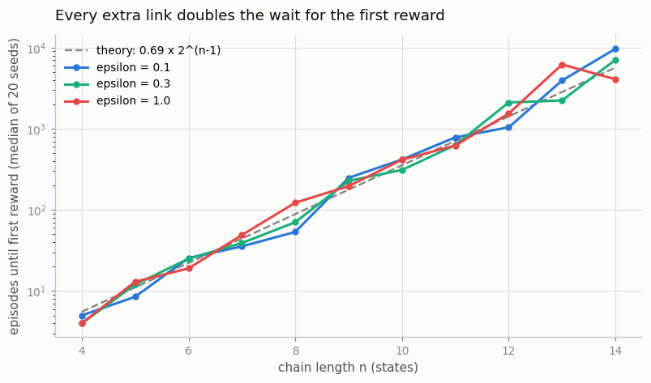
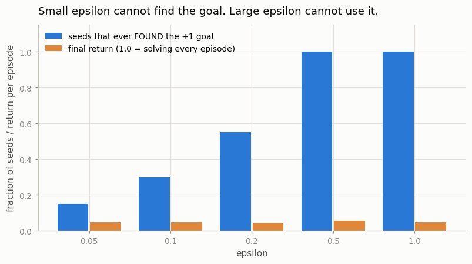
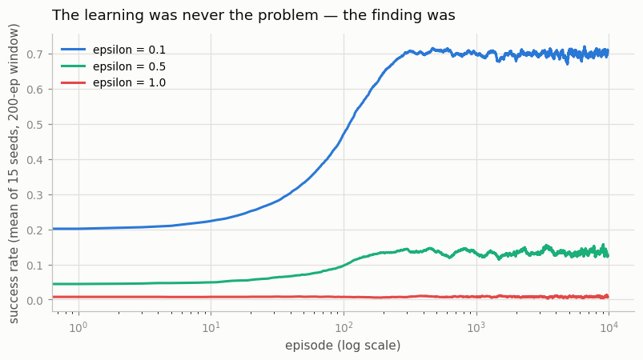

# ε-greedy on a Chain

## Key Insight

[Epsilon-greedy (ε-greedy)](/shared/glossary/#epsilon-greedy) is the workhorse [exploration](/shared/glossary/#exploration-vs-exploitation) rule, but this project is built to make it fail. A [chain MDP](/shared/glossary/#chain-mdp) lines its states up in a single row with the only [reward](/shared/glossary/#reward-function) hidden at the far end, so the agent must take many correct steps in a row before it ever sees a payoff — a textbook [sparse-reward](/shared/glossary/#sparse-reward) problem. Because ε-greedy explores by occasionally picking a *uniformly random* action, the chance of randomly walking all the way to the goal is roughly halved with every extra link in the chain, so the time to first discover the reward blows up exponentially as the chain grows. Why it matters: it shows concretely that random jitter is not a real exploration strategy — the moment rewards are rare and far away you need a method that is *directed* toward the unknown, which is the whole motivation for the [intrinsic-motivation](/shared/glossary/#intrinsic-motivation) methods in this phase.

---

## What's in this directory

| File | Role |
|------|------|
| `chain.py` | The chain environment, tabular [Q-learning](/shared/glossary/#q-learning), and three experiments. [Project 45](../45-count-based-on-a-small-env/README.md) imports the `Chain` class from this file, so the two methods are measured on *literally* the same world. |

```bash
python3 chain.py     # ~5.5 min, three figures
```

## The world

```
    start                                             goal
      s0 --> s1 --> s2 --> ... --> s(n-2) --> s(n-1)   reward +1
      <--    <--    <--            <--
```

Two actions: **left** and **right**. One reward: `+1` for arriving at the far end.
Everywhere else pays exactly zero. It is called a *chain* because the
[states](/shared/glossary/#state) are strung in a single line, each linked only to its two
neighbours — the simplest possible shape for a world where the goal is *far away* in a way
you can count.

The one rule that gives this project its teeth: **an episode lasts exactly `n-1` steps** —
precisely enough to walk from one end to the other, with nothing to spare. Step left once
and the goal is out of reach for the rest of the episode. (An
[episode](/shared/glossary/#episode) is one attempt: from the start state until the game
ends or the clock runs out.)

So reaching the reward by luck means choosing `right`, `right`, ..., `right` — `n-1`
correct choices in a row, with no second chances:

```
P(a random walker reaches the goal in one episode) = (1/2)^(n-1)
```

Each extra link **halves** it. This design is a miniature of Osband's *deep sea* benchmark,
and the name is apt: the treasure is at the bottom, and you have only enough air for a
straight descent.

> **Why not just let the episode run longer?** Because then a random walker eventually
> stumbles to the end anyway, and the difficulty grows only like `n²` — bad, but survivable.
> The tight deadline is what makes the failure *exponential* instead of merely slow, and
> exponential is what real hard-exploration games look like. In
> [Montezuma's Revenge](/shared/glossary/#montezumas-revenge) you must fetch a key, climb
> down a ladder, cross a room, and reach a door **before dying** — the deadline is the whole
> problem.

## Giving ε-greedy its best shot

One implementation detail decides whether this experiment is a fair test or a rigged fight.

The Q-table starts at all zeros — the agent's opening belief is that everything is worth
nothing. (The **Q-value** `Q(s, a)` is the agent's estimate of "how much total reward do I
end up with if I take action `a` here and act well afterwards".) So when the ε-greedy rule
says *"with probability `1-ε` take the [greedy](/shared/glossary/#greedy-policy) action"* —
the action with the highest Q-value — **every action is tied at zero**. A plain `argmax`
would silently return the first index, `left`, every single time, and the agent would spend
all of training walking into the left wall.

That would be a strawman. `chain.py` therefore breaks ties **by coin flip**:

```python
best = np.flatnonzero(q == q.max())   # every action tied for best
a = int(rng.choice(best))             # ... so pick among them fairly
```

This hands ε-greedy the strongest possible version of itself — and it produces the
experiment's first surprise.

## Result 1: every extra link doubles the wait



Episodes until the agent stumbles on the reward for the very first time (median of 20 seeds):

| chain length `n` | 4 | 6 | 8 | 10 | 12 | 14 |
|---|---|---|---|---|---|---|
| ε = 0.1 | 5 | 26 | 54 | 418 | 1,041 | **9,682** |
| ε = 0.3 | 4 | 25 | 70 | 310 | 2,111 | **7,080** |
| ε = 1.0 | 4 | 19 | 122 | 416 | 1,537 | **4,085** |

Fit the growth rate and you get **2.13x, 2.11x and 2.00x per extra link**, against a
theoretical prediction of exactly 2.00x. A straight line on a log-scale plot *is* what
exponential growth looks like. Ten more links and the median wait would be roughly a
thousand times longer.

**The surprise is that the three rows are the same row.** Turning ε from 0.1 up to 1.0 —
from "explore 10% of the time" to "explore *always*" — changes nothing that matters. The
three curves are three samples from one distribution; the wiggles between them are seed
noise (a median of 20 runs of a very spread-out quantity).

Once you see why, you cannot unsee it:

> Before the first reward is found, **every Q-value is still zero**, so the greedy action is
> a coin flip (we made sure of that above) and the random action is a coin flip. The two
> branches of ε-greedy are *the same branch*. Whatever ε you set, the agent performs an
> unbiased random walk.
>
> **ε is a dial that does nothing at all until the agent has already succeeded once.** It
> cannot help you find the first reward, because all it does is re-weight a choice between
> "exploit what I know" and "act at random" — and at that moment the agent knows nothing, so
> exploiting *is* acting at random.

That is the deep version of the lesson. ε-greedy is not a bad exploration strategy; it is
**not an exploration strategy**. It is a way to keep a little randomness in a policy that
already has opinions.

## Result 2: add one crumb, and it gets worse

Now change the world slightly: stepping `left` at the start state pays **+0.01** — one
hundredth of the real goal. Call it a crumb. The agent finds it in the first step of the
first episode.



Chain of length 6, 20 seeds, 15,000 episodes each:

| ε | seeds that ever found the +1 goal | final return per episode |
|---|---|---|
| 0.05 | 3 / 20 | 0.048 |
| 0.1 | 6 / 20 | 0.046 |
| 0.2 | 11 / 20 | 0.042 |
| 0.5 | **20 / 20** | 0.055 |
| 1.0 | **20 / 20** | 0.046 |

Read the two columns together, because each one alone tells a lie.

- **Small ε (0.05–0.2): cannot find it.** The agent has locked onto the crumb. Its greedy
  action is now `left` — a *real* preference, not a tie — so the only way it ever produces
  six rights in a row is if the random branch fires six times in a row *and* points right
  every time: probability `(ε/2)^5`. Lowering ε to "waste fewer steps" makes discovery
  exponentially less likely. The crumb has upgraded ε-greedy's blindness into an active trap.
- **Large ε (0.5–1.0): finds it, cannot use it.** With enough randomness the goal *is*
  discovered by every seed, and the agent learns a perfectly correct Q-table that says "go
  right". It then fails to follow its own advice, because half its actions are coin flips
  and one stray `left` ruins the episode. Its [return](/shared/glossary/#return) stays at
  **crumb level (~0.05, i.e. about five crumbs)** — nowhere near the 1.0 it would earn by
  simply walking right.

**No value of ε both finds the goal and then uses it.** Small ε cannot explore; large ε
cannot exploit. This is the [exploration–exploitation
trade-off](/shared/glossary/#exploration-vs-exploitation) in its rawest form: with one
scalar knob, you get to choose which half of the problem to fail at.

## Result 3: the learning was never the problem



Back to the plain chain (`n = 8`, no crumb), now watching what happens *after* the reward
has been found. Mean success rate over the final 1,000 episodes:

| ε | 0.1 | 0.5 | 1.0 |
|---|---|---|---|
| success rate | **0.70** | 0.14 | 0.01 |

Q-learning does its job the instant it has something to work with. One lucky episode plants
a `+1` at the end of the chain, and the [temporal-difference
update](/shared/glossary/#temporal-difference-learning) — which nudges each state's value
toward "the reward I just got, plus the value of the state I landed in" — carries that value
backwards down the chain, one link per episode, until the whole path glows.

The learning machinery is fine. **The pipeline breaks at the very first step: the agent could
not find a single example of success to learn from.** And notice the reversal — here a large
ε is *catastrophic* (0.01), while for discovery it was harmless. The same knob, doing damage
in opposite directions depending on which half of the problem you look at.

## What to take away

1. **ε-greedy explores by accident, not on purpose.** Before the first reward, every ε
   produces the identical unbiased random walk — measured across ε = 0.1, 0.3 and 1.0, whose
   discovery times are statistically indistinguishable.
2. **The cost of that accident is exponential.** Each extra link doubles the time to first
   discovery (measured 2.0–2.1x per link; theory says exactly 2x). Real sparse-reward games
   are chains hundreds of decisions long.
3. **A tiny distracting reward turns blindness into a trap.** A crumb worth 1% of the goal
   made small-ε agents miss the goal in 17 of 20 seeds: the crumb gives the greedy policy an
   opinion, and now randomness has to fight it.
4. **No single ε works.** Small ε cannot explore; large ε cannot exploit. The knob has no
   good setting, because the *method* has no notion of "I have not been there yet".
5. **Learning is not the bottleneck — finding is.** Q-learning solved the chain immediately
   once it was shown one success.

That last point is what the rest of Phase 8 is about. If randomness cannot find the reward,
the agent needs a *reason* to walk toward the unknown. The cheapest such reason is to count
where you have been and prefer where you have not:
[project 45](../45-count-based-on-a-small-env/README.md) adds exactly one term to the code in
this directory and flattens the exponential curve above. When states are pixels and no two
are ever identical, counting stops working —
[project 46](../46-rnd-on-atari/README.md) then replaces the counter with a neural network.
