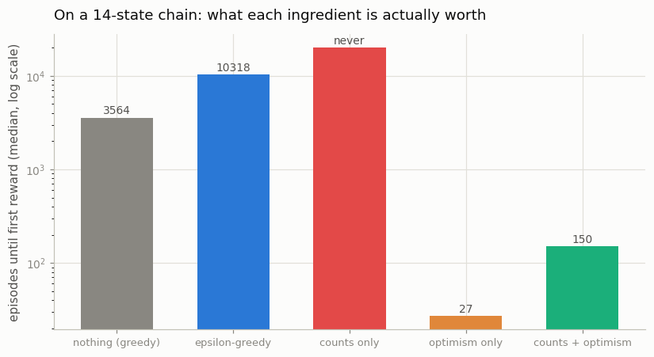
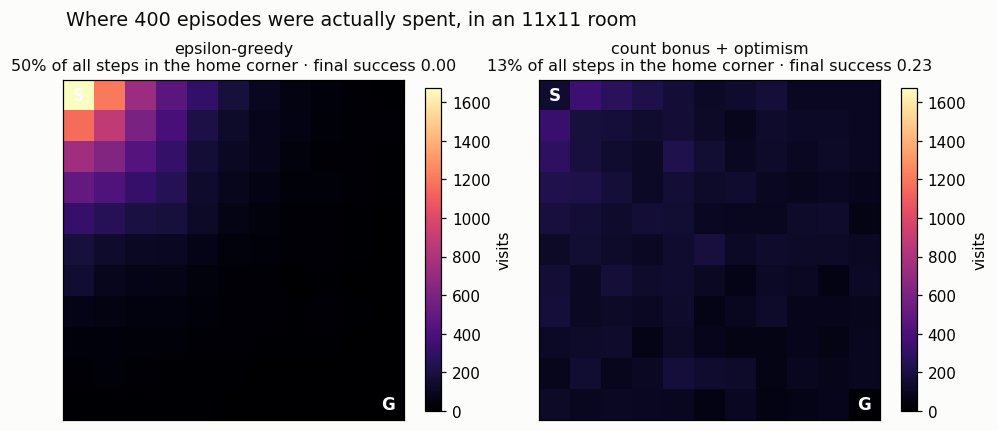

# Count-Based on a Small Env

## Key Insight

[Count-based exploration](/shared/glossary/#count-based-exploration) turns "go somewhere new" into a concrete bonus: keep a tally `N(s)` of how many times each [state](/shared/glossary/#mdp) has been visited and add an [intrinsic reward](/shared/glossary/#intrinsic-reward) of `1/√N(s)` on top of the environment's own [reward](/shared/glossary/#reward-function). Rarely seen states get a large bonus and heavily visited ones get almost none, so a [Q-learning](/shared/glossary/#q-learning) agent is actively pulled toward the unexplored frontier instead of relying on the random luck of [ε-greedy](/shared/glossary/#epsilon-greedy). Why the `1/√N` shape: it mirrors how statistical confidence tightens with more samples, so the bonus fades at exactly the rate your uncertainty about a state does. This is the cleanest illustration of [intrinsic motivation](/shared/glossary/#intrinsic-motivation) — exploration driven by the agent's own curiosity signal — and it works beautifully in small discrete worlds, though it breaks down in large or pixel-based ones where no two observations are ever exactly identical, so every raw count stays stuck at one.

---

## What's in this directory

| File | Role |
|------|------|
| `count_based.py` | One Q-learner with three knobs — random jitter (`eps`), the count bonus (`beta`), and how good an *untried* action is assumed to be (`q_init`) — run on [project 44](../44-epsilon-greedy-on-a-chain/README.md)'s chain (imported straight from that directory) and on an 11x11 room. |

```bash
python3 count_based.py     # ~6 min, three figures
```

## The one-line change — which does nothing

Take [project 44](../44-epsilon-greedy-on-a-chain/README.md)'s Q-learning and add one term to the reward the *learner* sees:

```python
bonus  = beta / sqrt(N[s2])                # N[s2] = times we have ARRIVED in state s2
target = r + bonus + gamma * Q[s2].max()   # the agent chases r + bonus; we still report r
```

Run it on the same chain [project 44](../44-epsilon-greedy-on-a-chain/README.md) could not solve:

| chain length `n` | 8 | 10 | 12 | 14 | 16 |
|---|---|---|---|---|---|
| ε-greedy ([project 44](../44-epsilon-greedy-on-a-chain/README.md)) | 74 | 261 | 1,421 | 10,211 | **never** |
| **count bonus alone** | **never** | **never** | **never** | **never** | **never** |

*(median episode of the first reward, 8 seeds, 20,000-episode budget; "never" = the budget ran out)*

The bonus does not merely underperform. **It is worse than doing nothing at all**, at every
length, on the exact task it was invented for. Understanding why is worth more than any other
result in this project.

### The Q-table confesses

Print what the agent believes on a 6-state chain, after 600 episodes:

```
  N(s)        [   0.  600. 6000. 5400.    0.    0.]   <- states 4 and 5: NEVER VISITED
  Q(s,left)   [0.    0.    0.    0.067 0.    0.   ]
  Q(s,right)  [0.069 0.067 0.067 0.    0.    0.   ]   <- Q(3,right) is still exactly 0
  greedy      ['R', 'R', 'R', 'L', '-', '-']          <- at state 3 it turns AROUND
```

The agent walks right, right, right — and at state 3 it turns back. It has built itself a
comfortable corridor between states 2 and 3 and paces up and down it six thousand times, while
the last two states of the world sit untouched.

Look at state 3 to see why. Going *left* returns it to state 2, and that habit is worth 0.067 —
assembled from the bonuses it has already collected there. Going *right* is worth **0.0**,
because `Q(3, right)` has never been updated, because the agent has never gone right, because
going right looks worthless, because it has never gone right.

> **A bonus is a reward you can only collect after you arrive.** It pays you for visiting
> somewhere new; it says nothing whatsoever about a place you have never been. An untried action
> has collected no bonus, so it is still worth its starting value of zero — and zero loses to any
> familiar route that has been quietly earning small bonuses all along.

The bonus is real money, behind a door that only opens from the inside.

### The fix: assume the unknown is wonderful

Start the Q-table at `q_init = 1` instead of `0` — a claim that every untried action leads
somewhere as good as the goal itself. This is [optimism in the face of
uncertainty](/shared/glossary/#optimism-in-the-face-of-uncertainty), and it is emphatically *not*
a second copy of the bonus:

| | what it is | what it talks about |
|---|---|---|
| **the count bonus** | a payment | places you **have** been (and how often) |
| **optimism** | a belief | places you have **never** been |

Optimism gets the agent through the door; the bonus then fades away as it learns what is behind
it. Neither one does the other's job — which is why the version with only one of them fails.


| chain length `n` | 8 | 10 | 12 | 14 | 16 |
|---|---|---|---|---|---|
| ε-greedy ([project 44](../44-epsilon-greedy-on-a-chain/README.md)) | 74 | 261 | 1,421 | 10,211 | never |
| count bonus alone | never | never | never | never | never |
| **count bonus + optimistic start** | 60 | 96 | 122 | **140** | **154** |

That third row is what the whole phase is chasing. ε-greedy's cost **doubles with every extra
link**. The directed agent's cost is **essentially flat**: 140 episodes at n = 14, 154 at n = 16.
At n = 16 that is at least a **130x** improvement, and the gap grows without limit — one curve is
exponential and the other is not.

## Which half did the work?

An uncomfortable question, and the code answers it. Same 14-state chain, five agents:



| agent | found the goal | median episode |
|---|---|---|
| nothing (pure greedy) | 9/10 seeds | 3,564 |
| ε-greedy | 9/10 seeds | 10,318 |
| **counts only** | **0/10 seeds** | never |
| **optimism only** | 10/10 seeds | **27** |
| counts + optimism | 10/10 seeds | 150 |

Read that honestly, because it is not the tidy story the method's name promises:

- **The count bonus is not what does the work here. Optimism is.** Alone, optimism finds the goal
  in 27 episodes — *five times faster* than optimism plus counts, and 380x faster than ε-greedy.
  Adding the bonus actively **slows discovery down**: it keeps luring the agent back to re-check
  under-counted states near the start, while pure optimism marches to the frontier and never
  looks back.
- In a small **deterministic** world, that is exactly correct behaviour. One visit tells you the
  whole truth about a state, so a belief that dies after a single visit — optimism — is perfectly
  calibrated, and the bonus's slow `1/√N` fade is insurance against a risk that does not exist here.
- ε-greedy is *worse than plain greedy* (10,318 vs 3,564). Its random actions actively sabotage
  the walk, exactly as [project 44](../44-epsilon-greedy-on-a-chain/README.md) found.

### Then why does anyone use counts?

Because optimism is a trick you can only play inside a table.

Optimistic initialization means writing a hopeful number into every cell of `Q`, including the
cells of states you have never seen. **A neural network has no such cells.** Show it a state it
has never visited and it will confidently interpolate a value from states it *has* seen — and
that guess is as likely to be too low as too high. There is nowhere to write "I have never been
here", because the network has no slot for it.

Counting *is* that slot. `N(s)` is a measured record of experience rather than a belief, and it is
the only one of the two ideas that survives the trip out of the table:

```
   N(s), an exact tally                 perfect in tables; hopeless on pixels
        |                               (no two frames are identical -> every count stays 1)
        v
   pseudo-counts from a density model   "how surprised is my model of typical frames?"
        |
        v
   RND: the error of a predictor        "how badly do I predict a random fingerprint?"
```

Each step keeps the idea — *measure how familiar this is* — and drops a requirement that cannot
survive high dimensions. [Project 46](../46-rnd-on-atari/README.md) builds the last box and runs
it on real Atari frames.

## What "directed" actually looks like

The same two agents in an 11x11 room: start in one corner, `+1` in the opposite one, 40 steps per
episode (the corners are 20 moves apart, so there is no time to dawdle). 400 episodes, and the
heat-map shows where every single step went.



| | steps spent in the home corner | cells ever seen | goal first found | final success rate |
|---|---|---|---|---|
| ε-greedy | **50%** | 119/121 | episode 5 | **0.00** |
| count bonus + optimism | **13%** | 121/121 | episode 184 | **0.23** |

ε-greedy spent **half of its entire life within two squares of where it started.** That is what
an undirected random walk does — it diffuses, and diffusion keeps you close to home: after `t`
random steps your expected distance from the start grows only like `√t`, so a hundred times the
steps buys ten times the distance.

The last two columns hold a trap worth naming. **ε-greedy found the goal first** — episode 5, by
luck — **and still ended up never reaching it** (final success 0.00). The count-driven agent took
184 episodes to find it, because it was busy sweeping the room methodically, and then actually
learned to go there. Stumbling on a reward once is not the same as being able to *reach* it: for
that you must have walked the path often enough to learn it, which is what systematic coverage
buys and luck does not.

## What to take away

1. **A bonus alone cannot explore.** It pays you for arriving somewhere, and says nothing about
   where you have never been — so a greedy policy never goes there to claim it. Measured: 0 of 10
   seeds, at every chain length, worse than doing nothing.
2. **Optimism is the missing half.** "Assume the unknown is wonderful" is a belief about the
   unvisited, and it is what gets the agent through the door. With it, the same bonus flattens
   [project 44](../44-epsilon-greedy-on-a-chain/README.md)'s exponential curve: 154 episodes at n = 16, versus never for ε-greedy.
3. **In a tiny tabular world, optimism does the work and the bonus is a tax** (27 episodes versus
   150). Say that out loud rather than letting the method take credit it did not earn.
4. **Counts still matter, because counts are the idea that scales.** You cannot optimistically
   initialize a network's opinion of a state it has never seen; it just generalizes. A count is a
   *record*, and its descendants — [pseudo-counts](/shared/glossary/#pseudo-count), then
   [RND](/shared/glossary/#rnd) — are how novelty survives the move to pixels.
5. **Directed exploration looks different.** ε-greedy spent 50% of its steps in the corner it
   started in. The count-driven agent spent 13%, saw every cell in the room, and was the only one
   of the two that ever learned to reach the goal.

Next: on an Atari screen, no two frames are ever identical, so `N(s)` is stuck at 1 forever and
this entire project collapses. [Project 46](../46-rnd-on-atari/README.md) rebuilds the novelty
signal out of a neural network's prediction error instead of a tally.
