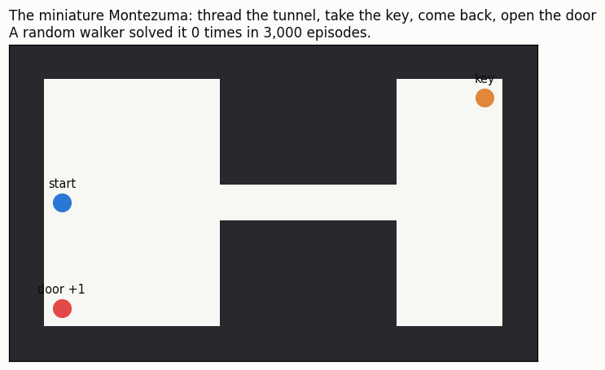
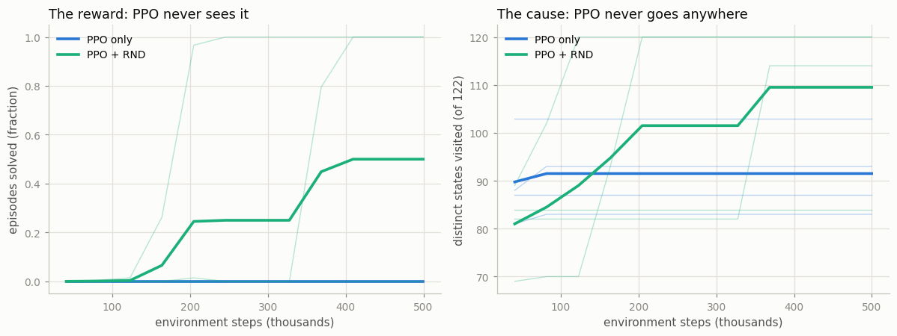
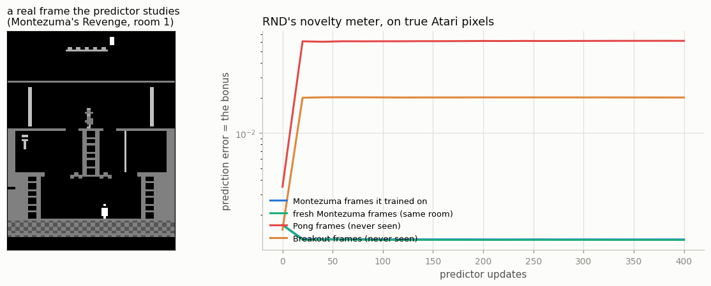

# RND on Atari

## Key Insight

[Random Network Distillation (RND)](/shared/glossary/#rnd) scales the "reward novelty" idea up to high-dimensional [Atari](/shared/glossary/#atari) screens, where simple visit counts are meaningless because no two frames are ever identical. It keeps two networks: a fixed, randomly-initialized *target* network and a *predictor* network trained to copy the target's output on every state the agent visits ([distillation](/shared/glossary/#distillation) of one network into another). On familiar states the predictor has had plenty of practice and its error is tiny; on a genuinely new screen it has never trained, so its error is large — and that prediction error is handed straight to the agent as an [intrinsic reward](/shared/glossary/#intrinsic-reward). Why it matters: with no hand-designed counts, RND was the method that finally cracked [Montezuma's Revenge](/shared/glossary/#montezumas-revenge), the notorious [sparse-reward](/shared/glossary/#sparse-reward) game where the agent must cross several rooms before earning a single point, putting curiosity-style [intrinsic motivation](/shared/glossary/#intrinsic-motivation) firmly on the map.

---

## An honest word about "on Atari"

The RND paper trains on **2 billion frames of Montezuma's Revenge across 128 parallel
workers**. On this CPU that is several months of compute. Pretending otherwise would teach
you nothing, so this project is split in two halves, and neither pretends to be the other:

| Half | What it is | What it proves |
|---|---|---|
| **The agent** | A *miniature Montezuma*: a pixel maze with the same shape of problem — thread a tunnel, fetch a key, come back, open a door. ~31 correct moves for a single point. | [PPO](/shared/glossary/#ppo) alone **never** finds the reward. PPO + RND does. |
| **The signal** | RND's novelty detector itself, run on **real 210x160 Montezuma frames** from the Arcade Learning Environment. | The bonus really is a novelty meter on true Atari pixels: it collapses on frames it has studied and stays 51x higher on frames it has never seen. |

## What's in this directory

| File | Role |
|------|------|
| `explore_lib.py` | The shared stack for the whole phase: the maze, the [vectorized envs](/shared/glossary/#vectorized-environment), PPO with **two value heads**, and the `RND` bonus. [Project 47](../47-icm/README.md) and [project 49](../49-noisy-tv-experiment/README.md) import it, so all three projects change *only the bonus* and nothing else. |
| `rnd.py` | Runs both halves: 4 seeds x (PPO, PPO+RND), then the real-Atari novelty demo. |

```bash
python3 rnd.py     # ~9 min: 8 training runs in parallel, then the Atari probe
```

## The maze



The agent sees a stack of small binary images (5 channels x 9 x 15): walls, itself, the key,
the door, and an "inventory bar" saying whether it is carrying the key. It is a cartoon of an
Atari screen — and, importantly, **nothing in it is a state number**, so the visit counter of
[project 45](../45-count-based-on-a-small-env/README.md) has nothing to count.

Two design choices were forced on this maze by measurements, and both are worth knowing
because they are exactly the traps that make a demo lie:

1. **The tunnel is five cells long, not a doorway.** With a simple doorway, the maze was
   solvable *by accident*: because the observation says whether the agent holds the key, an
   untrained network can behave like two different biased drifts — one before the key, one
   after — and roughly 1 random initialization in 6 drifted the right way twice. That is how
   the "PPO never finds it" baseline first sneaked a win, at step 15,104, with no learning at
   all. No drift threads a five-cell tunnel and comes back.
2. **The episode is 200 steps, not 50.** A tight deadline kills luck, but it also starved the
   curiosity agent: it fetched the key and the clock ran out before it could carry it home.
   A long tunnel keeps luck impossible even with a generous deadline.

With both in place, the sparseness is real and measured:

| Who | Episodes solved |
|---|---|
| A uniform random walker | **0 / 3,000** |
| Six untrained networks | **0 / 2,400** |
| Trained PPO, 500k steps | **0 / 4 runs** |

## Result 1: the agent



Four seeds each, 500,000 steps each:

| | found the reward | learned to repeat it | states seen (of 122) |
|---|---|---|---|
| **PPO only** | **0 / 4** — never, in 2 million total steps | 0 / 4 | 83–103 |
| **PPO + RND** | **3 / 4** (at steps 76k, 188k, 342k) | 2 / 4 | 84–**120** |

The two columns say different things, and the gap between them is the lesson.

**Finding the reward.** This is exploration's job, and RND does it: three of four runs stumble
onto a door that random play has never opened in 3,000 tries. PPO alone does not find it once.
Not "rarely" — *never*, across four independent runs and two million steps. Its
[gradient](/shared/glossary/#policy-gradient-theorem) has literally nothing to push on: every
episode returns zero, so every action looks exactly as good as every other, and the policy
just drifts wherever its initialization pointed. That is what the right-hand plot shows —
PPO's coverage flattens out around 90 states, which is what "wandering near home" looks like
when drawn.

**Keeping it.** Two of the three finders turned it into a policy that solves *every* episode.
The third (seed 3) found the door at step 188k, saw 120 of the 122 states — it explored
beautifully — and still ended at a success rate of 0.01. One success among thousands of
episodes is a very thin gradient signal, and the intrinsic reward is meanwhile still paying it
to go and look at things. Exploration found the door; exploitation never took over.

> **This is the honest state of the art, not a broken run.** The guide's own summary of this
> phase says it plainly: *no algorithm robustly explores arbitrary sparse-reward worlds*. RND
> turned an impossible task into one that is solved most of the time. It did not turn it into
> a solved task. If your intuition was "add curiosity and exploration is handled", the fourth
> seed is here to remove it.

### The two details that make RND work

Both look like fussy implementation trivia. Both are load-bearing, and each one was a real bug
before it was a design choice.

**Two value heads, not one.** The extrinsic reward is episodic — reaching the door *ends* the
episode. Novelty is not: dying does not make a room you already saw interesting again. So the
[advantage](/shared/glossary/#advantage) is computed twice, with two critics, and the
intrinsic one deliberately **ignores episode boundaries** (`episodic=False` in the code). Merge
them into one head, as most first attempts do, and the agent learns that ending the episode
cuts off its future curiosity income — so it *avoids the door* to keep sightseeing.

**The predictor is trained on only 25% of the data** (`update_proportion`, straight from the
paper). Deliberately handicapping your own novelty detector sounds perverse. The reason is a
race: the predictor learns states far faster than the policy learns to *reach* the reward, and
once every state is familiar the bonus dies and the agent goes back to wandering. Feeding the
predictor a quarter of the experience keeps novelty alive long enough for the policy to convert
it into a route. Curiosity is a fuel that burns as you use it, and this is the throttle.

## Result 2: the signal, on real Atari pixels

We cannot train on Montezuma. We *can* ask whether RND's novelty meter works on its real
frames, which is the claim the whole method rests on. So: take an RND predictor, train it on
400 real Montezuma frames (from random play — which never leaves the first room, and that fact
*is* the game's reputation), and watch its error on four groups of frames.



| Frames the predictor sees | Prediction error after 400 updates |
|---|---|
| Montezuma frames it trained on | 0.0012 |
| **Fresh** Montezuma frames (same room, unseen) | 0.0012 |
| Breakout frames (never seen) | 0.0201 — **17x** |
| Pong frames (never seen) | 0.0614 — **51x** |

Three things worth pausing on.

**It generalizes, which is the whole trick.** The error on *fresh* Montezuma frames is
identical to the error on the training frames (0.0012). RND is not memorizing pictures; it has
learned the *look* of that room, so any frame from it is "familiar" — which is precisely what
counting could never do, because [no two Atari frames are ever byte-for-byte
identical](/shared/glossary/#count-based-exploration) and every raw count would stay stuck at 1.

**Novelty is a comparison, not an absolute.** At step 0 the errors are all small and all
similar (0.001–0.003) — an untrained predictor is equally wrong everywhere. The separation
*appears during training*: as the predictor specializes on Montezuma, its error on other games
climbs. The signal is the 51x **ratio**, not the raw number, which is also why the agent's
bonus has to be rescaled by a running standard deviation instead of used as-is.

**Even the ranking means something.** Breakout (17x) is less alien than Pong (51x) — a mostly
dark screen with small bright objects is closer to Montezuma than Pong's big white paddles.
Nobody taught it that. It falls out of a random network and a regression loss.

## What to take away

1. **On a sparse-reward maze that random play never solves, PPO scores exactly zero and RND
   solves it.** 0/4 runs versus 3/4 — the clearest possible statement that exploration is a
   separate problem from learning.
2. **RND replaces counting with regression.** A frozen random network turns any observation
   into a fingerprint; a predictor learns to reproduce those fingerprints; its error is
   novelty. No counts, no density model, no memory of what it has seen — and it works on real
   Atari pixels, where the error on unseen games is 17–51x higher than on studied ones.
3. **The bonus must be kept alive.** Train the predictor on everything and it learns the world
   faster than the policy can use it. Training on 25% of the data is the paper's throttle.
4. **Novelty is not episodic; reward is.** Two value heads, two advantages, and the intrinsic
   return does not stop at episode boundaries. One head and the agent learns to avoid the exit.
5. **It is not solved.** One seed in four never found the door; another found it and failed to
   keep it. "Add curiosity" makes hard exploration *usually* work, which is a very long way
   from *reliably*.

Next: [project 47](../47-icm/README.md) keeps this exact maze and swaps only the bonus, asking
whether predicting *what happens next* (curiosity about dynamics) beats predicting a random
fingerprint. And [project 49](../49-noisy-tv-experiment/README.md) puts a television in the
corner of the same maze — and RND, whose novelty detector you have just watched work
beautifully, sits down and watches it forever.
