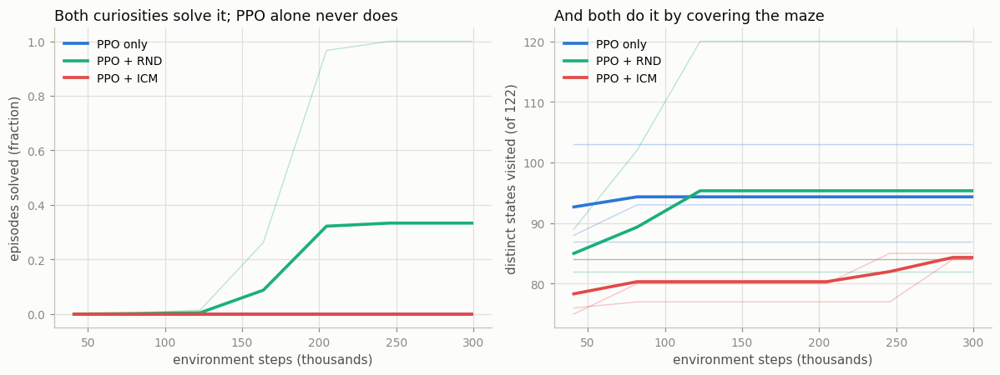
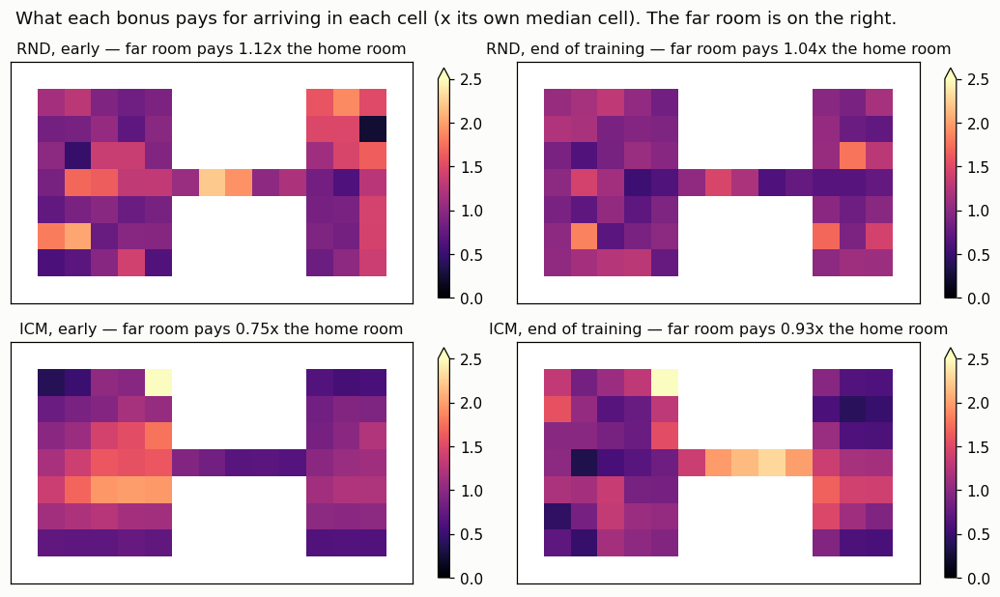
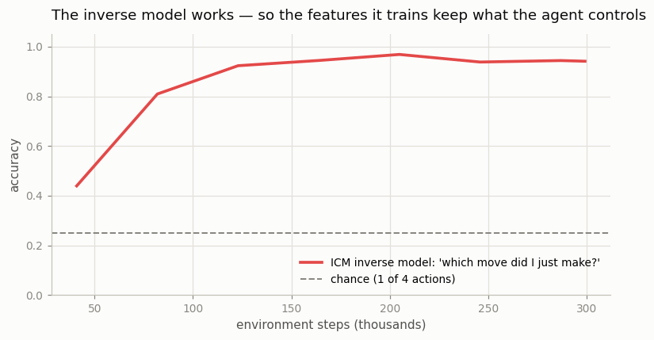

# ICM

## Key Insight

The [Intrinsic Curiosity Module (ICM)](/shared/glossary/#icm) builds its novelty bonus from a [forward model](/shared/glossary/#forward-model) — a network that predicts the *next* state from the current state and action — and pays the agent an [intrinsic reward](/shared/glossary/#intrinsic-reward) equal to how wrong that prediction was, on the logic that surprising transitions are worth revisiting. Its key refinement over [RND](/shared/glossary/#rnd) is *where* it measures surprise: ICM first learns a compact feature space using an *inverse model* (predict which action took you from one state to the next), which keeps only the parts of an observation the agent can actually control and discards uncontrollable visual detail. Why that matters: predicting in this controllable feature space partly protects ICM from the [noisy-TV problem](/shared/glossary/#noisy-tv-problem), where a raw pixel-level predictor would chase random flicker forever. Running ICM and RND on the same task lays bare two different bets on one idea — model the *dynamics* versus distill a *random function* — both aimed at turning prediction error into directed [exploration](/shared/glossary/#exploration-vs-exploitation).

---

## What's in this directory

| File | Role |
|------|------|
| `icm.py` | The `ICM` class (encoder + [inverse model](/shared/glossary/#inverse-model) + forward model), plus `PixelForward` — curiosity that predicts raw pixels, with no feature space at all. [Project 49](../49-noisy-tv-experiment/README.md) imports both. |

The maze, the [PPO](/shared/glossary/#ppo) agent and the RND bonus all come from
[project 46](../46-rnd-on-atari/README.md)'s `explore_lib.py`, unchanged. **Only the bonus
differs** between the three arms, which is what makes this a fair comparison.

```bash
python3 icm.py     # ~8 min: 3 bonuses x 3 seeds, plus bonus heat-maps
```

## The three pieces of ICM

```
   observation s ──► [ phi ] ──► features f
                                   │
   observation s' ─► [ phi ] ──► f'│
                                   │
   INVERSE MODEL:  (f, f') ──────► "which action did I just take?"     ← trains phi
   FORWARD MODEL:  (f, a)  ──────► prediction of f'                    ← makes the bonus

   bonus = || forward_model(f, a) - f' ||²        "how surprised was I?"
```

### Why the inverse model exists at all

A beginner's fair question: if you want to be surprised by the world, why not just predict the
next *picture*? Why bolt on a second network that guesses which button you pressed — surely the
agent already knows which action it took?

It does. The inverse model is **not there to tell the agent anything.** It is there to *train the
encoder*, and it is the only part of ICM that decides what the features are allowed to contain.

To name the action that took you from `s` to `s'`, the features must encode the thing that moved
because of you — your own position. They can safely ignore everything the action does not touch:
swaying trees, other agents, a flickering screen. So the encoder is squeezed into keeping exactly
the **controllable** part of the world and throwing away the rest. The forward model then makes
its predictions in that filtered space, which is what gives ICM its famous partial immunity to
the [noisy-TV problem](/shared/glossary/#noisy-tv-problem) — the whole point of
[project 49](../49-noisy-tv-experiment/README.md).

### And why the forward loss must not touch the encoder

In `icm.py` the features are **detached** before the forward loss sees them:

```python
pred = self.forward_net(torch.cat([f.detach(), a1h], -1))
fwd_loss = 0.5 * (pred - f2.detach()).pow(2).sum(-1).mean()
```

Without that `detach`, the forward loss could reshape the encoder — and it would immediately find
the cheapest way to make prediction error zero forever: **map every observation to the same
constant vector.** Perfect predictions, zero surprise, zero curiosity, dead agent. Detaching means
the encoder answers only to the inverse model, which cannot be gamed that way (a constant feature
vector makes it impossible to name the action, so the inverse loss punishes it).

## The result: ICM does not explore this maze

Same maze, same PPO, 300,000 steps, 3 seeds each.



| bonus | ever found the reward | states seen (of 122) |
|---|---|---|
| PPO only | 0 / 3 | 87, 103, 93 |
| **PPO + RND** | **1 / 3** (step 76k) | **120**, 82, 84 |
| **PPO + ICM** | **0 / 3** | 84, 85, 84 |

ICM did not just lose to RND. **It explored no better than having no bonus at all** — its
coverage (84) is, if anything, slightly *below* plain PPO's (94 on average). Curiosity about
dynamics bought nothing here.

*(Give RND 500k steps instead of 300k and it finds the reward on 3 of 4 seeds — see
[project 46](../46-rnd-on-atari/README.md). The budget here is shorter because three bonuses had to
fit in one run; the ranking is what matters, and it does not change.)*

## Why: the bonus points the wrong way

The heat-maps show what each bonus would pay for stepping into each cell, divided by what it pays
for an ordinary cell. (The normalization matters: RND's raw errors are around 0.0001 and ICM's are
around 20, so only the *shape* of each map — which cells outbid which — can be compared.)



Even on the seed that explored *everything*, RND's far room outbids its home room and ICM's does
not. The test is sharper on a seed that **stalled** — one that never got out of the home room — so
we can ask each bonus what it thinks of a room it has genuinely never seen:

| | bonus in the home room | bonus in the never-visited far room | ratio |
|---|---|---|---|
| **RND** | 0.0001 | 0.0001 | **1.18x** — pays *more* for the unknown |
| **ICM** | 28.1 | 17.3 | **0.62x** — pays *less* for the unknown |

And ICM's ratio gets *worse* as training goes on — across the three seeds it falls from
0.97 → 0.75, 0.67 → 0.57, and 0.73 → 0.44. **ICM is actively paying the agent to stay where it has
already been.** No wonder it never leaves.

### The reason is the thing that made ICM clever

ICM measures surprise inside a **learned** feature space — and that space is learned *only from
states the agent has actually visited*.

- In the **home room**, the encoder has been trained hard. It has rich, large-magnitude features
  there, and the forward model is forever chasing them as they drift (ICM's average bonus *grows*
  during training, from 6.8 to 21.7 — that is not novelty appearing, that is the feature space
  inflating under the predictor's feet).
- In the **far room**, the encoder has never been trained. It maps those observations to a bland,
  low-magnitude corner of feature space — and a bland target is *easy* to predict. Low error. Low
  bonus. **The unexplored room looks boring precisely because it is unexplored.**

That is a self-defeating loop, and it is exactly the trap RND's strangest design choice avoids.
RND's target is a **frozen random network**: it hands every input a rich, distinctive fingerprint
whether the agent has been there or not, because nothing about it is learned from the agent's
experience. Its fingerprints cannot go bland in the places you have never visited.

> **This is why "just predict the next state, it is more principled" is not the free win it
> sounds like.** A learned representation is only trustworthy where it has been trained — and
> exploration is, by definition, about everywhere else.

## What did work: the inverse model



The inverse model reaches **94% accuracy** at naming which of the four moves the agent just made
(chance is 25%). So the encoder really is doing its job: the features keep the agent's own
controllable position and let the rest go. ICM is not broken — it is doing exactly what it was
designed to do.

That feature space is worthless for exploring this maze. It is also the *only* thing that survives
[project 49](../49-noisy-tv-experiment/README.md), where a television full of random static
destroys RND and pixel-level curiosity — and ICM walks straight past it. **The same design
decision is a liability here and a lifesaver there**, which is the most honest summary of the
ICM-vs-RND question anyone can give you.

## What to take away

1. **ICM explored this maze no better than no bonus at all** (coverage 84 vs PPO's 94; 0/3 seeds
   found the reward, versus RND's 1/3 at this budget). Curiosity about *dynamics* is not the same
   thing as curiosity about *places*.
2. **Measured, not guessed: ICM's bonus points backwards.** On a stalled seed it paid 0.62x as
   much for the never-visited far room as for the home room, and the ratio kept falling. RND's
   pointed forwards (1.18x).
3. **A learned feature space goes bland where it has not been trained**, and bland is easy to
   predict, so unexplored regions score as *unsurprising*. RND's frozen random target is immune to
   this because it never learns anything at all — the design choice that looks most arbitrary is
   the one doing the work.
4. **The inverse model does its job** (94% action-recovery accuracy). It keeps only what the agent
   controls — useless for finding a key in a far room, and the difference between life and death
   in front of a noisy television.
5. **Two bets on one idea.** ICM models the world; RND memorizes a fingerprint. On a big, simple,
   sparse world, the fingerprint wins. [Project 49](../49-noisy-tv-experiment/README.md) finds the world where it loses badly.
