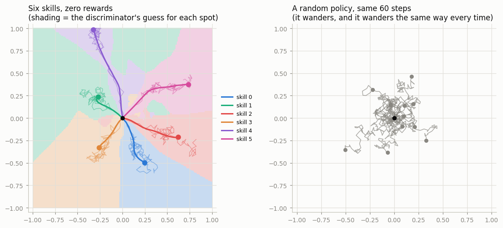
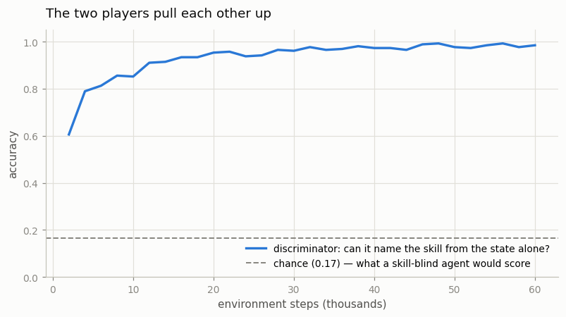
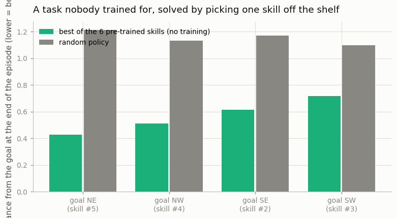

# DIAYN

## Key Insight

[DIAYN (Diversity Is All You Need)](/shared/glossary/#diayn) learns a whole repertoire of distinct behaviors with *no* environment [reward](/shared/glossary/#reward-function) at all — a form of unsupervised [skill discovery](/shared/glossary/#skill-discovery). It hands the [policy](/shared/glossary/#policy) a randomly chosen "skill" code as extra input and rewards it, via an [intrinsic reward](/shared/glossary/#intrinsic-reward), for making its visited states *predictable from the skill yet different across skills* — formally, for maximizing the [mutual information](/shared/glossary/#mutual-information) between the skill code and the states it produces. The effect is that each skill claims its own region of behavior — one learns to run forward, another to flip, another to stand still — without anyone hand-designing those goals. Why it matters: these pre-trained skills become a ready-made action vocabulary that a later reward-driven task can compose, and the idea connects directly to [maximum-entropy RL](/shared/glossary/#maximum-entropy-rl), which similarly prizes a diverse, non-collapsed policy.

---

## What's in this directory

| File | Role |
|------|------|
| `diayn.py` | A reward-free 2D room, six skills, a discriminator, and [SAC](/shared/glossary/#sac) — whose actor, critics and [replay buffer](/shared/glossary/#experience-replay) are imported straight from [project 26](../26-ddpg-on-pendulum/README.md)'s `cc_lib.py`. Then a downstream test on four goals nobody trained for. |

```bash
python3 diayn.py     # ~7 min
```

## The setup

The environment is a dot in a square room. It has no goal, no walls, and **no reward, ever**.
The agent invents its own job:

```
   1. Before each episode, roll a die:  "today I am skill z"     (z = 0..5)
   2. A DISCRIMINATOR q(z | s) watches the states you visit
      and tries to guess which skill you are.
   3. Your reward is:   log q(z | s) - log p(z)
                        \___________/   \_____/
                        "how sure is    a constant: log(1/6).
                         the guesser     Subtracting it makes the
                         that I am z?"   reward 0 for a skill that
                                         is no more identifiable
                                         than a coin flip.
```

To be easy to guess, a skill must go where the other skills do not. Six skills all racing to be
recognizable end up carving the room into six territories — and that is the entire algorithm.

### Why a separate discriminator, when the policy already knows its own skill?

The obvious objection. We *hand* the policy `z` as an input. It knows perfectly well which skill
it is. So why train a second network to guess something we already know?

Because knowing `z` is the **question**, not the answer. Nothing about receiving `z` as an input
forces the policy to *do* anything different with it — a policy that ignores `z` entirely and
wanders identically for all six values would be perfectly happy, and that is exactly what a
freshly initialized network does.

The discriminator is the part that cannot be fooled, because **it never sees `z`. It sees only the
states.** So the only way to earn its confidence is for the behaviour itself to give the skill
away. It converts "please be different" from a wish into a number the agent can climb:

| | sees the skill code? | job |
|---|---|---|
| **policy** | yes | *act* on it |
| **discriminator** | **no** | *detect* it — from the states alone |

That gap is where the whole learning signal lives. And the two of them pull each other up: the
discriminator gets better at reading behaviour, so behaviour must become more distinctive to stay
readable, so the discriminator must get sharper still.

### One more thing that looks redundant: the reward is not stored

In `diayn.py` the reward is **recomputed from scratch every time a batch is sampled** from the
[replay buffer](/shared/glossary/#experience-replay), instead of being written down when the
transition happened:

```python
with torch.no_grad():
    r_int = F.log_softmax(disc(state2), dim=-1).gather(1, skill.unsqueeze(1)) - log_pz
```

Why not just save the number? Because DIAYN's reward is *defined by the discriminator*, and the
discriminator is a moving target. A bonus computed 40,000 steps ago was scored by a much worse
judge and no longer means anything — it is a grade from an examiner who has since learned the
subject. Relabelling every sampled batch with the **current** judge keeps the critic learning
today's objective instead of a fossil.

## Result: six skills, out of nothing



The left panel is the whole idea in one picture. Six skills, trained with **zero** environment
reward, have each claimed a direction: one goes north, one north-east, one south, and so on. The
shading is the discriminator's opinion — which skill it would guess for a dot standing at each
spot — and the room has been partitioned into six territories that the trajectories run straight
into.

The right panel is a policy that was never given a reason to be different: it wanders, and it
wanders the same way every time. Both agents saw exactly zero reward from the environment.



| | value |
|---|---|
| discriminator accuracy | **0.98** (chance = 1/6 = 0.17) |
| intrinsic reward earned | **1.745** |
| theoretical maximum (`log 6`) | **1.792** |

The reward reaches **97% of its ceiling**, and the ceiling is not arbitrary: the objective *is*
the [mutual information](/shared/glossary/#mutual-information) between the skill and the state,
which cannot exceed the entropy of the skill distribution — `log 6 = 1.79` [nats](/shared/glossary/#entropy-regularization)
when six skills are drawn uniformly. (A *nat* is simply the unit information is measured in when
you use natural logarithms — the natural-log counterpart of a *bit*.) The agent has extracted
essentially all the information that six skills can carry: watch where the dot goes, and you know
which skill it is.

## Are the skills any use?

A skill library is only interesting if a later task can spend it. So: invent four goals nobody
trained for — the four corners — and, **with no learning at all**, simply try each of the six
skills once and keep whichever lands closest.



| goal | best skill | its final distance | random policy |
|---|---|---|---|
| NE | #5 | **0.43** | 1.21 |
| NW | #4 | **0.51** | 1.13 |
| SE | #2 | **0.61** | 1.17 |
| SW | #3 | **0.72** | 1.10 |

Each corner is claimed by a **different** skill — the library really does span directions — and
picking one off the shelf gets you 2–3x closer than the untrained policy, for the price of six
rollouts and no gradient steps at all. That is the promise of unsupervised pre-training in
miniature: the expensive part (learning to *move* somewhere on purpose) is already paid for, and
the task only has to choose.

## The limitation hiding in those numbers

Look again at the distances: the best skill for the NE corner ends up **0.43 away from it**. It
does not arrive. And in the picture, no trajectory reaches a corner — the skills stop at a
comfortable middle distance.

That is not a training failure. **It is the objective getting exactly what it asked for.**

Mutual information rewards skills for being **distinguishable**, not for being **far**. Once six
skills occupy six clearly separate regions, the discriminator is at 98% and the reward is at 97% of
its ceiling — there is no further gradient at all. Travelling to the far corner would earn the
agent *nothing extra*, because it is already perfectly identifiable where it stands.

> **"Diversity" and "coverage" are not the same thing, and DIAYN optimizes the first one.** Six
> skills that each shuffle a few centimetres in six different directions would satisfy this
> objective completely, and in bigger environments that is exactly the failure people report —
> the skills become distinguishable rather than useful.

This is worth holding next to the rest of Phase 8. [RND](../46-rnd-on-atari/README.md) and
[ICM](../47-icm/README.md) chase the *frontier*: go where you have never been. DIAYN chases
*separation*: be reliably different from your siblings. Those are different goals, and it explains
why DIAYN is used as a **pre-training** stage — a way to obtain a vocabulary of behaviours cheaply
— rather than as a way to solve a hard-exploration game. (Later methods in this family, such as
DADS and APT, attack precisely this gap by rewarding skills for *covering* the state space, not
merely partitioning it.)

## What to take away

1. **You can learn six distinct behaviours with no reward whatsoever.** The environment paid
   exactly zero, at every step, for the entire run.
2. **The discriminator is the trick, and it works because it is blind to the skill code.** The
   policy is told which skill it is; the discriminator must *infer* it from states alone, so the
   only way to score is to make the behaviour itself informative.
3. **It hits the information ceiling**: 1.745 of a possible `log 6 = 1.792` nats, with the
   discriminator at 98% versus 17% chance.
4. **The skills transfer for free.** Four goals nobody trained for, solved 2–3x better than random
   by simply picking the right skill off the shelf — no gradients.
5. **Distinguishable is not the same as useful.** No skill reaches a corner, because once six
   skills are separable the objective is satisfied and the gradient dies. If you want coverage, you
   must ask for coverage.
