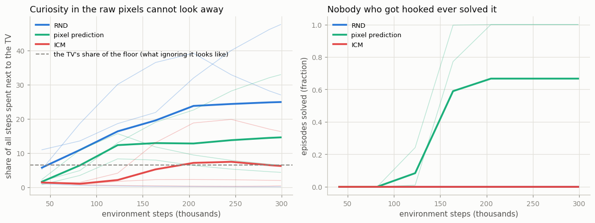
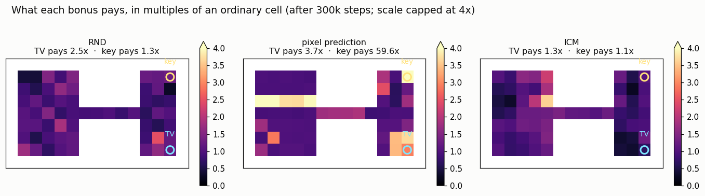

# Noisy-TV Experiment

## Key Insight

The [noisy-TV problem](/shared/glossary/#noisy-tv-problem) is the Achilles' heel of simple [prediction-error](/shared/glossary/#prediction-error) [exploration](/shared/glossary/#exploration-vs-exploitation) methods, and this project reproduces it on purpose. You drop a "television" into the environment that displays fresh random static every step; because the static is truly unpredictable, a naive pixel-level curiosity agent — or one using [RND](/shared/glossary/#rnd) (which maps raw [states](/shared/glossary/#state) through a fixed random network) — earns a large [intrinsic reward](/shared/glossary/#intrinsic-reward) *every single time it looks at the screen*, so it sits and stares forever instead of exploring. Why it matters: it draws the sharp line between *novelty* (something genuinely new to learn) and mere [stochasticity](/shared/glossary/#stochasticity) (randomness you can never learn), and it explains why methods like the [ICM (Intrinsic Curiosity Module)](/shared/glossary/#icm) measure surprise in a learned, controllable [feature space](/shared/glossary/#feature-space) (ignoring the uncontrollable static) rather than over raw pixels.

---

## What's in this directory

| File | Role |
|------|------|
| `noisy_tv.py` | The same maze, the same [PPO](/shared/glossary/#ppo), the same three bonuses — plus a television. Everything is imported from [project 46](../46-rnd-on-atari/README.md) (`explore_lib`) and [project 47](../47-icm/README.md) (`ICM`, `PixelForward`); this project adds **one 3x3 patch of random static** and measures who cannot look away. |

```bash
python3 noisy_tv.py            # ~8 min: 3 bonuses x 3 seeds
python3 noisy_tv.py --plot     # redraw the figures from saved curves, no retraining
```

## The trap

The television sits in the corner of the far room. Stand next to it and a 3x3 patch of the
observation fills with **fresh random static — a picture nobody has ever seen, and nobody will
ever see again**:

```python
if abs(self.pos[0] - TV[0]) <= 1 and abs(self.pos[1] - TV[1]) <= 1:
    o[5, TV[1]-1:TV[1]+2, TV[0]-1:TV[0]+2] = self.rng.random((3, 3))
```

That is the entire change. Now think like a curiosity agent whose bonus is *"how badly did I
predict this?"*:

- Every frame of static is new, so the prediction error is high.
- You train on it, and the error **does not go down** — there is nothing to learn. The next sheet
  of static is independent of every sheet you have ever studied.
- So the bonus never fades. To a machine that defines novelty as prediction error, this corner is
  *permanently* novel.

An agent optimizing that bonus does the rational thing: it walks to the corner, sits down, and
watches television. This is not a bug in the code. **It is the bonus working exactly as
specified**, in a world where "surprising" and "worth learning" have come apart.

### The distinction the whole phase turns on

| | example | can prediction error tell them apart? |
|---|---|---|
| **Novelty** | a room you have not entered | error is high **now**, and *falls* once you study it |
| **[Stochasticity](/shared/glossary/#stochasticity)** | a screen of random static | error is high **forever** — studying it changes nothing |

At any single moment the two look identical. That is why this is hard, and why "reward the agent
for being surprised" is not a complete idea.

## The result

Three bonuses, three seeds each, 300,000 steps. The reference line is **6.6%** — the TV's share of
the walkable floor, which is how often an agent that spreads its time evenly and *ignores* the
television would find itself beside it by chance.



| bonus | time at the TV | vs. ignoring it | solved the maze | states seen |
|---|---|---|---|---|
| **RND** | **24.9%** | **3.8x** | 0 / 3 | 84 |
| **pixel prediction** | 14.6% | 2.2x | **2 / 3** | 115 |
| **ICM** | **6.2%** | **0.9x** — the "ignore it" rate | 0 / 3 | 91 |

Per seed, because the average hides the real spread:

| bonus | seed 0 | seed 1 | seed 2 |
|---|---|---|---|
| RND | **27.0%** — no solve | **47.6%** — no solve | 0.1% — no solve |
| pixel prediction | 6.5% — **solved** | 4.3% — **solved** | **32.9%** — no solve |
| ICM | 0.4% — no solve | 2.0% — no solve | 16.3% — no solve |

And now the one line this project exists to produce, across all nine runs:

> **Every run that spent more than 20% of its life at the television — three of them — solved
> nothing. Both runs that solved the maze spent under 7% of their time there.**

Getting hooked is not a quirk. It is fatal, every time it happens, to whichever method it happens
to.

### The cost, on a single seed

The sharpest comparison needs no averaging at all. Take **RND, seed 0**: same code, same seed, same
300,000 steps, in [project 47](../47-icm/README.md)'s maze and in this one. The only difference in
the world is a television in the corner.

| RND, seed 0 | states explored | solved the maze? | time at the TV |
|---|---|---|---|
| maze **without** a TV ([project 47](../47-icm/README.md)) | **120 / 122** | **yes, at step 76k** | — |
| maze **with** a TV (here) | 84 / 122 | **no, never** | **27%** |

**A television in the corner of the room cost RND the only success it had.** It explored a third
less of the world and never found the door — not because the maze got harder, but because it found
something better to do.

## Where each bonus is actually pointing

The heat-maps show what each bonus would pay for stepping into each cell of the maze. Two cells
decide everything: the **television**, and the **key** — the one object the task actually requires.



Relative to an ordinary cell (mean of 3 seeds; the figure shows seed 0):

| bonus | pays for the **key** | pays for the **TV** | and so the agent... |
|---|---|---|---|
| **RND** | 1.1x | **2.3x** | ...finds the TV twice as interesting as the key. **Watches TV. Solves nothing.** |
| **pixel prediction** | **25.8x** | 2.8x | ...finds the key **9x** more interesting than the TV. **Fetches the key. Solves the maze.** |
| **ICM** | 2.0x | 1.5x | ...mildly prefers the key, but both signals are weak. **Does neither.** |

**Every agent went exactly where its bonus pointed.** There is no mystery left in the behaviour
once you have this table — the entire result is written in it before a single episode is run.

And the TV's premium is **permanent by construction** for RND and pixel prediction: ordinary cells
become familiar and their bonus decays toward zero, while the TV can never become familiar. RND's
premium starts at 3.9x and is still 2.3x after 300k steps; pixel prediction's goes 3.7x → 2.8x.
Nothing you can do with more training will wear it down.

### Why pixel prediction is so excited about the key

Because picking up the key changes **more of the picture than anything else in this world**: the key
sprite vanishes from its shelf and reappears on the agent, *and* the whole "am I carrying the key?"
plane flips from all-zeros to all-ones — over a hundred pixels at once. A predictor that works in
raw pixels is enormously surprised by that. RND is not: its frozen fingerprint of that state is
simply one more fingerprint it has already learned, so its error there has faded like everywhere
else.

**But do not read that as "pixel prediction is better".** It is a *lucky alignment* between "what
changes the most pixels" and "what the task needs". In real Atari, a key is a handful of pixels on
a 210x160 screen while a flickering background changes hundreds — and then the same bonus points
straight at the flicker. Pixel-level curiosity is a bet that **visual change equals importance**,
and this maze is a world where that bet happens to pay.

ICM escapes because of the design decision that looked like bureaucracy in
[project 47](../47-icm/README.md): **it does not predict the observation. It predicts its own
features — and those features are trained only to answer "which action did I just take?"**

The static is useless for answering that question. It looks the same whether you moved left, right,
up or down; nothing you do affects it. So the encoder, squeezed to keep only what helps name the
action, **throws the static away**, and the forward model never has to predict it. There is no
surprise left to pay for.

> **This is the point of the inverse model, and the whole reason ICM is more than "predict the next
> frame".** Not *predict better* — **predict something else**. The bonus lives in a space that
> structurally cannot contain what the agent has no control over.
>
> ICM's premium is 1.5x rather than 1.0x, and one seed still gave the TV 16% of its time, so a
> little static does leak through the encoder. **Partial immunity, not a vaccine** — which is
> exactly how the literature describes it.

## The two results nobody plans for

**1. Immunity is not competence.** ICM ignored the television beautifully — and still solved
nothing (0/3). Of course it did: [project 47](../47-icm/README.md) showed that ICM never solves
this maze *even with no television in it*, because its bonus points backwards, toward the room it
already knows. Being un-trappable is not the same as being able to explore. **An agent that ignores
everything ignores the television too.**

**2. The naive method won.** Pixel prediction — curiosity with no feature space at all, the
strawman of the story — is the only method that solved the maze here, twice. Its TV vulnerability is
real (its third seed sat in front of the screen for a third of its life and solved nothing), but two
of its three runs stayed away and explored 115 of 122 states.

The heat-map table above explains why, and the explanation is not flattering to anybody: the key
outbid the television, 25.8x against 2.8x. The television is exactly as unlearnable for pixel
prediction as it is for RND — but pixel prediction had **something better to want**, and RND did
not, because RND's novelty had already faded everywhere it had been.

> **How badly the noisy TV hurts you depends on what else your bonus still has to pay for.** A
> novelty detector that has done its job well — one whose bonus has decayed everywhere it has
> looked — is precisely the one left with nothing to want except the static.

## What to take away

1. **The trap is real, reproducible, and fatal.** Three of nine runs spent over 20% of their lives
   in front of a 3x3 patch of static (one of them 48%), and **not one of them solved the maze**.
   Both runs that did solve it spent under 7% of their time there.
2. **It cost RND a solved maze.** Same seed, same budget: 120 states and a solution without the TV;
   84 states and nothing with it.
3. **Prediction error cannot tell "new" from "random."** Both look surprising in the moment. The
   difference only appears over time — genuine novelty *fades* as you study it, noise never does —
   and a bonus computed from one step cannot see that.
4. **ICM's inverse model really is the cure.** Features trained to name your own action cannot
   contain what your action does not affect, so the static is filtered out before the bonus exists.
   Its time at the TV (6.2%) is indistinguishable from ignoring it (6.6%).
5. **But immunity bought nothing here**: ICM still solved nothing, because it could not explore
   this maze in the first place ([project 47](../47-icm/README.md)). And the crude pixel predictor,
   which *is* vulnerable, solved it twice — because the key outbid the television in its bonus
   (25.8x vs 2.8x), while for RND the television outbid the key (2.3x vs 1.1x).
6. **Agents go where the bonus points, and nowhere else.** Read the two-column table of what each
   bonus pays for the key and for the TV, and you can predict every result in this project without
   running it. Designing an exploration bonus *is* deciding what your agent will find interesting —
   there is no other lever.
7. **So there is no winner in this phase, only trade-offs.** RND finds rooms and cannot look away
   from noise. ICM ignores noise and cannot find rooms. Pixel prediction won here on a coincidence
   that will not survive a real game. That is what "exploration is unsolved" actually means, and you
   have now measured it.
