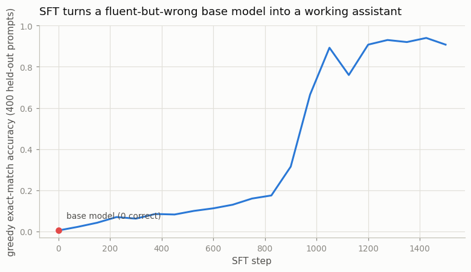

# SFT a Small Base Model

## Key Insight

[Supervised fine-tuning (SFT)](/shared/glossary/#sft) is the first post-training stage and the foundation every later [RLHF](/shared/glossary/#rlhf) step builds on: you take a [base model](/shared/glossary/#base-model) — a raw next-word predictor fresh out of [pretraining](/shared/glossary/#pretraining) that only knows how to continue text — and [fine-tune](/shared/glossary/#fine-tuning) it on a dataset of (instruction, response) demonstrations so it learns to *follow requests* instead of merely autocompleting them ([instruction tuning](/shared/glossary/#instruction-tuning)). Mechanically it is plain [supervised learning](/shared/glossary/#supervised-learning): the demonstrated response is the answer key, and the model is trained with a [cross-entropy](/shared/glossary/#cross-entropy) loss to reproduce those tokens. This project fine-tunes a small base model (e.g. [Qwen-0.5B](/shared/glossary/#qwen)) on a compact instruction dataset so you can watch a brilliant-but-aimless autocomplete turn into a usable assistant. Why it matters: SFT alone produces a decent model, and the resulting checkpoint becomes the frozen [reference model](/shared/glossary/#reference-model) that the [reward model](/shared/glossary/#reward-model), [PPO](/shared/glossary/#ppo), and [DPO](/shared/glossary/#dpo) stages all measure their changes against.

---

## What's in this directory

| File | Role |
|------|------|
| `rlhf_lib.py` | The shared stack for the whole phase: a ~1.6M-parameter char-level GPT, the addition task, SFT training, batched generation, log-prob helpers, and the reward-model class. Projects 51–57 all import from this file. |
| `sft.py` | This project: builds a "base model", SFT-tunes it, and tracks accuracy while it learns. |

```bash
python3 sft.py     # ~2 min on CPU, one figure + sample tables
```

## The whole phase runs on one tiny task

The projects in this phase are about post-training *LLMs*, but a 0.5B-parameter model needs
hours per experiment on a CPU-only box. So we shrink the setup as far as it will go while
keeping every moving part of the real pipeline:

```
prompt      "37+8="      (the user's request)
completion  "45;"        (the assistant's answer; ';' means "I'm done")
```

The model is a 4-layer [transformer](/shared/glossary/#transformer) with a 13-character
vocabulary (`0-9`, `+`, `=`, `;`). It is a genuine
[autoregressive language model](/shared/glossary/#autoregressive-model) — "auto" (self) +
"regressive" (predicting from its own past): it writes one character at a time, and each
written character is fed back as input when predicting the next.

Why *addition*, of all tasks? Because a three-line function can check any answer exactly:

```python
def is_correct(a, b, completion):
    return completion.split(";")[0] == str(a + b)
```

That checker — the [verifier](/shared/glossary/#verifier) — is the quiet star of this phase.
Correct-vs-wrong gives us preference pairs for free
([project 51](../51-train-a-reward-model/README.md), [53](../53-dpo/README.md)), an exact
reward for RL ([project 54](../54-grpo-from-scratch/README.md),
[55](../55-rlvr-on-math/README.md)), and — just as important — an honest measuring stick
that no model can fool. Real RLHF usually has *no* such stick (that is exactly why it needs
a learned reward model), so building the pipeline on a task where ground truth is knowable
lets us compare, at every step, *what the model optimizes* against *what is actually true*.
[Projects 52](../52-ppo-style-rlhf/README.md) and
[57](../57-reward-hacking-demo/README.md) live entirely inside that gap.

## Step 1: manufacture a "base model"

A real base model has read the whole web: it is fluent, but it completes text rather than
answering questions. We imitate that in miniature by pretraining for 150 steps on arithmetic
text with **random wrong answers** — strings like `"37+8=91;"`. The format is perfectly
consistent; the content is noise.

> **Why bother with a wrong-answer stage instead of just training on correct sums from
> scratch?** Because the gap between those two models is the very thing SFT exists to
> close, and we want to *see* it. A base model is not an empty network: it already knows the
> *form* of its training text (here: "after `=` come digits, then `;`") without reliably
> doing the *task*. Starting SFT from a fluent-but-wrong model reproduces the real
> situation. Training from scratch on correct answers would work here, but it would skip the
> demonstration.

The manufactured base behaves eerily like the real thing. Ask it anything and it answers
*something* well-formed:

```
prompt        base completion
20+9=         15;
25+41=        15;
3+4=          15;
13+2=         15;        <- correct, by pure luck
```

It has collapsed onto a single plausible-looking guess: when the answers in your training
text are random, the loss-minimizing move is to always predict a "typical" answer, and this
model settled on `15;`. Accuracy: **0.005**. Fluent format, zero arithmetic — an
autocomplete parrot.

## Step 2: supervised fine-tuning

Now fine-tune on correct demonstrations, `"37+8=45;"`, with one detail every real SFT
pipeline shares: **loss masking**. The cross-entropy loss is computed only on the *answer*
tokens, never on the prompt tokens:

```python
m = [1.0 if i >= eq else 0.0 for i in range(BLOCK)]   # grade only after '='
```

> **Why mask the prompt? The model reads it either way.** Reading and *being graded on* are
> different things. Without the mask, part of every gradient step would push the model to
> predict the prompt itself — "after `3` comes `7`" — but our prompts are random numbers, so
> those tokens are unpredictable noise and the capacity spent on them is wasted. The mask
> says: *condition on the question, imitate only the answer.* The same masking reappears in
> every later project, wherever a loss or an RL update must touch only the tokens the model
> chose.



The learning curve is worth staring at. Accuracy crawls for 900 steps (0.005 → 0.16 by step
750), then leaps to ~0.89 within 150 steps. The model spends a long time on surface
patterns, then rather suddenly assembles a working addition procedure — a small-scale
version of the sudden capability jump called [grokking](/shared/glossary/#grokking). Final
greedy accuracy: **0.907**, and the same eight prompts now read:

```
prompt        SFT completion
20+9=         29;      ok
25+41=        66;      ok
3+4=          4;       WRONG
34+6=         40;      ok
```

| model | greedy accuracy |
|---|---|
| base (150 steps of wrong-answer text) | 0.005 |
| + SFT, 750 steps | 0.160 |
| + SFT, 1500 steps | **0.907** |

All evaluations decode with [greedy decoding](/shared/glossary/#greedy-decoding)
([temperature](/shared/glossary/#temperature) 0) — always pick the most likely next
character — so a model's score never depends on sampling luck.

## The checkpoint the rest of the phase starts from

The RL and preference projects don't want the *finished* 0.907 model: a policy that is
already right nine times in ten leaves RL almost nothing to teach. They start instead from a
deliberately **partial** SFT model, stopped at 650 steps — just *before* the accuracy cliff:

```python
policy = rlhf_lib.sft_model()      # 650 steps -> greedy accuracy 0.360
```

This 0.360 policy is fluent, always answers in the right format, gets a third of sums right
— and has real headroom. Watch what each later project does with it:

| starting from 0.360 | method | reward signal | ends at |
|---|---|---|---|
| [project 52](../52-ppo-style-rlhf/README.md) | PPO | learned reward model | 0.298 |
| [project 53](../53-dpo/README.md) | DPO | preference pairs | 0.458 |
| [project 54](../54-grpo-from-scratch/README.md) | GRPO | exact verifier | **0.522** |

One pattern to watch for while reading them: **the trustworthiness of the reward signal,
more than the sophistication of the algorithm, decides the outcome.**

## What to take away

1. **A base model is fluent before it is useful.** 150 steps of format-only pretraining
   produced perfect syntax and a constant wrong guess — exactly the "brilliant autocomplete,
   aimless assistant" gap that SFT exists to close.
2. **SFT is ordinary supervised learning plus a mask.** Demonstrations in, cross-entropy on
   the answer tokens only. No rewards, no rollouts — that machinery starts in
   [project 51](../51-train-a-reward-model/README.md).
3. **Capability can arrive as a cliff, not a slope.** 900 steps of crawling, then +73
   accuracy points in 150 steps. When you evaluate a model mid-training, know which side of
   the cliff you are on — the RL projects deliberately start on the *left* side.
4. **The SFT checkpoint anchors everything after it.** It becomes the frozen reference that
   the KL penalty ([project 52](../52-ppo-style-rlhf/README.md)), the DPO loss
   ([project 53](../53-dpo/README.md)), and the GRPO update
   ([project 54](../54-grpo-from-scratch/README.md)) all measure drift against.
