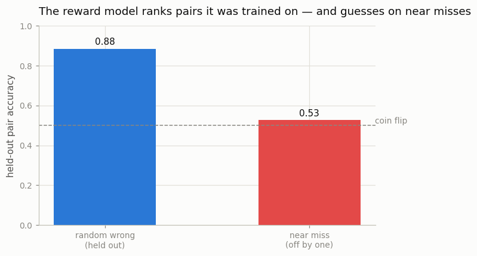
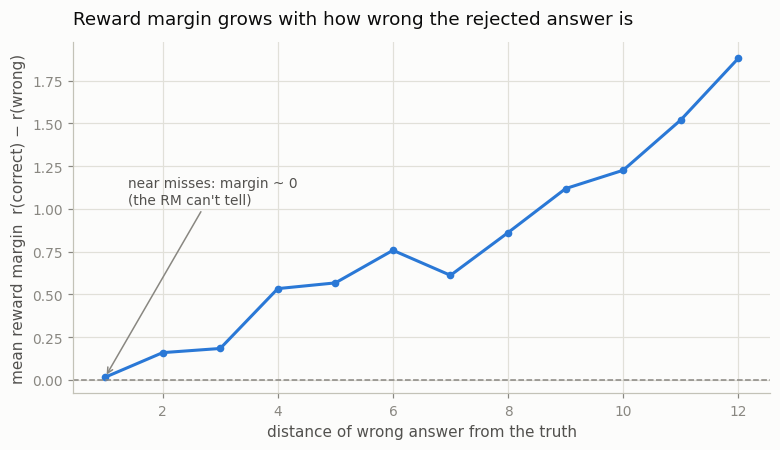

# Train a Reward Model

## Key Insight

A [reward model](/shared/glossary/#reward-model) is the piece of classic [RLHF](/shared/glossary/#rlhf) that turns subjective human taste into a single number an algorithm can optimize: it scores how good a completion is, standing in for a human rater so millions of answers can be graded automatically. You build it by taking your [SFT](/shared/glossary/#sft) model, swapping its next-token head for a head that outputs one scalar, and training on (prompt, chosen, rejected) triples with the [Bradley-Terry](/shared/glossary/#bradley-terry) loss — which simply pushes the chosen completion's score above the rejected one's, learning *relative* preference rather than any absolute "correct" value. This project trains such a pairwise classifier over your SFT outputs and checks it on held-out preferences. Why it matters: the reward model is the target that [PPO](/shared/glossary/#ppo)-style RLHF then optimizes against — and because it is only an imperfect *proxy* for what humans want, it is exactly the component a policy will later learn to [reward-hack](/shared/glossary/#reward-hacking).

---

## What's in this directory

| File | Role |
|------|------|
| `rm.py` | Trains the reward model on 3,000 preference pairs, then probes it on pairs it was never designed to handle. The `RewardModel` class and `train_reward_model` live in [project 50](../50-sft-a-small-base-model/README.md)'s `rlhf_lib.py`, because projects 52 and 57 need them too. |

```bash
python3 rm.py     # ~1 min on CPU, two figures
```

## From next-token head to score head

A reward model is architecturally almost the language model it grades. We take the same GPT
body and swap the final layer:

```
language model:  hidden state (128 numbers)  ->  13 logits   "which char comes next?"
reward model:    hidden state (128 numbers)  ->  1 scalar    "how good is this text?"
```

The scalar is read at the **last token** of (prompt + completion) — the one position whose
hidden state has seen the entire exchange.

> **Why reuse a whole transformer just to output one number?** Because judging an answer
> requires the same understanding as writing one: the model must parse the prompt, track the
> numbers, and relate them to the proposed answer. A small fresh network fed raw characters
> would have to relearn all of that from 3,000 pairs. In real RLHF pipelines the reward
> model is typically *initialized from the SFT model itself* for exactly this reason — the
> judge starts out knowing everything the writer knows.

## Learning from comparisons, not grades

Human raters are bad at absolute scores ("this answer is a 7.3/10") and good at comparisons
("A is better than B"). So preference data comes as pairs, and the loss only cares about the
*difference* of the two scores:

```python
loss = -F.logsigmoid(rm.reward(chosen) - rm.reward(rejected))
```

This is the **Bradley-Terry model** — named after Ralph Bradley and Milton Terry, who
proposed it in 1952 for ranking sports teams from match results. It assumes the probability
that A beats B grows smoothly with the score gap `r(A) − r(B)` (through a
[sigmoid](/shared/glossary/#sigmoid), so a gap of 0 means a 50/50 call). Chess Elo ratings
are the same idea. Nothing in the loss ever defines "good" in absolute terms — only *better
than* — which is why a reward model's raw score has no meaningful units or zero point.

Our stand-in for the human rater is the [verifier](/shared/glossary/#verifier): for each
prompt the **chosen** side is the correct sum (`"45;"`) and the **rejected** side is a
random wrong number (`"91;"`). 3,000 such triples, six [epochs](/shared/glossary/#epoch),
about 19 seconds.

## The probe: pairs it never saw

Held-out accuracy — how often the RM ranks the correct answer above the wrong one — on two
kinds of pairs:



| held-out pair type | RM ranks correct answer higher |
|---|---|
| rejected = random wrong number | **0.884** |
| rejected = off by one (never trained on) | **0.527** ≈ coin flip |

On the distribution it was trained on, the RM is a solid judge. On **near misses** — `37+8=44`
instead of `45` — it is guessing. And this is not a training bug to be fixed with more
epochs; sweeping the wrong answer's distance from the truth shows the judgment fading
smoothly as errors get subtle:



The mean margin `r(correct) − r(wrong)` is ~0.02 at distance 1 (statistically nothing),
0.53 at distance 4, and 1.88 at distance 12. The RM learned "answers wildly far from
plausible are bad" — a real, useful skill — but it never *does the addition*, so answers
that are wrong in a plausible way score like correct ones.

> **Isn't the fix just to train on near-miss pairs too?** It helps less than you'd hope: to
> rank `45` above `44` the judge must actually compute `37+8`, which is the very skill the
> policy itself is struggling to learn — a judge bootstrapped from the same small model
> cannot reliably out-compute it (the sibling LLM-guide experiment measured ~0.47–0.51 even
> when trained on near-miss pairs). The deeper point stands for real RLHF: **a learned
> reward model is competent exactly on the distribution of mistakes it was trained to
> judge**, and optimization pressure will push the policy *off* that distribution — toward
> mistakes the judge cannot see.

## Why this blind spot is the story of the phase

Keep the two numbers 0.884 / 0.527 in mind while reading the next projects:

- [Project 52](../52-ppo-style-rlhf/README.md) optimizes a policy against this exact RM with
  PPO — and true accuracy *drops* while the RM's score climbs, because the policy's
  near-misses all pass the judge.
- [Project 57](../57-reward-hacking-demo/README.md) removes the KL leash and lets PPO
  over-optimize: the policy converges onto confidently-wrong near-miss answers — the RM's
  blind spot, weaponized.
- [Projects 54](../54-grpo-from-scratch/README.md) and [55](../55-rlvr-on-math/README.md)
  replace the learned judge with the exact verifier, and the same RL machinery suddenly
  works — the blind spot, not the algorithm, was the bottleneck.

## What to take away

1. **A reward model is your language model wearing a judge's robe.** Same transformer body,
   next-token head swapped for a scalar head, score read at the final token.
2. **Preferences are learned from comparisons.** The Bradley-Terry loss (1952, invented for
   ranking sports teams) trains on score *differences*; absolute reward values mean nothing
   on their own.
3. **It reproduces its training distribution, not the truth.** 0.884 on the pair type it was
   trained on; 0.527 — a coin flip — on near misses it never saw.
4. **Margins fade as errors get subtle.** From 1.88 at distance 12 down to ~0 at distance 1:
   the judge grades plausibility, not arithmetic.
5. **Every learned judge has a blind spot somewhere** — and RL optimization is a search
   process that will find it. That is the whole plot of projects 52 and 57.
