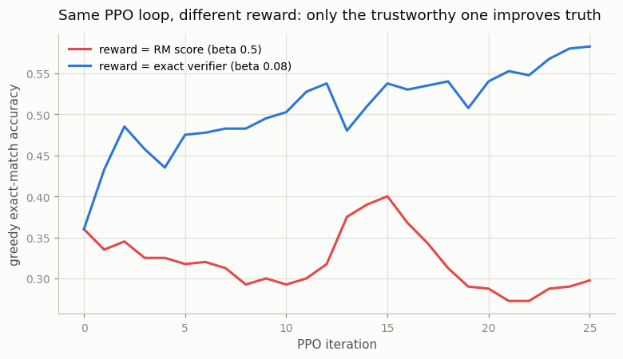
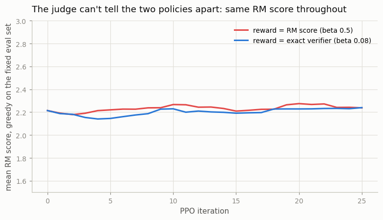
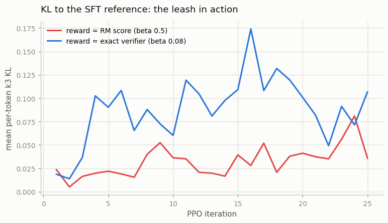

# PPO-Style RLHF

## Key Insight

This is the original [RLHF](/shared/glossary/#rlhf) recipe behind InstructGPT and ChatGPT: treat the prompt as the state, the generated completion as a sequence of actions, the [reward model](/shared/glossary/#reward-model)'s score as a terminal [reward](/shared/glossary/#reward-function), and run [PPO](/shared/glossary/#ppo) to nudge the [policy](/shared/glossary/#policy) (the language model) toward higher-scoring completions. The catch is a [KL-divergence](/shared/glossary/#kl-divergence) penalty back to the frozen [reference model](/shared/glossary/#reference-model): without that leash the policy quickly [reward-hacks](/shared/glossary/#reward-hacking) — producing gibberish the reward model happens to rate highly — so the penalty keeps it improving slowly toward what humans actually want. This project runs a mini-RLHF loop on a small model and small reward model while tracking the KL to the reference. Why it matters: PPO-RLHF is powerful but notoriously fiddly (a separate value head, [advantage](/shared/glossary/#advantage) estimates on token-level returns, KL scheduling), and feeling that fragility firsthand is exactly why later methods like [DPO](/shared/glossary/#dpo) and [GRPO](/shared/glossary/#grpo) exist to remove moving parts.

---

## What's in this directory

| File | Role |
|------|------|
| `ppo_rlhf.py` | The mini-RLHF loop. Two arms share the identical `ppo_train` function and differ in ONE argument: where the reward comes from. [Project 57](../57-reward-hacking-demo/README.md) imports `ppo_train` to over-optimize on purpose. |

```bash
python3 ppo_rlhf.py     # ~2.5 min on CPU, three figures
```

## Language modeling, dressed as an MDP

The first thing PPO-RLHF asks you to do is squint at text generation until it looks like the
MDPs from Phase 1:

| RL concept | in RLHF |
|---|---|
| state | the prompt plus tokens generated so far |
| action | the next token (one of 13 characters here) |
| episode | one completion, ending at `;` |
| reward | **0 on every token** until the end; then the RM scores the whole text |

That last row is why this is genuinely hard RL: the reward is terminal and the policy must
figure out which of its token-actions deserve credit
([credit assignment](/shared/glossary/#credit-assignment)). InstructGPT's answer is the full
PPO kit from [project 22](../22-ppo-from-scratch/README.md): a value head to estimate
per-state expected reward, [GAE](/shared/glossary/#gae) to spread the terminal reward over
tokens, clipped ratios, KL control.

Our completions are at most 4 tokens, so we can afford one honest simplification: instead
of a *learned* value head we use the batch mean as the baseline —
`adv = (r - r.mean()) / (r.std() + 1e-4)`, broadcast to every token of the completion.

> **Doesn't dropping the value head change the algorithm?** It swaps a learned,
> prompt-specific baseline for a crude global one — fine at 4 tokens per episode, where
> there is barely any "which token deserves credit" question to answer. With
> hundreds-of-tokens completions the value head becomes load-bearing (this is PPO's main
> *moving part* — the thing GRPO later deletes by using a group mean instead; see
> [project 54](../54-grpo-from-scratch/README.md)). Two fiddly details survive even at toy
> scale, and they are instructive: the standardized advantage must be **clipped to ±3**,
> because the RM scores completions in a narrow band (its std can be tiny, and dividing by
> a tiny std makes advantages explode); and the KL estimate must clamp its log-ratio,
> because a policy that pushes one token's probability far from the reference otherwise
> produces `exp(big)` and one poisoned batch.

Everything else is the PPO you already know: sample completions at
[temperature](/shared/glossary/#temperature) 0.7, compute the clipped
[surrogate objective](/shared/glossary/#surrogate-objective) on completion tokens (masked
exactly like SFT's loss mask, so prompt tokens never get gradient), add `beta * KL(policy ||
reference)` per token, update twice, resample.

## The experiment: same loop, two rewards

Both arms start from the shared partial-SFT policy
([project 50](../50-sft-a-small-base-model/README.md), greedy accuracy **0.360**) with the
same frozen reference. The only difference:

- **arm `rm`** — reward = score from [project 51](../51-train-a-reward-model/README.md)'s
  reward model (held-out pair accuracy 0.884, near-miss accuracy 0.527), strong leash
  `beta = 0.5`;
- **arm `verifier`** — reward = the exact checker (1 if the sum is right, else 0), light
  leash `beta = 0.08`. A verifier can't be gamed, so it doesn't need the heavy leash — the
  remaining light one just guards the fragile answer format against noisy early updates.

25 iterations of 64 prompts each. Every iteration we log three things *on the same fixed
400-prompt eval set*: true accuracy (verifier), the RM's score of the greedy completions
(the proxy), and the KL to the reference.

## Results: you get exactly what you measure



| | start | end (iter 25) |
|---|---|---|
| arm `rm` — true accuracy | 0.360 | **0.298** |
| arm `verifier` — true accuracy | 0.360 | **0.583** |

The identical algorithm, the identical starting policy — one arm gains 22 points, the other
*loses* 6. The entire difference is the trustworthiness of the number being maximized.

Now the plot that explains the `rm` arm — the judge's own opinion of both policies:



The RM scores the 0.583-accurate policy and the 0.298-accurate policy **the same (~+2.2)**,
start to finish. Recall the RM's blind spot from project 51: it can spot *garbage* (random
wrong numbers, margin +1.9) but scores a near-miss like a correct answer (margin +0.02).
Our partial-SFT policy almost never writes garbage — its errors are near-misses. So on this
policy's actual output distribution, the proxy is already maxed out: there is nothing the
RM *can see* left to improve. PPO dutifully churns inside that blind plateau (KL stays
tiny, ~0.02–0.04), drifting on noise — while in the verifier arm a 22-point genuine
improvement happens *and the RM cannot even see it*.

This is the quiet horror of proxy optimization, and it cuts both ways:

> A flawed reward model doesn't just let the policy cheat — it also **can't recognize real
> improvement**. If you evaluated these two runs by "RM score went up," you would call them
> equally successful. Only the outside verifier reveals that one policy got markedly better
> and the other slightly worse. Real labs hit exactly this: RM score climbing while human
> evals stay flat is the standard symptom of a saturated or hacked reward model.

The KL trace (`outputs/ppo_kl.png`) completes the picture: the `rm` arm under `beta = 0.5`
barely moves from the reference (there is nowhere profitable to go), while the `verifier`
arm spends its KL budget (~0.1 per token) buying real accuracy.



## Where's the dramatic reward hacking?

Deliberately postponed. With `beta = 0.5` the leash is doing its job — the policy *cannot*
wander far enough to weaponize the RM's blind spot, which is why accuracy only drifts to
0.298 instead of collapsing. [Project 57](../57-reward-hacking-demo/README.md) reruns this
exact `ppo_train` with `beta = 0` and forty iterations, and watches the policy migrate its
answers into the blind spot wholesale. Between them sits the real point of this project:
**the KL penalty buys you time under a flawed reward, but no amount of leash makes a flawed
reward produce real improvement.**

## What to take away

1. **RLHF is Phase-4 PPO wearing a text costume.** Prompt = state, token = action, terminal
   RM score = reward, plus the familiar clipped surrogate. The exotic part is not the
   algorithm — it is what the reward *is*.
2. **The value head is PPO-RLHF's heaviest moving part.** We could replace it with a batch
   baseline only because completions are 4 tokens; at real lengths it is essential — and
   its cost is precisely what GRPO's group trick later removes.
3. **The optimizer maximizes the number you hand it — measured 0.583 vs 0.298** from
   identical code, differing only in the reward source.
4. **A saturated proxy looks like success.** Both arms held a ~+2.2 RM score throughout;
   the proxy could neither detect the verifier arm's genuine 22-point gain nor the RM arm's
   decay. Never evaluate a policy with the same model that trained it.
5. **The leash contains damage; it cannot create signal.** `beta = 0.5` kept the RM arm
   within 6 points of where it started. What happens without it is
   [project 57](../57-reward-hacking-demo/README.md)'s show.
