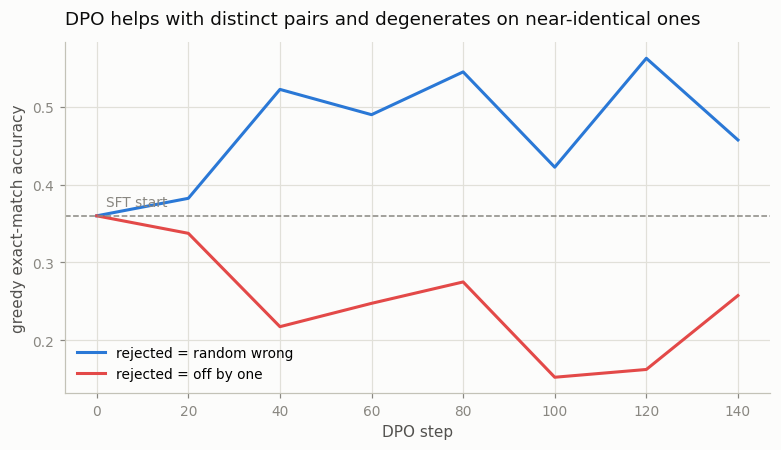
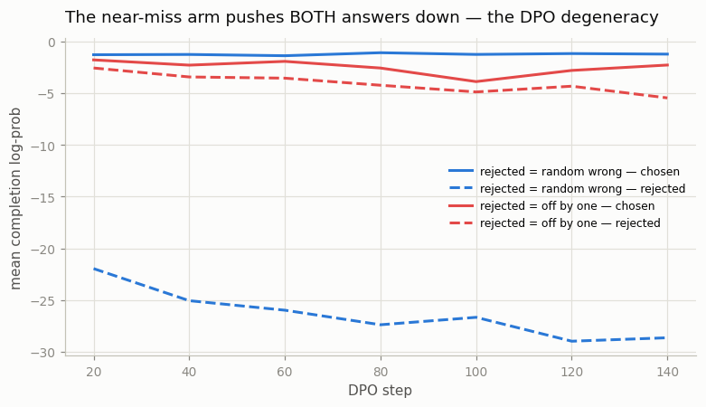

# DPO

## Key Insight

[Direct Preference Optimization (DPO)](/shared/glossary/#dpo) collapses the entire [PPO](/shared/glossary/#ppo)-style [RLHF](/shared/glossary/#rlhf) pipeline into a single [supervised](/shared/glossary/#supervised-learning) loss on (chosen, rejected) pairs — no separate [reward model](/shared/glossary/#reward-model), no [rollouts](/shared/glossary/#rollout), no RL loop. A clever mathematical shortcut (a [closed-form](/shared/glossary/#closed-form) derivation) proves that the model's own answer probabilities—how likely it is to output each word compared to a frozen [reference model](/shared/glossary/#reference-model)—already contain an [implicit reward](/shared/glossary/#implicit-reward). This means we don't need a separate reward model at all: one simple training step just makes the human-preferred answer more likely and the rejected one less likely, while using the reference model comparison as a leash to keep the model from drifting into nonsense. This project trains DPO on the same preference data you used for PPO-RLHF and compares quality, training time, and stability. Why it matters: DPO is far simpler and cheaper to run than PPO, which is why it became the default in many open-source post-training pipelines — though its DPO-family variants (KTO, IPO, ORPO, SimPO) exist precisely because the plain loss has failure modes such as [length bias](/shared/glossary/#length-bias).

---

## What's in this directory

| File | Role |
|------|------|
| `dpo.py` | The DPO loss (verified bit-for-bit against a deliberately naive reimplementation), trained in two arms that differ only in how the rejected answer is built. |

```bash
python3 dpo.py     # ~2 min on CPU, two figures
```

## The loss, in one screen

DPO trains directly on the same triples [project 51](../51-train-a-reward-model/README.md)
used to train a reward model — but skips the reward model:

```python
logits = beta * ((lp_chosen - ref_chosen) - (lp_rejected - ref_rejected))
loss   = -F.logsigmoid(logits).mean()
```

where `lp_*` are the completion [log-probabilities](/shared/glossary/#log-probability) under
the model being trained and `ref_*` under the frozen SFT reference. Unpack it from the
inside out:

- `lp_chosen - ref_chosen` — how much *more* likely the policy has made the chosen answer,
  relative to where it started. The DPO paper shows this quantity (times `beta`) behaves
  exactly like a reward model's score — the **implicit reward**. The reference subtraction
  is doing the same job the KL penalty does in PPO: change is measured *from the SFT model*,
  so drifting far from it is what gets penalized.
- the outer difference — chosen's implicit reward minus rejected's: the same score gap that
  [Bradley-Terry](/shared/glossary/#bradley-terry) trains a reward model on.
- `-logsigmoid(...)` — the same pairwise loss as in project 51. DPO literally *is*
  reward-model training, except the "reward model" being trained is a formula read off the
  policy itself.

> **Why does the reference model appear twice (once per side)? Isn't once enough of a
> leash?** The two subtractions do different work. Mathematically they make the loss depend
> only on how the *gap* between chosen and rejected has moved since SFT — so a pair the SFT
> model already ranked correctly contributes little gradient, and one it ranks backwards
> contributes a lot. Remove the reference entirely and the loss would just be "maximize
> chosen, minimize rejected" with no anchor, which happily walks the model into degenerate
> text. That anchoring is the KL leash of PPO-RLHF, smuggled inside the loss.

One line of the run output is worth savoring. At step 0, policy = reference, so every
implicit reward is zero, the sigmoid sits at 0.5, and the loss is exactly `log 2`:

```
loss check: batched 0.6931471825   naive 0.6931471825   diff 0.00e+00
```

(The check re-computes the loss one pair at a time with explicit masking — a habit worth
copying whenever you implement a paper loss: a wrong mask or padding bug shifts the number
silently, and here `0.00e+00` says the batched version is exact.)

## Two arms, one variable

Both arms start from the partial SFT policy (greedy accuracy **0.360**) and train on 3,000
pairs for 3 [epochs](/shared/glossary/#epoch). The only difference is the rejected side —
the same probe that exposed the reward model's blind spot in project 51:

| arm | chosen | rejected | final accuracy |
|---|---|---|---|
| `random` | correct sum | random wrong number | **0.458** |
| `nearmiss` | correct sum | off by one | **0.258** — *below* the 0.360 start |



## Why near-miss pairs backfire: the DPO degeneracy

The loss only rewards *widening the gap* between chosen and rejected. It never says "keep
the chosen answer likely." Watch the completion log-probabilities during training:



| arm | logp(chosen) start → end | logp(rejected) start → end |
|---|---|---|
| `random` | −1.3 → **−1.2** (held) | −1.3 → **−28.6** (crushed) |
| `nearmiss` | −1.3 → **−2.3** (dragged down) | −1.3 → **−5.5** |

In the random arm the two answers share almost nothing (`45;` vs `91;`), so the model can
crush the rejected tokens without touching the chosen ones. In the near-miss arm the answers
are nearly the same string (`45;` vs `44;`) — computed by nearly the same internal circuitry
— so the cheapest way to make `44` less likely is to make *answers like 45* less likely
overall. The gap still widens (the loss is perfectly happy), while the probability of the
correct answer falls and greedy accuracy sinks. This is the documented "likelihood
displacement" degeneracy of plain DPO, reproduced in two minutes on a CPU — and it is one
concrete reason the KTO/IPO/SimPO family of losses exists.

The practical rule it teaches: **DPO pairs should differ where you want the gradient to
act.** Preference data whose pairs differ by a hair force the model to invent a distinction
at the wrong granularity.

## DPO vs PPO-RLHF, same data

Comparing against [project 52](../52-ppo-style-rlhf/README.md) (which optimized a reward
model trained on the *same* random-wrong triples, with PPO):

| | PPO-RLHF (project 52) | DPO (this project) |
|---|---|---|
| pipeline stages | RM training + rollouts + PPO | one supervised loss |
| models in memory | policy, reference, reward model | policy, reference |
| moving parts to tune | lr, clip, KL beta, advantage clipping, sampling temp | lr, beta |
| wall clock (this box) | ~75 s | **~15 s** |
| accuracy from 0.360 | 0.298 | **0.458** |
| failure mode observed | optimizes the RM's blind spots | degenerates on near-identical pairs |

On this task DPO wins on every row — which is *why it became the open-source default*. Keep
the asterisk in mind though: DPO's edge here partly reflects that its training signal (the
verifier-labeled pairs) is clean and on-distribution. PPO's flexibility — any reward, any
number of fresh rollouts — is what you need when preferences must be *queried* rather than
pre-collected, and [project 54](../54-grpo-from-scratch/README.md) shows the RL loop winning
once the reward is trustworthy.

## What to take away

1. **DPO = reward-model training where the reward is read off the policy.** The implicit
   reward `beta * (logp_policy − logp_ref)` replaces the scalar head; the Bradley-Terry
   sigmoid loss is unchanged from project 51.
2. **The reference model is the smuggled KL leash.** Both sides of the loss measure change
   *relative to the SFT model*, which anchors the policy the same way PPO's explicit KL term
   does.
3. **It works when pairs differ meaningfully** — 0.360 → 0.458 on random-wrong pairs, with
   the rejected answer's probability crushed 27 orders of magnitude while the chosen one
   held firm.
4. **It degenerates when pairs are near-identical** — 0.360 → 0.258, with the *correct*
   answer's probability dragged down alongside the rejected one. Widening a gap is not the
   same as being right.
5. **Simplicity is a feature you pay for in control.** DPO deleted the reward model, the
   rollouts, and most of the knobs — and with them, the ability to steer *what the model
   practices on*. The next two projects put the RL loop back for exactly that reason.
