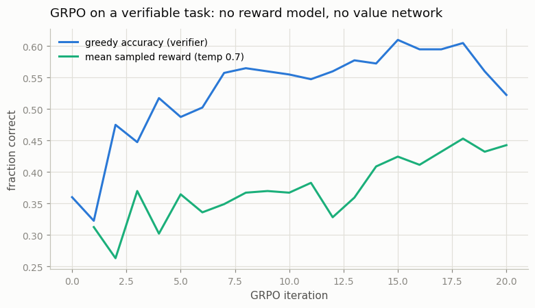
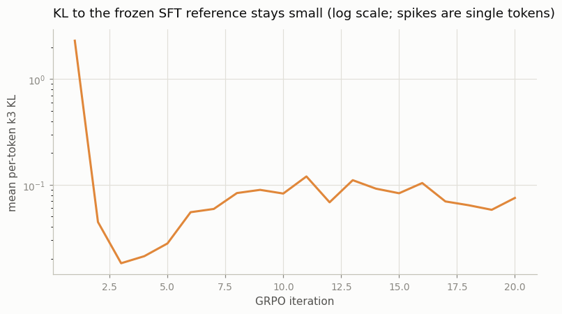

# GRPO from Scratch

## Key Insight

[Group Relative Policy Optimization (GRPO)](/shared/glossary/#grpo) is DeepSeek's slimmed-down [PPO](/shared/glossary/#ppo): it deletes the separate critic (the [value function](/shared/glossary/#value-function) network PPO uses as a baseline) and replaces it with a much cheaper trick — for each prompt, sample a *group* of completions, score them all, and use each completion's [advantage](/shared/glossary/#advantage) *relative to the group's average* as the learning signal. This project implements GRPO from scratch on a small math task (GSM8K-style), where the score can come straight from a [verifier](/shared/glossary/#verifier) checking the final answer instead of a learned [reward model](/shared/glossary/#reward-model). Why it matters: dropping the critic roughly halves the memory and compute of RL fine-tuning, and this simplicity is why GRPO became the backbone of recent [reasoning-model](/shared/glossary/#reasoning-model) training.

---

## What's in this directory

| File | Role |
|------|------|
| `grpo.py` | The full algorithm in ~90 lines of logic: group sampling, group-relative advantages, PPO-style clipped update, k3 KL penalty. `grpo_update` is generic and is reused by [project 55](../55-rlvr-on-math/README.md) on a different task. |

```bash
python3 grpo.py     # ~2.5 min on CPU, two figures + a worked example
```

## Why the critic could be deleted at all

PPO needs a [baseline](/shared/glossary/#baseline) — an estimate of "how well does this
policy usually do here?" — because a raw reward tells you nothing by itself. (Scoring 1 on a
prompt is impressive if the policy usually fails, unremarkable if it usually succeeds; only
the *difference from usual* — the advantage — says which way to push.) Classic PPO learns
that baseline with a second neural network, the critic, trained alongside the policy.

For an LLM there is a cheaper way to answer "how well does the policy usually do on this
prompt?": **just ask it several times.**

```
prompt: 24+48=      (true answer 72)

completion   reward   advantage
74;             0.0      -0.577
72;             1.0      +1.732
73;             0.0      -0.577
74;             0.0      -0.577
73;             0.0      -0.577
72;             1.0      +1.732
73;             0.0      -0.577
74;             0.0      -0.577
```

That is a real group from this run (`outputs/group_example.txt`, iteration 1). Eight samples
for one prompt; the group's mean reward (2/8 = 0.25) *is* the baseline. The two correct
completions sit above it (positive advantage — push their tokens up), the six near-misses
below (negative — push down). "Group Relative" in the name means exactly this: advantage is
measured relative to your own group, nothing else.

```python
adv = (r - r.mean()) / (r.std() + 1e-4)     # per group
```

> **Why divide by the standard deviation too?** It puts every group on the same scale: a
> group where rewards barely differ produces tiny raw differences, and a wild group produces
> big ones — after dividing, a "best in group" completion gets a similar-sized push either
> way. It also means an all-correct or all-wrong group contributes *zero* gradient (no
> contrast, no signal, and nothing to learn from that prompt this round).

The rest of the update is standard PPO machinery, kept because it solves real problems:

- **the clipped ratio** (`ratio.clamp(1-0.2, 1+0.2)`) — PPO's "proximal" idea: the new
  policy may not move a token's probability more than ~20% away from the policy that
  generated the data, because the data stops being trustworthy beyond that
  ([surrogate objective](/shared/glossary/#surrogate-objective));
- **the KL penalty to the frozen SFT reference** — the RLHF leash from
  [project 52](../52-ppo-style-rlhf/README.md), here with a small weight (`beta = 0.08`)
  since a verifier, unlike a reward model, cannot be hacked. We use the *k3 estimator*
  `exp(d) − d − 1` (with `d = ref_logp − new_logp`): unlike the naive estimate `−d`, it is
  never negative on a sample, so noise cannot masquerade as "negative KL".

> **Wait — if the verifier is unhackable, why keep any KL penalty at all?** Because the
> leash protects against more than hacking: with only ~30% correct samples the gradient is
> noisy, and an unlucky run of updates can wreck the fragile 4-token answer format before
> the policy collects enough reward to know better. A light leash keeps the policy fluent
> while it learns. Project 57 shows the other extreme — what removing the leash does when
> the reward *can* be gamed.

## The run

Starting from the shared partial-SFT policy
([project 50](../50-sft-a-small-base-model/README.md), greedy accuracy **0.360**), 18–20
iterations of: sample 48 prompts × 8 completions at [temperature](/shared/glossary/#temperature)
0.7, grade with the verifier, one clipped update.



| iteration | 0 | 5 | 10 | 15 | 20 |
|---|---|---|---|---|---|
| greedy accuracy | 0.360 | 0.488 | 0.555 | 0.610 | **0.522** |

Final greedy accuracy **0.522** (the curve is noisy at this scale — it touched 0.61 at
iteration 15; each update sees only 384 one-bit rewards). Compare the scoreboard across the
phase, all starting from the same 0.360 policy:

| method | reward signal | final accuracy |
|---|---|---|
| PPO ([project 52](../52-ppo-style-rlhf/README.md)) | learned RM | 0.298 |
| DPO ([project 53](../53-dpo/README.md)) | offline pairs | 0.458 |
| **GRPO (this project)** | exact verifier | **0.522** |

And the leash barely moves: mean per-token KL stays in the 0.02–0.4 band throughout
(`outputs/grpo_kl.png`) — the policy is improving *within reach* of the SFT model, not
mutating into something new.



## What GRPO deleted, and what it kept

It is worth pausing on how little is left. Compare the shopping list:

| component | PPO-RLHF | GRPO + verifier |
|---|---|---|
| policy | yes | yes |
| frozen reference | yes | yes |
| reward model | yes | **no** — verifier |
| critic / value network | yes | **no** — group mean |
| GAE, value loss, value clipping | yes | **no** |

Two networks and their optimizers, gone — at the price of sampling 8 completions per prompt
instead of 1. That trade (more inference, less training machinery) is exactly the right one
for LLMs, where sampling is cheap and parallel while keeping a second 70B-parameter critic
in memory is not. It is why GRPO-style training scaled to the DeepSeek-R1 generation of
reasoning models.

## What to take away

1. **A group of samples is a value function you don't have to train.** The group mean
   answers "how well does the policy usually do on this prompt?" — by measurement instead
   of estimation. That is the whole trick, and the worked example above *is* the algorithm.
2. **Standardizing per group equalizes the signal** across easy and hard prompts, and
   silently skips prompts that provide no contrast (all right or all wrong).
3. **The PPO safety rails survive** — clipped ratios and a KL leash are kept because they
   fix failure modes (stale rollouts, format collapse) that have nothing to do with the
   critic.
4. **With a verifier for a reward, RL on LLMs becomes almost embarrassingly simple** — 0.360
   → 0.522 from ~90 lines of logic and 2.5 CPU-minutes, beating both the RM-based PPO and
   offline DPO on this task. [Project 55](../55-rlvr-on-math/README.md) points this same
   loop at a task where reasoning length can grow — and watches it grow.
