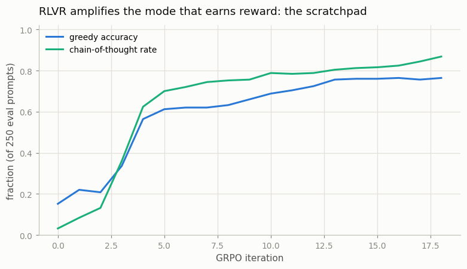
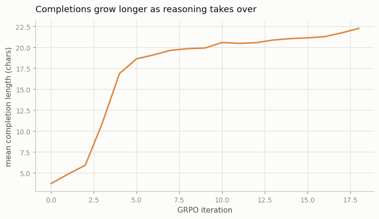

# RLVR on Math

## Key Insight

[RL with Verifiable Rewards (RLVR)](/shared/glossary/#rlvr) throws out the learned [reward model](/shared/glossary/#reward-model) entirely: when an answer can be checked by a program — a math result that matches the known solution, code that passes its unit tests — a deterministic [verifier](/shared/glossary/#verifier) hands back an exact, [unhackable](/shared/glossary/#reward-hacking) reward for free. This project trains a small reasoning loop on a verifiable math subset (GSM8K-style) and watches the model's [chain of thought](/shared/glossary/#cot) grow longer over training, because writing out more reasoning steps leads to more correct — and therefore more rewarded — answers. Why it matters: RLVR is the engine of the [reasoning-model](/shared/glossary/#reasoning-model) wave (o1, R1), and it explains the grand bet of 2026 — the more domains we can convert into verifiable form, the more of [RLHF](/shared/glossary/#rlhf)'s messy preference machinery we can throw away.

---

## What's in this directory

| File | Role |
|------|------|
| `cot_lib.py` | A harder math task where *showing your work pays*: sum four numbers, answered either directly or via a scratchpad. Also used by [project 56](../56-length-bias-audit/README.md). |
| `rlvr.py` | Two-stage SFT that leaves the scratchpad as a buried minority skill, then GRPO with the exact verifier. Reuses `grpo_update` from [project 54](../54-grpo-from-scratch/README.md) unchanged. |

```bash
python3 rlvr.py     # ~5 min on CPU, two figures + before/after samples
```

## A task where thinking out loud pays

Our [GSM8K](/shared/glossary/#gsm8k) stand-in: add **four** numbers. The model can answer
two ways:

```
prompt            "17+2+18+13="
direct answer     "50;"                            3 chars, hard
chain of thought  "17+2=19,19+18=37,37+13=50;"     26 chars, easy
```

Why is the long way easier for a small model? Adding four numbers in one forward shot is a
big carry-tracking computation squeezed into predicting the answer's first digit. The
scratchpad — literally scratch paper the model writes for itself — decomposes it into three
two-number additions, each of which this model does at ~90%. **Chain of thought converts
one hard prediction into several easy ones, using generated tokens as working memory.** The
verifier grades only the *last* number before `;`, so both styles are scored by the same
rule.

## Making "reasoning" a buried skill, on purpose

The interesting RLVR story is not "train a model to do CoT with supervised data" — that is
just SFT. The story is: **the skill already exists inside the model, but its default
behavior doesn't use it** — and RL surfaces it. We manufacture that situation in two SFT
stages:

1. **Stage 1 — learn the skill.** 800 steps of pure CoT demonstrations → greedy accuracy
   0.904, every completion a scratchpad.
2. **Stage 2 — bury it.** 250 more steps on a mix that is 85% *direct answers*. Mode
   preference tracks recent data, so greedy decoding flips to answering directly (and badly);
   the scratchpad survives as a minority behavior that sampling still visits.

> **Why bury the skill in stage 2 — isn't that sabotage?** It recreates, in miniature, what
> a real pretrained LLM looks like *before* reasoning-RL: web text contains far more plain
> answers than worked solutions, so step-by-step reasoning exists in the model but is not
> its default. R1-style training starts exactly there. (It also mirrors this guide's Phase 8
> lesson in a new costume: RL can only *amplify* behaviors that exploration actually visits —
> if the CoT mode were truly gone, no reward signal could recreate it.)

The buried model, measured:

| decoding | behavior |
|---|---|
| greedy | 97% direct answers, accuracy **0.152**, mean length 3.7 chars |
| sampling, [temperature](/shared/glossary/#temperature) 0.8 | 88.5% direct (accuracy 0.116), **11.5% CoT (accuracy 0.457)** |

That last row is the latent gold: roughly one sample in nine still uses the scratchpad, and
those samples are right **4x as often** as the direct ones.

## Let the verifier vote

Now run GRPO ([project 54](../54-grpo-from-scratch/README.md)'s `grpo_update`, byte-for-byte)
for 18 iterations: 32 prompts × 8 sampled completions each, reward = `is_correct`, light KL
leash to the buried SFT model. No reward model, no human labels — the only feedback in the
whole loop is a program checking sums.

Inside each group of 8 the arithmetic of amplification is plain: a group typically holds
7 direct samples (mostly wrong) and 1 scratchpad (usually right). The scratchpad's reward
sits far above the group mean → large positive [advantage](/shared/glossary/#advantage) →
every token of the scratchpad, including the `17+2=19,` habit itself, gets pushed up.



| GRPO iteration | 0 | 3 | 4 | 9 | 18 |
|---|---|---|---|---|---|
| greedy accuracy | 0.152 | 0.336 | 0.564 | 0.660 | **0.764** |
| CoT rate (greedy) | 0.032 | 0.360 | 0.624 | 0.756 | **0.868** |
| mean completion length (chars) | 3.7 | 11.0 | 16.9 | 19.9 | **22.3** |

The takeoff between iterations 2 and 5 is the signature: once a few scratchpad completions
collect their rewards, the mode snowballs — more CoT samples per group → more reinforcement
→ higher CoT rate. And because the amplified mode happens to be the *long* one, average
completion length grows 6x without anyone ever rewarding length:



This is the toy version of the reasoning-model phenomenon: **"thinks longer" is not an
objective anywhere in the loop — it is a side effect of "correct answers earn reward" plus
"the reliable path to correct answers spends more tokens."** The same six prompts, before
and after:

```
before RLVR (greedy)                     after RLVR (greedy)
20+3+0+8=   -> 35;            WRONG      -> 20+3=23,23+0=23,23+8=31;    ok
17+2+18+13= -> 53;            WRONG      -> 17+2=19,19+18=37,37+13=50;  ok
17+6+20+17= -> 63;            WRONG      -> 17+6=23,23+20=43,43+17=60;  ok
7+7+4+3=    -> 19;            WRONG      -> 19;                         WRONG
```

(Note the honest last row: prompts the model still answers directly usually stay wrong —
at iteration 18 the takeover is at 87%, still spreading.)

## The caveat that keeps this honest

In this toy, the *format* of the chain of thought is fixed (always three partial sums), so
what grows is the *rate* of reasoning, and length rises from 3.7 to a ceiling near ~25
chars. Real RLVR on real math goes further: with an open-ended format, models discover that
*extra* verification steps, backtracking, and case-splitting also raise the pass rate, so
length keeps growing past any template — that open-endedness is what this miniature cannot
show. What it shows exactly is the mechanism: **verifiable reward + sampling variety +
amplification = reasoning takes over.**

Also worth saying plainly: RLVR did not teach arithmetic here. Stage-1 SFT taught the
scratchpad; RLVR *re-weighted* which existing behavior the model reaches for. That division
of labor — SFT installs skills, RL selects among them — matches how the labs describe
R1-style training, where a "cold-start" SFT on worked solutions precedes the RL loop.

## What to take away

1. **CoT is working memory, not decoration.** The same model is right 11.6% of the time
   answering directly and 45.7% when it writes three intermediate sums — generated tokens
   are the scratch paper the computation runs on.
2. **RLVR = RL where the grader is a program.** With `is_correct` as the reward there is
   nothing to hack ([project 57](../57-reward-hacking-demo/README.md) shows what happens
   when there is) and nobody to pay for labels.
3. **RL amplifies; it rarely invents.** The whole 0.152 → 0.764 gain came from a mode that
   sampling visited 11.5% of the time before RL started. Check that your desired behavior
   has nonzero probability *before* spending compute on RL.
4. **Longer reasoning emerges as a side effect of correctness.** Length 3.7 → 22.3 chars
   with reward = right-or-wrong only. When you read "the model learned to think longer,"
   this selection dynamic is what is meant — which is also why
   [project 56](../56-length-bias-audit/README.md) matters: *length growing for bad reasons*
   looks identical on a length chart.
