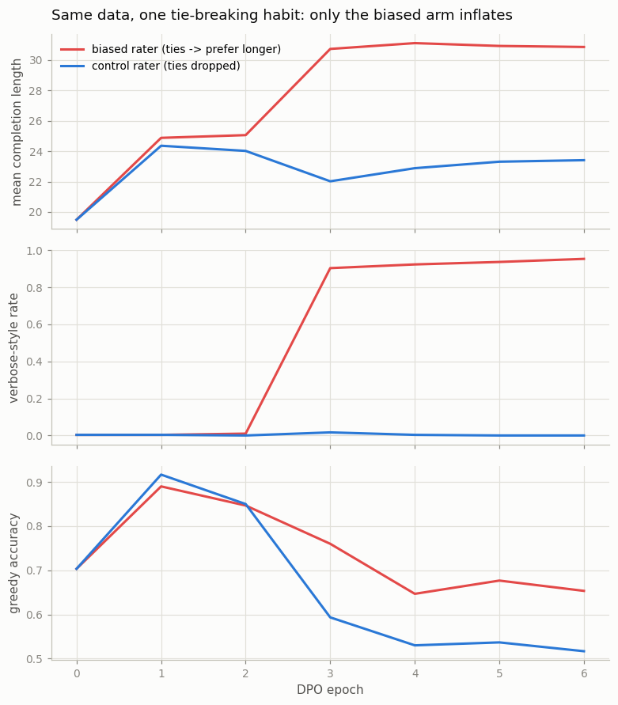
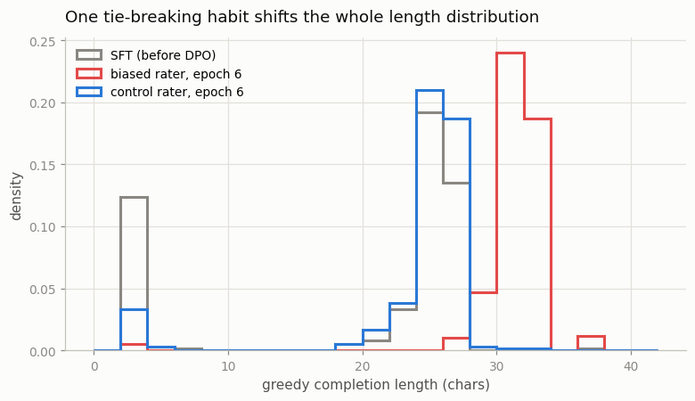

# Length-Bias Audit

## Key Insight

[Length bias](/shared/glossary/#length-bias) is the well-documented tendency of [RLHF](/shared/glossary/#rlhf)-tuned models to grow more verbose over training — not because longer answers are genuinely better, but because [reward models](/shared/glossary/#reward-model) and human preference data quietly correlate length with quality, and the [policy](/shared/glossary/#policy) learns to exploit that correlation. This project plots the completion-length distributions of your [PPO](/shared/glossary/#ppo)- and [DPO](/shared/glossary/#dpo)-trained models before and after tuning to make the drift visible. Why it matters: length bias is a concrete, easy-to-measure instance of [reward hacking](/shared/glossary/#reward-hacking) — the model is maximizing a flawed proxy rather than true helpfulness — and spotting it is the first step toward the length-corrected losses (such as SimPO) that try to remove it.

---

## What's in this directory

| File | Role |
|------|------|
| `length_bias.py` | Builds preference data the way labs do (sample two answers, have a "rater" pick one), injects a single realistic rater habit, and audits what DPO does with it, epoch by epoch. Uses [project 55](../55-rlvr-on-math/README.md)'s task and `cot_lib.py`. |

```bash
python3 length_bias.py     # ~8 min on CPU, two figures
```

## A task with room to be verbose

[Project 55](../55-rlvr-on-math/README.md)'s four-number sums, with the SFT data now mixing
*three* answer styles so the model has a verbosity dial it can actually turn:

```
direct        "50;"                                  short
CoT           "17+2=19,19+18=37,37+13=50;"           long, each step useful
verbose CoT   "17+2=19,19+18=37,37+13=50,50=50;"     longer, ends with pure filler
```

The verbose style's extra step — restating the answer as `50=50` — computes nothing. It
exists to be the "waffle" a model can pad with. After SFT the model answers 25% direct /
75% CoT / ~0% verbose, greedy accuracy 0.703, mean length 19.5 chars.

## Manufacturing preference data with one bad habit

We copy the industrial pipeline: for each of 2,500 prompts, sample **two** completions
(temperature 1.0) and have a rater label the better one. Our rater is a script, so we can
control exactly one habit and audit its downstream cost:

- If one completion is correct and the other wrong → **the correct one wins.** (Both arms
  share all 1,072 of these pairs; this is the genuine quality signal.)
- If both are correct or both wrong — a tie on substance:
  - **biased arm**: prefer the *longer* one (624 extra pairs). This mimics the measured
    human-rater tendency to read length as effort/thoroughness.
  - **control arm**: drop the pair. No opinion, no data.

> **Why bother with a control arm at all?** Because the naive audit — "did answers get
> longer after DPO?" — is confounded. Look at the pair statistics: even in the *control*
> data, chosen answers average 23.3 chars vs 8.9 for rejected, simply because correct
> answers are mostly chain-of-thought and wrong ones mostly direct. Length correlates with
> quality *in honest data*. So some post-DPO lengthening is legitimate (more reasoning),
> and you cannot tell it from padding on a length chart alone. The control arm — identical
> in every pair except the tie-breaks — isolates exactly the drift the rater habit causes.

## The drift, epoch by epoch

DPO (β = 0.1, lr 1e-4) for six [epochs](/shared/glossary/#epoch) on each arm, evaluating
after every epoch:



| | SFT | biased, ep 1 | biased, ep 3 | biased, ep 6 | control, ep 6 |
|---|---|---|---|---|---|
| greedy accuracy | 0.703 | 0.890 | 0.760 | 0.653 | 0.517 |
| mean length (chars) | 19.5 | 24.9 | **30.7** | **30.9** | 23.4 |
| verbose-style rate | 0.00 | 0.00 | **0.90** | **0.95** | **0.00** |

Read it as three acts:

1. **Epoch 1 — both arms look great.** Accuracy jumps to ~0.9 in both; length rises 19.5 →
   ~24.5 in both. That length increase is the *legitimate* kind: the correctness signal
   pushes the model from direct answers to chains of thought (project 55's effect, achieved
   with preferences instead of RL). At this point the bias is invisible.
2. **Epoch 3 — the habit cashes in.** The biased arm flips almost overnight to the verbose
   style: 0.01 → 0.90 in one epoch, mean length 25 → 31. Nothing about correctness changed
   — the model found the one behavior that wins *ties*, and ties are 37% of the biased
   data. The control arm, same moment, same data minus tie votes: verbose stays at zero.
3. **Epochs 4–6 — the drift is permanent, the padding pure.** The biased model now restates
   its answer (`...,50=50;`) on 95% of prompts. Six extra characters per answer, zero
   information. (Both arms also decay in accuracy with continued optimization — that is
   [project 53](../53-dpo/README.md)'s displacement degeneracy acting on same-prompt pairs,
   an honest artifact of over-training DPO, and it affects biased and control alike.)

The final length distributions make the audit vivid — the biased model's whole mass sits
6–8 characters to the right, at identical answer quality:



## What this says about real RLHF models

The mechanism you just watched is scale-independent:

- **The bias enters through ties.** On substance-equal pairs, *any* systematic tie-breaker
  (length, formatting, hedging, bullet points) becomes a training signal exactly as strong
  as the quality signal — the loss cannot tell them apart.
- **It expresses under optimization pressure, not immediately.** One epoch looked clean;
  the takeover happened later. A model card that evaluated after epoch 1 would certify the
  data as unbiased. This is why length drift in real models appears "over training" —
  the RLHF version of [project 57](../57-reward-hacking-demo/README.md)'s lesson that
  hacks are found by sustained search.
- **Auditing needs a decomposition, not a ruler.** Mean length rose in *both* arms; only
  the style breakdown (useful steps vs filler) and the matched control separate "learned to
  reason" from "learned to waffle". Real audits do the same with rubric-based or
  length-controlled evals — and length-corrected objectives (SimPO's length-normalized
  implicit reward, R-DPO's explicit length penalty) exist precisely to starve this channel.

## What to take away

1. **Length bias needs no biased reward model — a tie-breaking habit is enough.** 624 tie
   votes buried in 1,696 pairs turned into a 95% filler rate.
2. **Legitimate and spurious length growth look identical on a length chart.** Both arms
   grew ~5 chars by epoch 1 (direct → CoT, accuracy +19 points). The audit that works
   compares against a control and decomposes by style.
3. **Bias expresses late.** Clean at epoch 1, 90% verbose at epoch 3. Audit *trained*
   checkpoints, not just data.
4. **The loss optimizes everything systematic in your labels** — quality and habit alike,
   in proportion to how often each decides a pair. The only fix is upstream: kill the
   correlation in the data (drop ties, length-match pairs) or in the loss (SimPO-style
   normalization).
