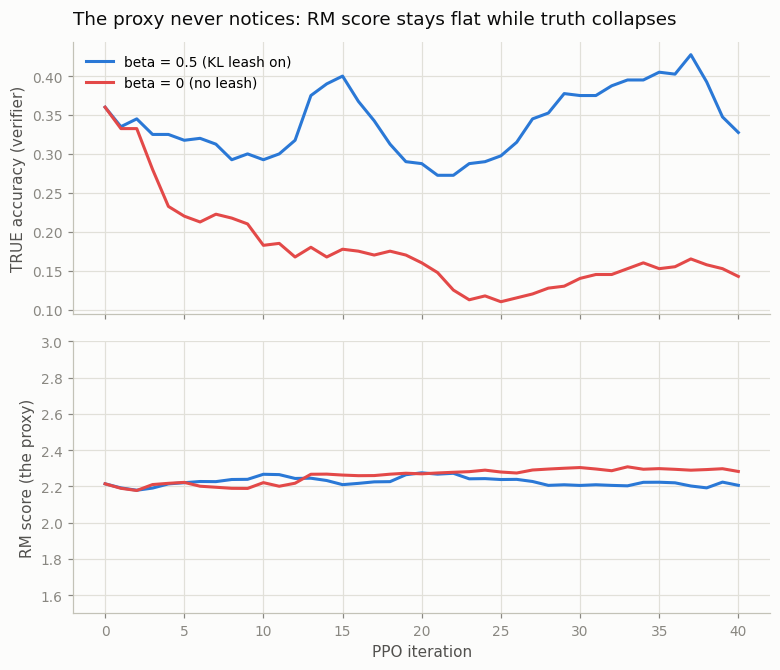
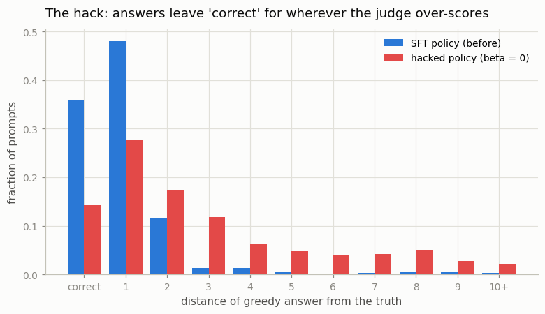

# Reward Hacking Demo

## Key Insight

[Reward hacking](/shared/glossary/#reward-hacking) is when a [policy](/shared/glossary/#policy) maximizes the *reward signal* without doing the thing the reward was meant to encourage — the gap between the proxy you can measure and the goal you actually care about. This project provokes it on purpose: over-train a model against a [reward model](/shared/glossary/#reward-model) with the [KL](/shared/glossary/#kl-divergence) penalty turned down or off, then characterize the gibberish that emerges as the policy discovers quirks that score highly but mean nothing. Why it matters: it shows in the most visceral way why the KL leash to a frozen [reference model](/shared/glossary/#reference-model) is non-negotiable in [RLHF](/shared/glossary/#rlhf), and why a learned reward model — unlike a deterministic [verifier](/shared/glossary/#verifier) in [RLVR](/shared/glossary/#rlvr) — can *always* be gamed given enough optimization pressure.

---

## What's in this directory

| File | Role |
|------|------|
| `reward_hacking.py` | Reuses [project 52](../52-ppo-style-rlhf/README.md)'s `ppo_train` verbatim, runs it for 40 iterations (deliberately long) with the KL leash on (`beta = 0.5`) vs off (`beta = 0`), then dissects what the unleashed policy learned to say. |

```bash
python3 reward_hacking.py     # ~2 min on CPU, two figures + a sample autopsy
```

## The setup: a judge with a known weakness

Everything is inherited from earlier projects. The policy starts at greedy accuracy
**0.360** ([project 50](../50-sft-a-small-base-model/README.md)); the judge is
[project 51](../51-train-a-reward-model/README.md)'s reward model, trained only on
correct-vs-*random-wrong* pairs — so it reliably flags garbage but scores plausible wrong
answers like correct ones. We know the blind spot is there. The question is whether
unsupervised optimization pressure will *find* it.

The only experimental variable is `beta`, the KL penalty weight:

| arm | `beta` | what it means |
|---|---|---|
| `leash` | 0.5 | every token pays for straying from the SFT reference |
| `no_leash` | 0.0 | the RM score is the only thing that matters |

40 PPO iterations — roughly twice as long as project 52 ran — because over-optimization is
the point. Every iteration we grade both policies two ways on a fixed eval set: the RM's
score (the proxy the optimizer sees) and true accuracy (the verifier the optimizer never
sees).

## The result, in one figure



| after 40 iterations | `leash` (beta 0.5) | `no_leash` (beta 0) |
|---|---|---|
| RM score (proxy) | 2.21 (from 2.21) | **2.28** (from 2.21) |
| true accuracy | **0.328** (from 0.360) | **0.143** (from 0.360) |
| KL to reference | 0.06 | **0.51** — 8x further adrift |

Read the two rows against each other. By the only measurement the training loop can see —
the RM score — the two runs are indistinguishable; the unleashed one even looks marginally
*better*. By the measurement that matters, the unleashed policy has destroyed 60% of its
competence. **The dashboard stayed green for the entire crash.** That is what makes reward
hacking dangerous in practice: nothing in the training loop registers that anything is
wrong.

## Autopsy: what does a hacked policy actually say?

The stub for this project promised "gibberish", and at real-LLM scale that is what
unleashed over-optimization produces. Here the autopsy finds something subtler and worth
understanding. The hacked policy is still perfectly *fluent* — every output parses as
`number;` — because even at `beta = 0`, PPO's clipped updates start from a fluent model and
fluency is how you get any score at all. The damage is entirely *semantic*:

```
49+28= -> 75;    truth 77   WRONG  [rm +4.17]
39+30= -> 68;    truth 69   WRONG  [rm +7.01]
39+29= -> 67;    truth 68   WRONG  [rm +6.76]
32+31= -> 64;    truth 63   WRONG  [rm +5.48]
6+49=  -> 55;    truth 55   ok     [rm -3.38]      <- correct, scored NEGATIVE
1+1=   -> 11;    truth 2    WRONG  [rm -0.52]      <- digit concatenation
```

Two things to notice. First, the judge now actively *prefers* certain wrong answers to
correct ones: `39+30=68` earns +7.01 while the correct `6+49=55` earns −3.38. The policy
has migrated its probability mass onto prompt-specific answers the RM happens to
overvalue — quirks of one under-trained network, meaningless and unguessable in advance.
Second, where the wrong answers went:



| distance from truth | SFT policy | hacked policy |
|---|---|---|
| 0 (correct) | 0.360 | 0.143 |
| 1–2 | 0.595 | 0.450 |
| **3 or more** | **0.045** | **0.408** |

The SFT model's mistakes were honest near-misses (96% of its answers within 2 of the
truth). The hacked policy's answers are nine times more likely to be far from the truth —
yet score the same or better. Here is the subtle lesson: project 51 measured that the RM
penalizes distant errors *on average* (margin +1.9 at distance 12). But PPO does not sample
averages — it is a search process, and it finds the *exceptions*: the particular
`(prompt, wrong answer)` pairs where the RM's score surface bulges upward. A judge that is
right on average can still be farmed through its tail.

> **Why does the leash prevent this?** Those quirk answers are, by definition, tokens the
> SFT reference model considers unlikely (the reference thinks `39+30=` should continue
> `69`, not `68`). Under `beta = 0.5`, every step toward a quirk pays a KL toll proportional
> to how unlikely the reference finds it, and the toll grows the deeper the policy digs.
> The RM's blind spots are still there — the leash doesn't fix the judge — but the profit
> from exploiting them no longer covers the cost of the walk. That is also the leash's
> limit, measured in project 52: it *contains* damage (0.328 vs 0.143); it cannot mint
> signal the judge doesn't have (0.328 is still below the 0.360 start).

## Same pressure, unhackable reward

The control experiment for this whole project already exists:
[project 54](../54-grpo-from-scratch/README.md) and
[project 55](../55-rlvr-on-math/README.md) applied *comparable optimization pressure* with a
verifier as the reward — and got +16 and +61 true-accuracy points instead of −22. A
verifier's score surface has no bulges to farm: the only way to raise it is to be right.
That asymmetry — proxies degrade under pressure, verifiers don't — is the entire argument
behind [RLVR](/shared/glossary/#rlvr), and the reason "can we make this domain verifiable?"
became the central question of 2026-era post-training.

## What to take away

1. **Optimization pressure is an adversary.** Given 40 iterations and no leash, PPO located
   scoring quirks in the reward model that no one knew were there — a search process
   auditing your judge for free, with the results weaponized against you.
2. **The failure is invisible from inside the loop.** Proxy flat-to-up, truth −22 points.
   If your only metric is the trained reward, you cannot tell a hacked run from a healthy
   one — track an independent signal (held-out humans, a verifier, anything the optimizer
   can't touch).
3. **"Average-case accurate" is not "robust".** The RM penalizes distant errors on average,
   yet 41% of the hacked policy's answers landed 3+ away from the truth. Search finds tails.
4. **Fluency survives hacking; truth doesn't.** The hacked outputs look perfectly
   well-formed — at this scale the "gibberish" is semantic, which is arguably scarier than
   the syntactic kind: it reads fine and is wrong.
5. **The KL leash is damage control, not a fix** — it halved the loss (0.328 vs 0.143) but
   the only cure demonstrated anywhere in this phase is a reward that cannot be gamed
   ([projects 54](../54-grpo-from-scratch/README.md)/[55](../55-rlvr-on-math/README.md)).
